# TW1.1 — Git Workflow & Collaboration

**Student:** Aayush Joshi | **PRN:** 23070122008 | **Marks:** 4

---

## Task 1.1 — Initialize Repo & First Commit (1 Mark)

Initialized a new Git repository and committed a Python Flask "Hello World" application to the `main` branch.

**Commands used:**
```bash
git init hello-world-flask
cd hello-world-flask
git add .
git commit -m "Initial commit: Add Hello World Flask app"
```

### Screenshots:
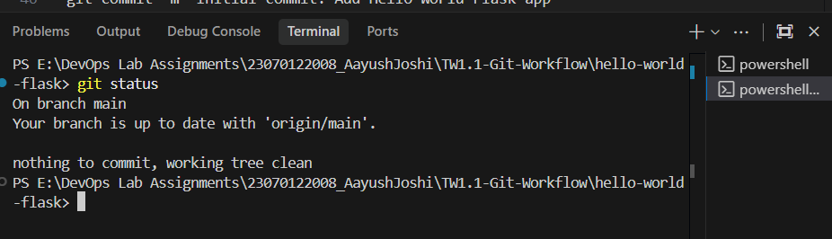
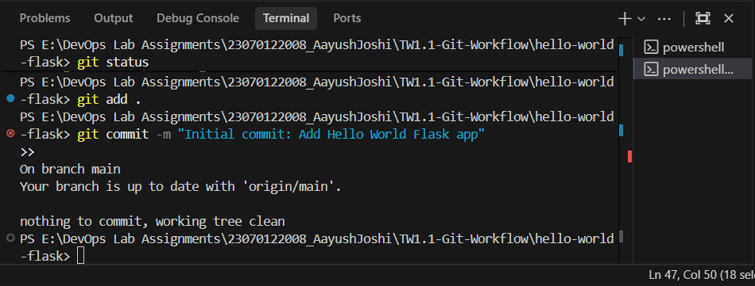
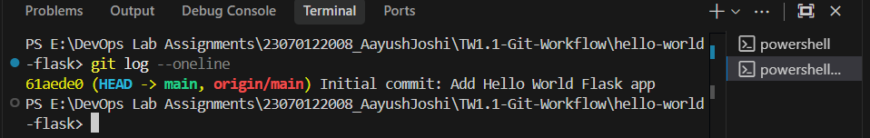

---

## Task 1.2 — Feature Branch (1.5 Marks)

Created a new branch `feature/user-auth`, made a modification (added a print statement to indicate user auth), committed, and pushed to GitHub.

**Commands used:**
```bash
git checkout -b feature/user-auth
# Modified app.py: added print("User authentication module loaded")
git add app.py
git commit -m "feat: add user-auth placeholder print statement"
git push origin feature/user-auth
```

### Screenshots:
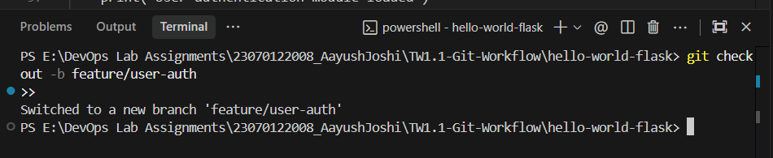
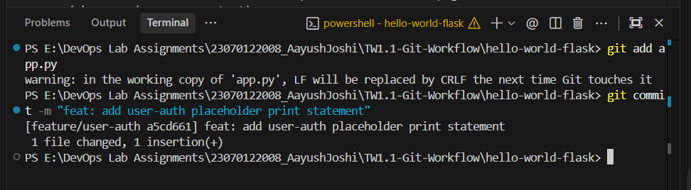
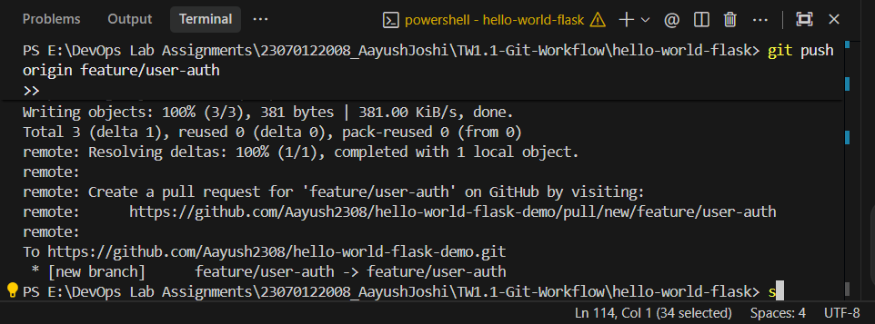
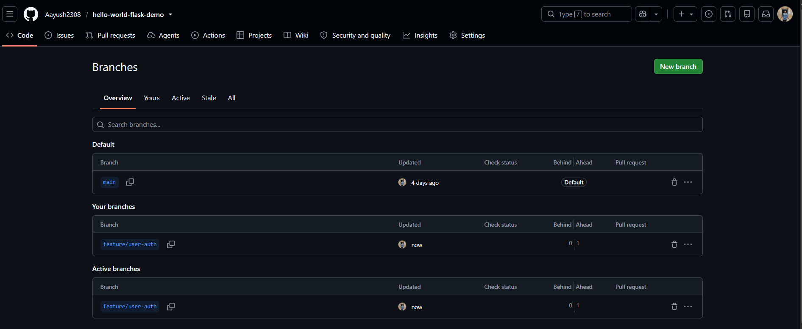

---

## Task 1.3 — Simulate Conflict & Resolve (1.5 Marks)

Simulated a merge conflict by modifying the same line in both `main` and `feature/user-auth`, then manually resolved it.

**Commands used:**
```bash
# On main: modify the same line as feature/user-auth
git checkout main
# Edit app.py — same line modified differently
git add app.py
git commit -m "chore: update greeting message on main"

# Attempt merge → conflict
git merge feature/user-auth

# Manually resolve conflict in app.py
# Edit the file to keep the desired combined content
git add app.py
git commit -m "merge: resolve conflict between main and feature/user-auth"
git push origin main
```

### Screenshots:
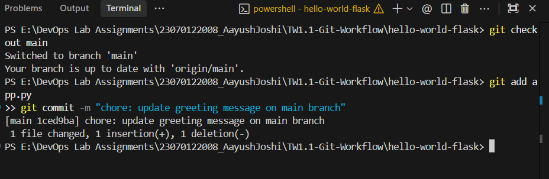
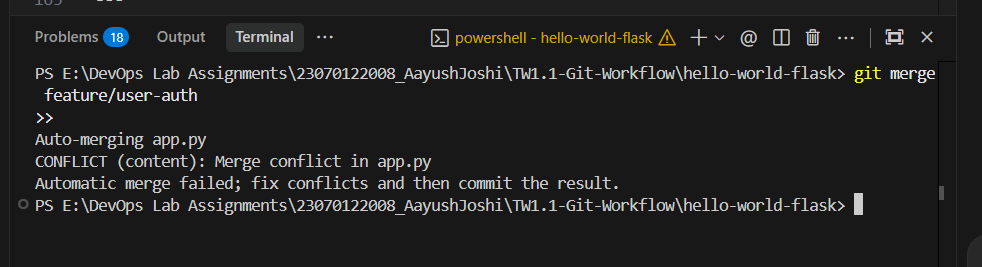
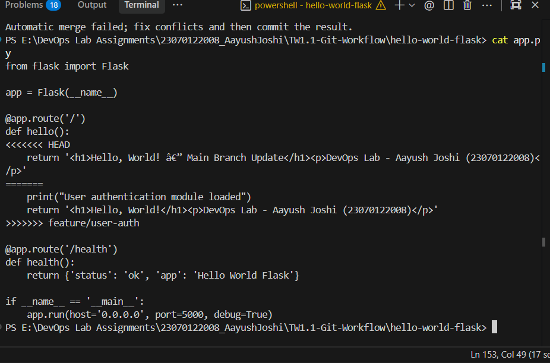
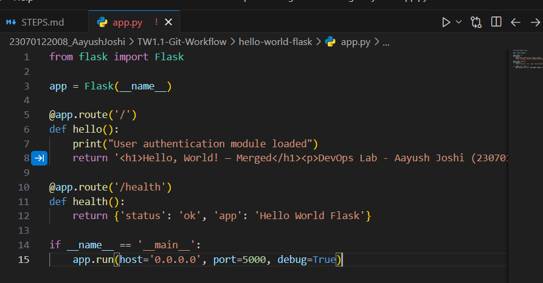
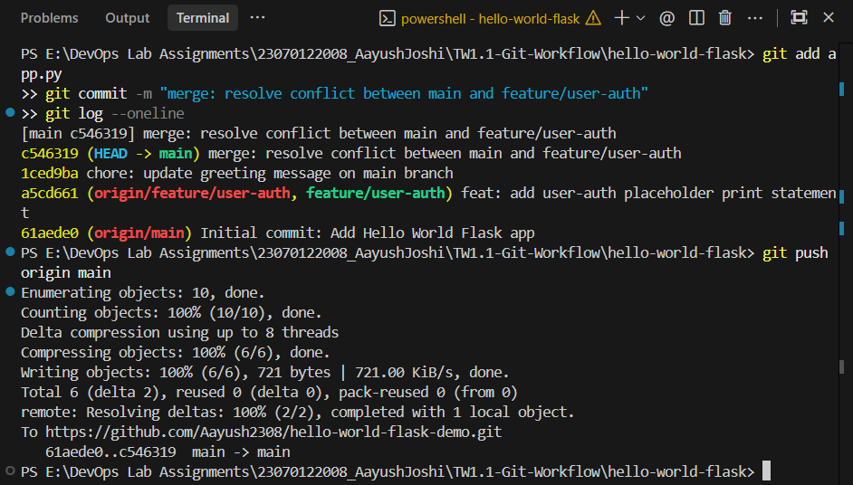
