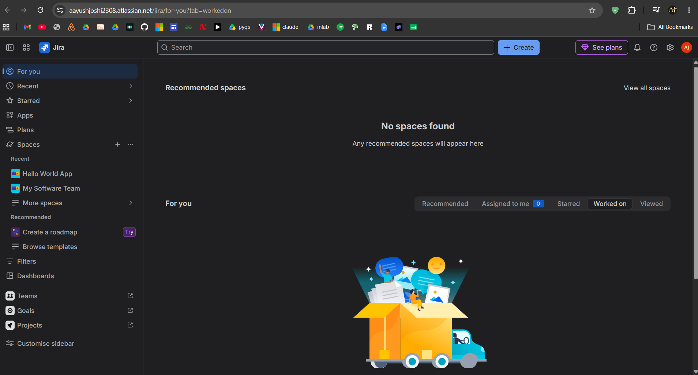
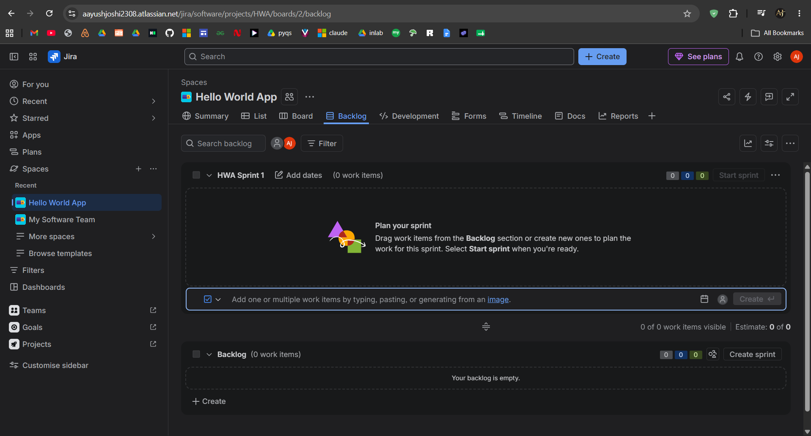
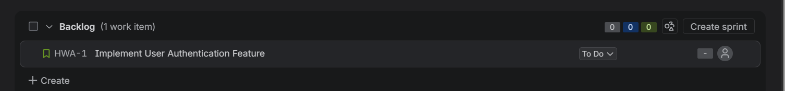
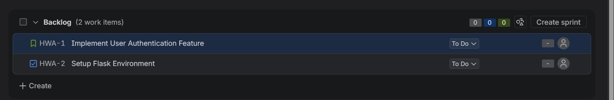
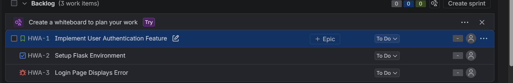
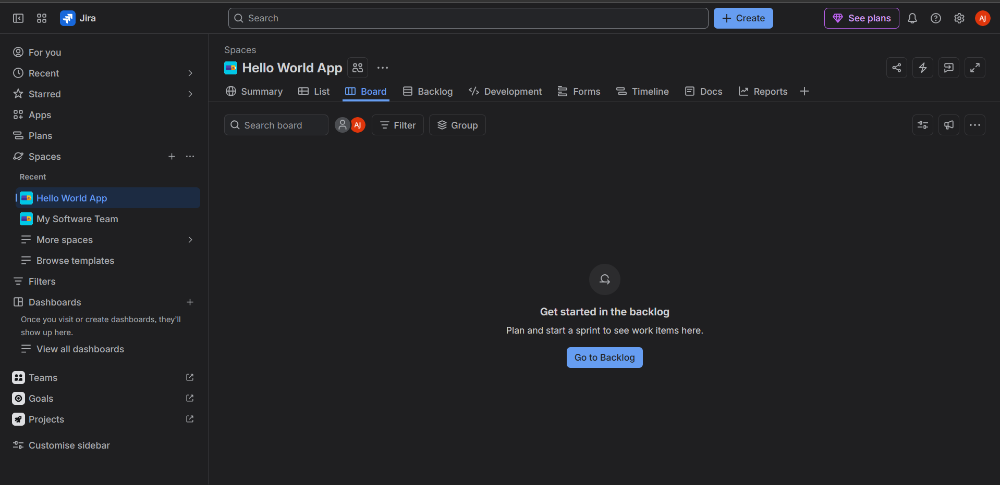
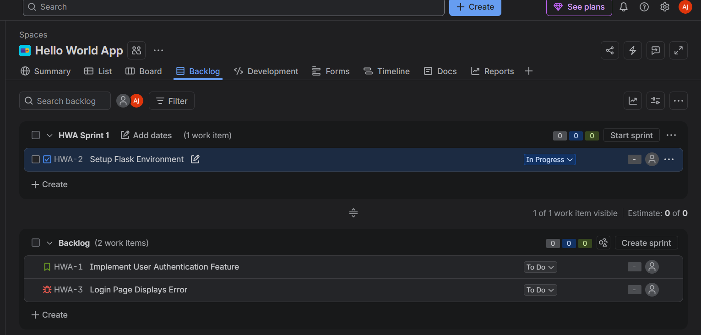
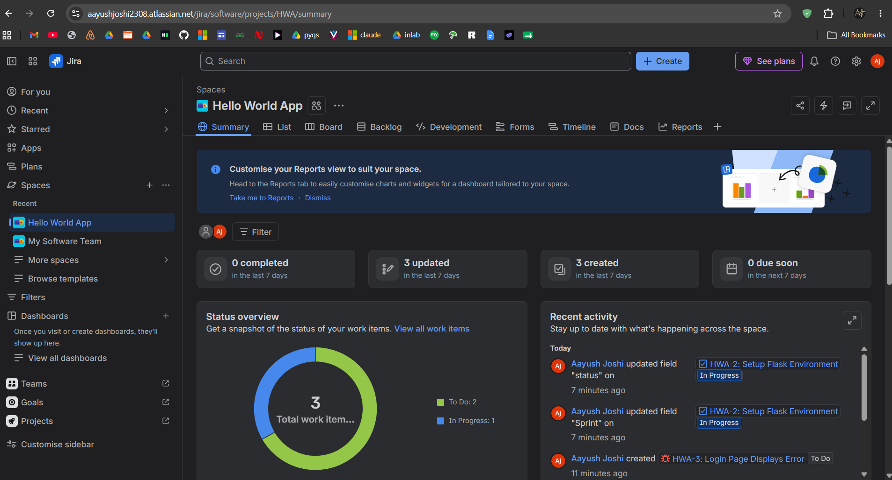

# TW1.2 — Jira Project & Issue Tracking

**Student:** Aayush Joshi | **PRN:** 23070122008 | **Marks:** 3

---

## Task 2.1 — Create Jira Scrum Project (1 Mark)

Logged into Jira Cloud and created a new **Scrum** project named **"Hello World App"** for the Flask web application.

### Screenshots:

---

## Task 2.2 — Create Issues (1 Mark)

Created the following issues in the project:

| Type | Title |
|------|-------|
| 📖 Story | Implement User Authentication Feature |
| ✅ Task | Setup Flask Environment |
| 🐛 Bug | Login Page Displays Error |

### Screenshots:

---

## Task 2.3 — Move Task to In Progress (1 Mark)

Navigated to the Scrum board and moved **"Setup Flask Environment"** from **To Do** → **In Progress**.

### Screenshots:

