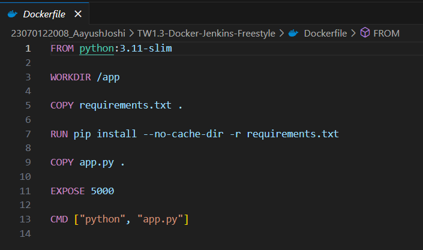
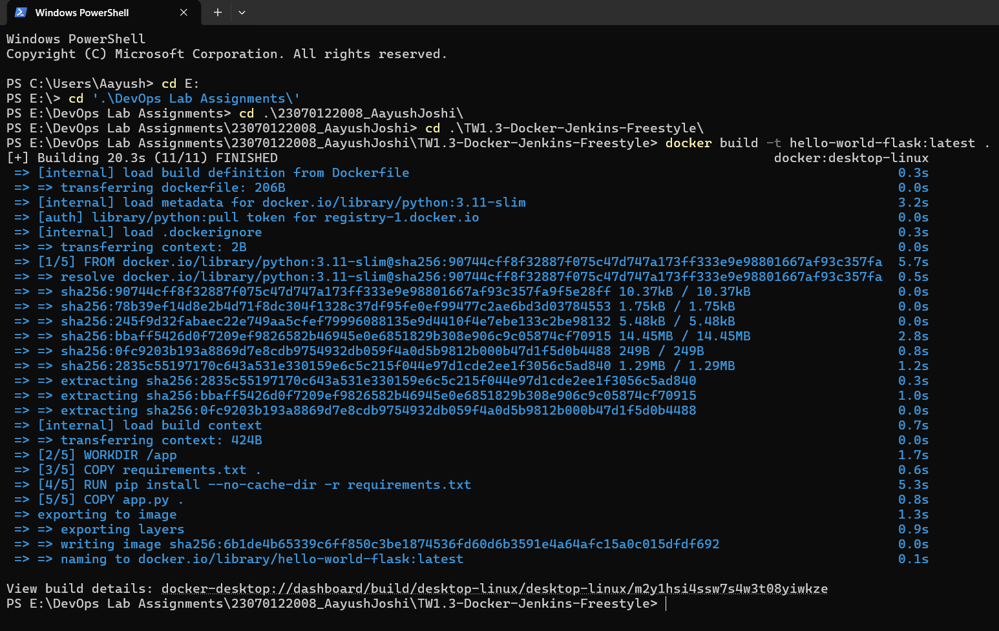
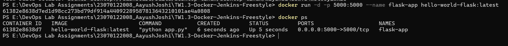
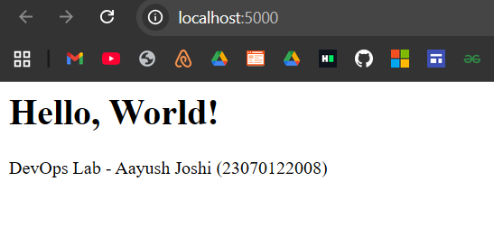
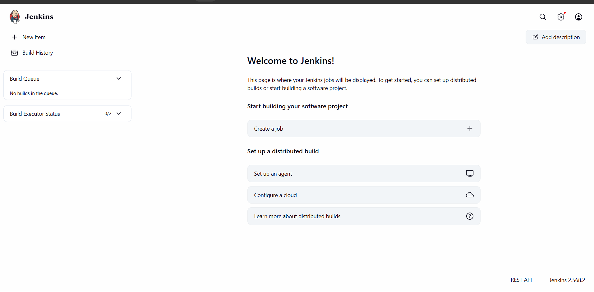
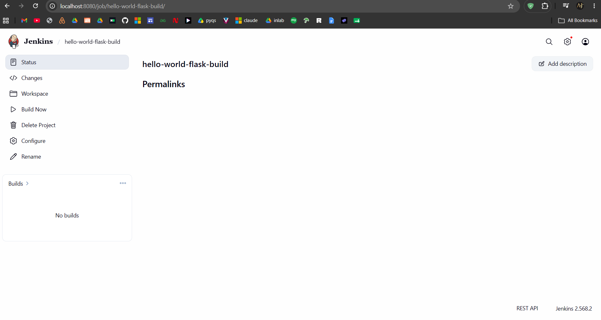
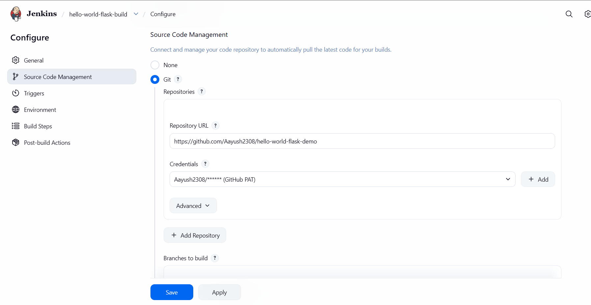
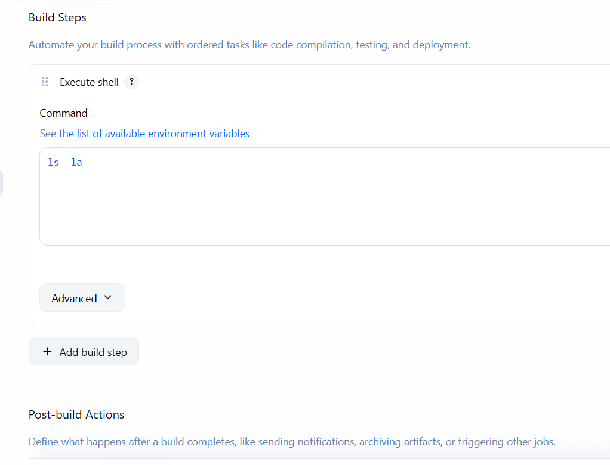
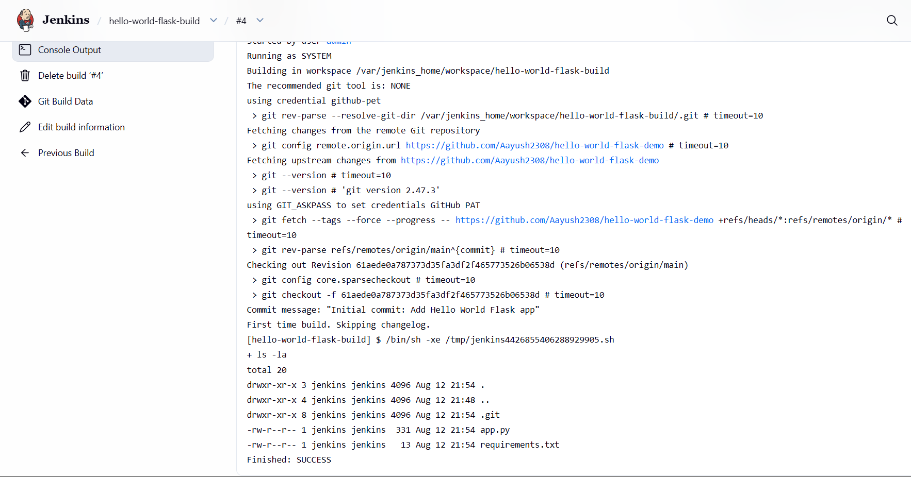
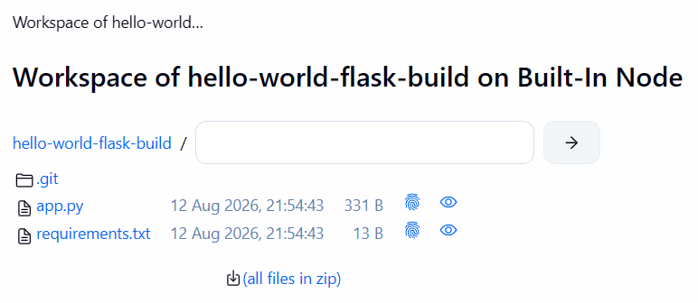

# TW1.3 — Basic Containerization (Docker) & Jenkins Freestyle Project

**Student:** Aayush Joshi | **PRN:** 23070122008 | **Marks:** 3

---

## Task 3.1 — Dockerize the Flask App (1.5 Marks)

Created a `Dockerfile` for the Python Flask "Hello World" application. The image runs the app on **port 5000**.

### Dockerfile:
```dockerfile
FROM python:3.11-slim
WORKDIR /app
COPY requirements.txt .
RUN pip install --no-cache-dir -r requirements.txt
COPY app.py .
EXPOSE 5000
CMD ["python", "app.py"]
```

**Commands used:**
```bash
# Build the Docker image
docker build -t hello-world-flask:latest .

# Run the container
docker run -d -p 5000:5000 --name flask-app hello-world-flask:latest

# Verify it's running
docker ps
```

### Screenshots:





---

## Task 3.2 — Jenkins Freestyle Project (1.5 Marks)

Set up a Jenkins Freestyle project to:
1. Pull the Git repository
2. Execute a build step that lists the workspace contents (`ls -la`)

Jenkins was run via Docker:
```bash
docker run -d \
  --name jenkins \
  -p 8080:8080 \
  -p 50000:50000 \
  -v jenkins_home:/var/jenkins_home \
  jenkins/jenkins:lts
```

**Jenkins Job Configuration:**
- Job Type: Freestyle Project
- SCM: Git (repository URL)
- Build Step: Execute Shell → `ls -la`

### Screenshots:






