# Project 2 – Deploy Angular Application in Docker Container

Name: Anshul Mandekar  
prn:23070122033

---

# Objective

The objective of this project is to deploy an Angular application inside a Docker container using Angular CLI. Docker Compose is used for both development and production environments to simplify deployment and application management.

---

# Software & Tools Used

- Angular CLI
- Node.js
- Docker Desktop
- Docker Compose
- Visual Studio Code
- Git & GitHub

---

# Project Files

The project consists of the following files:

- Angular Source Code
- Dockerfile
- docker-compose.yml
- docker-compose.prod.yml
- package.json
- angular.json
- README.md

---

# Project Workflow

```
Angular CLI
      │
      ▼
Create Angular Application
      │
      ▼
Run Application (ng serve)
      │
      ▼
Create Dockerfile
      │
      ▼
Build Docker Image
      │
      ▼
Docker Compose
(Development & Production)
      │
      ▼
Deploy Angular Application
```

---

# Task 1 – Install Angular CLI

Angular CLI was installed successfully using npm.

### Command

```bash
npm install -g @angular/cli
```

### Screenshots

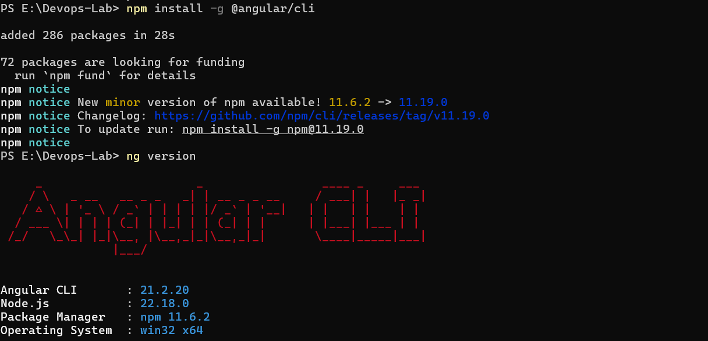

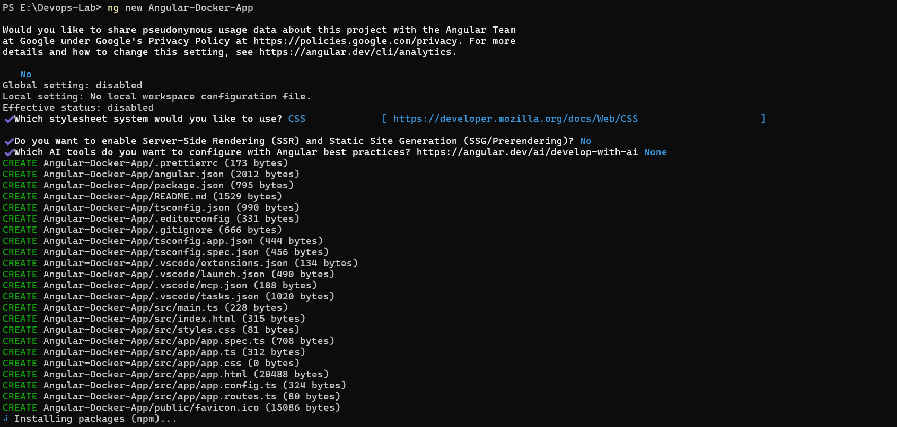

---

# Task 2 – Create Angular Application

A new Angular application named **Angular-Docker-App** was created successfully using Angular CLI.

### Screenshot

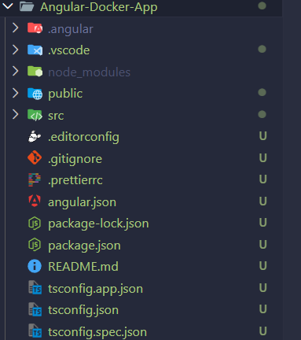

---

# Task 3 – Run Angular Application

The Angular development server was started successfully.

### Command

```bash
ng serve
```

The application was verified by opening:

```
http://localhost:4200
```

### Screenshots

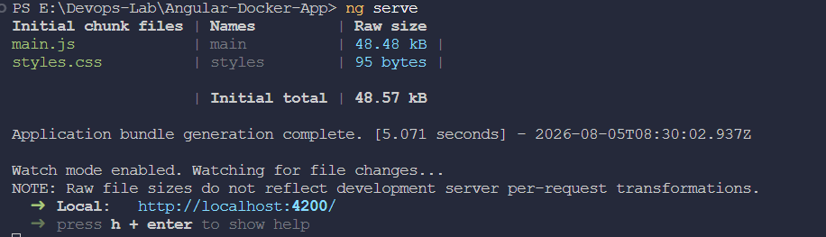

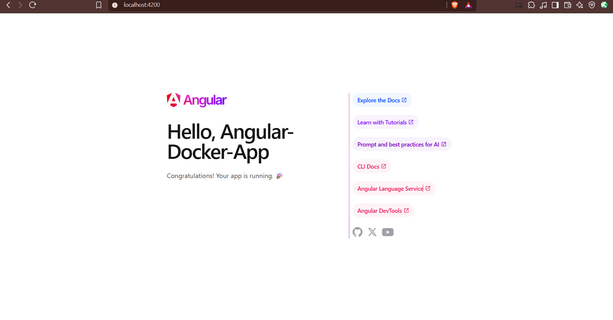

---

# Task 4 – Create Dockerfile

A Dockerfile was created to containerize the Angular application.

### Screenshot

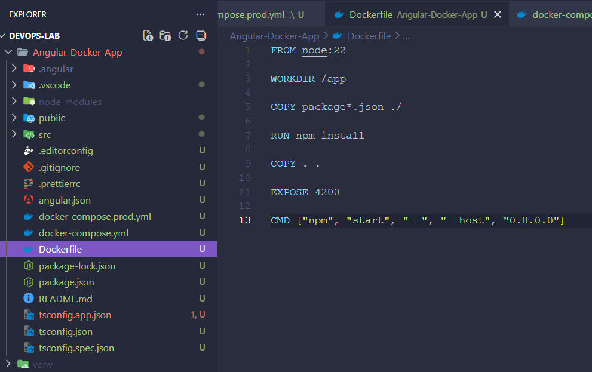

---

# Task 5 – Build Docker Image

The Docker image for the Angular application was built successfully.

### Command

```bash
docker build -t angular-docker-app .
```

### Screenshot

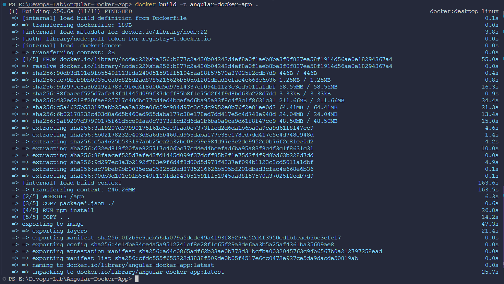

---

# Task 6 – Verify Docker Image

The Docker image was verified successfully.

### Command

```bash
docker images
```

### Screenshot

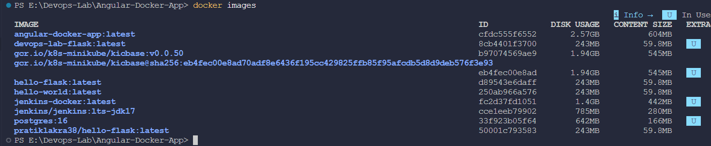

---

# Task 7 – Docker Compose Configuration

Docker Compose configuration files were created for both development and production environments.

**Development Configuration**

- docker-compose.yml

**Production Configuration**

- docker-compose.prod.yml

### Screenshots

Development

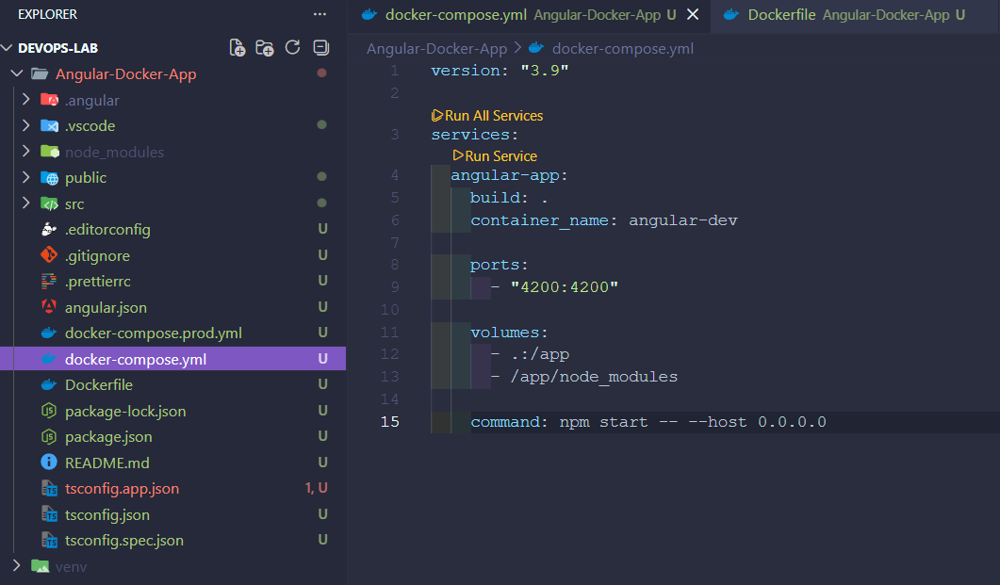

Production

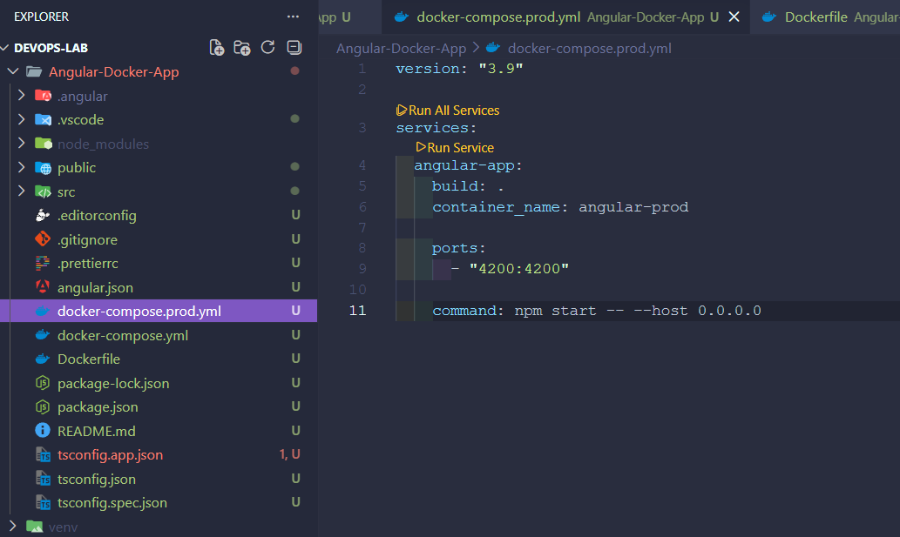

---

# Task 8 – Verify Running Container

The running Docker container was verified successfully.

### Command

```bash
docker ps
```

### Screenshot

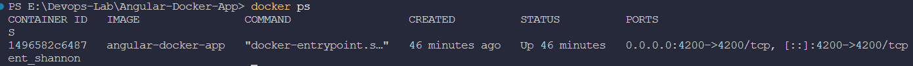

---

# Commands Used

```bash
npm install -g @angular/cli

ng new Angular-Docker-App

cd Angular-Docker-App

ng serve

docker build -t angular-docker-app .

docker images

docker run -d -p 4200:4200 angular-docker-app

docker compose up

docker compose -f docker-compose.prod.yml up

docker ps
```

---

# Learning Outcomes

- Installed and configured Angular CLI.
- Created an Angular application using Angular CLI.
- Executed the Angular application using the development server.
- Created a Dockerfile to containerize the Angular application.
- Built and verified the Docker image.
- Configured Docker Compose for both development and production.
- Verified the running Docker container using Docker commands.
- Understood the deployment workflow of Angular applications using Docker and Docker Compose.

---

# Result

The Angular application was successfully developed using Angular CLI and deployed inside a Docker container. Docker Compose was configured for both development and production environments. The application was built, containerized, and verified successfully, demonstrating the deployment of an Angular application using Docker and Docker Compose.