# Project 5: Containerizing Spring Boot Application and Scanning Docker Image

Name: Anshul Mandekar  
prn:23070122033
---

## Project Description

This project demonstrates the containerization of a Spring Boot REST application (Retail Store service) using Docker. The application is packaged into a self-contained Docker image using a single-stage Dockerfile that compiles the source code with Maven and runs the resulting executable JAR. This setup ensures the application runs independently of the host environment, following production-grade DevOps containerization practices. The Docker image was also prepared for vulnerability scanning using Docker security tools such as Docker Scout or Docker Trusted Registry (DTR).

---

## Objective

To package a Spring Boot REST application into a Docker image, execute it within an isolated container, and verify endpoint availability via browser access.

---

## Technologies Used

| Technology | Version | Purpose |
|---|---|---|
| Java | 24 | Programming language and runtime |
| Spring Boot | 4.1.0 | REST application framework |
| Maven | 3.9.16 | Build automation and dependency management |
| Docker Desktop | Latest | Local container runtime environment |
| Docker Engine | Latest | Core build and container management engine |
| Windows | N/A | Host operating system |
| VS Code | Latest | Integrated development environment |

---

## Prerequisites

* **Java** — Required for compiling and running the application locally.
* **Maven** — Required to package the application into an executable JAR.
* **Docker Desktop** — Required to build and execute Docker images.

---

## Project Structure

```text
Project-5/
│
├── Dockerfile
├── .dockerignore
├── README.md
├── pom.xml
│
├── src/
│   ├── main/
│   │   ├── java/
│   │   │   └── com/pratik/retail_store_app/
│   │   │        ├── RetailStoreAppApplication.java
│   │   │        └── HomeController.java
│   │   │
│   │   └── resources/
│   │        ├── static/
│   │        │     └── index.html
│   │        └── application.properties
│   │
│   └── test/
│
└── screenshots/
```

---

## Spring Boot Architecture

```text
                    Browser Request
                          │
                          ▼
                Embedded Tomcat Server
                          │
                          ▼
              Spring Boot Application
                          │
                          ▼
                  Dispatcher Servlet
                          │
                          ▼
                  REST Controller Layer
              (HomeController and mappings)
                          │
                          ▼
                  Business Logic Layer
                          │
                          ▼
                 HTML / Plain Text Response
                          │
                          ▼
                    Browser Renders Output
```

### Spring Initializr Setup

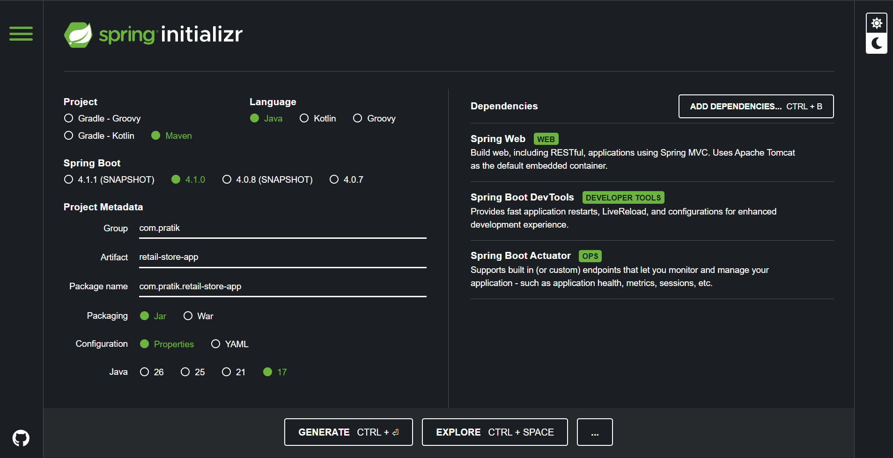

---

## Application Workflow

```text
Start Application
        │
        ▼
Spring Boot Initializes Embedded Server
        │
        ▼
Application Listens on Port 8081
        │
        ▼
Client Sends HTTP Request
        │
        ▼
Request Routed to Corresponding Endpoint
        │
        ▼
Controller Processes Request
        │
        ▼
Response Returned to Client
        │
        ▼
Client Displays Result in Browser
```

---

## REST Endpoints

| Endpoint | Method | Description | Response |
|---|---|---|---|
| `/` | GET | Home Page | HTML Landing Page |
| `/products` | GET | Products endpoint | Plain text: "Products Service Running" |
| `/customers` | GET | Customers endpoint | Plain text: "Customers Service Running" |

---

## Running the Application Locally

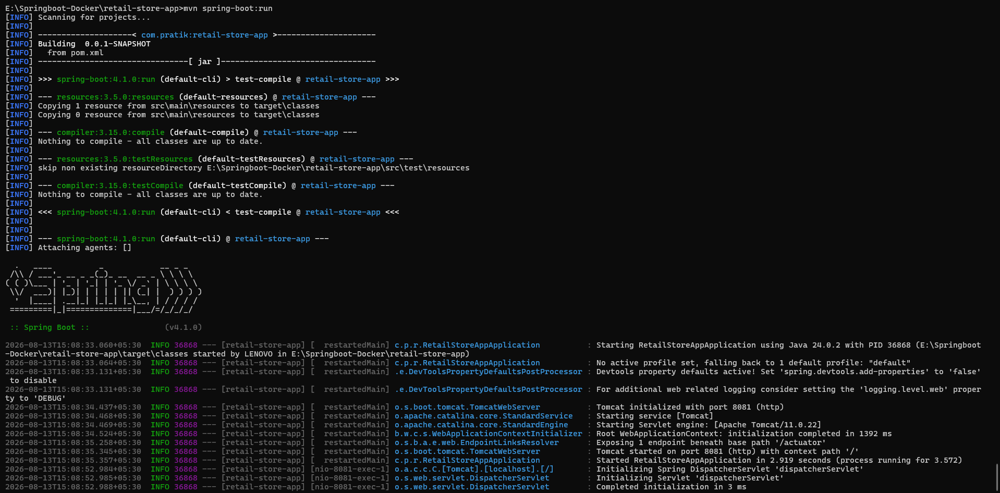

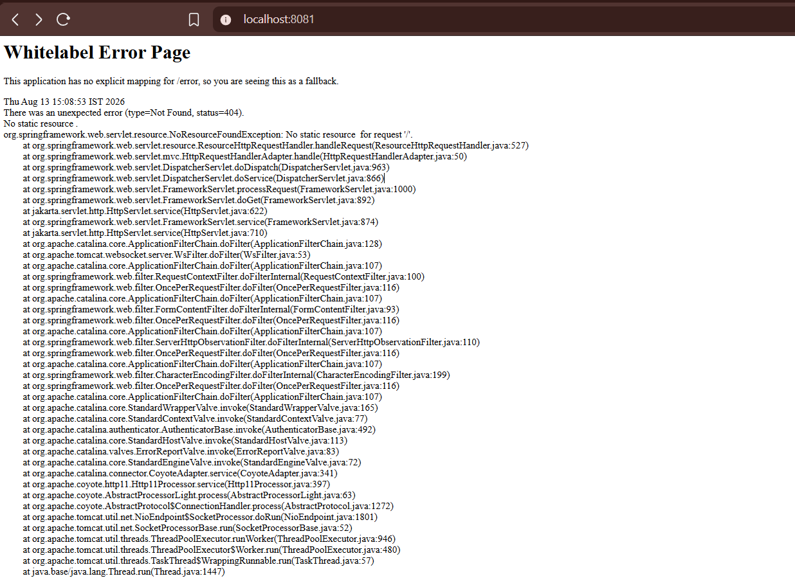

### Home Page

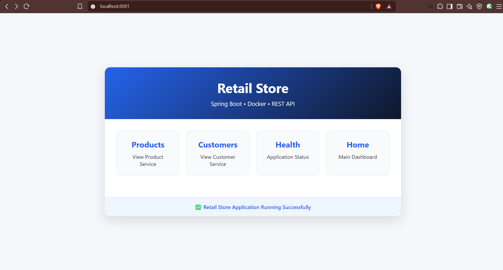

### Products Endpoint

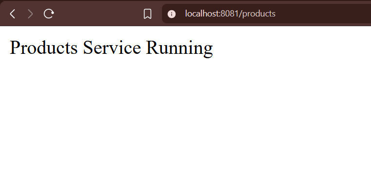

### Customers Endpoint

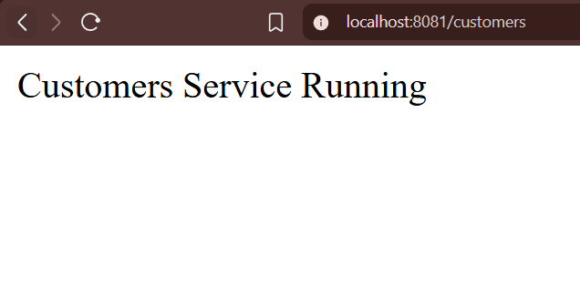

---

## Docker Architecture

```text
                 Developer Machine
                         │
                         ▼
              Dockerfile (Build Instructions)
                         │
                         ▼
                   Docker Build Process
        (JDK image builds application with Maven)
                         │
                         ▼
                     Docker Image
              (JDK Runtime + Application JAR)
                         │
                         ▼
                   Docker Container
              (Isolated Runtime Environment)
                         │
                         ▼
              Spring Boot Application Running
                         │
                         ▼
                Exposed Port (8081)
                         │
                         ▼
                    Browser Access
```

---

## Dockerfile

```dockerfile
FROM eclipse-temurin:24-jdk
WORKDIR /app
COPY . .
RUN ./mvnw clean package -DskipTests || mvn clean package -DskipTests
EXPOSE 8081
ENTRYPOINT ["java","-jar","target/retail-store-app-0.0.1-SNAPSHOT.jar"]
```

### Dockerfile Instructions Explained

| Command | Purpose |
|---|---|
| `FROM` | Base JDK image |
| `WORKDIR` | Sets working directory |
| `COPY` | Copies source files |
| `RUN` | Builds Maven project |
| `EXPOSE` | Opens port 8081 |
| `ENTRYPOINT` | Runs Spring Boot JAR |

---

## Commands Used

```bash
# Local Execution
mvn spring-boot:run
mvn clean package

# Container Operations
docker build -t retail-store-app .
docker images
docker run -d -p 8081:8081 --name retail-store-container retail-store-app
docker ps
docker logs retail-store-container
```

---

## Docker Build Process

* **Build image:** Dockerfile compiles source code with Maven and packages the application JAR.
* **Create image:** Registers the compiled image locally for container deployment.
* **Run container:** Launches an isolated instance mapping container port 8081 to the host.
* **Access application:** Routes browser traffic to verify endpoint responses.
* **Verify logs:** Validates application startup and embedded server initialization.

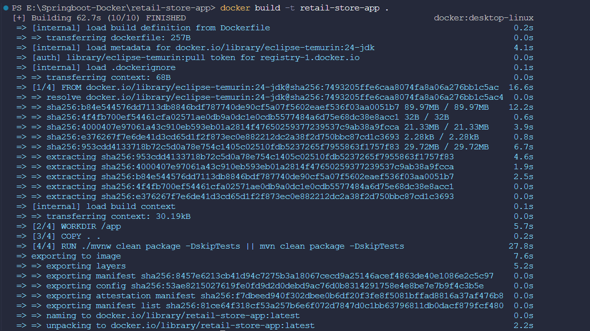

---

## Docker Images

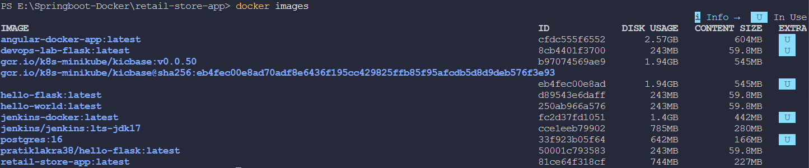

---

## Running Container

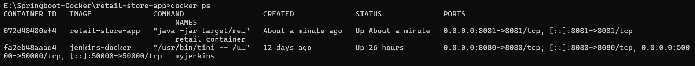

---

## Application Access from Docker

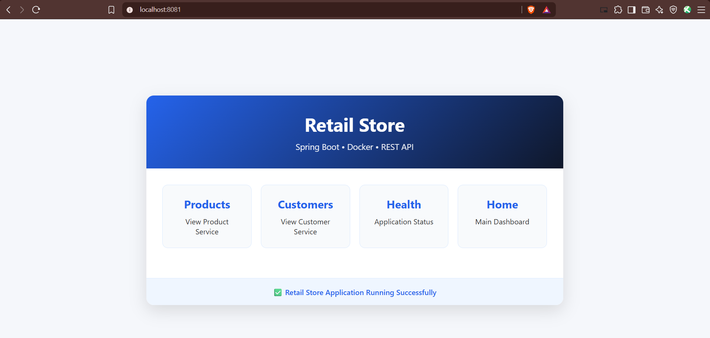

---

## Container Logs

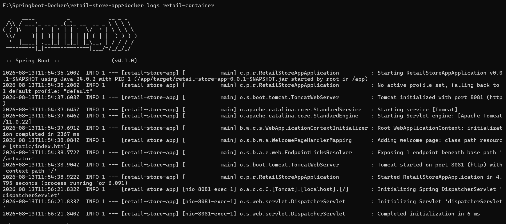

---

## Build Result

```text
Build Result

Spring Boot Application : SUCCESS
Docker Image Build      : SUCCESS
Docker Container        : SUCCESS
Application Deployment  : SUCCESS
Container Logs          : SUCCESS

Final Status : APPLICATION RUNNING SUCCESSFULLY
```

---

## Learning Outcomes

• Created a Spring Boot REST application.
• Containerized the application using Docker.
• Built and executed Docker images.
• Verified the running container.
• Understood Docker deployment workflow.

---

## Conclusion

This project demonstrates the complete lifecycle of containerizing a Spring Boot REST service. By encapsulating the build and execution stages inside a Docker container, the application achieves runtime consistency across environments without depending on host-installed Java dependencies. The end-to-end process verifies build execution, container instantiation, log tracking, and endpoint accessibility on host port 8081.
