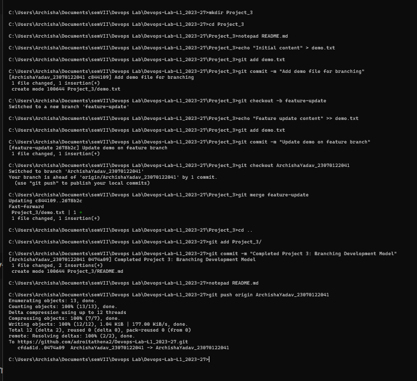

# Experiment Theory: Git Branching Development Model

## Overview

This experiment demonstrates a standard **Git branching and merging workflow** for a DevOps laboratory project (**Project 3: Branching Development Model**).

The primary goal of this workflow is to ensure faster and safer work integration by isolating new feature development from the main codebase.

---

## Experiment Components

The experiment utilizes the following files to demonstrate the workflow:

* **`README.md`** – Contains the documentation and step-by-step instructions for the Git branching workflow.
* **`demo.txt`** – A sample text file used to practice file modifications across different branches. During the experiment, this file transitions from containing `"Initial content"` to including `"Feature update content"`.
* **`screenshot1.png`** – Screenshot showing the execution of the Git branching and merging commands in the terminal.

---

## Step-by-Step Procedure

### 1. Verify Current State

The `git status` command was executed to ensure that the working tree was clean before creating any branches.

```bash
git status
```

---

### 2. Create and Switch to a Feature Branch

A separate feature branch was created to isolate the new development work from the main codebase.

```bash
git checkout -b feature-branch
```

This creates the branch and switches the working directory to it.

---

### 3. Develop and Commit

The `demo.txt` file was modified by adding the following feature content:

```text
Feature update content
```

The changes were then staged and committed using:

```bash
git add demo.txt
git commit -m "Add feature update"
```

This stores the feature changes safely within the feature branch.

---

### 4. Switch Back to the Main Branch

After completing the feature development, the workspace was switched back to the main integration branch.

```bash
git checkout main
```

---

### 5. Merge the Feature Branch

The feature branch was merged into the main branch using:

```bash
git merge feature-branch
```

This integrates the changes developed in the feature branch into the main codebase.

#### Handling Merge Conflicts

If a merge conflict occurs, the conflicting files must be manually edited to resolve the differences.

After resolving the conflict, the files are staged and the merge is completed:

```bash
git add .
git commit -m "Resolve merge conflict"
```

---

### 6. Push the Updated Branch

Finally, the updated main branch was pushed to the remote repository:

```bash
git push origin main
```

This makes the integrated changes available in the remote repository.

---

## Execution Evidence

The successful execution of the Git branching and merging workflow is documented in the screenshot below.

### Branching Execution



The screenshot provides practical evidence of the Git commands used during the experiment, including branch creation, switching, committing changes, merging the feature branch, and pushing the updated code.

---

## Git Branching Workflow

```text
Main Branch
    |
    | git checkout -b feature-branch
    v
Feature Branch
    |
    | Modify demo.txt
    | git add
    | git commit
    v
Feature Complete
    |
    | git checkout main
    v
Main Branch
    |
    | git merge feature-branch
    v
Integrated Changes
    |
    | git push origin main
    v
Remote Repository
```

---

## Conclusion

The Git branching development model was successfully demonstrated by creating an isolated feature branch, modifying and committing changes, merging the feature branch into the main branch, and pushing the integrated changes to the remote repository.

This workflow helps maintain a **clean, organized, and safer development process** by allowing features to be developed independently before being integrated into the main codebase.
