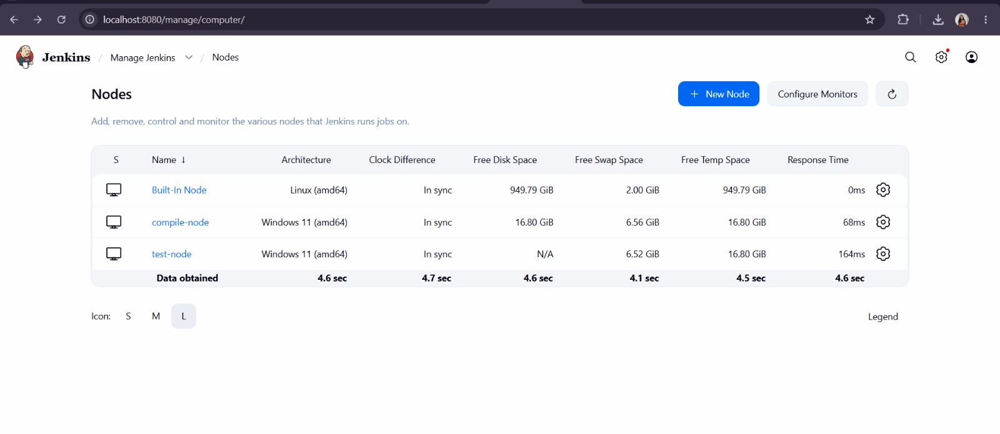
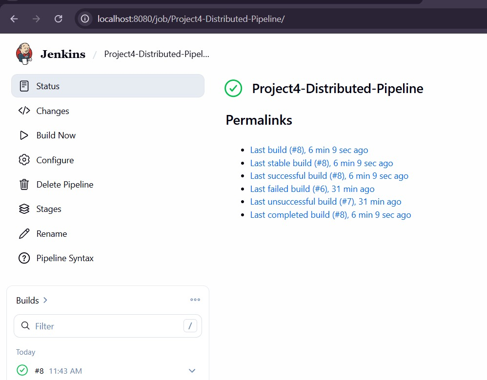
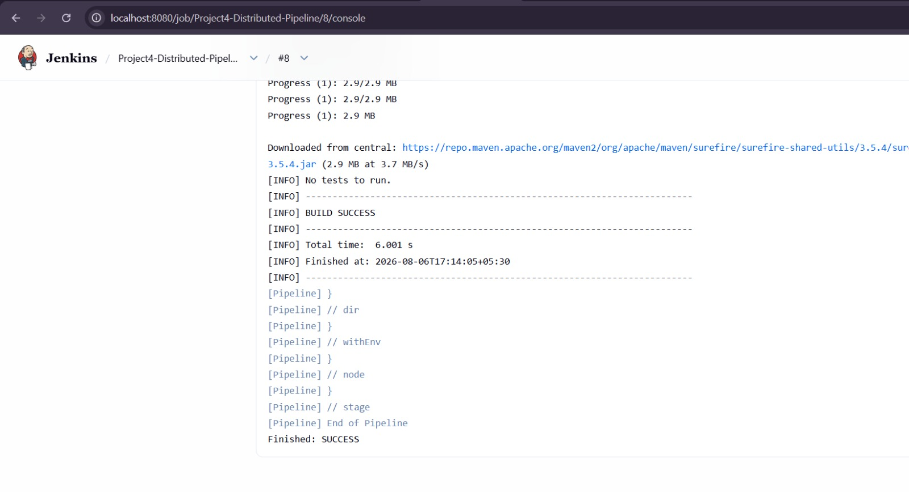

# Project 4: Architecting Jenkins Pipeline for Scale

## Objective

The objective of this project is to design and implement a **distributed Jenkins pipeline** for the `project4-demo` Maven application using two different Jenkins agent nodes.

The pipeline distributes the **compilation** and **testing** stages across separate Jenkins agents to demonstrate scalable, isolated build execution.

---

## Technologies Used

* Jenkins (Declarative Pipeline)
* Apache Maven
* Windows Command Line / Batch Scripting

---

## Project Description

A Maven-based application was used to demonstrate **distributed Continuous Integration (CI)** using Jenkins.

The pipeline avoids running the complete workflow on a single Jenkins node. Instead, two separate Windows agents are used:

* **Compile Agent:** Compiles the Maven project.
* **Test Agent:** Executes the automated testing suite.

The **Jenkins Master** coordinates the pipeline execution and delegates each workload to the appropriate agent.

---

## Jenkins Architecture

```text
                 Jenkins Master
                        |
              ---------------------
              |                   |
              v                   v
        compile-node          test-node
    Label: maven-compile  Label: maven-test
              |                   |
              v                   v
       Maven Compilation       Maven Tests
              |                   |
              -----------+---------
                         |
                         v
                    BUILD SUCCESS
```

---

## Jenkins Agent Configuration

### Compile Agent

* **Node:** `compile-node`
* **Label:** `maven-compile`
* **Purpose:** Clean the workspace and compile the Maven source code.

### Test Agent

* **Node:** `test-node`
* **Label:** `maven-test`
* **Purpose:** Execute Maven automated tests against the compiled codebase.

Both agents execute their commands inside the specific `Project_4` directory.

---

## Pipeline Stages

### Stage 1: Compile on Node 1

The compilation stage is executed on the agent with the label `maven-compile`.

**Command:**

```bat
cd Project_4
mvn clean compile
```

This stage cleans the previous build artifacts and compiles the Maven source code.

### Stage 2: Test on Node 2

The testing stage is executed on the agent with the label `maven-test`.

**Command:**

```bat
cd Project_4
mvn test
```

This stage runs the automated test suite for the Maven application.

---

## Pipeline Workflow

```text
Jenkins Master
(Pipeline Initialization)
       |
       v
Stage: Compile on Node 1
(Agent: maven-compile)
       |
       v
cd Project_4
mvn clean compile
       |
       v
Stage: Test on Node 2
(Agent: maven-test)
       |
       v
cd Project_4
mvn test
       |
       v
BUILD SUCCESS
```

---

## Jenkinsfile

The `Jenkinsfile` uses a **Declarative Pipeline** structure with:

```groovy
agent none
```

at the top level.

Using `agent none` ensures that no default Jenkins node is assigned to the entire pipeline. Each stage explicitly specifies the Jenkins agent on which it should execute.

The compilation stage uses:

```groovy
agent {
    label 'maven-compile'
}
```

while the testing stage uses:

```groovy
agent {
    label 'maven-test'
}
```

This enables the pipeline to distribute different workloads across separate Jenkins nodes.

---

## Source Code Structure

```text
Project_4/
│
├── README.md
├── screenshot1.jpeg
├── screenshot2.jpeg
├── screenshot3.jpeg
├── Jenkinsfile
└── pom.xml
```

---

## Build Result

The distributed Jenkins pipeline executed successfully.

| Stage                 | Result        |
| --------------------- | ------------- |
| Maven Compile         | SUCCESS       |
| Maven Test            | SUCCESS       |
| Final Pipeline Status | BUILD SUCCESS |

---

## Screenshots

### Screenshot 1 — Distributed Nodes Online

Shows the active status of the Jenkins worker nodes.



### Screenshot 2 — Pipeline Stage View

Shows the successful completion of the multi-stage Jenkins pipeline.



### Screenshot 3 — Console Output

Contains the detailed execution logs generated during pipeline execution.



---

## Learning Outcomes

This project provided practical experience with:

* Jenkins Master-Agent Architecture
* Distributed Jenkins Declarative Pipelines
* Isolating workloads using Jenkins Agent Labels
* Maven Build Automation
* Executing Windows batch commands using `bat`
* Pipeline Scalability
* Separation of Concerns in CI pipelines
* Distributed build and test execution

---

## Conclusion

A distributed Jenkins CI pipeline was successfully implemented for the `project4-demo` Maven application.

The **compilation stage** was executed on the `maven-compile` agent, while the **testing stage** was independently executed on the `maven-test` agent. The Jenkins Master successfully coordinated the complete workflow.

This demonstrates how Jenkins can distribute workloads across multiple agent nodes to achieve **scalable, isolated, and efficient CI execution**.
