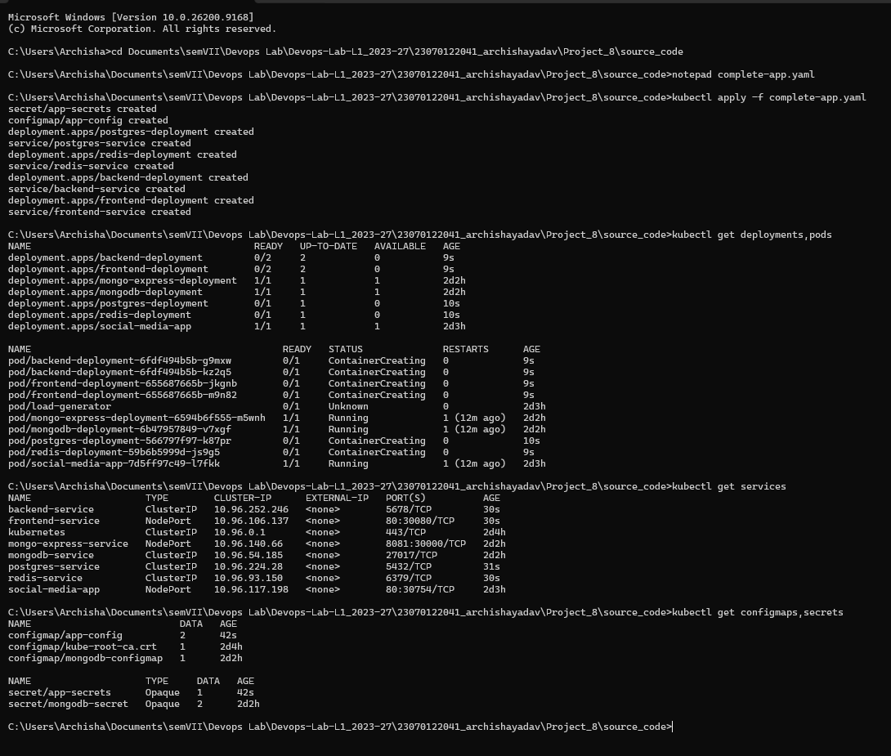
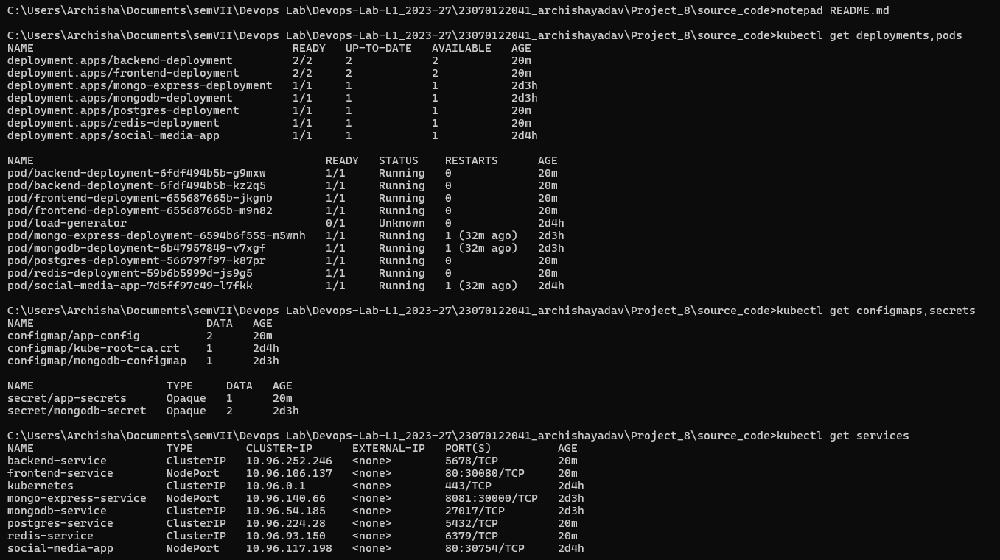
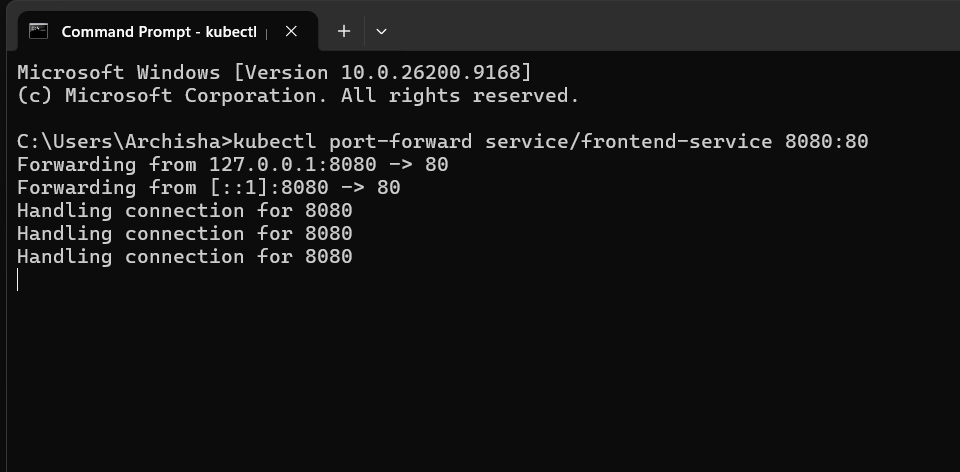
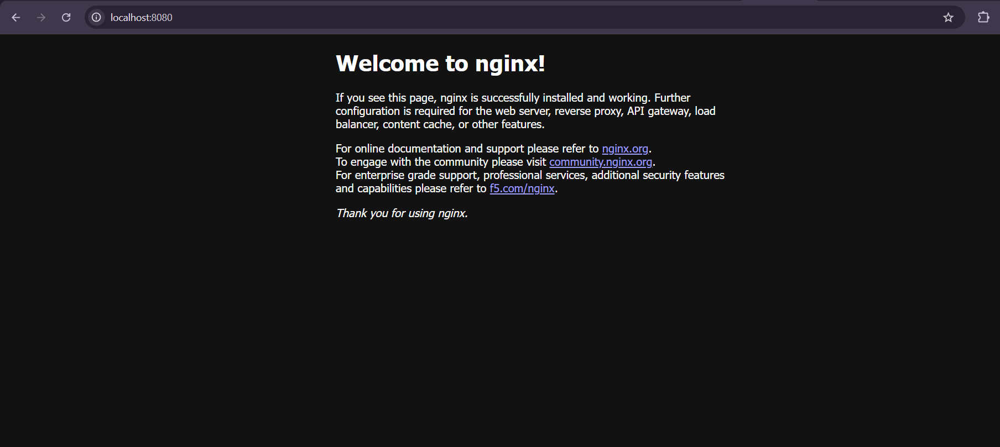
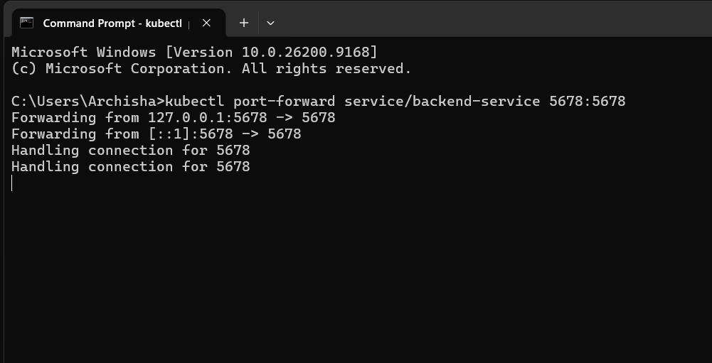
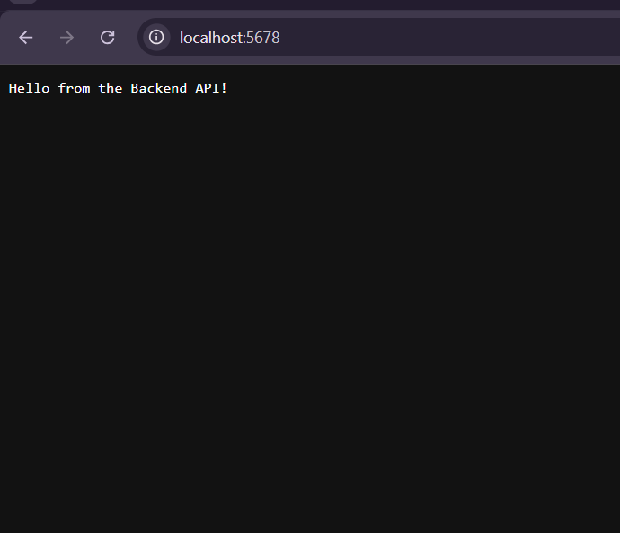
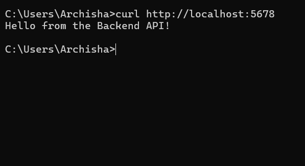
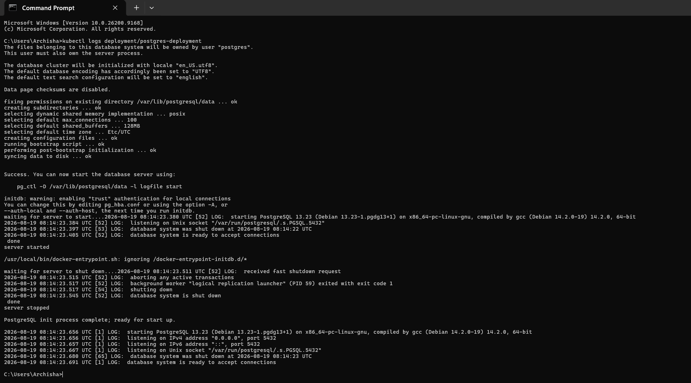
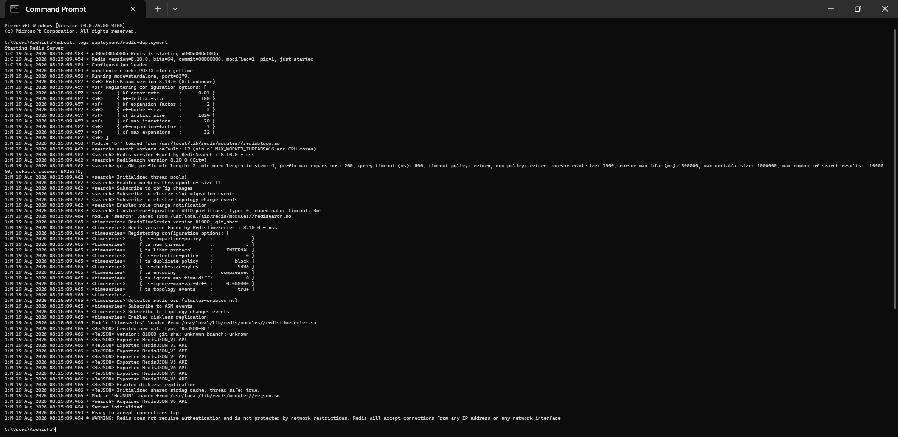

# Project 8: Containerizing a 4-Microservice Application

## 1. Objective
Create deployments, services, configmaps, and secrets to containerize a complete application with at least 4 microservices [cite: 1].

## 2. Architecture Overview
This project deploys a 4-tier mock architecture using Kubernetes [cite: 1]:
1. **Frontend:** Nginx web server (exposed via NodePort on port 30080) [cite: 1]
2. **Backend API:** Echo server (exposed via ClusterIP on port 5678) [cite: 1]
3. **Database:** PostgreSQL (uses Secrets for password, exposed via ClusterIP on port 5432) [cite: 1]
4. **Cache:** Redis (exposed via ClusterIP on port 6379) [cite: 1]

All configurations (Secrets, ConfigMaps, Deployments, and Services) are maintained in a single manifest file `complete-app.yaml` [cite: 1].

## 3. Execution & Validation

### Step 1: Applying Manifests & Verifying Deployment
The Kubernetes configuration file was applied to create all the necessary pods, deployments, services, configmaps, and secrets.

**Creation of Services:**  
 [cite: 1]

**Containerized Services Running:**  
 [cite: 1]

### Step 2: Testing the Frontend Service
Since the frontend service is exposed via a NodePort, port-forwarding was used to map it to a local port for testing.

**Port-forwarding Frontend:**  
 [cite: 1]

**Frontend Application Running:**  
 [cite: 1]

### Step 3: Testing the Backend Service
The backend API runs on a ClusterIP, requiring port-forwarding to access it locally. 

**Port-forwarding Backend Service:**  
 [cite: 1]

**Backend Service Running & Responding:**  
 [cite: 1]  
 [cite: 1]

### Step 4: Verifying Stateful Services (Database & Cache)
To ensure the backend data layers were functioning properly, their container logs were inspected to verify they are ready to accept connections.

**PostgreSQL Logs (Ready for connections):**  
 [cite: 1]

**Redis Cache Logs (Ready for connections):**  
 [cite: 1]

## 4. Conclusion
The application architecture consisting of four microservices was successfully deployed to the local Kubernetes cluster. The deployments, services, configmaps, and secrets were correctly configured, allowing the frontend to serve web traffic, the backend to respond to API requests, and both the database and cache to initialize and accept connections.