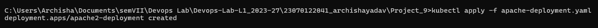
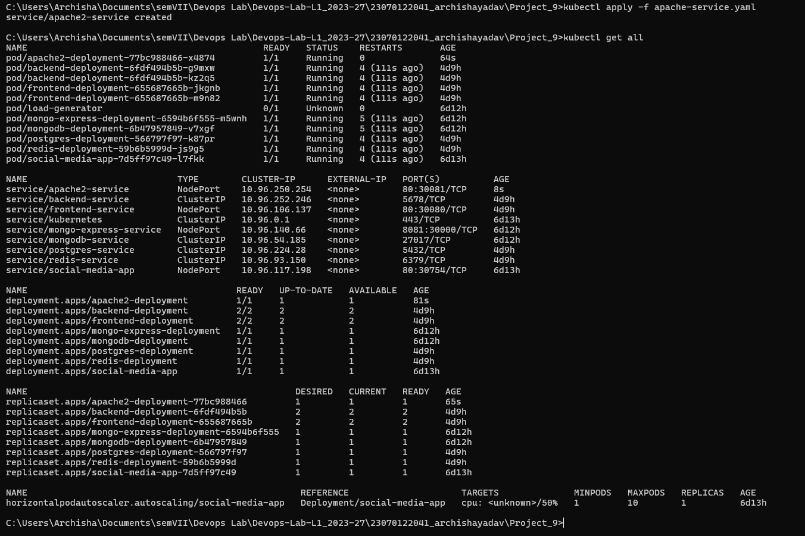
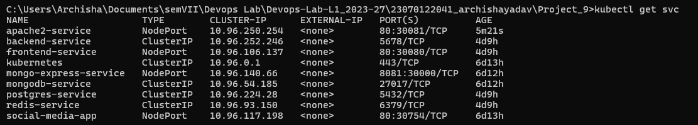
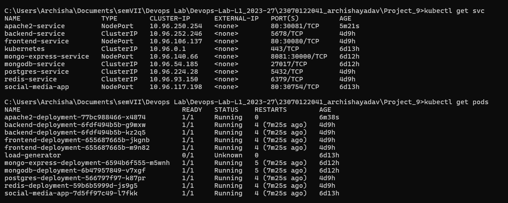
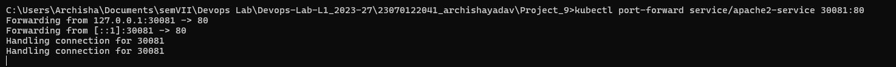

# Project 9: Deploying Apache2 Server on Kubernetes

## Objective
To create an Apache2 HTTP server within a Kubernetes deployment, expose it as a service, and successfully access it from the host machine using Kubernetes commands.

## Configuration Files Used
1. **`apache-deployment.yaml`**: Configured to spin up a pod running the `httpd:latest` Docker image.
2. **`apache-service.yaml`**: Configured as a `NodePort` service to expose port 80 of the deployment to an external node port (30081).

---

##  Execution Steps & Screenshots

### Step 1: Creating the Apache2 Deployment
First, the Apache2 deployment is applied to the cluster using the YAML manifest. This instructs Kubernetes to pull the Apache image and start the container.

*Applying the deployment manifest:*

### Step 2: Creating the Service & Verifying Cluster State
Next, the `apache-service.yaml` is applied to expose the server. The `kubectl get all` command is then used to verify the state of all active resources, including Pods, Services, Deployments, and ReplicaSets.

*Applying the service and listing all cluster resources:*

### Step 3: Verifying Pods and Services
To ensure the deployment is healthy and the ports are correctly mapped, we specifically poll the services and pods. The output confirms `apache2-service` is listening on NodePort `30081` and the pod is `Running`.

*Checking services isolated:*

*Checking both services and pods together:*

### Step 4: Port Forwarding to Host Machine
To bypass Node IP bridging limitations on the local host environment (Windows/Docker Desktop), the `kubectl port-forward` command is used. This tunnels traffic from `localhost:30081` directly to the Kubernetes service.

*Executing the port-forward command:*

### Step 5: Accessing the Application
With the port-forwarding active, the Apache web server is accessed via the host machine's web browser by navigating to `http://localhost:30081`. 

*Browser successfully rendering the default Apache page:*

---

## Conclusion
Successfully deployed a containerized Apache2 server on a local Kubernetes cluster, managed its lifecycle via deployment and service manifests, and verified host-machine access using network port-forwarding.ent and service manifests, and verified host-machine access using network port-forwarding.

