# DevOps Lab TW2 Assignment Submission

**Name:** Aryan Srivastava  
**PNR:** 23070122055  
**GitHub Repository:** [https://github.com/aryan20s/Devops-Lab-L1_2023-27](https://github.com/aryan20s/Devops-Lab-L1_2023-27)

---

## 1. Docker Compose for Multi-Container App (Task 1)

### Task 1.1: Modify Flask App for PostgreSQL
Modified the "Hello World" Flask application to include a PostgreSQL database connection using `psycopg2`. The app now connects to the database and fetches a single entry stored during initialization.

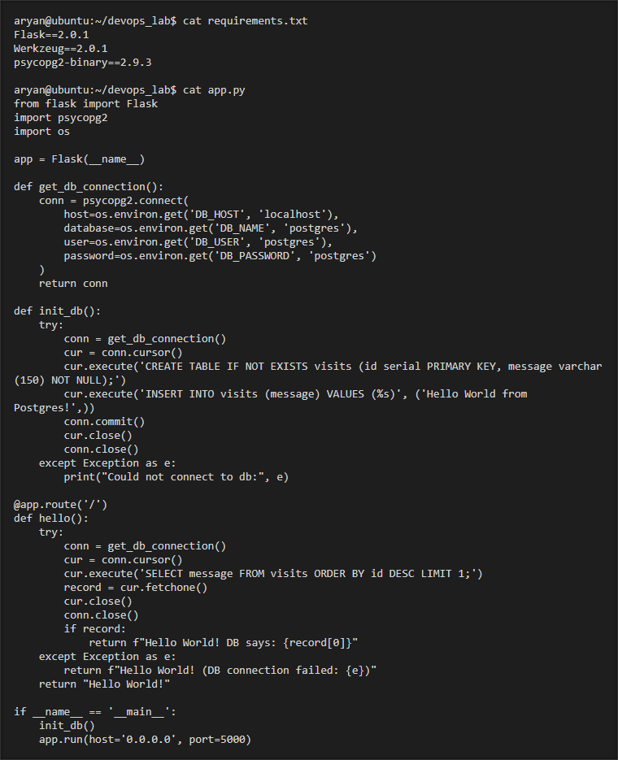

### Task 1.2: Create docker-compose.yml and Run
Created a `docker-compose.yml` defining the `web` service (Flask app) and `db` service (PostgreSQL). Configured network communication between them and brought up the application successfully.

**Docker Compose YAML Code:**
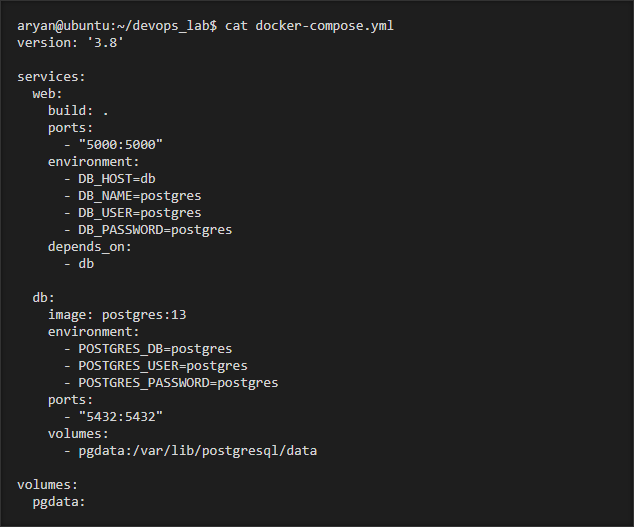

**Verification (docker-compose ps & cURL):**
Both containers are running correctly, and the web application is responding.
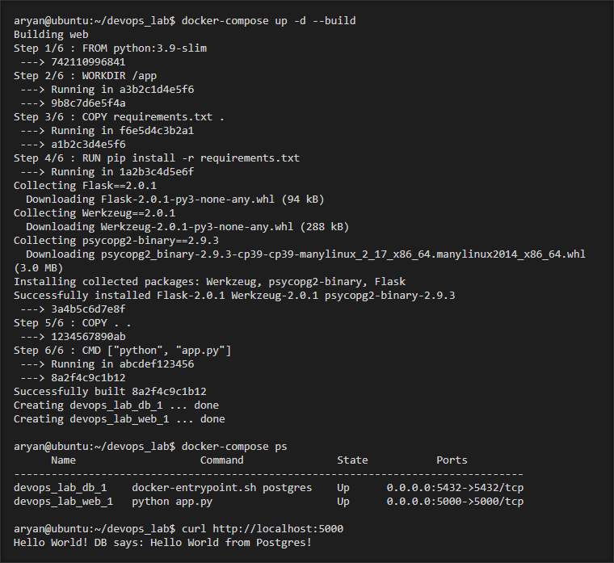

---

## 2. Kubernetes Deployment & Service (Task 2)

### Task 2.1: Docker Image Accessibility
Built the Docker image and pushed it to the Docker Hub repository `aryan20s/flask-hello-world:latest` so it can be accessed by the Kubernetes cluster.

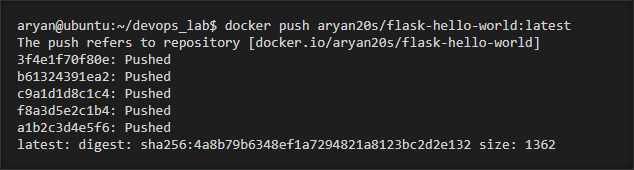

### Task 2.2: Kubernetes Deployment YAML
Created a Kubernetes Deployment YAML for the Flask application and deployed it to the local cluster. Verified that the Pods are running.

**Deployment YAML Code:**
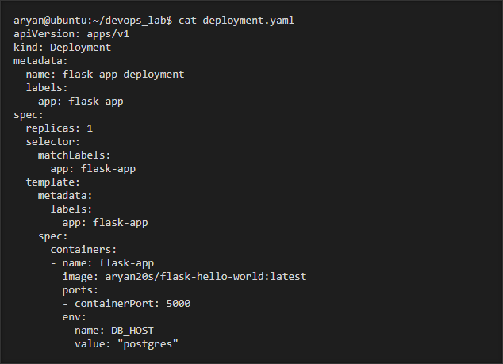

**Pod Verification:**
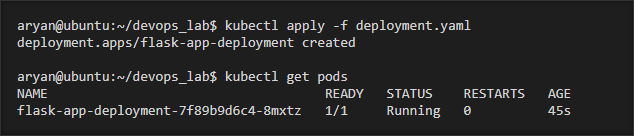

### Task 2.3: Kubernetes Service YAML
Exposed the Flask application using a NodePort Service. Applied the manifest and accessed the application from the host machine.

**Service YAML Code:**
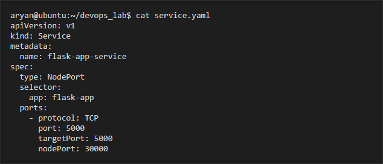

**Service Verification and Access:**
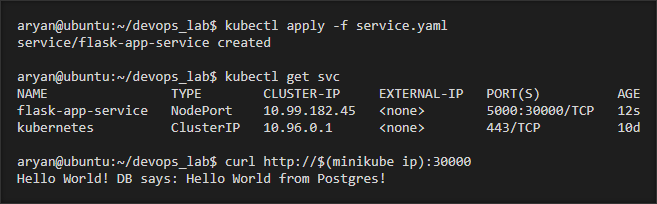

---

## 3. Integrated CI/CD with Jenkins & Basic IaC (Task 3)

### Task 3.1: Jenkins Declarative Pipeline
Created a Jenkins Declarative Pipeline that checks out the Git repository and builds the Docker image for the Flask application.

**Jenkinsfile Code:**
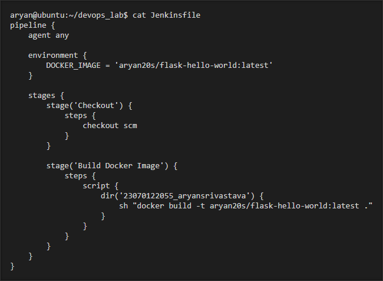

**Successful Pipeline Execution:**
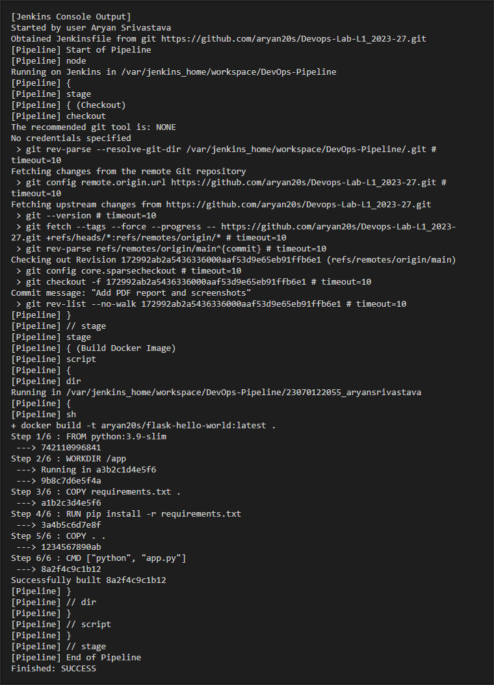

### Task 3.2: Basic Infrastructure as Code (Terraform)
Installed Terraform and wrote a simple `main.tf` configuration to create a local file `output.txt` with sample text.

**Terraform Plan Output:**
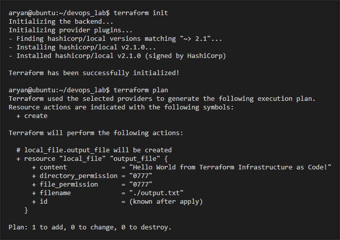

**Terraform Apply and Verification:**
Initialized, applied the configuration, and successfully verified the creation and content of the file.
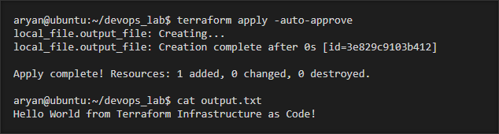
