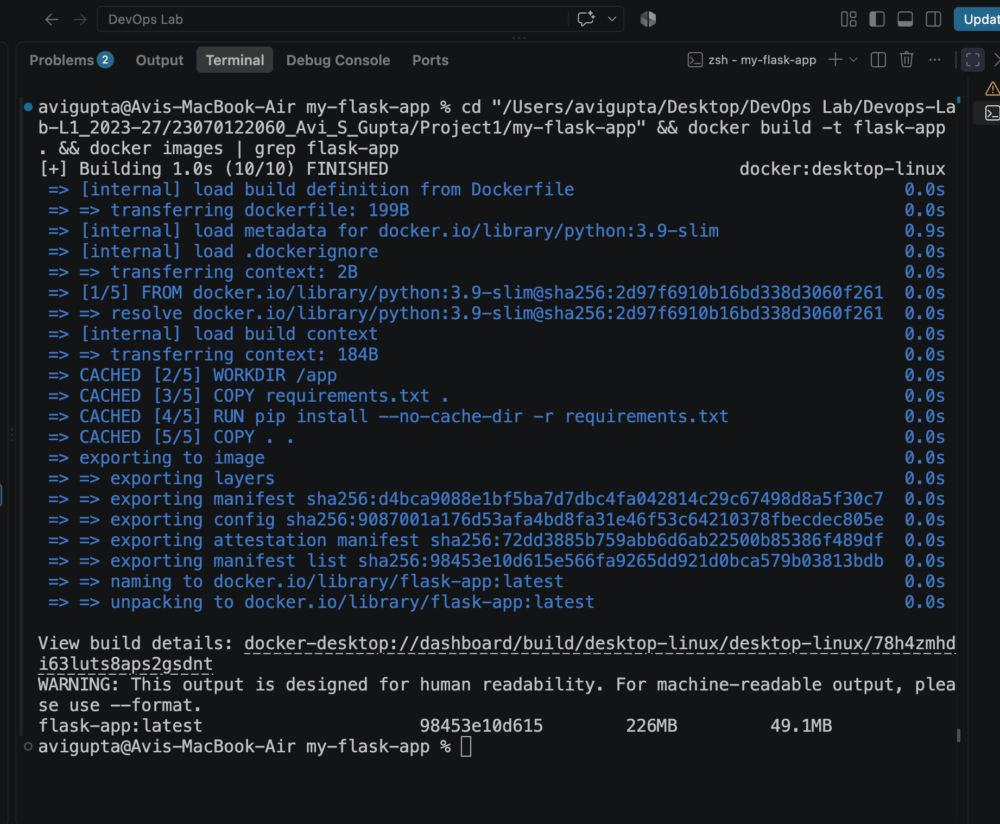
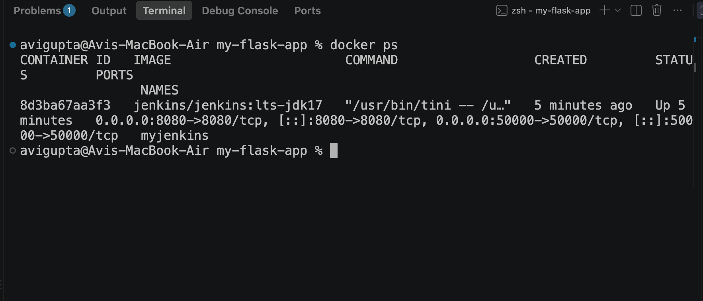
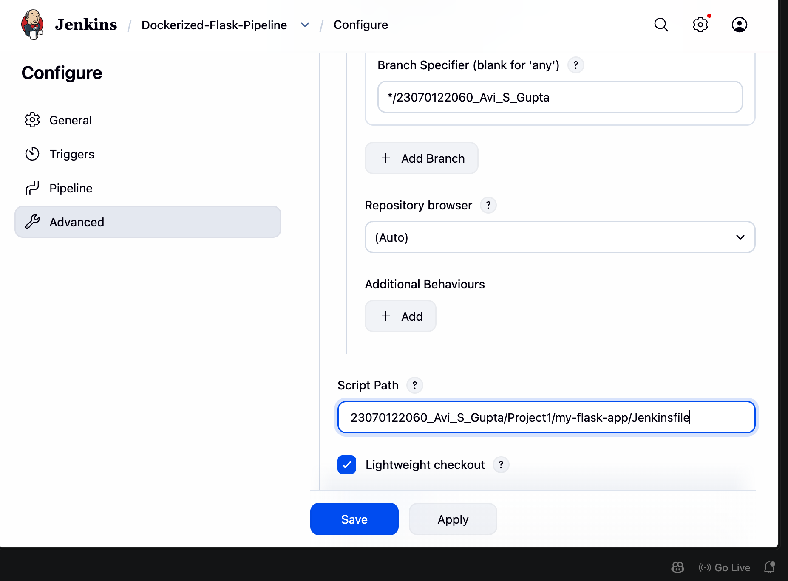
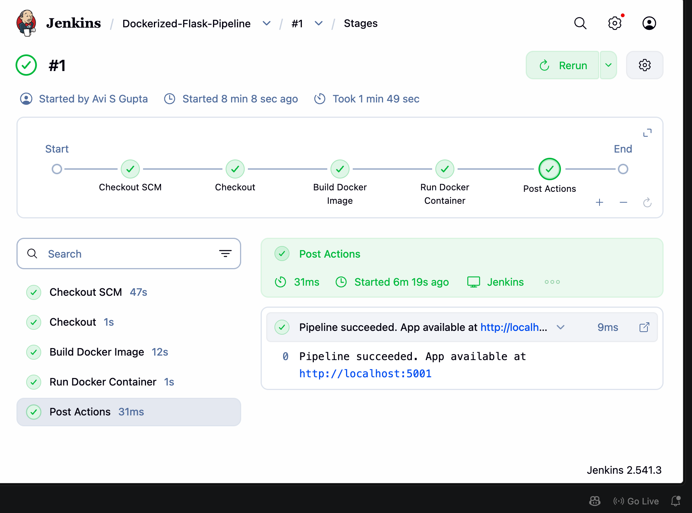
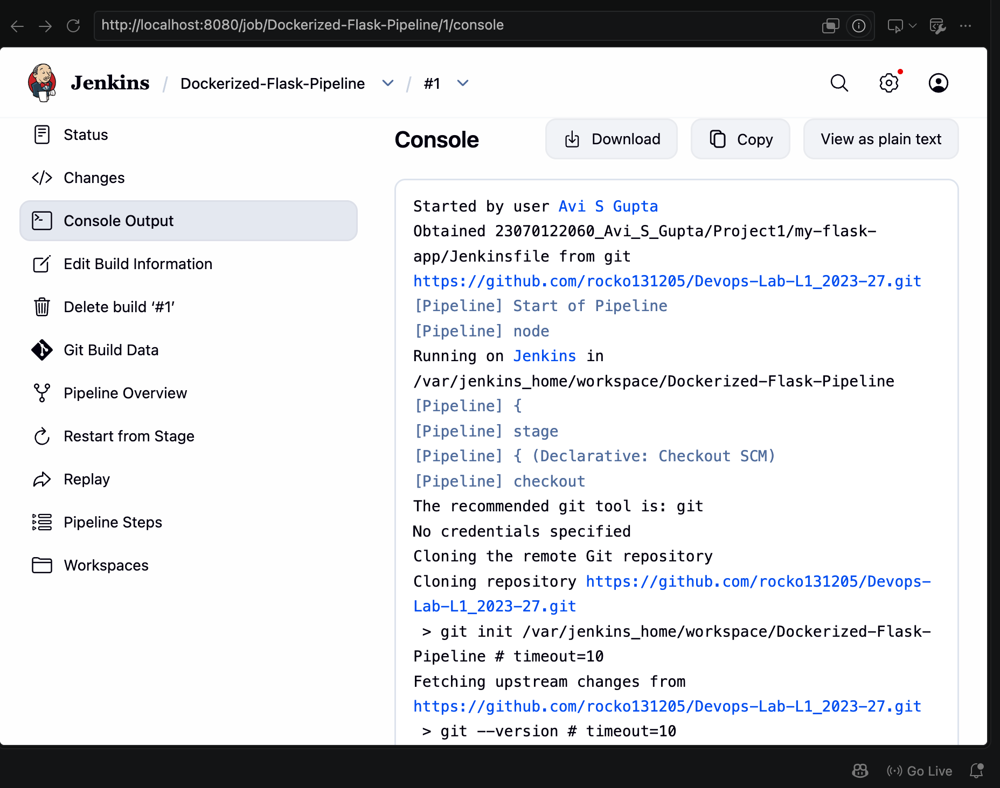
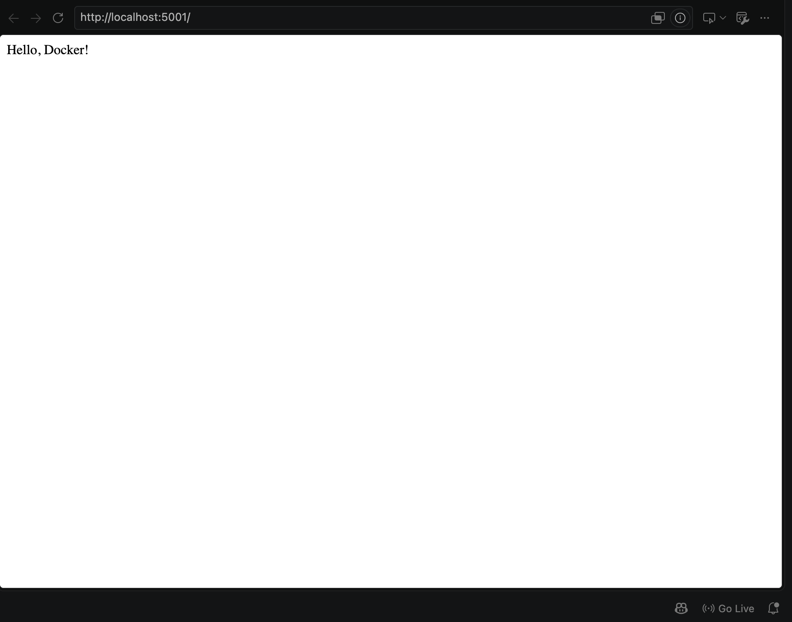

# Project 1 – Dockerizing a Jenkins Pipeline

## Student Details
- **Name:** Avi S Gupta
- **PRN:** 23070122060
- **Course:** DevOps Lab L1 (2023–27)

## Objective
The objective of this project is to containerize a simple Flask application using Docker and
automate its build and deployment through a Jenkins **declarative pipeline**. Jenkins itself is
run inside a Docker container, and the pipeline is defined as code in a `Jenkinsfile` committed
to the repository, demonstrating the Pipeline-as-Code approach.

## Tools & Technologies
- **Python (Flask)** – lightweight web framework for the sample application
- **Docker** – containerization engine used to build and run the application image
- **Jenkins (LTS)** – automation server, itself running as a Docker container
- **Declarative Pipeline (Groovy)** – pipeline defined in a `Jenkinsfile`
- **Git & GitHub** – version control and the SCM source for the pipeline

## Project Workflow

```
Create Flask Application
          │
          ▼
Write Dockerfile for the App
          │
          ▼
Write Jenkinsfile (Pipeline as Code)
          │
          ▼
Run Jenkins inside a Docker Container
          │
          ▼
Create a Jenkins Pipeline Job (from SCM)
          │
          ▼
Jenkins Checks Out Code → Builds Image → Runs Container
          │
          ▼
Access Application at http://localhost:5001
```

## Procedure

### Step 1 – Create the Flask Application
A minimal Flask application (`app.py`) exposes a single route `/` that returns
`Hello, Docker!`. Its dependencies are pinned in `requirements.txt`.

### Step 2 – Write the Dockerfile
The `Dockerfile` uses `python:3.9-slim` as the base image, sets `/app` as the working
directory, installs dependencies from `requirements.txt`, copies the source, exposes port
`5000`, and runs `python app.py`.



### Step 3 – Write the Jenkinsfile
A declarative pipeline with three stages was written and committed to the repository:

| Stage | Purpose |
|---|---|
| **Checkout** | Pulls the source code from GitHub via `checkout scm` |
| **Build Docker Image** | Runs `docker build -t flask-app .` |
| **Run Docker Container** | Removes any stale container, then runs a new one mapping host `5001` → container `5000` |

### Step 4 – Run Jenkins inside Docker
Jenkins was started as a Docker container and the setup wizard completed (unlock key,
suggested plugins, admin user):

```bash
docker run -d -p 8080:8080 -p 50000:50000 \
  -v /var/run/docker.sock:/var/run/docker.sock \
  --name myjenkins jenkins/jenkins:lts-jdk17
```

The Docker socket is mounted so that Jenkins, running inside a container, can execute
`docker` commands on the host daemon. The dashboard is reachable at `http://localhost:8080`.



### Step 5 – Create the Jenkins Pipeline Job
A new **Pipeline** job named `Dockerized-Flask-Pipeline` was created with:
- **Definition:** Pipeline script from SCM
- **SCM:** Git → this GitHub repository
- **Script Path:** `23070122060_Avi_S_Gupta/Project1/my-flask-app/Jenkinsfile`



### Step 6 – Run the Pipeline
The build was triggered from the Jenkins dashboard. All three stages completed
successfully, shown green in the Stage View.



### Step 7 – Verify the Console Output
The console log records the checkout, the image build layers, the container start, and the
final `Finished: SUCCESS` status.



### Step 8 – Verify the Running Application
The containerized application was verified in a browser at `http://localhost:5001`,
returning `Hello, Docker!`.



## Project Structure

```
Project1/
└── my-flask-app/
    ├── app.py              # Flask application
    ├── requirements.txt    # Python dependencies
    ├── Dockerfile          # Image definition
    ├── Jenkinsfile         # Declarative CI/CD pipeline
    ├── readme.md           # This document
    └── screenshots/        # Execution proof
```

## Result
The Flask application was successfully containerized with Docker and its build and
deployment fully automated through a Jenkins declarative pipeline running inside a Docker
container. The pipeline checked out the code, built the image, and started the container
without manual intervention, and the application was verified as running on port `5001`.

## Conclusion
Defining the pipeline as code in a `Jenkinsfile` makes the build process version-controlled,
reviewable, and reproducible — a clear improvement over the manually configured freestyle
job used in Assignment TW1.3. Combined with running Jenkins itself in a container, this
yields a portable and consistent CI/CD setup that behaves identically on any machine with
Docker installed.
