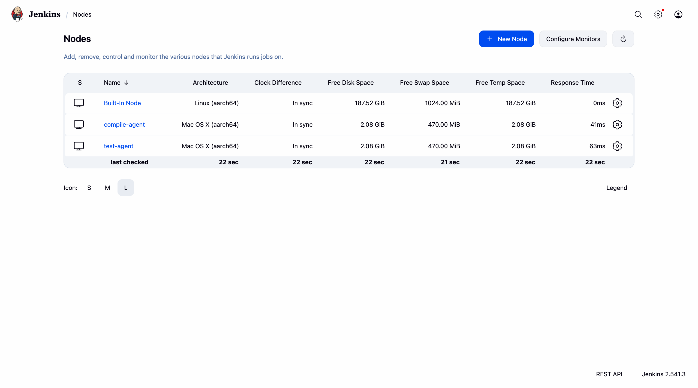
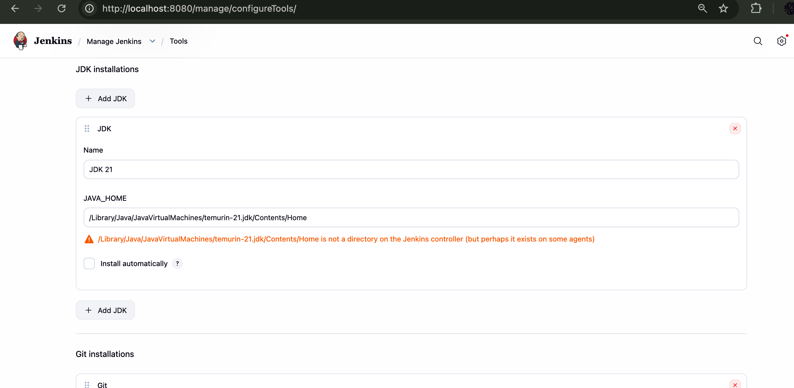
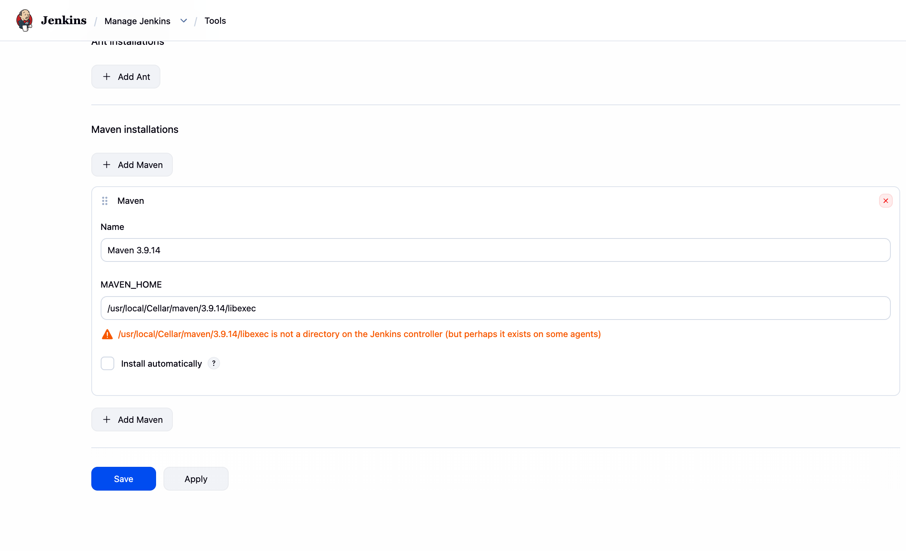
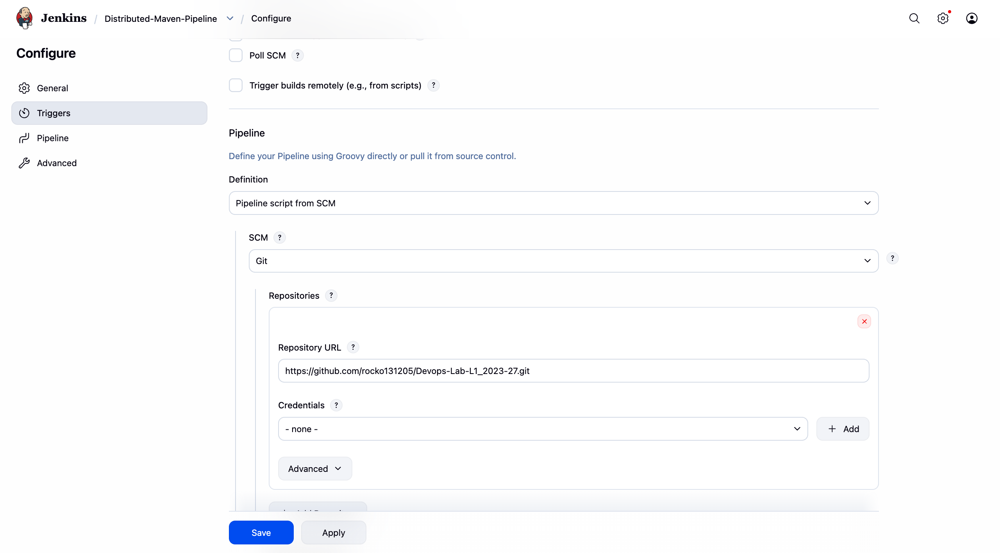
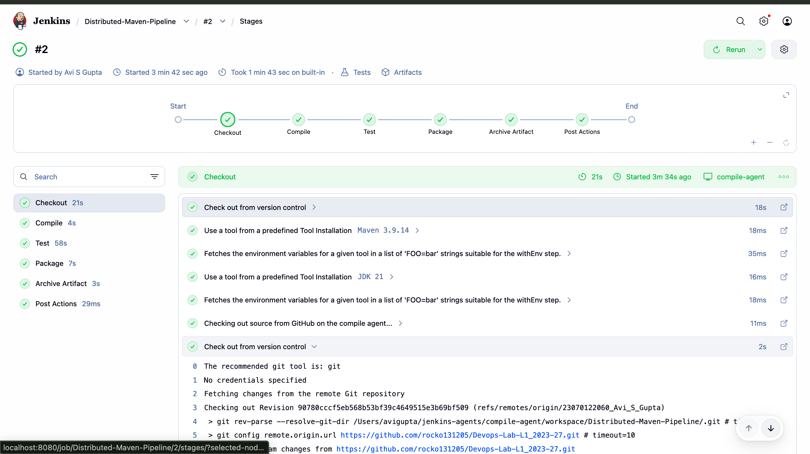
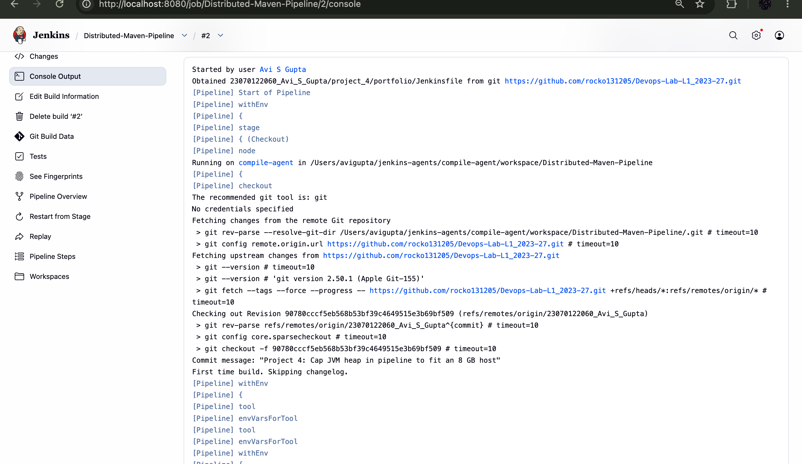
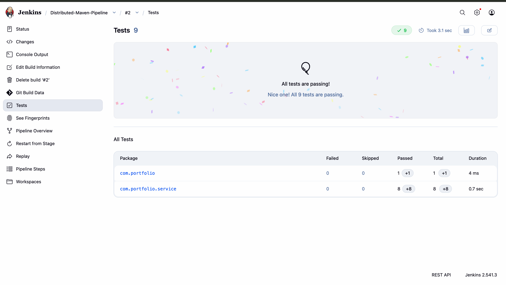
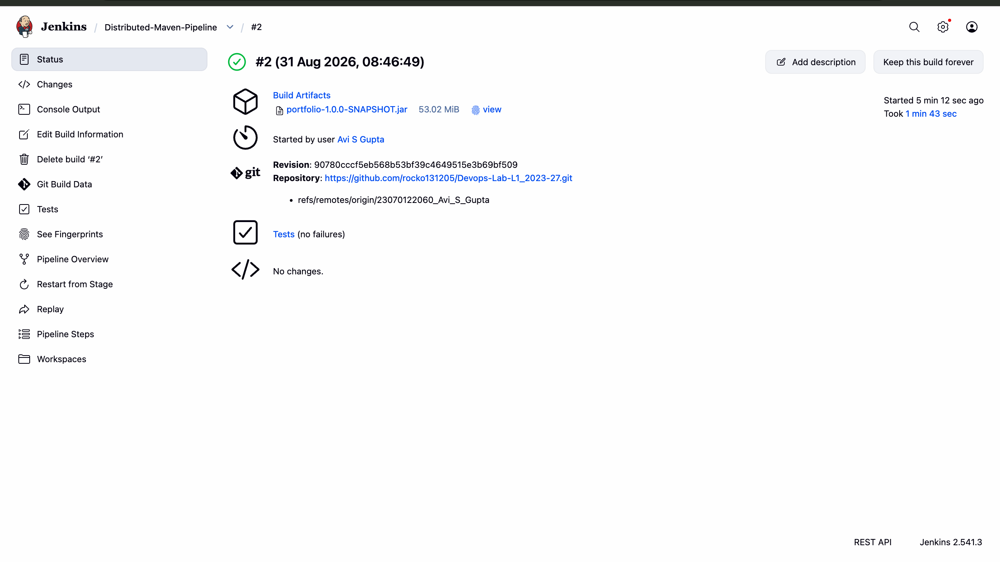

# Project 4 — Architecting a Jenkins Pipeline for Scale

## Student Details
- **Name:** Avi S Gupta
- **PRN:** 23070122060
- **Course:** DevOps Lab L1 (2023–27)

## Objective
To design and implement a **distributed** Jenkins CI pipeline in which the Jenkins controller
performs scheduling only, and the build work is carried out on two separate agent nodes. A
Maven-based Java application is pulled from GitHub, **compiled on one agent and tested on a
different agent**, then packaged and archived as a versioned JAR.

Project 1 ran an entire pipeline on a single Jenkins instance. That model does not scale: one
machine means one queue, and compile and test workloads compete for the same CPU and memory.
This project separates the roles.

## Tools & Technologies
| Tool | Role | Version |
|---|---|---|
| **Jenkins** | CI orchestration (controller + 2 agents) | 2.541.3 (Docker) |
| **Maven** | Build automation, dependency management | 3.9.14 |
| **JDK** | Compilation and test runtime on agents | Eclipse Temurin 21 |
| **Spring Boot** | The application under build | 3.2.3 |
| **JUnit 5** | Test framework, results published to Jenkins | via surefire 3.2.5 |
| **Git / GitHub** | SCM source for Pipeline-as-Code | — |

## Architecture

```
              ┌────────────────────────────────────┐
              │      JENKINS CONTROLLER            │
              │      Docker container, :8080       │
              │      schedules only — builds none  │
              └───────┬────────────────────┬───────┘
                      │                    │
         label:"compile"              label:"test"
           (JNLP/WebSocket)          (JNLP/WebSocket)
                      │                    │
                      ▼                    ▼
        ┌───────────────────────┐  ┌──────────────────────┐
        │    compile-agent      │  │     test-agent       │
        │  macOS host process   │  │  macOS host process  │
        ├───────────────────────┤  ├──────────────────────┤
        │  1. Checkout          │  │  3. Test             │
        │  2. Compile           │  │     mvn test         │
        │  4. Package           │  │     → JUnit report   │
        │  5. Archive Artifact  │  │                      │
        └───────────────────────┘  └──────────────────────┘
                      └──── stash / unstash ────┘
                        (workspace transfer via
                         the controller)
```

The controller runs inside Docker; both agents are processes on the macOS host, connected
inbound over WebSocket to port 50000.

## Key Pipeline Concepts

**`agent none`** — declared at the top of the pipeline. This withholds a default executor, so
every stage is *forced* to declare which node it runs on. Without it, stages would silently
execute on the controller and no distribution would occur.

**Labels** — the nodes are tagged `compile` and `test`. Each stage requests a label
(`agent { label 'compile' }`) and Jenkins schedules it onto a free node carrying that tag.

**`stash` / `unstash`** — each agent has its own filesystem. After `compile-agent` runs
`mvn compile`, `target/classes` exists **only on that machine**; `test-agent`'s workspace is
empty. `stash` archives the project directory through the controller and `unstash` restores it
on the test node. Without this the Test stage would fail with "no pom.xml found".

The stash is scoped to `${APP_DIR}` rather than the repository root, because this repository
contains every student's folder — stashing `**` would transfer hundreds of megabytes between
agents on every build.

## Procedure

### Step 1 — Configure two agent nodes
Two permanent agents were created under **Manage Jenkins → Nodes**, each with one executor,
its own remote root directory, and a distinguishing label. Usage was set to *"Only build jobs
with label expressions matching this node"* so neither agent picks up unlabelled work.

| Node | Label | Remote root directory |
|---|---|---|
| `compile-agent` | `compile` | `/Users/avigupta/jenkins-agents/compile-agent` |
| `test-agent` | `test` | `/Users/avigupta/jenkins-agents/test-agent` |

Both were launched with the inbound agent JAR and connected over WebSocket:

```bash
java -jar agent.jar -url http://localhost:8080/ \
     -secret <secret> -name "compile-agent" -webSocket \
     -workDir "/Users/avigupta/jenkins-agents/compile-agent"
```



### Step 2 — Register the build toolchain
Under **Manage Jenkins → Tools**, JDK and Maven were registered by name with
*"Install automatically"* unchecked, pointing at the copies already present on the host. The
names must match the `tools` block in the Jenkinsfile exactly.

| Tool | Name | Path |
|---|---|---|
| JDK | `JDK 21` | `/Library/Java/JavaVirtualMachines/temurin-21.jdk/Contents/Home` |
| Maven | `Maven 3.9.14` | `/usr/local/Cellar/maven/3.9.14/libexec` |





> Jenkins displays *"…is not a directory on the Jenkins controller (but perhaps it exists on
> some agents)"* for both paths. This is expected and harmless: the controller runs inside a
> Docker container and cannot see the host filesystem, but no stage executes on the controller —
> every Maven invocation runs on an agent, where the path is valid. The warning is itself a neat
> demonstration of controller/agent separation.

### Step 3 — Create the pipeline job
A **Pipeline** job was created using **Pipeline script from SCM**, so the pipeline definition is
version-controlled rather than pasted into the Jenkins UI.

| Setting | Value |
|---|---|
| Definition | Pipeline script from SCM |
| SCM | Git |
| Repository URL | `https://github.com/rocko131205/Devops-Lab-L1_2023-27.git` |
| Branch Specifier | `*/23070122060_Avi_S_Gupta` |
| Script Path | `23070122060_Avi_S_Gupta/project_4/portfolio/Jenkinsfile` |



### Step 4 — Execute the pipeline
Build **#2** completed successfully in **1 min 43 sec**, with every stage green.



| Stage | Agent | Duration |
|---|---|---|
| Checkout | `compile-agent` | 21s |
| Compile | `compile-agent` | 4s |
| Test | `test-agent` | 58s |
| Package | `compile-agent` | 7s |
| Archive Artifact | `compile-agent` | 3s |
| Post Actions | — | 29ms |

### Step 5 — Verify distribution in the console log
The console output confirms the pipeline definition was obtained from source control, and shows
each stage naming the node it executed on:

```
Obtained 23070122060_Avi_S_Gupta/project_4/portfolio/Jenkinsfile from git …
Running on compile-agent in /Users/avigupta/jenkins-agents/compile-agent/workspace/…
Compiling on compile-agent
…
Running on test-agent in /Users/avigupta/jenkins-agents/test-agent/workspace/…
Testing on test-agent
…
Packaging on compile-agent
Archiving JAR from compile-agent
Finished: SUCCESS
```

Two different node names and two different workspace paths within a single build is the
evidence that the workload was genuinely distributed.



### Step 6 — Test results and artifact
All **9 tests passed**, collected from the remote test agent via the `junit` post step:



The packaged JAR was archived with fingerprinting enabled:



## Pipeline Definition

The full pipeline lives in [`portfolio/Jenkinsfile`](portfolio/Jenkinsfile). Its structure:

```groovy
pipeline {
    agent none                                  // force every stage to declare its node
    tools { maven 'Maven 3.9.14'; jdk 'JDK 21' }
    environment {
        APP_DIR    = '23070122060_Avi_S_Gupta/project_4/portfolio'
        MAVEN_OPTS = '-Xmx512m'
    }
    stages {
        stage('Checkout')  { agent { label 'compile' } … }
        stage('Compile')   { agent { label 'compile' } … stash 'compiled' }
        stage('Test')      { agent { label 'test'    } … unstash 'compiled'
                             post { always { junit '…/surefire-reports/*.xml' } } }
        stage('Package')   { agent { label 'compile' } … }
        stage('Archive Artifact') { agent { label 'compile' } … archiveArtifacts }
    }
}
```

## Porting Notes — Windows to macOS

The pipeline was originally written for Windows agents and was reworked for this macOS
controller/agent setup:

| Change | Reason |
|---|---|
| `bat` → `sh` | The Windows batch shell does not exist on macOS; every step would fail immediately. |
| JDK 21 pinned (not the default JDK 24) | The application uses Lombok 1.18.30, which fails on JDK 24 with `java.lang.ExceptionInInitializerError: com.sun.tools.javac.code.TypeTag :: UNKNOWN`. Under Temurin 21 the build is clean. |
| `Maven 3.9.16` → `Maven 3.9.14` | Matches the version installed on this host; the `tools` name must match Global Tool Configuration exactly. |
| `stash includes: '**'` → `includes: "${APP_DIR}/**"` | The repository holds every student's folder; the unscoped stash transferred the entire repository between agents on each build. |
| Added `deleteDir()` before `unstash` | Guarantees the test agent starts from an empty workspace, so tests cannot pass on stale files from a previous run. |
| Added `echo "… on ${env.NODE_NAME}"` | Prints the executing node into the console log, providing direct evidence of stage distribution. |

## Troubleshooting — Build failure from JVM heap exhaustion

The first build attempt failed partway through the **Test** stage, and Docker Desktop shut down,
taking the Jenkins controller with it.

**Cause.** The JVM sizes its default maximum heap at roughly one quarter of system RAM — about
2 GB on this 8 GB machine. Because the controller, both agents and Maven all run on the same
host, the Spring Boot test JVM claiming that much exhausted available memory. Under the
resulting pressure macOS asked large applications to quit and Docker Desktop complied, logging
`VM has stopped gracefully`.

**Fix.** Cap the heap explicitly in the pipeline:

```groovy
environment { MAVEN_OPTS = '-Xmx512m' }
…
sh 'mvn -B test -DargLine=-Xmx512m'
```

`MAVEN_OPTS` bounds the Maven JVM, and `-DargLine` bounds the JVM that surefire forks to run the
tests — both are needed, as the forked JVM does not inherit `MAVEN_OPTS`. With these limits the
identical build completed in 1 min 43 sec on the same machine.

Constraining resources on build agents is a genuine CI concern rather than a lab artifact:
agents share hardware, and an unbounded build can starve everything else on the node.

## Project Structure

```
project_4/
├── README.md                  # This document
├── portfolio/                 # Maven Spring Boot application under build
│   ├── pom.xml
│   ├── Jenkinsfile            # Distributed declarative pipeline
│   └── src/
│       ├── main/java/…
│       └── test/java/…        # 9 JUnit 5 tests
└── screenshot/                # Execution evidence
    ├── 01_agent_nodes_online.png
    ├── 02_global_tool_jdk21.png
    ├── 03_global_tool_maven.png
    ├── 04_pipeline_job_scm_config.png
    ├── 05_pipeline_stage_view.png
    ├── 06_console_output_checkout_compile.png
    ├── 07_test_results.png
    └── 08_archived_artifact.png
```

## Result

A distributed Jenkins pipeline was implemented and executed successfully. The controller
scheduled work without building anything itself; `compile-agent` performed checkout,
compilation, packaging and archiving, while `test-agent` independently executed the test suite
on its own filesystem, with the workspace transferred between them by `stash`/`unstash`. Build
#2 finished in 1 min 43 sec with 9 of 9 tests passing and `portfolio-1.0.0-SNAPSHOT.jar`
(53.02 MiB) archived and fingerprinted.

## Conclusion

Separating the controller from labelled agents converts Jenkins from a single build machine into
a scheduler over a pool of workers: capacity grows by adding agents rather than by enlarging one
server, and specialised work can be routed to nodes that suit it. The stage-level `agent`
directive together with `stash`/`unstash` makes that distribution explicit in code, so the
topology is reviewed and version-controlled alongside the application — extending the
Pipeline-as-Code approach from Project 1 across multiple machines.

> **Note on the application.** The Spring Boot application in `portfolio/` is used here as the
> *subject* of the build. This project is assessed on the CI pipeline architecture — the
> controller/agent topology, label routing, workspace transfer, test reporting and artifact
> archiving — all of which were configured and executed on this machine.
