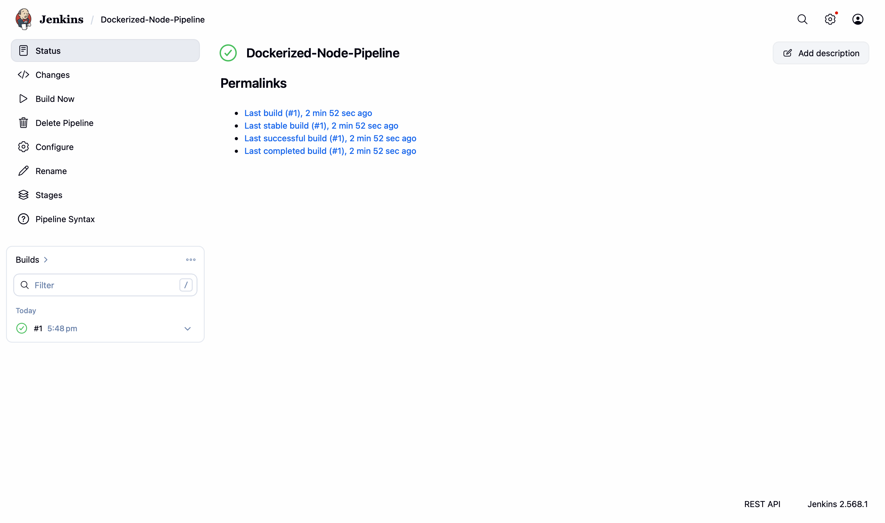
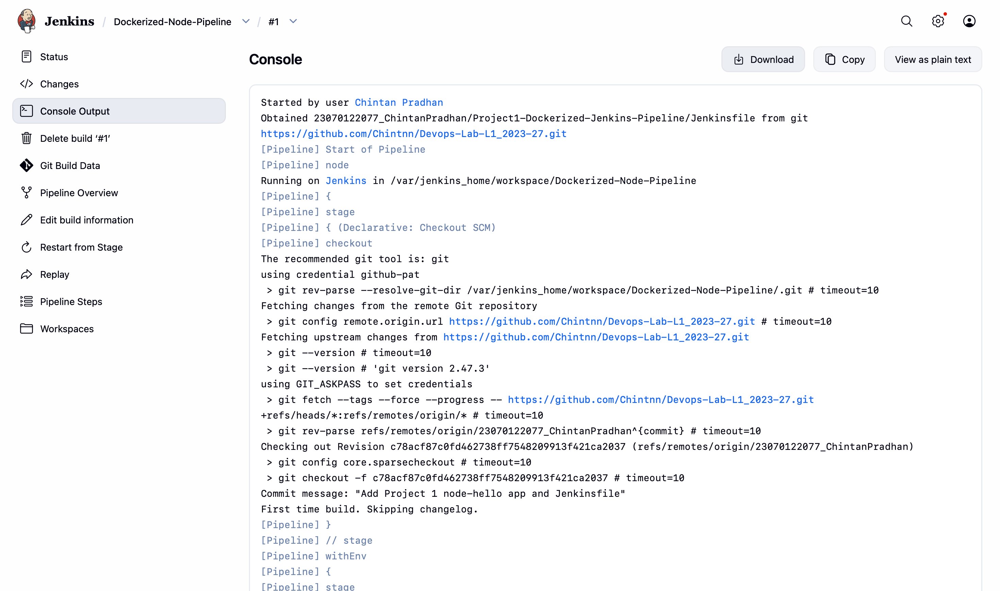

# Project 1 — Dockerizing Jenkins Pipeline

Ran Jenkins itself inside a Docker container, installed the Docker CLI inside it, and
configured a Pipeline job that checks out this repository, builds a Docker image for a
minimal Node.js app, and runs the container.

## Pipeline stages
1. Checkout — pulls from the submission branch
2. Build Docker Image — builds `node-hello` image
3. Run Container — runs the container, prints "Hello World from Docker!"

