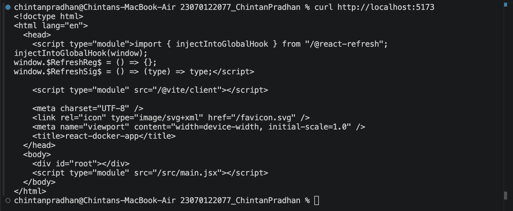
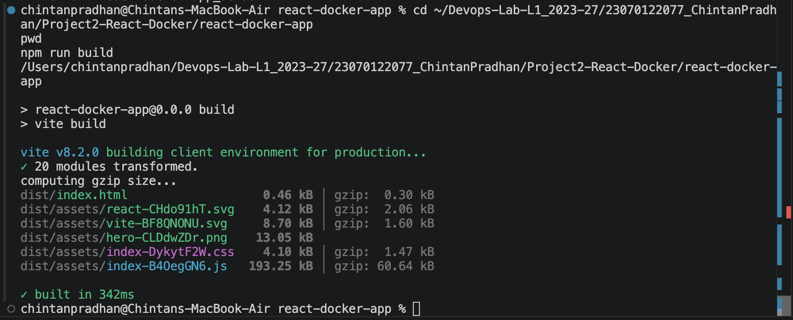
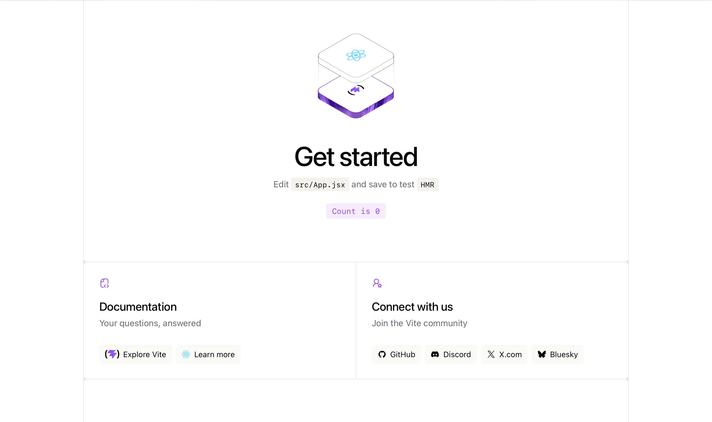
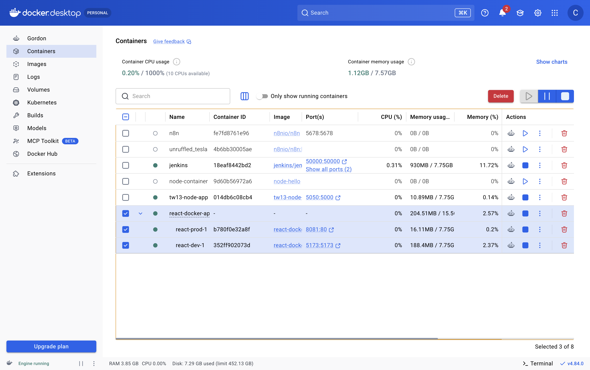

# Project 2 — Deploy React Application in Docker Container

- Created a React app using Vite (`npm create vite@latest react-docker-app -- --template react`)
- `Dockerfile.dev` — development image (Node alpine, live reload via `npm run dev --host`)
- `Dockerfile.prod` — production image (multi-stage build → Nginx serving static files)
- `nginx.conf` — SPA routing configuration
- `docker-compose.yml` — defines `react-dev` and `react-prod` services

## Development
Ran `docker compose up react-dev --build`, confirmed the live app at `localhost:5173`.

## Production
Built the production bundle (`npm run build`), confirmed the `dist` output, then ran
`docker compose up react-prod --build`, confirming the app served via Nginx at `localhost:8080`.

