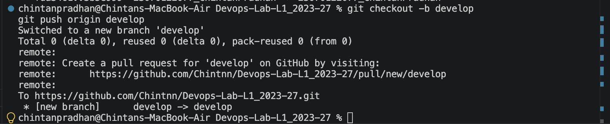
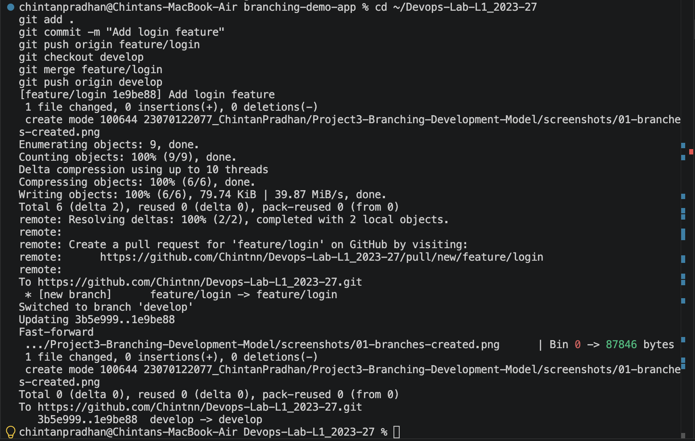
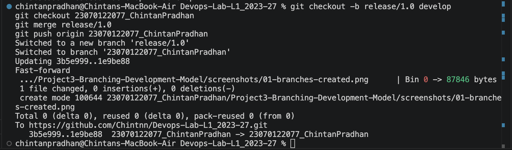
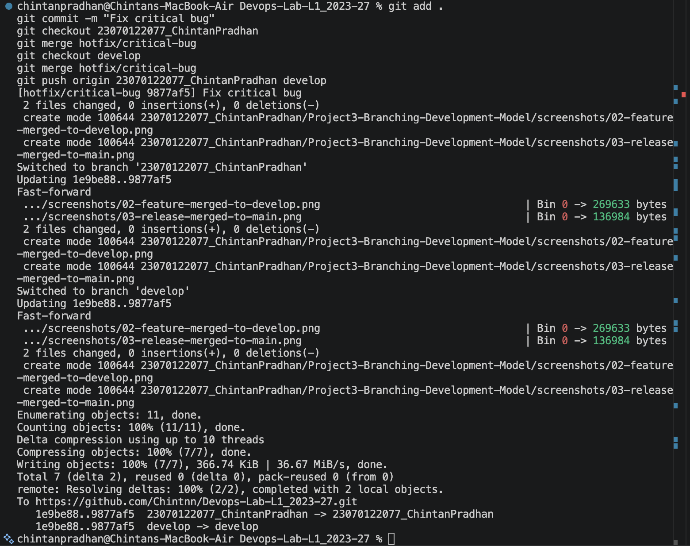
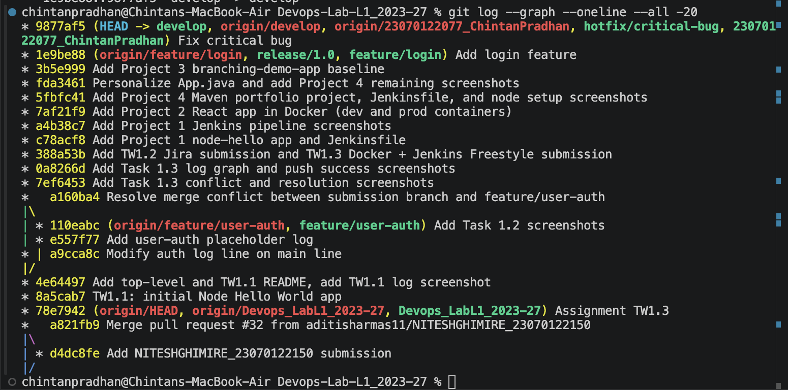

# Project 3 — Branching Development Model

Built a GitFlow-style branching model to help the team understand how to structure git
workflow for faster, safer work integration. Used a small Node.js app
(`branching-demo-app/`) as a vehicle to demonstrate real commits flowing through each
branch type.

## Branch structure
- `23070122077_ChintanPradhan` — acts as **main** (stable/production-ready code)
- `develop` — integration branch where features come together before release
- `feature/login` — isolated feature development, merged into `develop`
- `release/1.0` — release branch cut from `develop`, merged into main
- `hotfix/critical-bug` — urgent fix branched from main, merged into both main and `develop`

## Feature branch → develop
Created `feature/login` from `develop`, added a login feature, committed, and merged
back into `develop`.

## Release branch → main
Created `release/1.0` from `develop`, merged it into main once the feature was stable.

## Hotfix branch → main and develop
Created `hotfix/critical-bug` from main to patch an urgent issue, then merged the fix
into both main and `develop` so neither branch falls out of sync.

## Full branch history
`git log --graph --oneline --all` showing the complete branching and merge structure
across all branches.

