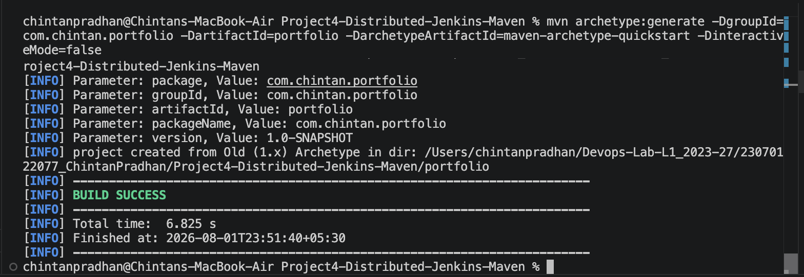
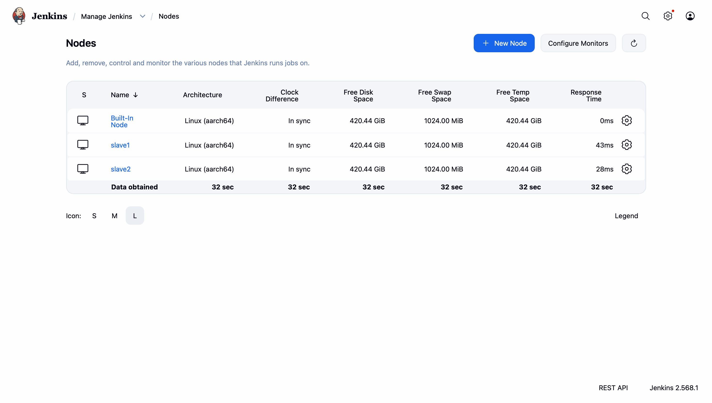
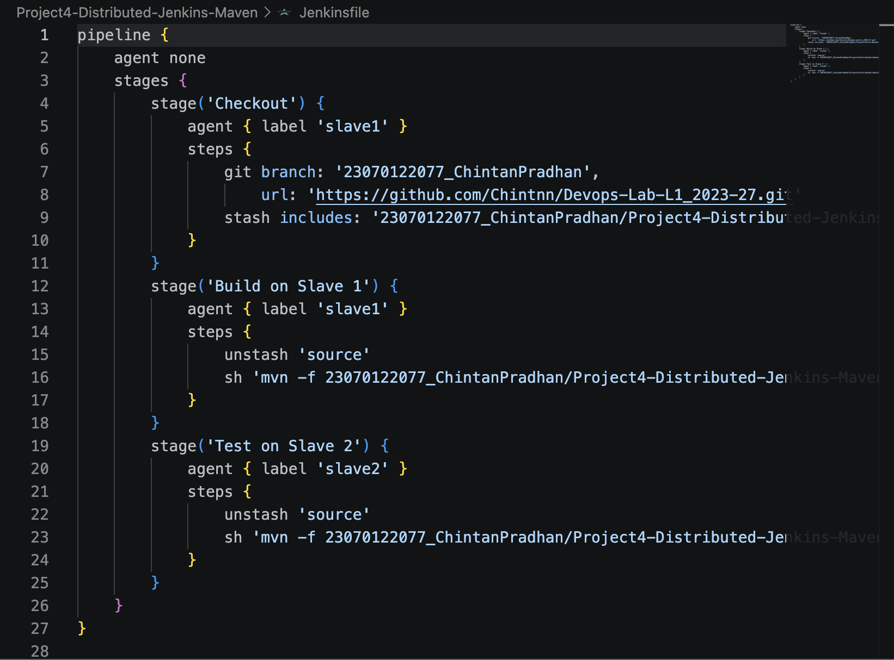
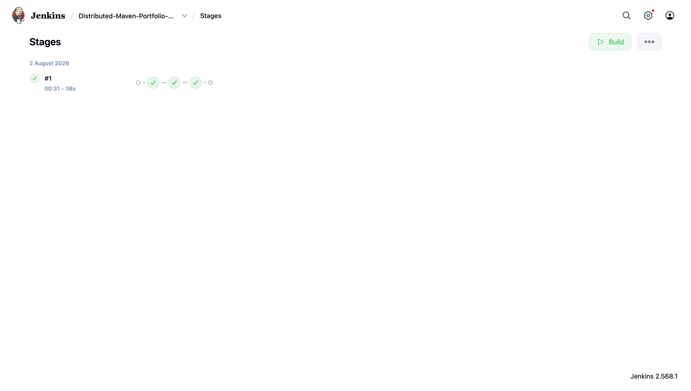
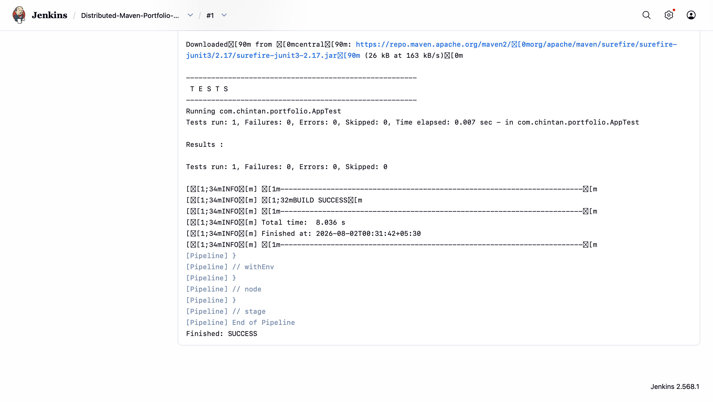

# Project 4 — Architecting Jenkins Pipeline for Scale

Set up a distributed Jenkins pipeline for a Maven project ("portfolio") using two
separate agent/slave nodes (`slave1`, `slave2`).

## Setup
- Generated a Maven quickstart project named `portfolio`
- Registered two Jenkins agent nodes, `slave1` and `slave2`

## Pipeline
- Checkout and Build run on `slave1`
- Test runs on `slave2`

