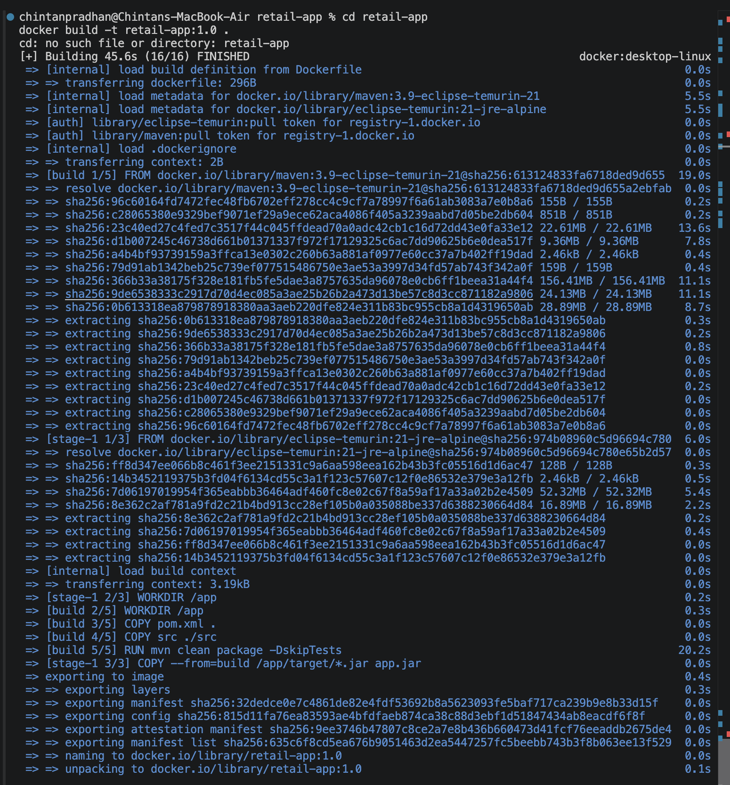
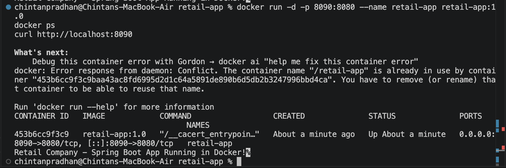
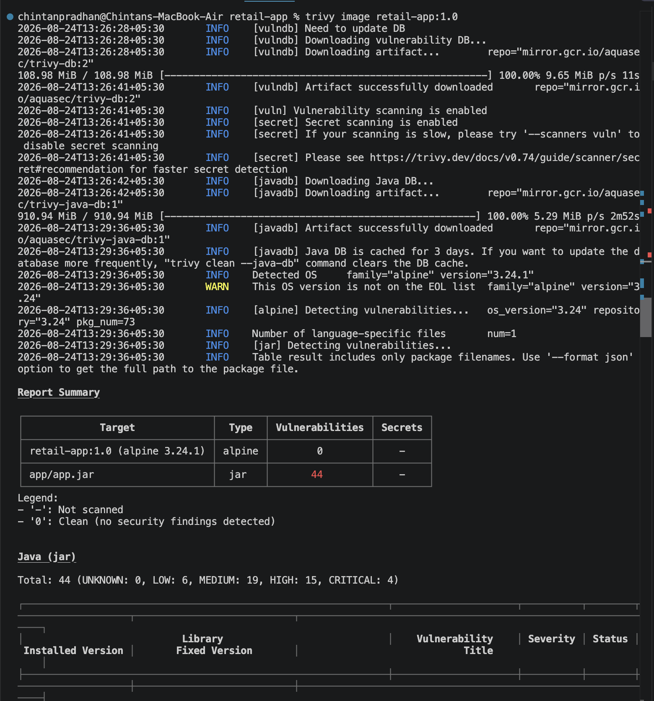

# Project 5 — Containerizing a Spring Boot Application and Scanning its Docker Image

Deployed a Spring Boot REST application for a retail company, containerized it with
Docker, and scanned the resulting image for vulnerabilities using **Trivy** (used in
place of Docker Trusted Registry's built-in scanning, which requires a full Docker
Enterprise/UCP setup not available in this lab environment — Trivy is the industry-
standard open-source equivalent for image vulnerability scanning).

## App
A minimal Spring Boot web app (`retail-app/`) exposing a single endpoint at `/`.

## Docker
Multi-stage Dockerfile: builds the jar with Maven in a build stage, then copies just
the jar into a lightweight `eclipse-temurin:21-jre-alpine` runtime image.

## Vulnerability Scanning
Scanned the built image with Trivy to identify known CVEs in OS packages and
dependencies, filtered to HIGH and CRITICAL severity.

