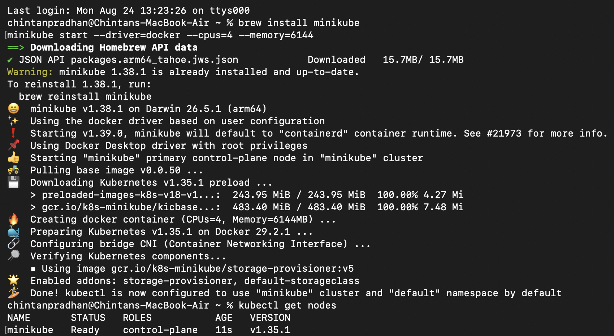
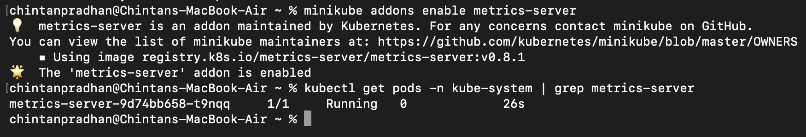
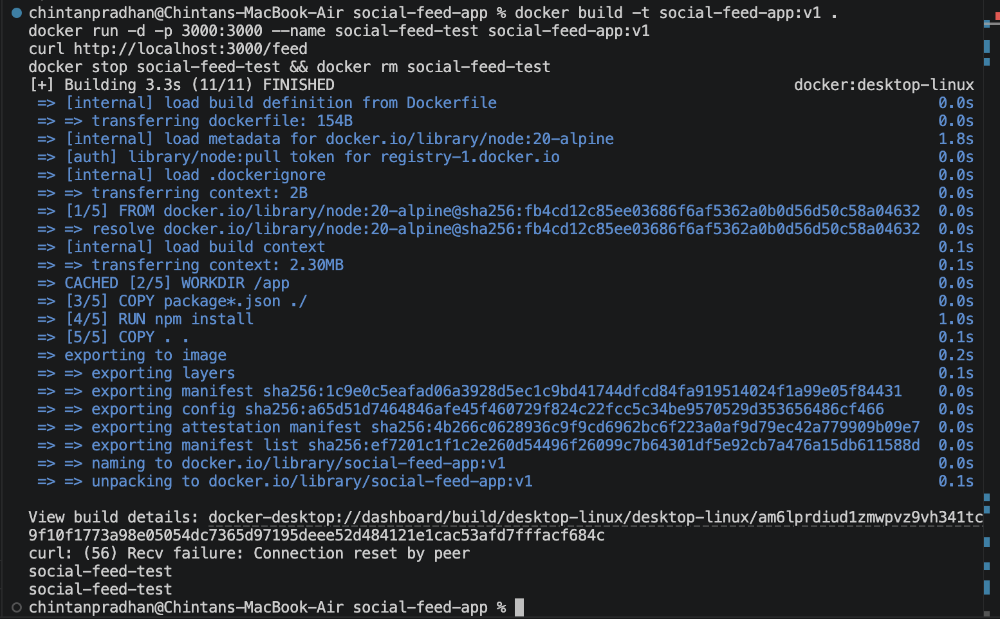
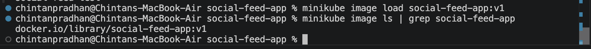
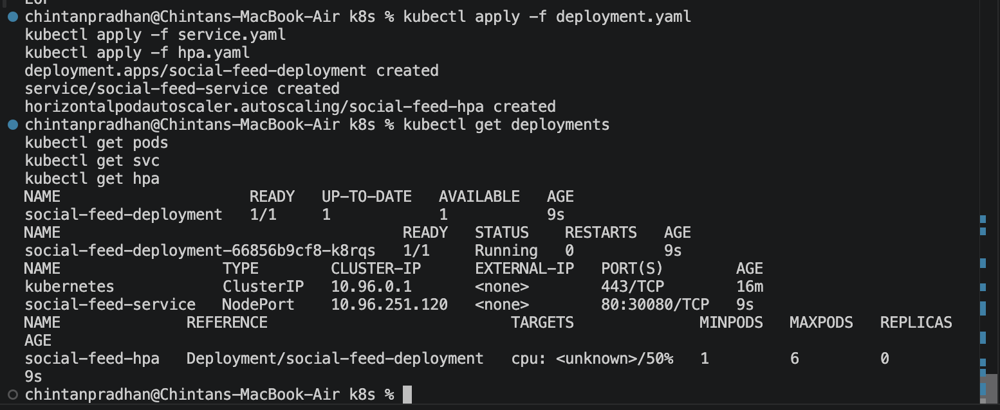
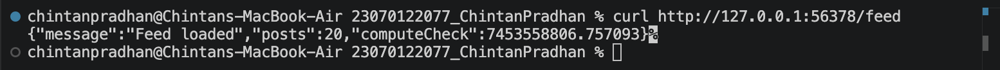
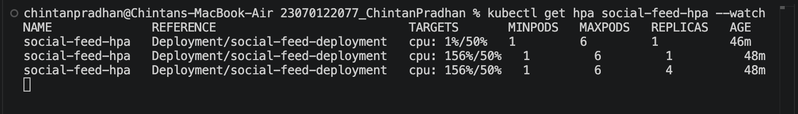
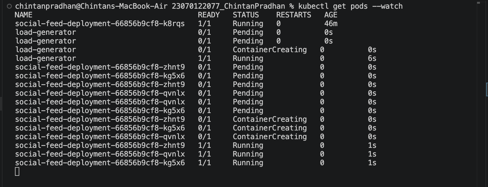
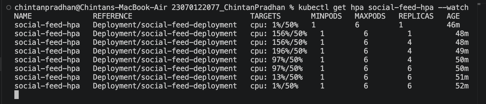

# Project 6 — Social Media Infra: Kubernetes Autoscaling

Demonstrated application scalability using Kubernetes' Horizontal Pod Autoscaler (HPA)
against a Node.js "social feed" service, using a local Minikube cluster.

## Setup
- Started a local Kubernetes cluster with Minikube (`minikube start`)
- Enabled the `metrics-server` addon, required for HPA to read CPU usage

## Application
Built a Node.js/Express "social feed" service (`social-feed-app/`) with a `/feed`
endpoint that performs CPU-bound work, simulating feed-generation load.

## Kubernetes resources
- `deployment.yaml` — Deployment with CPU requests/limits set (100m/200m)
- `service.yaml` — NodePort Service exposing the app
- `hpa.yaml` — HorizontalPodAutoscaler targeting 50% average CPU utilization,
  scaling between 1 and 6 replicas

## Autoscaling in action
Generated sustained load against the `/feed` endpoint using a temporary `busybox`
pod running a request loop. Watched the HPA and pod count scale up under load,
then scale back down once load stopped.

