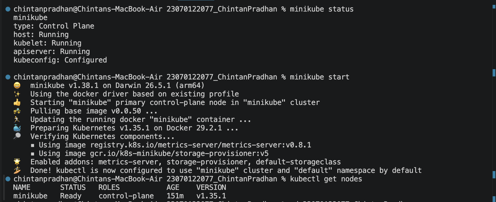
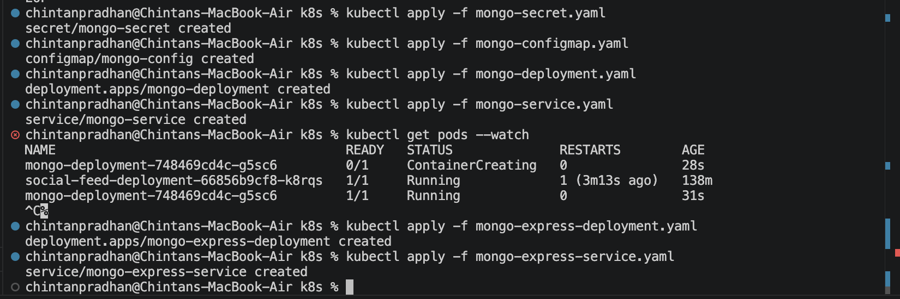
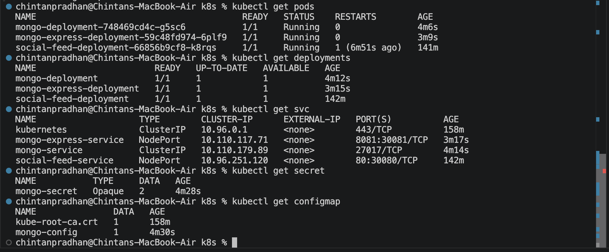
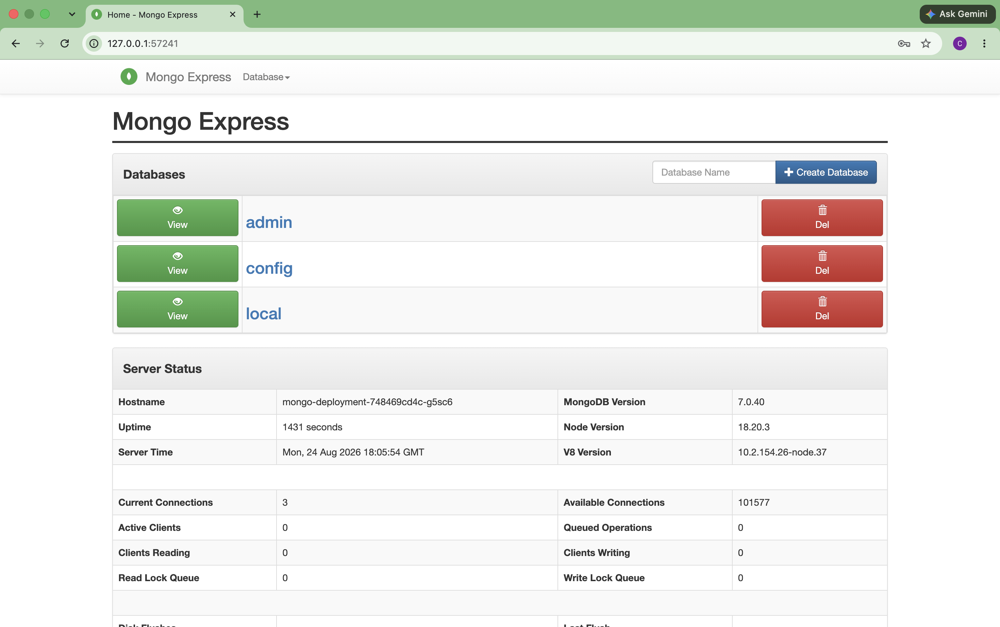
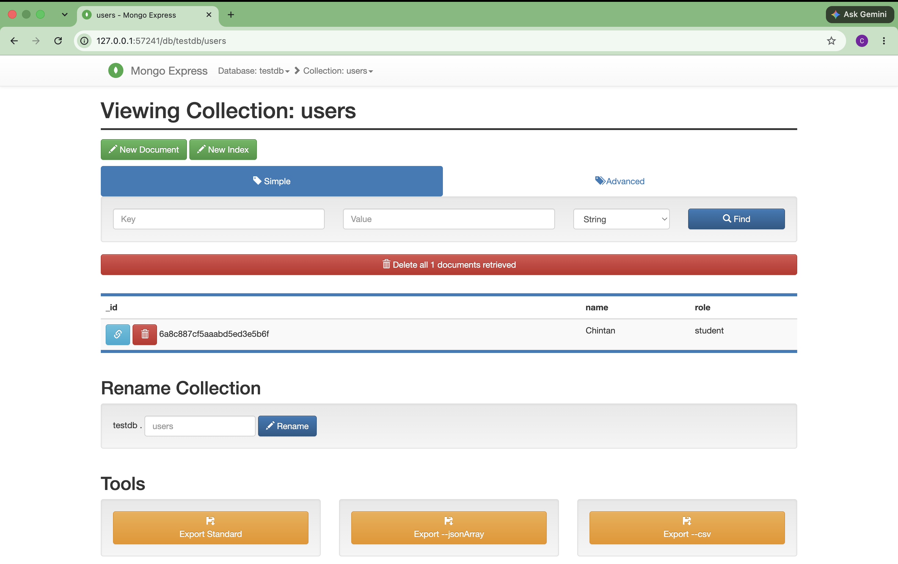

# Project 7 — Mongo and Mongo Express on Kubernetes

Deployed MongoDB and Mongo Express on a local Minikube cluster, using Kubernetes
Deployments, Services, a ConfigMap, and a Secret to wire them together.

## Cluster
Confirmed Minikube cluster running before deploying.

## Resources created
- `mongo-secret.yaml` — Secret holding the Mongo root username/password (base64-encoded)
- `mongo-configmap.yaml` — ConfigMap holding the Mongo service hostname
- `mongo-deployment.yaml` — MongoDB Deployment, credentials injected from the Secret
- `mongo-service.yaml` — ClusterIP Service exposing Mongo internally on 27017
- `mongo-express-deployment.yaml` — Mongo Express Deployment, connects to Mongo using
  the Secret (credentials) and ConfigMap (host)
- `mongo-express-service.yaml` — NodePort Service exposing Mongo Express's web UI

## Verification
Opened the Mongo Express web UI via the exposed NodePort service, confirming it
successfully connected to the MongoDB instance.

