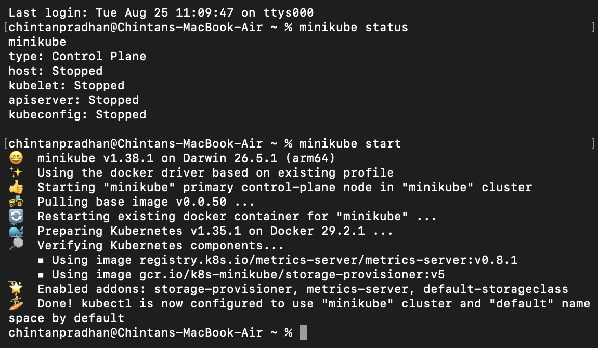
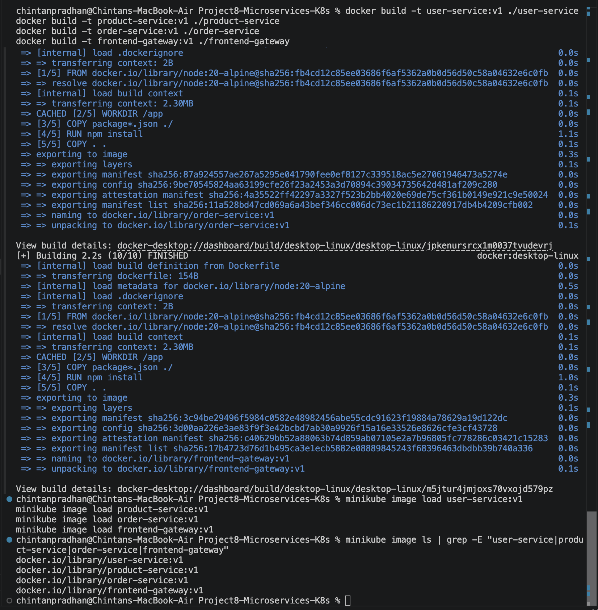
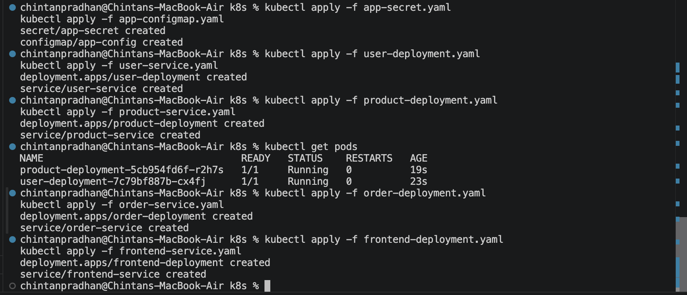
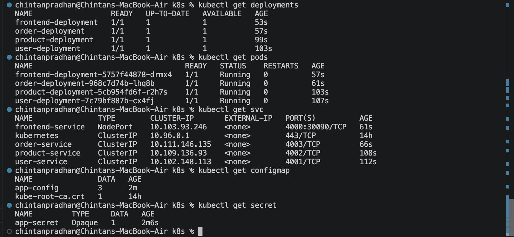
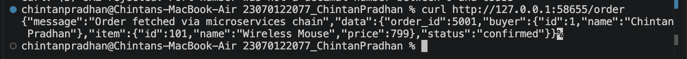

# Project 8 — Containerized Microservices Application on Kubernetes

Deployed a 4-microservice application on Kubernetes, with a shared ConfigMap for
inter-service URLs and a shared Secret for a common internal API key.

## Architecture
- `frontend-gateway` (NodePort, externally accessible) → calls `order-service`
- `order-service` (ClusterIP, internal) → calls `user-service` and `product-service`
- `user-service` (ClusterIP, internal) → returns user data
- `product-service` (ClusterIP, internal) → returns product data

Every service validates an `x-api-key` header sourced from a shared Kubernetes
Secret. Every service URL used for inter-service calls comes from a shared
ConfigMap rather than being hardcoded.

## Cluster

## Images
Built and loaded all 4 service images into Minikube.

## Resources deployed
- `app-secret.yaml` — Secret holding the shared internal API key
- `app-configmap.yaml` — ConfigMap holding the 3 internal service URLs
- 4 Deployments (`user-deployment`, `product-deployment`, `order-deployment`,
  `frontend-deployment`)
- 4 Services (3 ClusterIP for internal services, 1 NodePort for the frontend)

## End-to-end verification
Hit the exposed frontend gateway's `/order` endpoint, confirming the full call
chain (frontend → order-service → user-service + product-service) works, with
the API key validated at each hop.

