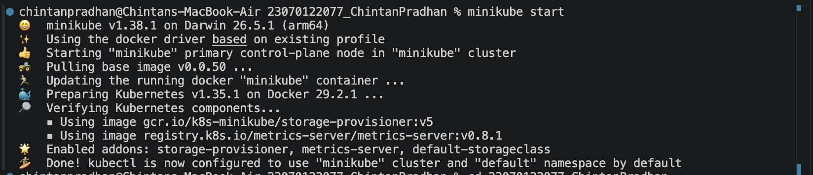
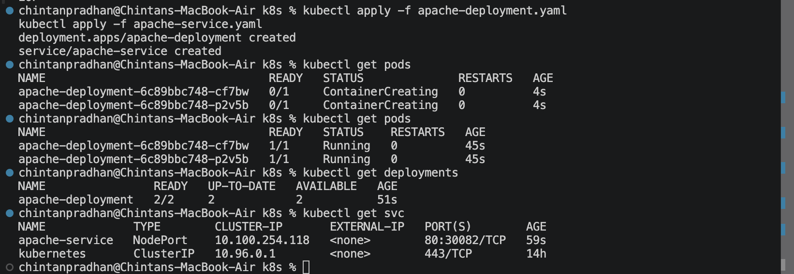
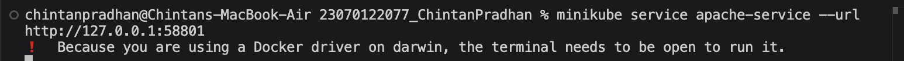
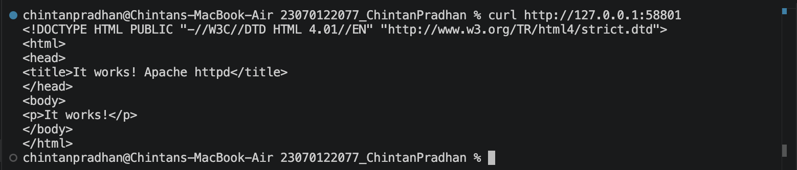
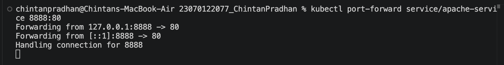
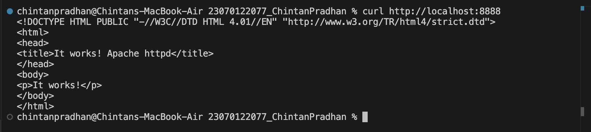
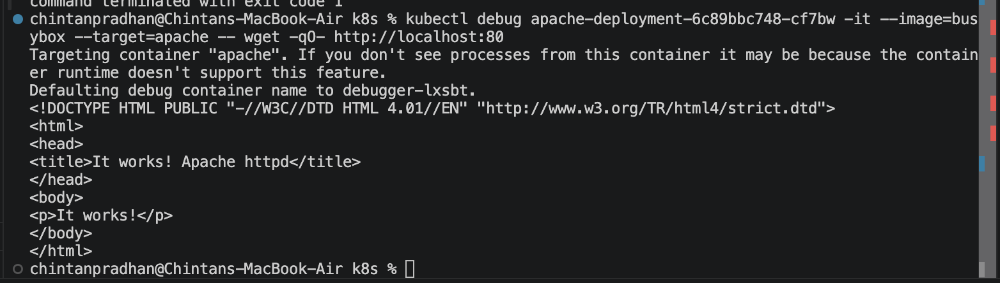
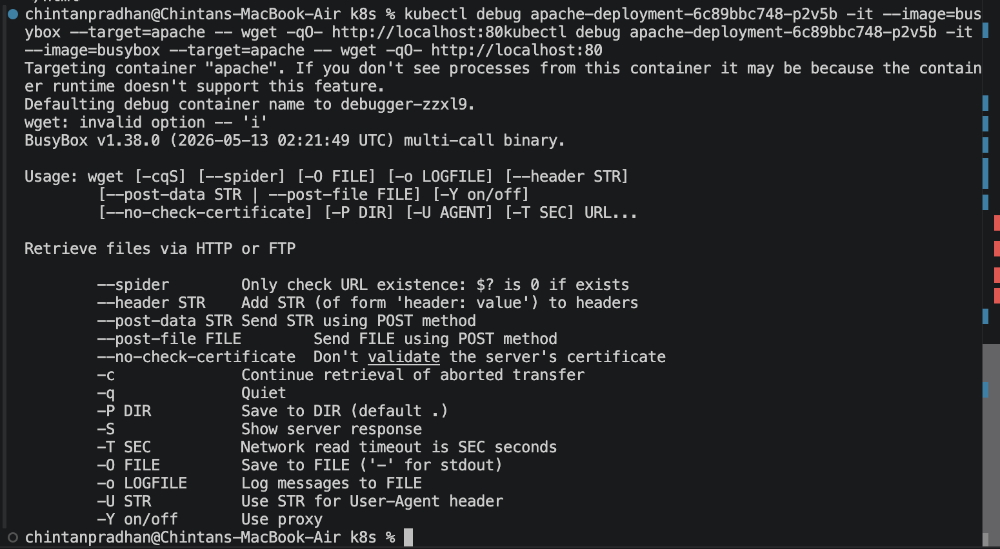
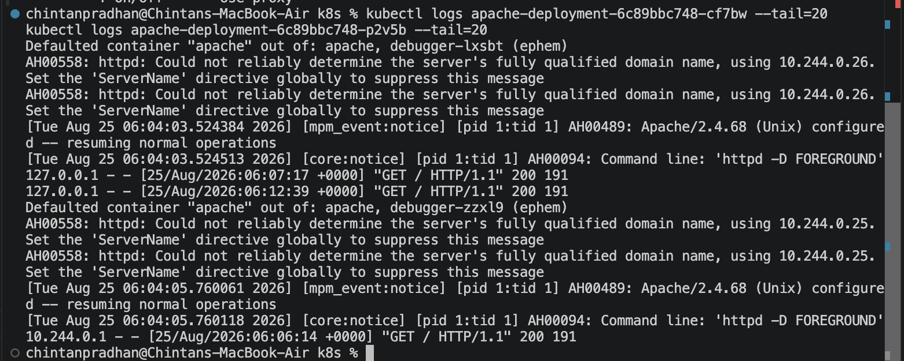

# Project 9 — Apache2 Server on Kubernetes, Accessed from the Host Machine

Deployed Apache HTTP Server (httpd) on Kubernetes with 2 replicas, then accessed
it from the host machine using three different Kubernetes networking mechanisms.

## Cluster

## Resources
- `apache-deployment.yaml` — Deployment running `httpd:2.4`, 2 replicas
- `apache-service.yaml` — NodePort Service exposing port 80

## Access Method 1 — NodePort via `minikube service`
Used `minikube service apache-service --url` to tunnel the NodePort service to
the host machine, then accessed it via browser/curl.

## Access Method 2 — `kubectl port-forward`
Forwarded a local port directly to the Kubernetes Service, bypassing NodePort
entirely, and accessed Apache through that tunnel.

## Access Method 3 — `kubectl exec` into the pod
The `httpd:2.4` image is minimal and doesn't include `curl`, `wget`, or `ps`. Used
`kubectl debug` to attach an ephemeral `busybox` container into the pod's network
namespace, and ran `wget` from there — confirming Apache responds correctly at the
container level, independent of any external networking path.

## Load balancing across replicas
Confirmed requests sent to the Service were served by the pods behind it, visible
in the pod logs.

