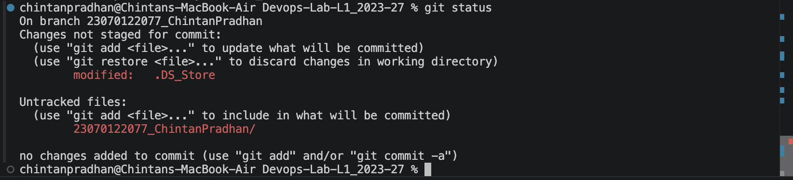
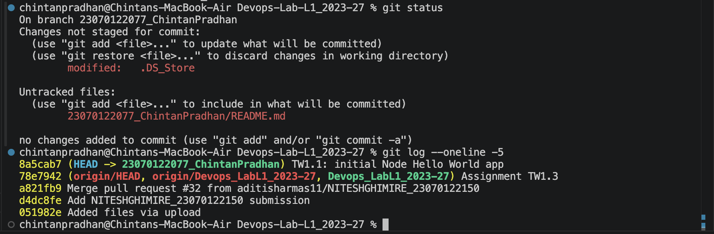
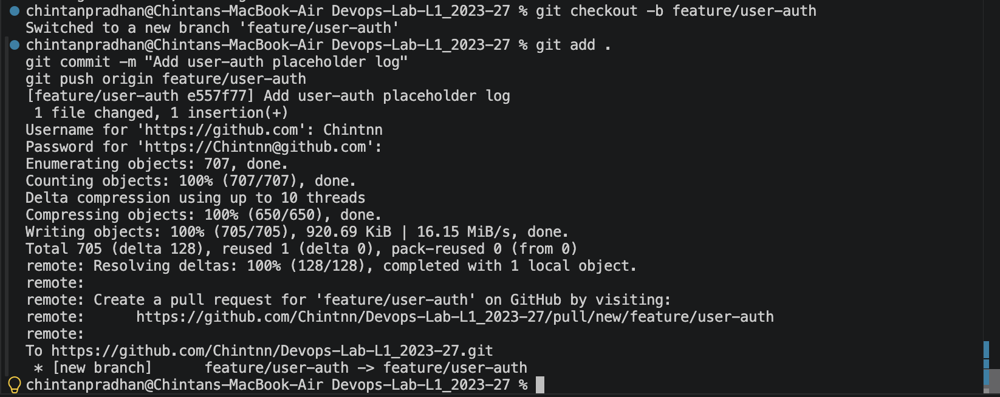
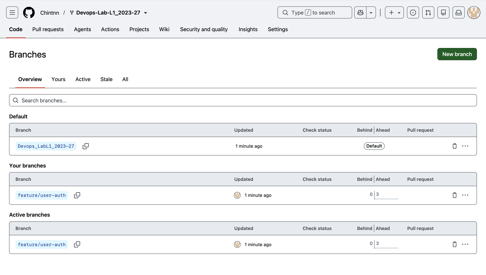
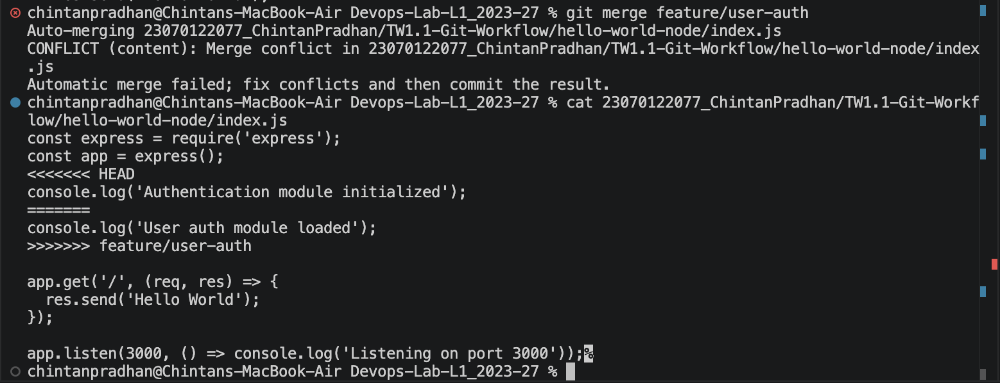
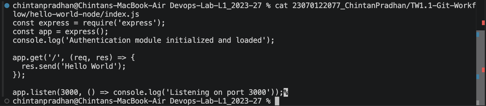
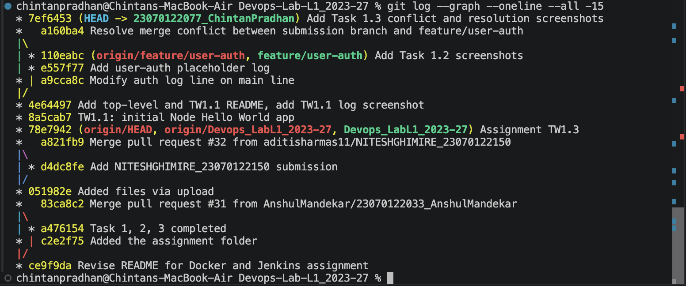
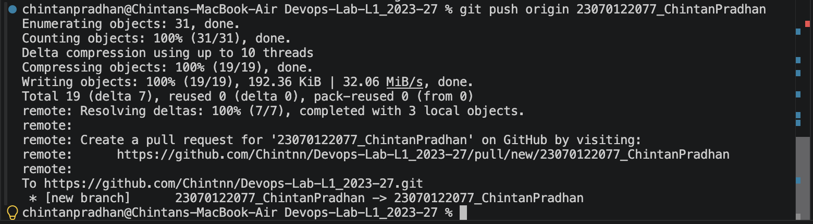

# TW1.1 — Git Workflow & Collaboration

## Task 1.1 — Initialize repo and commit (1 Mark)
Created a minimal Node.js "Hello World" Express app (`hello-world-node/`) and committed it.

## Task 1.2 — Feature branch (1.5 Marks)
Created branch `feature/user-auth`, added a log line, committed, and pushed the branch.

## Task 1.3 — Simulate and resolve a merge conflict (1.5 Marks)
Modified the same line on the submission branch, merged `feature/user-auth`, got a
conflict, resolved it manually, and pushed the result.

