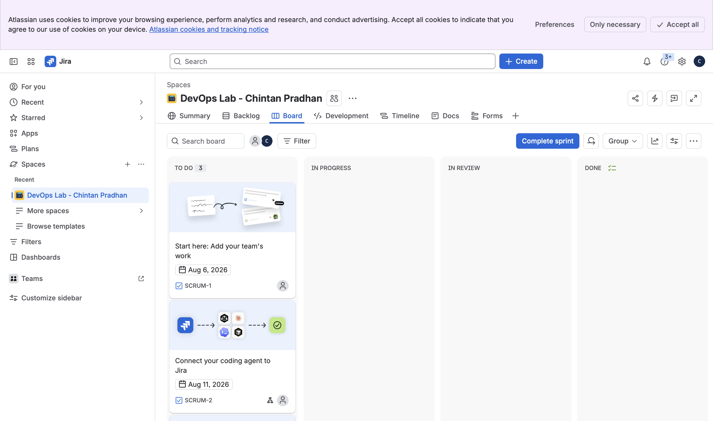
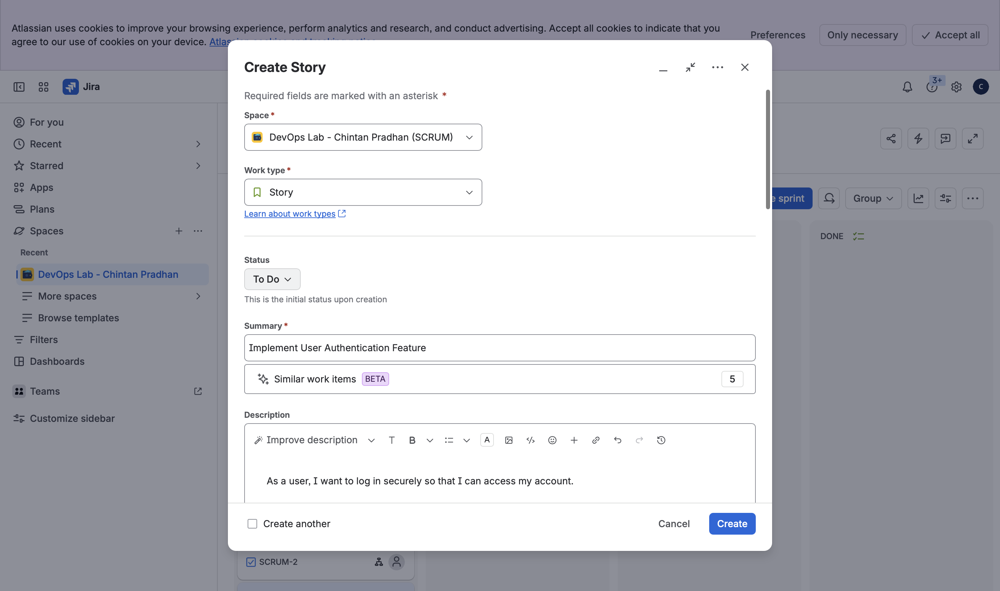
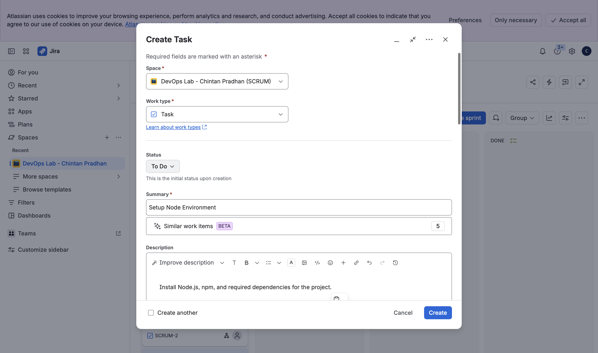
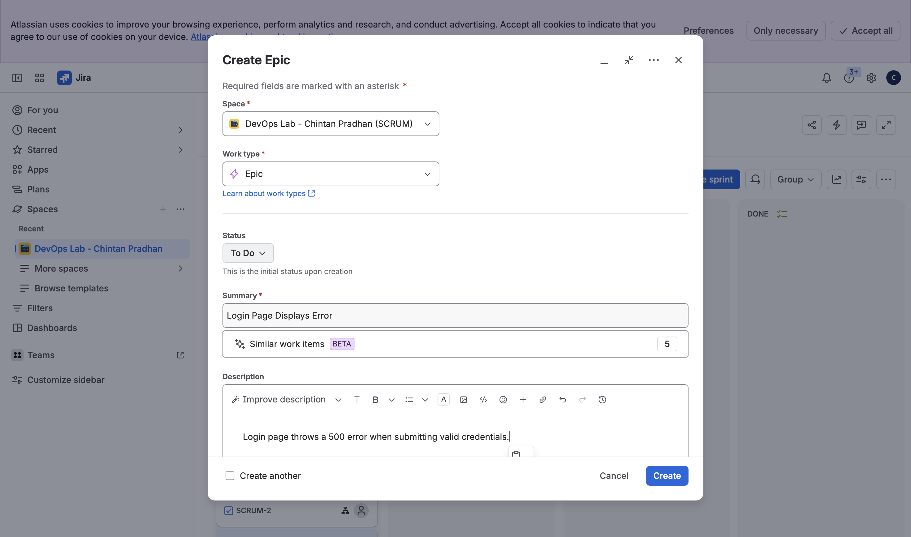
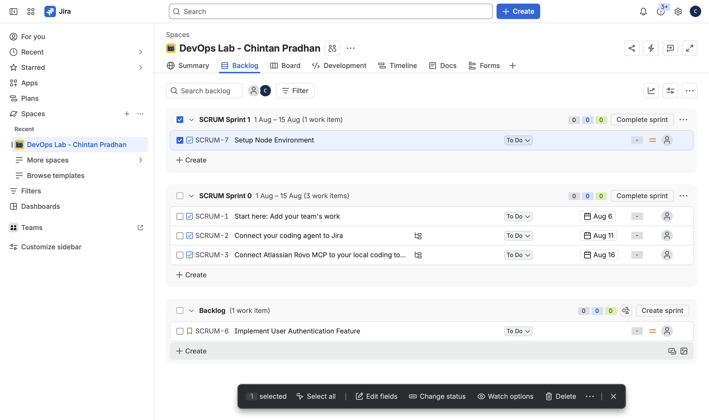
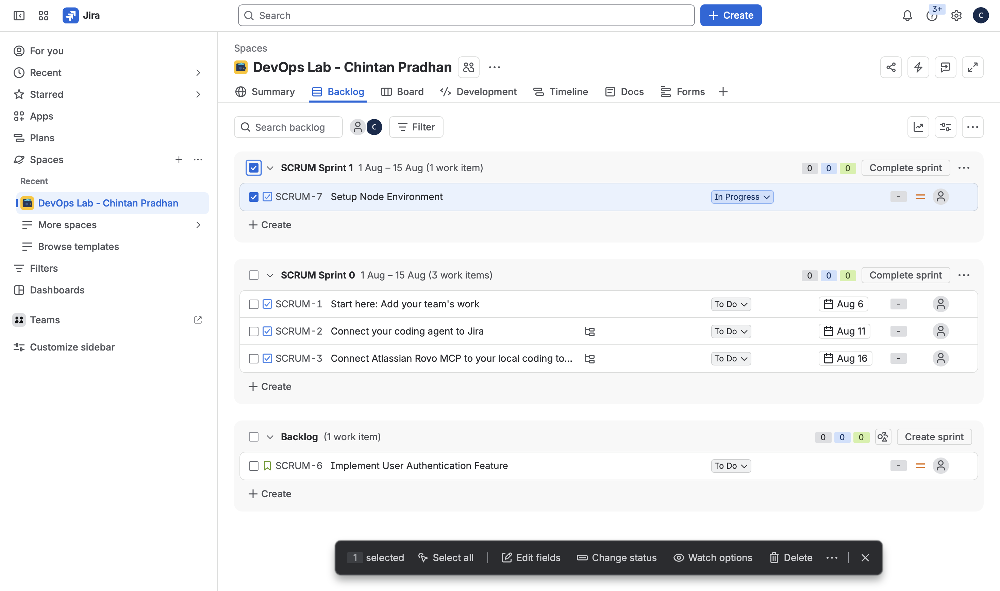

# TW1.2 — Jira Project & Issue Tracking

## Task 2.1 — Create Scrum project (1 Mark)
Created a new Scrum project in Jira Cloud for the Node.js "Hello World" application.

## Task 2.2 — Create issues (1 Mark)
- Story: "Implement User Authentication Feature"
- Task: "Setup Node Environment"
- Bug: "Login Page Displays Error"

## Task 2.3 — Move task on board (1 Mark)
Moved "Setup Node Environment" from To Do to In Progress.

