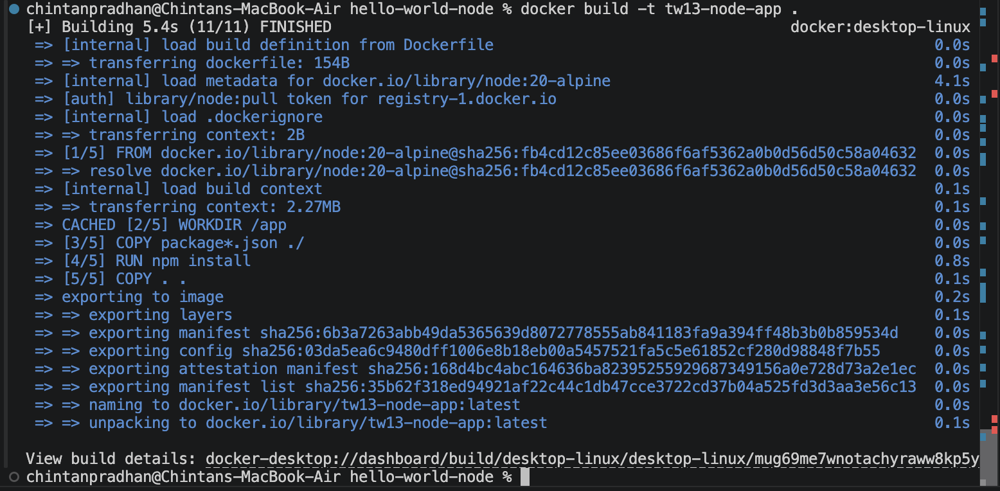
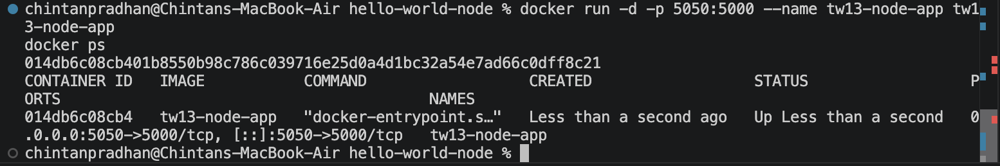
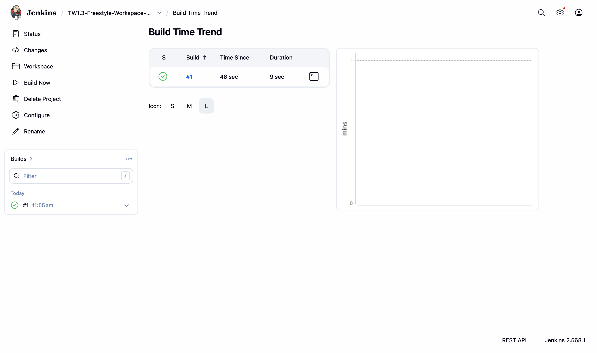
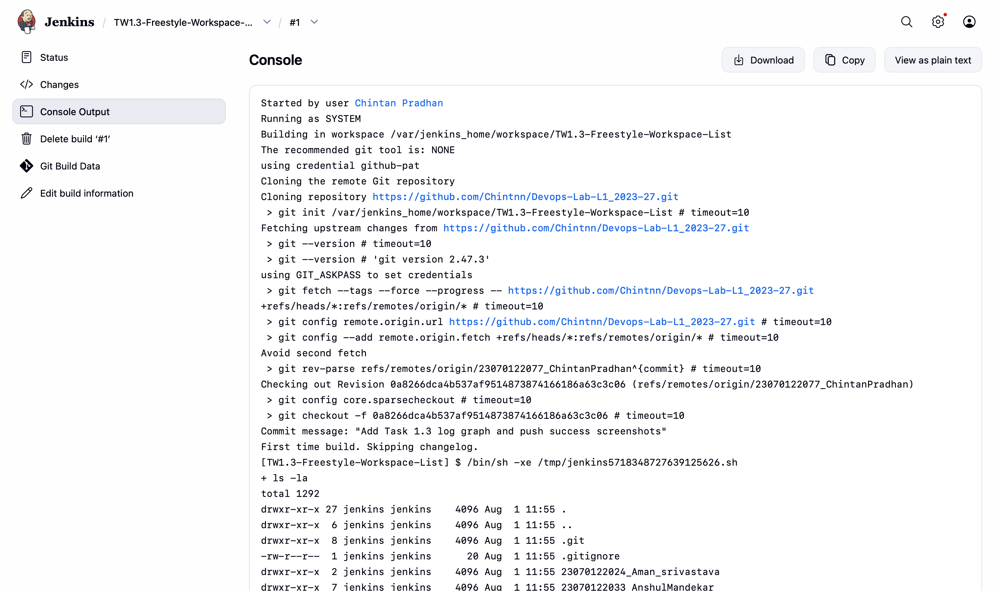

# TW1.3 — Basic Containerization (Docker) & Jenkins Freestyle Project

## Task 3.1 — Dockerize Node.js app on port 5000 (1.5 Marks)
Wrote a Dockerfile for the Node.js "Hello World" app, built the image, ran it, and
confirmed it responds on port 5000.

## Task 3.2 — Jenkins Freestyle project (1.5 Marks)
Set up a Jenkins Freestyle project pulling from the Git repository, with a build step
that lists the workspace contents (`ls -la`).

