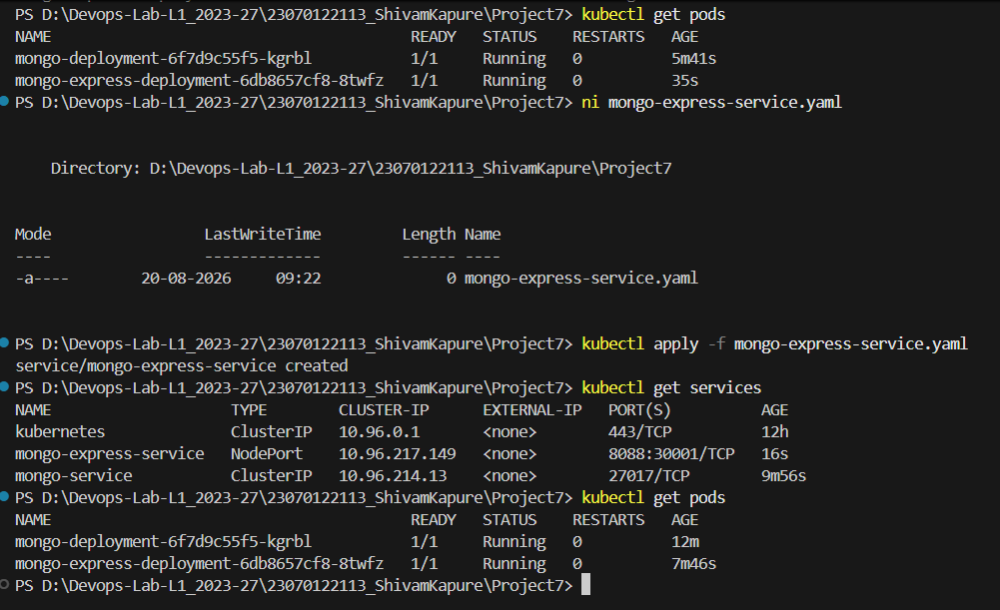
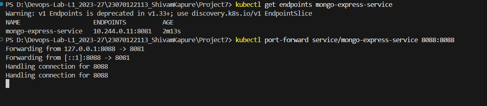

# Project 7 — MongoDB and Mongo Express on Kubernetes

## Overview

This project deploys MongoDB and Mongo Express on a local Kubernetes cluster using Docker Desktop Kubernetes.

The project demonstrates:
- Kubernetes Deployments
- Kubernetes Services
- ConfigMaps
- Secrets
- MongoDB and Mongo Express communication
- NodePort / port-forward access
- Mongo Express Basic Authentication

## Architecture

```text
Browser
   |
   v
Mongo Express Service
   |
   v
Mongo Express Pod
   |
   v
MongoDB Service
   |
   v
MongoDB Pod
   ^
   |
Secret + ConfigMap
```

## Prerequisites

1. Install Docker Desktop.
2. Enable Kubernetes in Docker Desktop.
3. Make sure the Kubernetes cluster is running.
4. Make sure `kubectl` is available in PowerShell.

Verify the cluster:

```powershell
kubectl get nodes
```

The Docker Desktop node should show `Ready`.

## Step 1 — Create the project directory

Create a directory for the Kubernetes manifests and open it in PowerShell.

```powershell
mkdir Project7-Mongo
cd Project7-Mongo
```

## Step 2 — Create the MongoDB Secret

Create `mongo-secret.yaml`:

```yaml
apiVersion: v1
kind: Secret
metadata:
  name: mongo-secret
type: Opaque
data:
  mongo-user: bW9uZ28=
  mongo-password: bW9uZ29wYXNz
```

Apply it:

```powershell
kubectl apply -f mongo-secret.yaml
kubectl get secrets
```

The Base64 values represent the MongoDB username and password used by this lab.

## Step 3 — Create the ConfigMap

Create `mongo-configmap.yaml`:

```yaml
apiVersion: v1
kind: ConfigMap
metadata:
  name: mongo-configmap
data:
  mongo-url: mongo-service
```

Apply it:

```powershell
kubectl apply -f mongo-configmap.yaml
kubectl get configmaps
```

The ConfigMap provides the MongoDB Service name to Mongo Express.

## Step 4 — Create the MongoDB Deployment

Create `mongo-deployment.yaml`:

```yaml
apiVersion: apps/v1
kind: Deployment
metadata:
  name: mongo-deployment
spec:
  replicas: 1
  selector:
    matchLabels:
      app: mongo
  template:
    metadata:
      labels:
        app: mongo
    spec:
      containers:
        - name: mongodb
          image: mongo:7
          ports:
            - containerPort: 27017
          env:
            - name: MONGO_INITDB_ROOT_USERNAME
              valueFrom:
                secretKeyRef:
                  name: mongo-secret
                  key: mongo-user
            - name: MONGO_INITDB_ROOT_PASSWORD
              valueFrom:
                secretKeyRef:
                  name: mongo-secret
                  key: mongo-password
```

Apply and verify:

```powershell
kubectl apply -f mongo-deployment.yaml
kubectl get deployments
kubectl get pods
```

Wait until the MongoDB Pod shows `1/1 Running`.

## Step 5 — Create the MongoDB Service

Create `mongo-service.yaml`:

```yaml
apiVersion: v1
kind: Service
metadata:
  name: mongo-service
spec:
  selector:
    app: mongo
  ports:
    - protocol: TCP
      port: 27017
      targetPort: 27017
```

Apply it:

```powershell
kubectl apply -f mongo-service.yaml
kubectl get services
```

The MongoDB Service is a ClusterIP Service and is used by Mongo Express to reach MongoDB.

## Step 6 — Create the Mongo Express Deployment

Create `mongo-express-deployment.yaml`:

```yaml
apiVersion: apps/v1
kind: Deployment
metadata:
  name: mongo-express-deployment
spec:
  replicas: 1
  selector:
    matchLabels:
      app: mongo-express
  template:
    metadata:
      labels:
        app: mongo-express
    spec:
      containers:
        - name: mongo-express
          image: mongo-express:1.0.2
          ports:
            - containerPort: 8081
          env:
            - name: ME_CONFIG_MONGODB_SERVER
              valueFrom:
                configMapKeyRef:
                  name: mongo-configmap
                  key: mongo-url
            - name: ME_CONFIG_MONGODB_ADMINUSERNAME
              valueFrom:
                secretKeyRef:
                  name: mongo-secret
                  key: mongo-user
            - name: ME_CONFIG_MONGODB_ADMINPASSWORD
              valueFrom:
                secretKeyRef:
                  name: mongo-secret
                  key: mongo-password
            - name: ME_CONFIG_BASICAUTH_USERNAME
              value: "admin"
            - name: ME_CONFIG_BASICAUTH_PASSWORD
              value: "admin123"
```

Apply and verify:

```powershell
kubectl apply -f mongo-express-deployment.yaml
kubectl get pods
```

Mongo Express uses the ConfigMap to locate MongoDB and the Secret for MongoDB credentials. Basic authentication is enabled for the Mongo Express web interface.

## Step 7 — Create the Mongo Express Service

Mongo Express listens inside its Pod on port `8081`. The Kubernetes Service uses port `8088`, and NodePort `30001` is used for external access.

Create `mongo-express-service.yaml`:

```yaml
apiVersion: v1
kind: Service
metadata:
  name: mongo-express-service
spec:
  selector:
    app: mongo-express
  type: NodePort
  ports:
    - protocol: TCP
      port: 8088
      targetPort: 8081
      nodePort: 30001
```

Apply it:

```powershell
kubectl apply -f mongo-express-service.yaml
kubectl get services
```

## Step 8 — Access Mongo Express

With the NodePort configuration, open:

```text
http://localhost:30001
```

The Mongo Express Basic Authentication credentials configured in the Deployment are:

```text
Username: admin
Password: admin123
```

Alternatively, use port-forwarding to access the Service on localhost port `8088`:

```powershell
kubectl port-forward service/mongo-express-service 8088:8088
```

Then open:

```text
http://localhost:8088
```

## Step 9 — Verify the Kubernetes Resources

Check Pods:

```powershell
kubectl get pods
```

Check Deployments:

```powershell
kubectl get deployments
```

Check Services:

```powershell
kubectl get services
```

Check ConfigMap:

```powershell
kubectl get configmaps
```

Check Secret:

```powershell
kubectl get secrets
```

Check all major resources:

```powershell
kubectl get all
```

## Step 10 — Troubleshooting

If a Pod is not running, check its status:

```powershell
kubectl get pods
```

View Pod logs:

```powershell
kubectl logs <pod-name>
```

View detailed Pod information:

```powershell
kubectl describe pod <pod-name>
```

Check MongoDB Service endpoints:

```powershell
kubectl get endpoints mongo-service
```

## Final Result

The completed project contains:
- 2 Deployments: MongoDB and Mongo Express
- 2 Services: MongoDB ClusterIP and Mongo Express NodePort
- 1 ConfigMap for MongoDB service configuration
- 1 Secret for MongoDB credentials
- Mongo Express Basic Authentication

## Screenshots

### Screenshot 01


### Screenshot 02


### Screenshot 03


### Screenshot 04


### Screenshot 05



### Screenshot 06


### Screenshot 07



### Screenshot 08


