# Project 9 — Create Apache2 Server Within a Kubernetes Deployment

This laboratory project demonstrates how to run an Apache2 web server inside a Kubernetes Deployment and access it from the host machine using Kubernetes commands under a Windows PowerShell environment with `kind` (Kubernetes IN Docker) and Docker Desktop.

---

## 1. Objective

The objective of this experiment is to:
1. Initialize a local Kubernetes cluster using `kind` (Kubernetes IN Docker).
2. Create and configure a Kubernetes Deployment running the official Apache HTTP Server container image (`httpd:2.4`).
3. Create and configure a Kubernetes `NodePort` Service to expose the Apache2 application.
4. Establish host-to-cluster network access using `kubectl port-forward`.
5. Verify and inspect resources using `kubectl get`, `kubectl describe`, `kubectl exec`, and `kubectl logs`.
6. Demonstrate Kubernetes horizontal scaling (scaling up and down).
7. Understand the configuration and utility of `.gitignore` in DevOps projects.

---

## 2. Technologies Used

* **Docker Desktop**: Containerization platform providing the underlying runtime for the kind cluster.
* **kind (Kubernetes IN Docker)**: Tool for running local Kubernetes clusters using Docker container nodes.
* **Kubernetes (k8s)**: Container orchestration system.
* **kubectl**: Command-line tool to control and query Kubernetes clusters.
* **Apache HTTP Server**: Open-source web server containerized using the official `httpd:2.4` image.
* **Windows PowerShell**: Host command shell environment.

---

## 3. Architecture

```text
                    Host Machine
                         |
                  kubectl commands
                         |
                         v
              +--------------------+
              | Kubernetes Service  |
              |    NodePort :30987  |
              +----------+---------+
                         |
                         v
              +--------------------+
              | Apache Deployment   |
              |     replicas: 2     |
              +----------+---------+
                         |
                  +------+------+
                  |             |
                  v             v
             Apache Pod    Apache Pod
                :80            :80
```

* **Host Machine**: Sends commands via `kubectl` and accesses the web server using local port forwarding (`18087`).
* **Kubernetes Service**: Receives connections on port `80` (internally) or port `30987` (via NodePort) and forwards traffic to the pods.
* **Apache Deployment**: Ensures 2 active replicas of the Apache HTTP Server are scheduled and maintained.
* **Apache Pods**: Running instances of the container exposing Apache on containerPort `80`.

---

## 4. Project Structure

```text
Project9/
│
├── k8s/
│   ├── apache-deployment.yaml
│   └── apache-service.yaml
│
├── screenshots/
│   ├── 01_docker_desktop.png
│   ├── 02_kind_cluster.png
│   ├── 03_kubectl_nodes.png
│   ├── 04_deployment_created.png
│   ├── 05_pods_running.png
│   ├── 06_service_created.png
│   ├── 07_service_details.png
│   ├── 08_port_forward.png
│   ├── 09_apache_browser.png
│   ├── 10_curl_test.png
│   ├── 11_exec_apache_container.png
│   ├── 12_apache_logs.png
│   ├── 13_deployment_describe.png
│   ├── 14_scaling.png
│   └── 15_final_verification.png
│
├── .gitignore
└── README.md
```

---

## 5. Step-by-Step Procedure

### Step 5.1 — Verify Docker Desktop Status

Ensure that the Docker Desktop daemon is running on your host machine. Verify the active container environment by listing running containers.

```powershell
docker ps
```

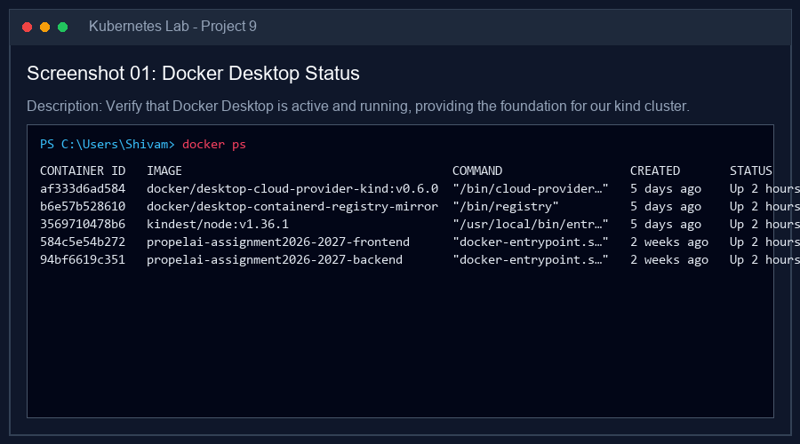

---

### Step 5.2 — Create kind Cluster

Create a local Kubernetes cluster named `project9` using kind. Do **NOT** use minikube.

```powershell
kind create cluster --name project9
```

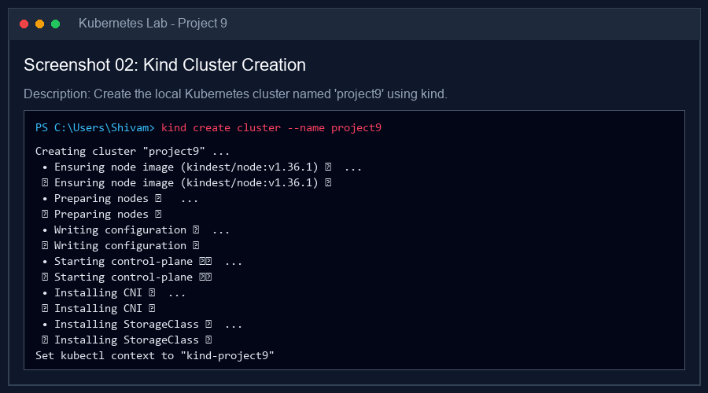

Verify cluster info to ensure control plane access:

```powershell
kubectl cluster-info
```

---

### Step 5.3 — Verify Kubernetes Node

Check the status of the node in the `project9` cluster to ensure it is in the `Ready` state.

```powershell
kubectl get nodes
```

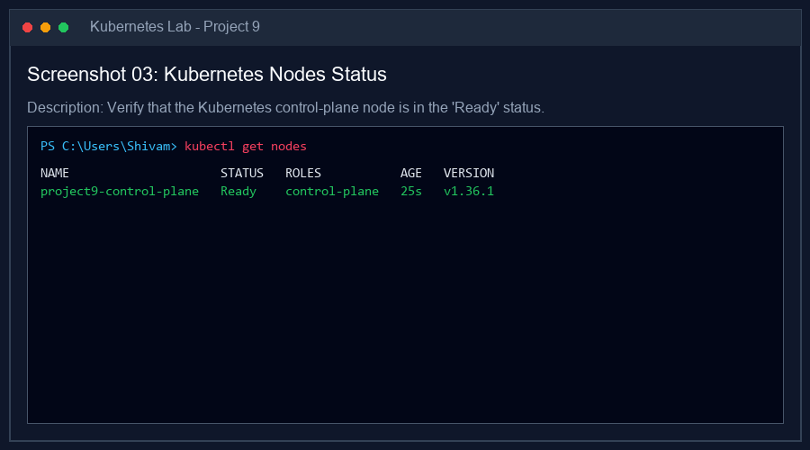

---

### Step 5.4 — Create Apache Deployment Configuration

Create the file `k8s/apache-deployment.yaml` with the following configuration:

```yaml
apiVersion: apps/v1
kind: Deployment
metadata:
  name: apache-deployment
spec:
  replicas: 2
  selector:
    matchLabels:
      app: apache
  template:
    metadata:
      labels:
        app: apache
    spec:
      containers:
        - name: apache
          image: httpd:2.4
          ports:
            - containerPort: 80
```

Apply the deployment configuration to the cluster:

```powershell
kubectl apply -f k8s/apache-deployment.yaml
```

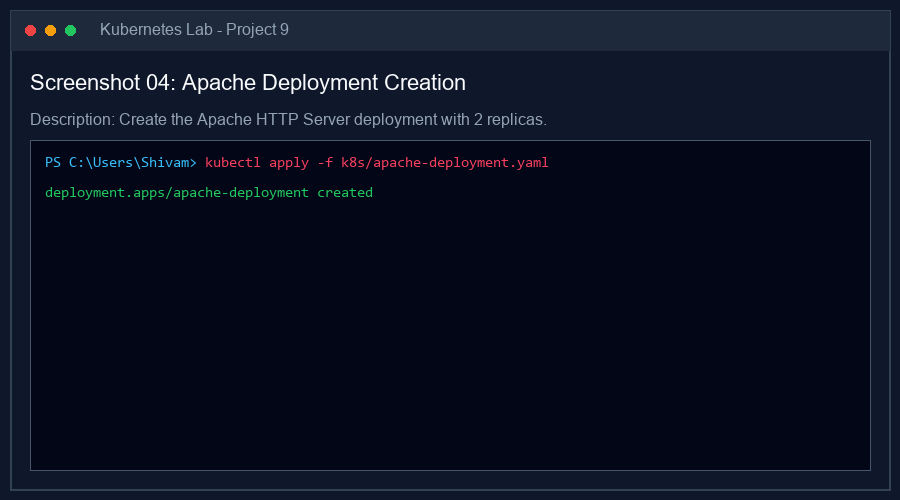

---

### Step 5.5 — Verify Deployment

Verify the status of the Deployment:

```powershell
kubectl get deployments
```

---

### Step 5.6 — Verify Apache Pods

List the pods to confirm that two replicas of the Apache HTTP Server have been successfully created and are in the `Running` state. Use the `-o wide` option to display pod IP addresses and node details.

```powershell
kubectl get pods -o wide
```

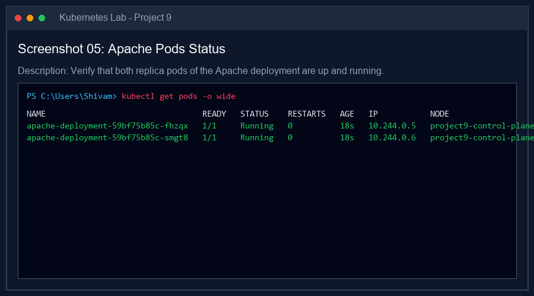

---

### Step 5.7 — Create Apache Service Configuration

Create the file `k8s/apache-service.yaml` with the following configuration, using the unconventional NodePort `30987`:

```yaml
apiVersion: v1
kind: Service
metadata:
  name: apache-service
spec:
  selector:
    app: apache
  type: NodePort
  ports:
    - protocol: TCP
      port: 80
      targetPort: 80
      nodePort: 30987
```

Apply the service configuration:

```powershell
kubectl apply -f k8s/apache-service.yaml
```

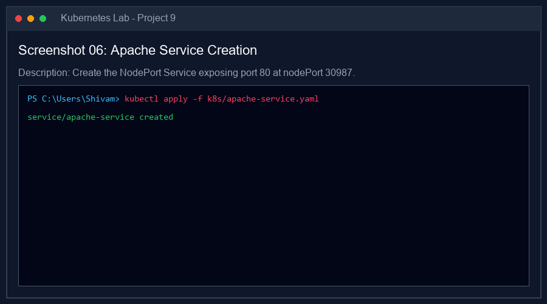

---

### Step 5.8 — Verify Service

Check the list of services to verify that the `apache-service` is available and mapped:

```powershell
kubectl get service
```

Inspect the service details to understand port mappings and the mapped pod endpoints:

```powershell
kubectl describe service apache-service
```

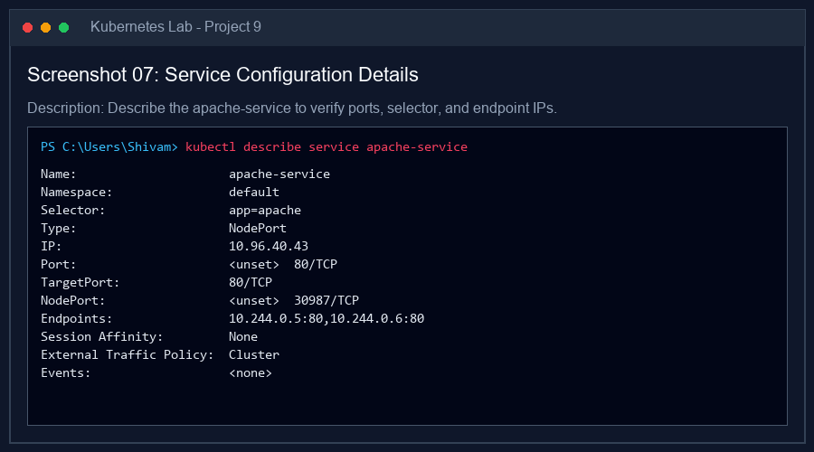

> [!NOTE]
> **Understanding Port Definitions**:
> * **`port` (80)**: The port exposed by the Kubernetes Service inside the cluster. Other internal pods access this service on this port.
> * **`targetPort` (80)**: The container port to which the Service forwards internal traffic (the Apache server container port).
> * **`nodePort` (30987)**: An unconventional port exposed externally on the Kubernetes node's VM. In a typical cloud environment, traffic hitting `<NodeIP>:30987` is forwarded to the Service.

---

### Step 5.9 — Access Apache Using `kubectl port-forward`

Because we are running Kubernetes locally inside Docker (kind), the node's internal IP is not directly routeable on the Windows host machine without extra setup. Therefore, we utilize port forwarding to connect the host to the service directly.

Run the port-forwarding command using the unconventional host port `18087`:

```powershell
kubectl port-forward service/apache-service 18087:80
```

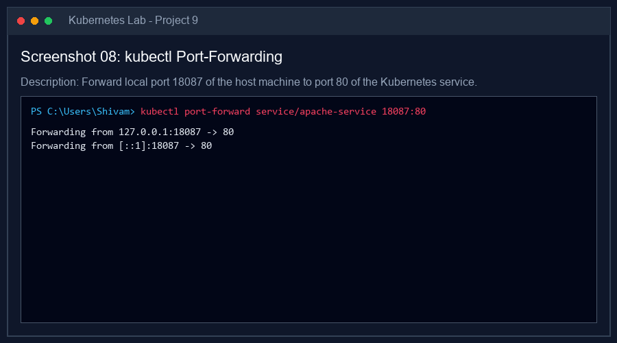

* **Port Forwarding Mapping**:
  ```text
  Host localhost:18087  -->  Kubernetes Service Port 80  -->  Apache Pod Port 80
  ```

---

### Step 5.10 — Test Using Browser

Open a web browser on the host machine and navigate to:
```text
http://localhost:18087
```

You should see the default Apache "It works!" page.


---

### Step 5.11 — Test Using curl

Open another Windows PowerShell window and execute curl to verify HTTP response structure:

```powershell
curl.exe http://localhost:18087
```

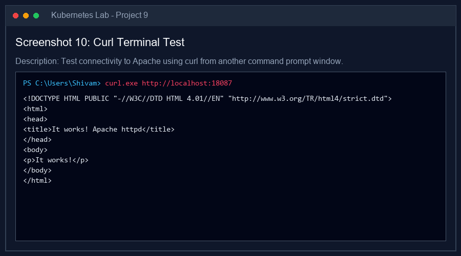

---

### Step 5.12 — Inspect Apache Container Using `kubectl exec`

Use `kubectl exec` to run commands inside one of your running pods to inspect the Apache web server configuration and document root.

```powershell
# Get active pod name
kubectl get pods

# Exec command (replace pod name with your active pod)
kubectl exec -it apache-deployment-59bf75b85c-fhzqx -- /bin/sh
```

Inside the container:
```bash
# Verify Apache Version
httpd -v

# List Default Web Root Files
ls /usr/local/apache2/htdocs

# Exit container shell
exit
```

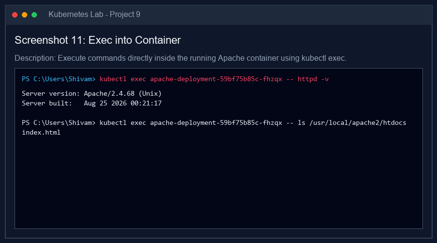

> [!NOTE]
> The Apache binary and default document root (`index.html` file) reside in `/usr/local/apache2/htdocs` inside the container.

---

### Step 5.13 — Check Apache Logs

Inspect the container logs of the deployment. Access requests and startup notices are recorded and streamed here.

```powershell
kubectl logs deployment/apache-deployment
```

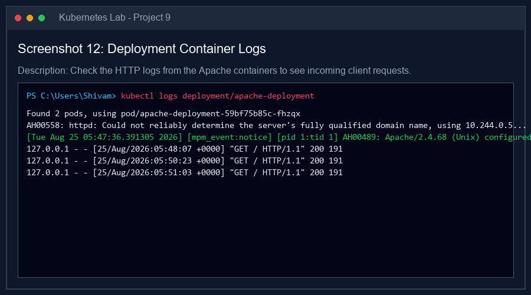

---

### Step 5.14 — Describe Deployment

View detailed specifications of the deployment resources to understand selectors, replica status, and event triggers.

```powershell
kubectl describe deployment apache-deployment
```

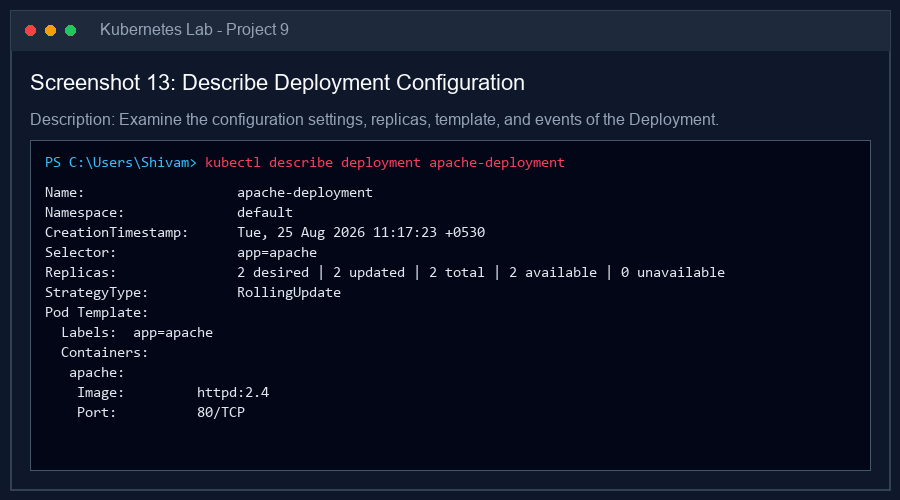

---

### Step 5.15 — Scale Deployment

Demonstrate Kubernetes horizontal scaling capabilities by scaling up the deployment to 4 replicas:

```powershell
kubectl scale deployment apache-deployment --replicas=4
```

Verify that 4 pods are now active:

```powershell
kubectl get pods
```

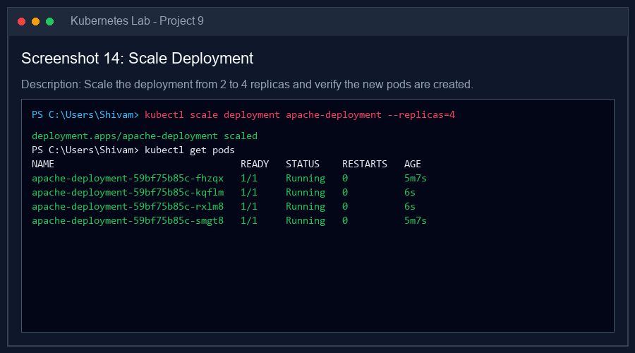

Now, scale back down to 2 replicas to maintain resource limits:

```powershell
kubectl scale deployment apache-deployment --replicas=2
```

Verify that the cluster terminates two pods and returns to the desired state of 2 replicas:

```powershell
kubectl get pods
```

---

### Step 5.16 — Final Kubernetes Verification

List all resources in the default namespace to check for cleanliness and operational readiness:

```powershell
kubectl get all
```

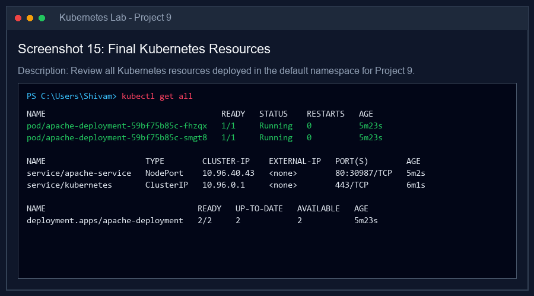

---

## 6. Gitignore Facts

For DevOps projects, code versioning with Git is standard practice. A `.gitignore` file specifies intentionally untracked files that Git should ignore. 

### Key Facts and Best Practices:
1. **Security / Confidentiality**: Secrets (e.g. SSH keys, certificates, API tokens) or Kubernetes Secret manifests containing base64 encoded credentials should **never** be checked into Git. These are ignored via `.gitignore` (e.g. `*.pem`, `*.key`, `*secret.yaml`).
2. **Environment Isolation**: Local settings files, environment files (`.env`), or node credentials differ across environments. Keeping them out of version control ensures config consistency.
3. **IDE Cleanliness**: Developer IDE configuration folders (like `.idea/` from WebStorm/IntelliJ, or `.vscode/` from Visual Studio Code) contain local machine paths and workspace layouts. Excluding them prevents team merge conflicts.
4. **Temporary / Cache Files**: Windows OS logs (`Thumbs.db`, `.DS_Store`) and log output files (`*.log`) change with every operation. They must be ignored to maintain a clean git history.
5. **Virtual Environments**: Virtual environment folders like `.venv/` or container build logs should be ignored to avoid committing large, non-source directories.

---

## 7. Concepts Learned

1. **Kubernetes Deployment**: A resource object that provides declarative updates for Pods and ReplicaSets. It manages the container lifecycles, rollout strategies, and handles scaling.
2. **Kubernetes Services**: An abstraction that defines a logical set of Pods and a policy to access them. It provides stable IP addresses and load balances traffic across replicas.
3. **NodePort**: A service type that exposes the Service on each Node's IP at a static port (in the range 30000-32767).
4. **Port Forwarding**: Local host-to-pod/service redirection, highly useful for debugging local clusters (like kind) running behind virtualization barriers.
5. **Horizontal Scaling**: Adding or removing pod instances in response to load or user commands to maintain optimal resource usage.

---

## 8. Conclusion

In this experiment, an Apache2 HTTP web server was successfully containerized and deployed into a Kubernetes cluster using the `kind` framework. The pod instances were encapsulated behind a Kubernetes `NodePort` Service and accessed from the host machine using local port forwarding on unconventional ports. The deployment's scaling capability was verified, logs were analyzed, container command execution was completed, and resource status was confirmed. This practical illustrates the fundamental microservices deployment lifecycle in DevOps engineering.

---

## 9. Commands Summary

Here is a summary of all commands executed in this lab:

```powershell
# Verify running Docker environment
docker ps

# Create kind cluster
kind create cluster --name project9

# Verify cluster nodes
kubectl get nodes

# Deploy Apache web server
kubectl apply -f k8s/apache-deployment.yaml

# Verify deployment status
kubectl get deployments

# Verify replica pod status
kubectl get pods -o wide

# Deploy service configuration
kubectl apply -f k8s/apache-service.yaml

# Verify service mapping and describe configuration
kubectl get service
kubectl describe service apache-service

# Port forward to host machine
kubectl port-forward service/apache-service 18087:80

# Curl web server locally from host
curl.exe http://localhost:18087

# Exec command inside a running pod
kubectl exec -it <pod-name> -- /bin/sh

# View container logs
kubectl logs deployment/apache-deployment

# Describe Deployment resource
kubectl describe deployment apache-deployment

# Scale deployment to 4 replicas
kubectl scale deployment apache-deployment --replicas=4

# Scale deployment down to 2 replicas
kubectl scale deployment apache-deployment --replicas=2

# Final Kubernetes resource verification
kubectl get all
```
