# Assignment 1 - DevOps Lab

**Submitted by:** Kashyup Gaud  
**PRN:** 23070122114  
**Class:** FIYCSE – A3  

---

## GIT

### Uncommited changes
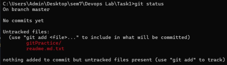

### Staging the changes
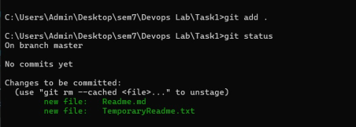

### Commited the changes
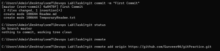

### New branch
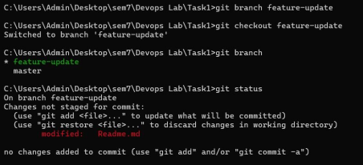

### commited in new branch
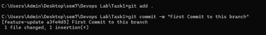

### Merging the branches
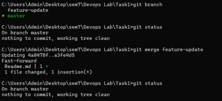

### Simulating the merge Conflict
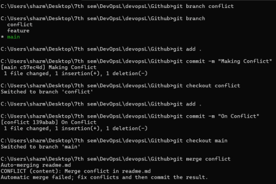

---

## Jira

### My Scrum Space
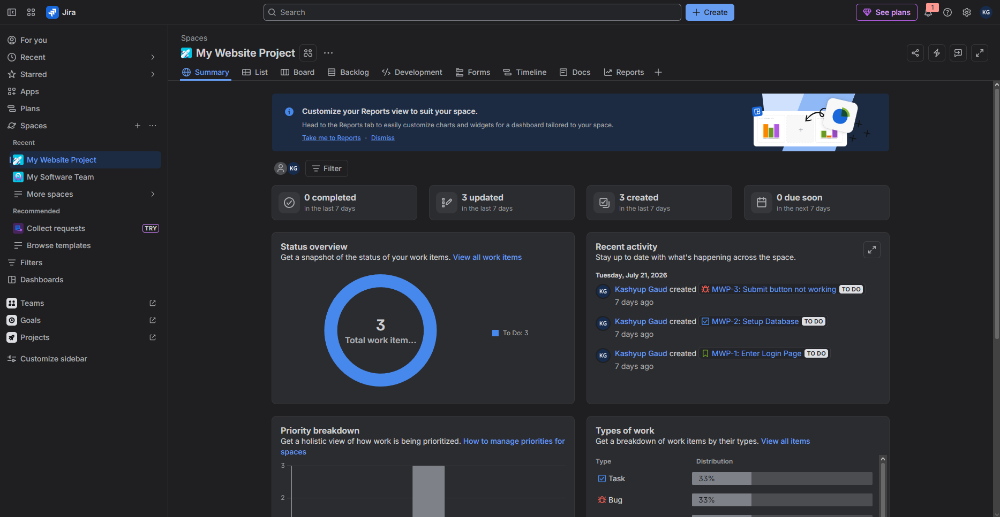

### Create Story
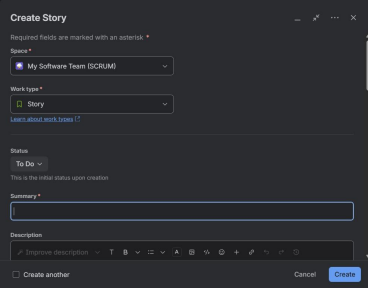

### Backlog Tasks
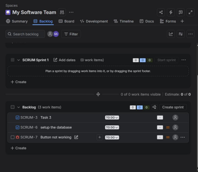

---

## Docker & Jenkins

### Creating docker Image
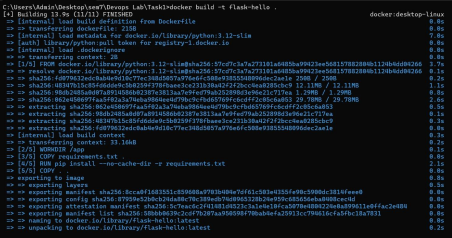

### Checking image status

### Running Docker Image

### Jenkins Bash Commands
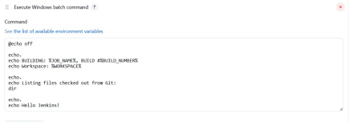

### Jenkins Console Output
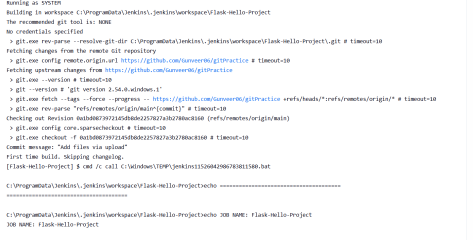