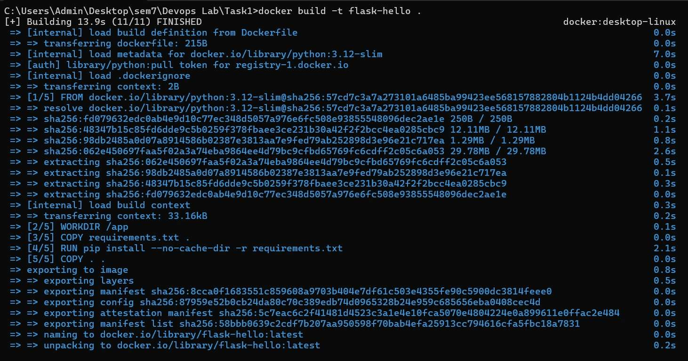
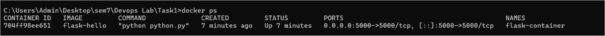
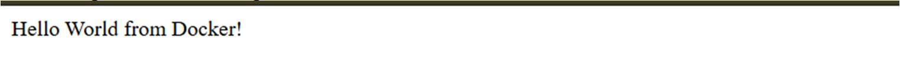
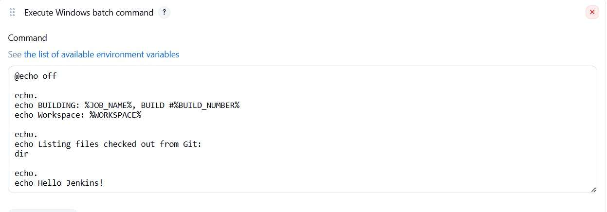
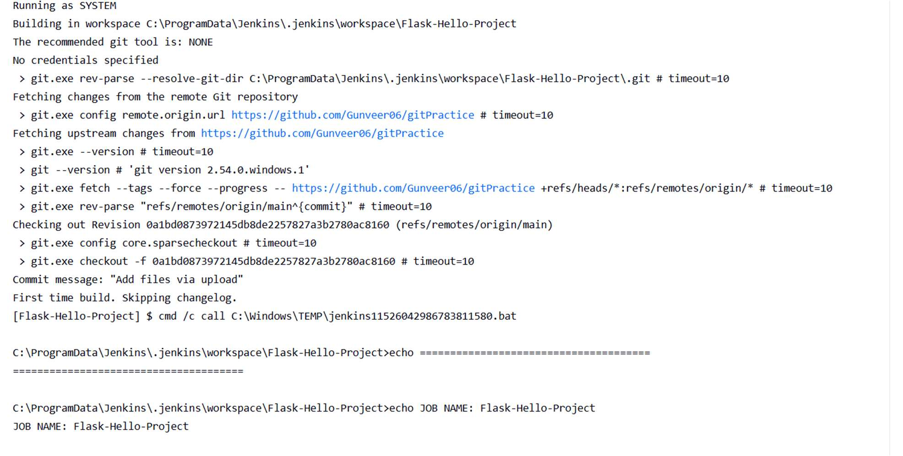
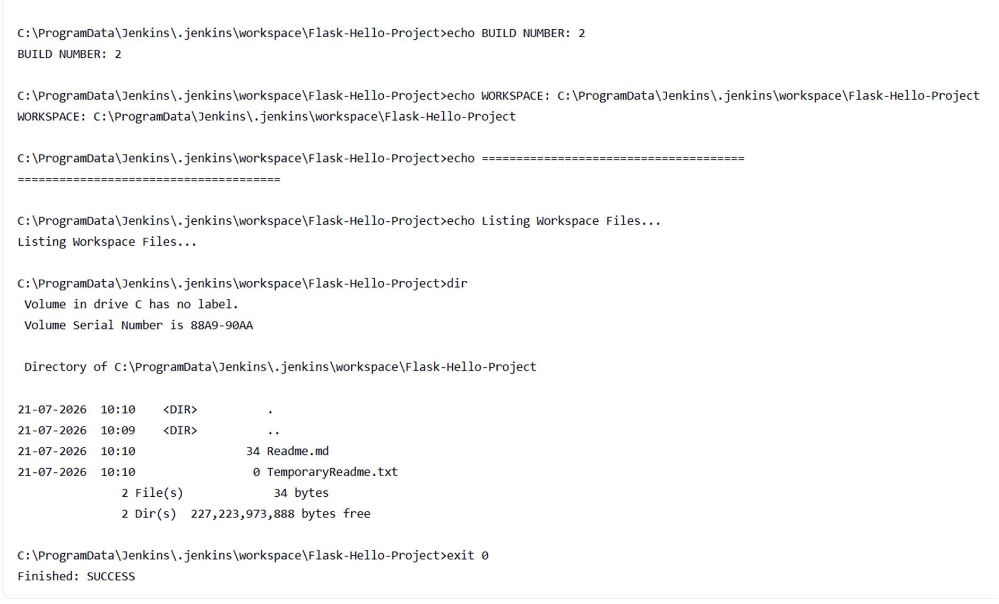

# Assignment TW1.3 - Docker & Jenkins

**Submitted by:** Kashyup Gaud  
**PRN:** 23070122114  
**Class:** FIYCSE – A3  

---

## Creating docker Image

---

## Checking image status

---

## Running Docker Image

Hello World from Docker!

---

## Jenkins Bash Commands

---

## Jenkins Console Output

