# Project 2: Angular Docker Deployment

**Deploying an Angular Application Using Docker and Docker Compose**  
*Development container with Angular CLI and production deployment with Nginx*  

**Project:** Project 2: Angular Docker Deployment  
**Submitted by:** Kashyup Gaud  
**Course / Subject:** DevOps Lab  
**Date:** 22 July 2026  

---

## Docker Configurations

### Development Dockerfile (`Dockerfile.dev`)

```dockerfile
FROM node:22.22.3
WORKDIR /app
COPY package*.json ./
RUN npm install
COPY . .
EXPOSE 4200
CMD ["npm", "start"]
```
*The development image installs dependencies, copies the project, exposes Angular's development port, and executes the project's start script.*

### Production Dockerfile (`Dockerfile`)

```dockerfile
# Build stage
FROM node:22-alpine AS build
WORKDIR /app
COPY package*.json ./
RUN npm install
COPY . .
RUN npm run build -- --configuration production

# Production stage
FROM nginx:alpine
COPY --from=build /app/dist/angular-docker/browser /usr/share/nginx/html
COPY nginx.conf /etc/nginx/conf.d/default.conf
EXPOSE 80
CMD ["nginx", "-g", "daemon off;"]
```
*The build tools remain in the temporary Node.js stage. Only Nginx and the compiled static files are retained in the final runtime image.*

### Development Compose File (`docker-compose.yml`)

```yaml
services:
  angular-app:
    build:
      context: .
      dockerfile: Dockerfile.dev
    ports:
      - "4200:4200"
    environment:
      - NG_ALLOWED_HOSTS=localhost
    volumes:
      - .:/app
      - /app/node_modules
```

### Production Compose File (`docker-compose.prod.yml`)

```yaml
services:
  angular-prod:
    build:
      context: .
      dockerfile: Dockerfile
    ports:
      - "80:80"
```

---

## Implementation Evidence and Screenshot Analysis

The following figures document the configuration, execution, validation, and shutdown of the project. Each screenshot is paired with an explanation of the evidence it provides.

### Figure 2. Angular project structure in VS Code
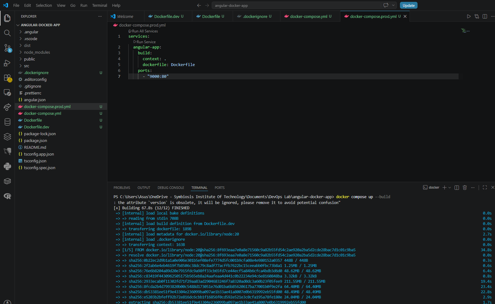  
**Explanation:** The Explorer shows the Angular source folders and all required Docker configuration files: `Dockerfile`, `Dockerfile.dev`, `docker-compose.yml`, `docker-compose.prod.yml`, `nginx.conf`, package files, and TypeScript configuration files.

### Figure 3. Development Dockerfile
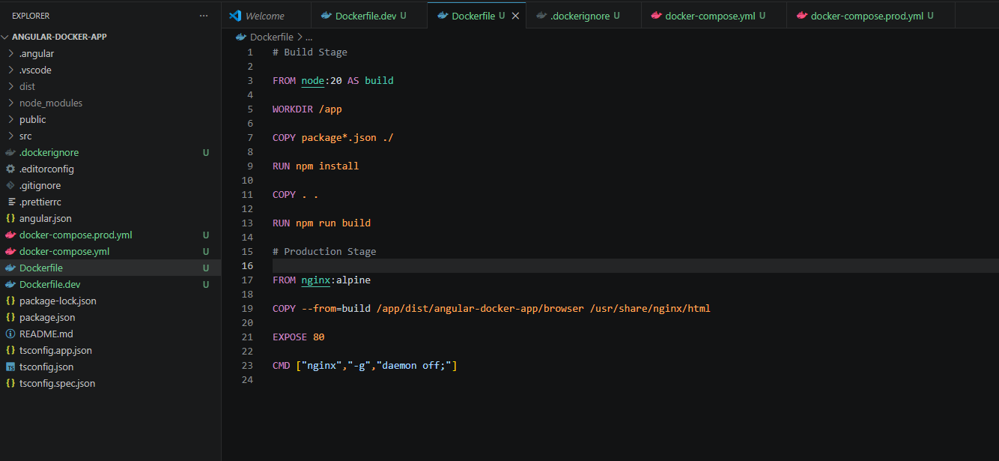  
**Explanation:** The development Dockerfile uses Node.js, sets `/app` as the working directory, installs npm dependencies, copies the application, exposes port 4200, and starts the Angular application.

### Figure 4. Multi-stage production Dockerfile
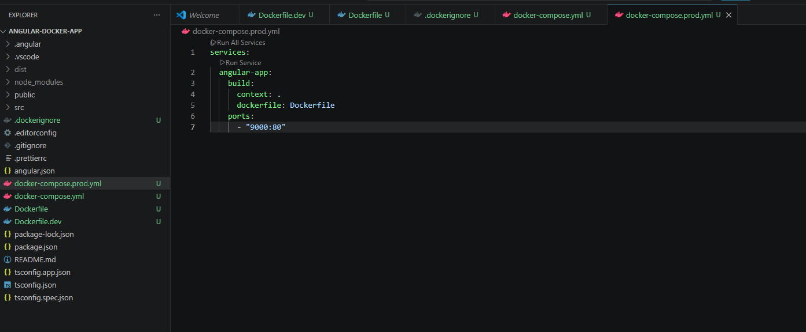  
**Explanation:** The first stage builds the Angular application with Node.js. The second stage uses Nginx Alpine, copies the browser build into the Nginx document root, exposes port 80, and keeps Nginx in the foreground.

### Figure 5. Development Docker Compose configuration
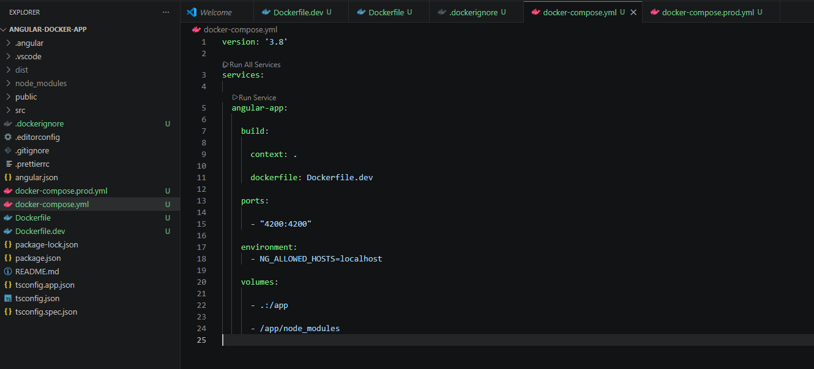  
**Explanation:** The development service builds from `Dockerfile.dev`, maps host port 4200 to container port 4200, passes the allowed-host setting, mounts the project directory, and protects container-installed `node_modules` with an anonymous volume.

### Figure 7. Angular development application on port 4200
  
**Explanation:** The browser successfully loads the Angular starter page from `localhost:4200`, proving that the development container is running and the port mapping is correct.

### Figure 8. Running Angular containers in Docker Desktop
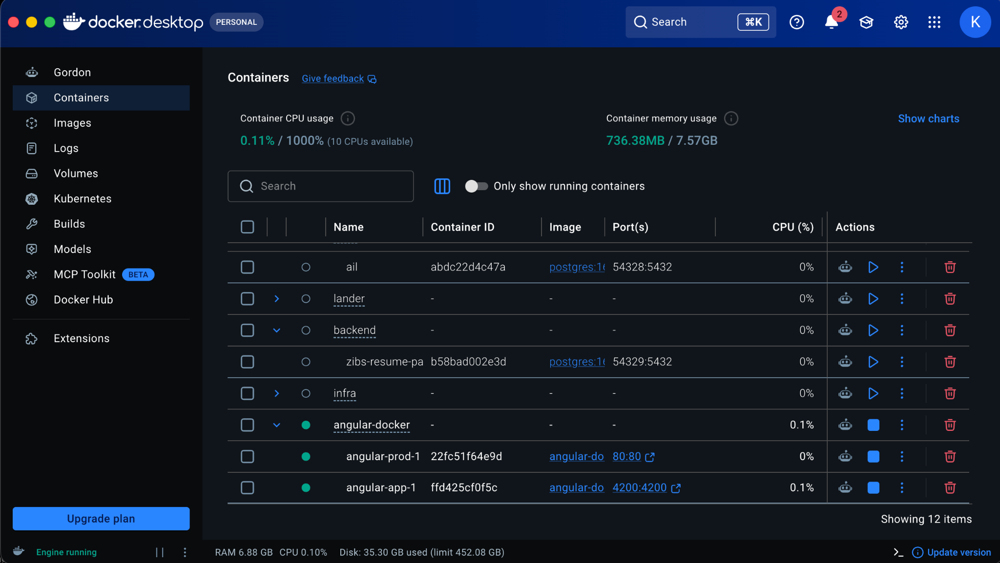  
**Explanation:** Docker Desktop shows the `angular-docker` Compose project and its running development and production containers. The published ports 4200:4200 and 80:80 are visible.

### Figure 9. Running containers verified with `docker ps`
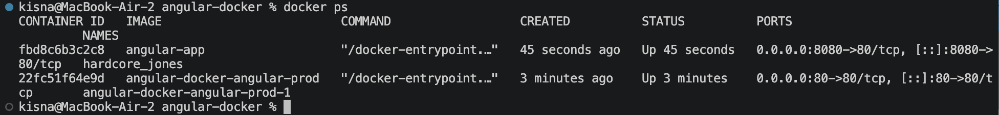  
**Explanation:** The terminal lists the running Angular images, container status, and host-to-container port mappings. This confirms that Docker has published the required ports.

### Figure 10. Production image build and Nginx startup
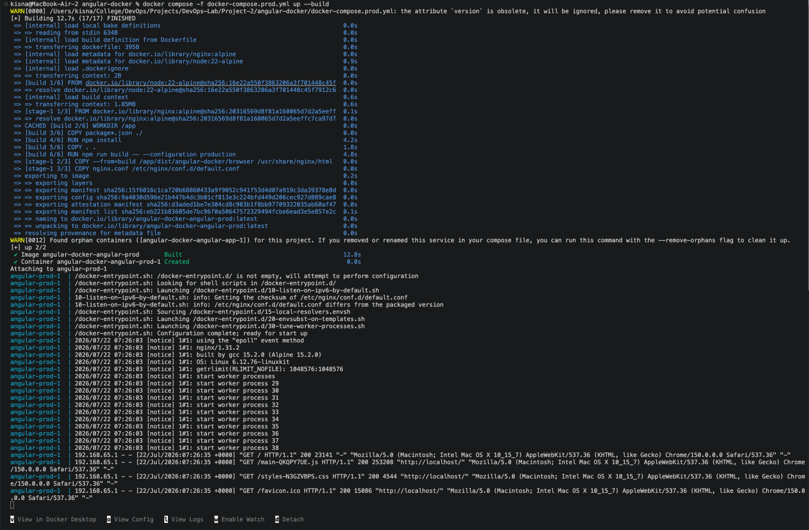  
**Explanation:** The production Compose command completes the Node.js build stage, copies the Angular browser output into Nginx, creates the container, starts Nginx workers, and records successful HTTP 200 responses.

### Figure 11. Production Angular application served by Nginx
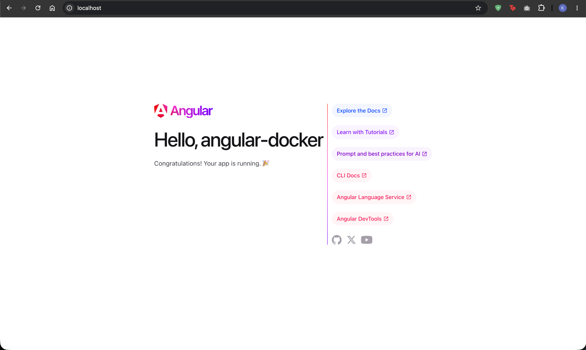  
**Explanation:** The Angular application loads at `http://localhost` without an explicit port because the production service is published on the standard HTTP port 80.

### Figure 12. Docker images available on the host
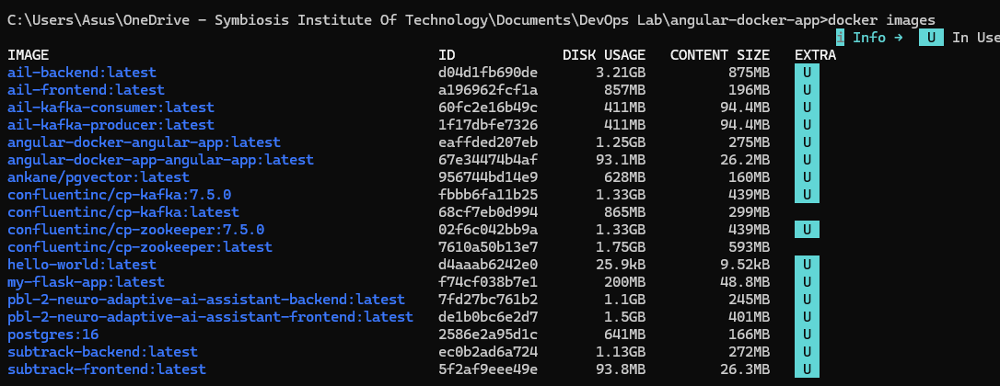  
**Explanation:** The `docker images` command lists the created Angular development and production images alongside the base Node.js and Nginx images used by the project.

### Figure 13. Docker Compose service status
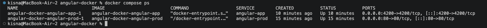  
**Explanation:** `docker compose ps` displays both Compose services, their images, running state, creation time, and published ports.

### Figure 14. Stopping development and production services
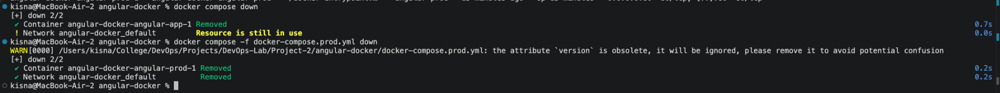  
**Explanation:** The development container is removed first, but the shared project network remains while the production container is attached. After the production Compose configuration is stopped, the remaining container and network are removed.

### Figure 15. Graceful Nginx shutdown logs
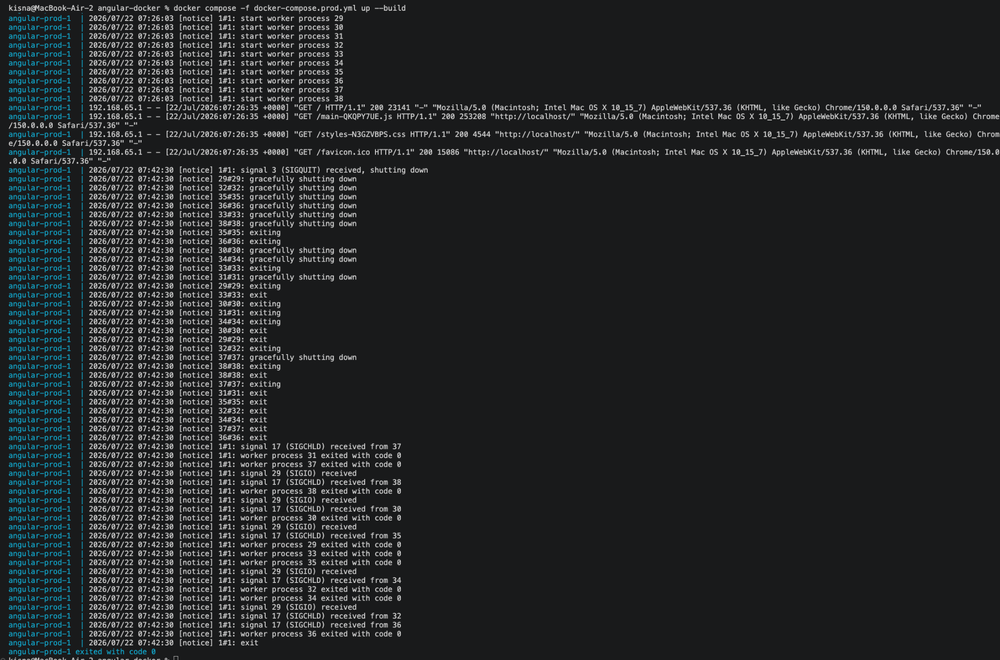  
**Explanation:** After the stop command, Nginx receives termination signals, gracefully shuts down its worker processes, and exits with code 0. This is normal container lifecycle behavior.

### Figure 16. Angular development process terminated during shutdown
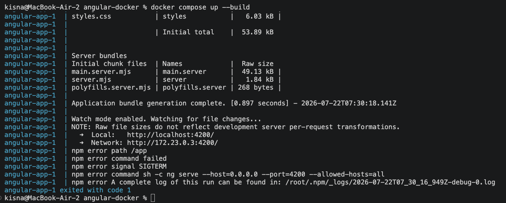  
**Explanation:** The Angular development process reports SIGTERM and exits after the container is stopped. The message represents an intentional termination signal rather than an Angular compilation failure.

---

## Docker Commands Explained

The project uses the following commands in sequence. Each command is shown with its practical purpose and expected behavior.

- **`ng new angular-docker-app`**: Creates a new Angular workspace and application, generates the source structure, and installs the initial npm dependencies.
- **`docker compose up --build`**: Reads `docker-compose.yml`, rebuilds the development image when required, creates the service container and network, starts Angular, and attaches the terminal to the service logs.
- **`docker compose down`**: Stops and removes the development service containers and removes the Compose network when no other containers are still using it.
- **`docker compose -f docker-compose.prod.yml up --build`**: Uses the production Compose file, performs the multi-stage Docker build, creates the Nginx-based service, publishes port 80, starts the container, and attaches to logs.
- **`docker compose -f docker-compose.prod.yml down`**: Stops and removes the production service and its Compose-managed resources.
- **`docker ps`**: Lists running containers with container IDs, images, commands, uptime, published ports, and names.
- **`docker images`**: Lists locally available images, image identifiers, disk usage, content size, and whether an image is currently in use.
- **`docker compose ps`**: Shows the status of services that belong to the current Compose project, including service name, state, and published ports.
- **`Ctrl + C`**: Sends an interrupt to the foreground Compose process. Docker forwards a termination signal to the container process so it can shut down gracefully.
- **`docker compose up --build --remove-orphans`**: Optional cleanup form that starts the selected Compose services and removes containers created by older service definitions that are no longer present.

---

## Conclusion

The project successfully demonstrates a complete Angular containerization workflow. Development uses Node.js, Angular's live development server, source mounting, and port 4200. Production uses a multi-stage build to keep compilation dependencies out of the runtime image and serves the final static application through Nginx on port 80. Docker Compose makes both workflows repeatable and provides consistent lifecycle management. The collected evidence confirms successful builds, correct networking, browser accessibility, image creation, service status, and controlled shutdown.
