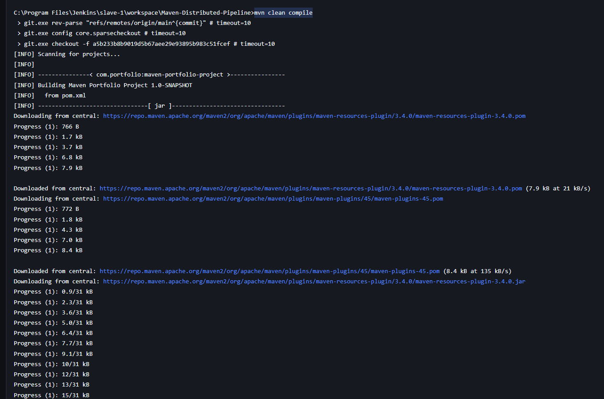
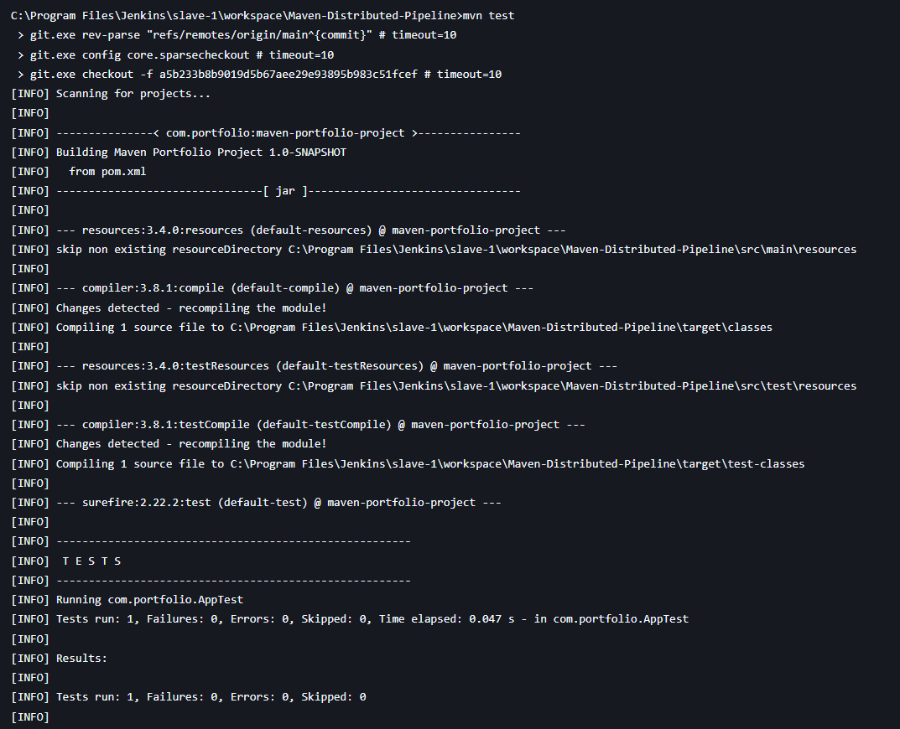
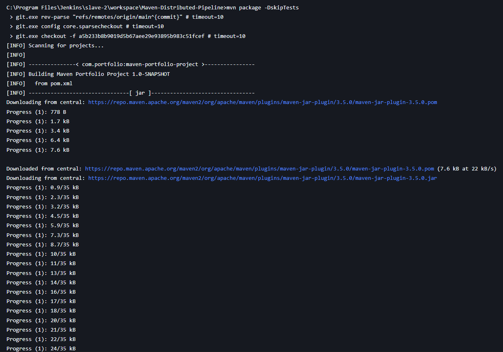
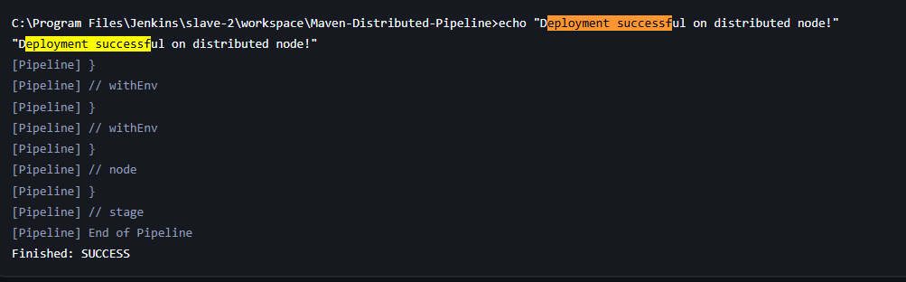
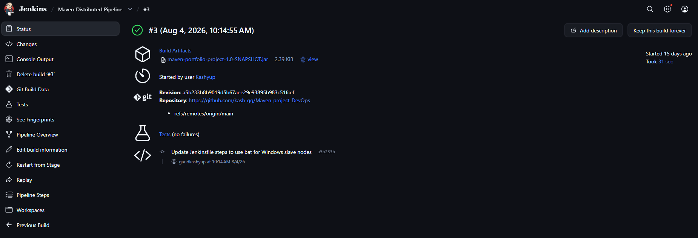

# Project 4: Architecting Jenkins Pipeline for Scale

## Overview
This project demonstrates how to architect a Jenkins Pipeline for scale by setting up a distributed pipeline. The pipeline automates the build, test, and deployment process of a Java Maven project using a Jenkins master node.

## Architecture
The pipeline is designed to execute tasks linearly through Jenkins:
1. **Checkout & Build**: Handles Source Code Checkout and Maven Compilation.
2. **Unit Testing**: Executes tests using Maven Surefire and captures the results.
3. **Package & Archive**: Packages the application into a `.jar` artifact and archives it in Jenkins.
4. **Deploy to Staging**: Simulates a deployment step to a staging environment.

## Prerequisites
- Jenkins server installed and running.
- Global Tool Configuration in Jenkins:
  - Maven configured as `Maven-3.8`.
  - JDK configured as `Java-25`.

## Pipeline Code (Jenkinsfile)
The following declarative pipeline script is used to execute the stages. We use `bat` commands since the pipeline runs on a Windows node.

```groovy
pipeline {
    agent any

    // Define tools configured in Jenkins Global Tool Configuration
    tools {
        maven 'Maven-3.8' 
        jdk 'Java-25'
    }

    stages {
        stage('Checkout & Build') {
            steps {
                echo "Running Checkout and Build..."
                // Checkout code from source control
                checkout scm
                
                // Compiling the maven project
                echo "Compiling the Maven project..."
                bat 'mvn clean compile'
            }
        }
        
        stage('Unit Testing') {
            steps {
                echo "Running Unit Tests..."
                bat 'mvn test'
            }
            post {
                always {
                    // Archive JUnit test results
                    junit 'target/surefire-reports/*.xml'
                }
            }
        }
        
        stage('Package & Archive Artifacts') {
            steps {
                echo "Running Packaging..."
                // Package the application (skip tests as they were done previously)
                bat 'mvn package -DskipTests'
            }
            post {
                success {
                    // Archive the built artifacts (jar/war files)
                    archiveArtifacts artifacts: 'target/*.jar, target/*.war', fingerprint: true, allowEmptyArchive: true
                }
            }
        }
        
        stage('Deploy to Staging') {
            steps {
                echo "Deploying portfolio to staging server..."
                // Simulated deployment step
                bat 'echo "Deployment successful!"'
            }
        }
    }
}
```

## Detailed Step-by-Step Instructions

### Step 1: Create the Jenkins Pipeline Job
1. Log into your Jenkins dashboard.
2. Click **New Item** in the sidebar.
3. Enter `Maven-Distributed-Pipeline` as the item name.
4. Select **Pipeline** and click **OK**.

### Step 2: Configure the Pipeline Script
1. In the job configuration screen, scroll down to the **Pipeline** section.
2. Change the *Definition* dropdown to **Pipeline script from SCM**.
3. Select **Git** as the SCM and enter your repository URL.
4. Ensure the **Script Path** points exactly to `23070122114_kashyupgaud/Project 4/Jenkinsfile`.
5. Click **Save**.

### Step 3: Run the Pipeline
1. Click **Build Now** on the left menu.
2. Monitor the progress in the **Stage View** to ensure all blocks turn green.

---

## Execution Flow & Screenshots

### 1. Checkout & Build Stage
Checks out the source code from Git and successfully runs `bat 'mvn clean compile'`.


### 2. Unit Testing Stage
Executes tests using `bat 'mvn test'` and generates JUnit test reports successfully.


### 3. Package & Archive Stage
Packages the application into a JAR file using `mvn package -DskipTests` and archives it as a Jenkins artifact.


### 4. Deploy to Staging Stage
A simulated successful deployment of the packaged application.


### 5. Final Build Status
The pipeline completed all stages successfully. The generated `.jar` artifact and test results are archived and visible on the main build dashboard.

