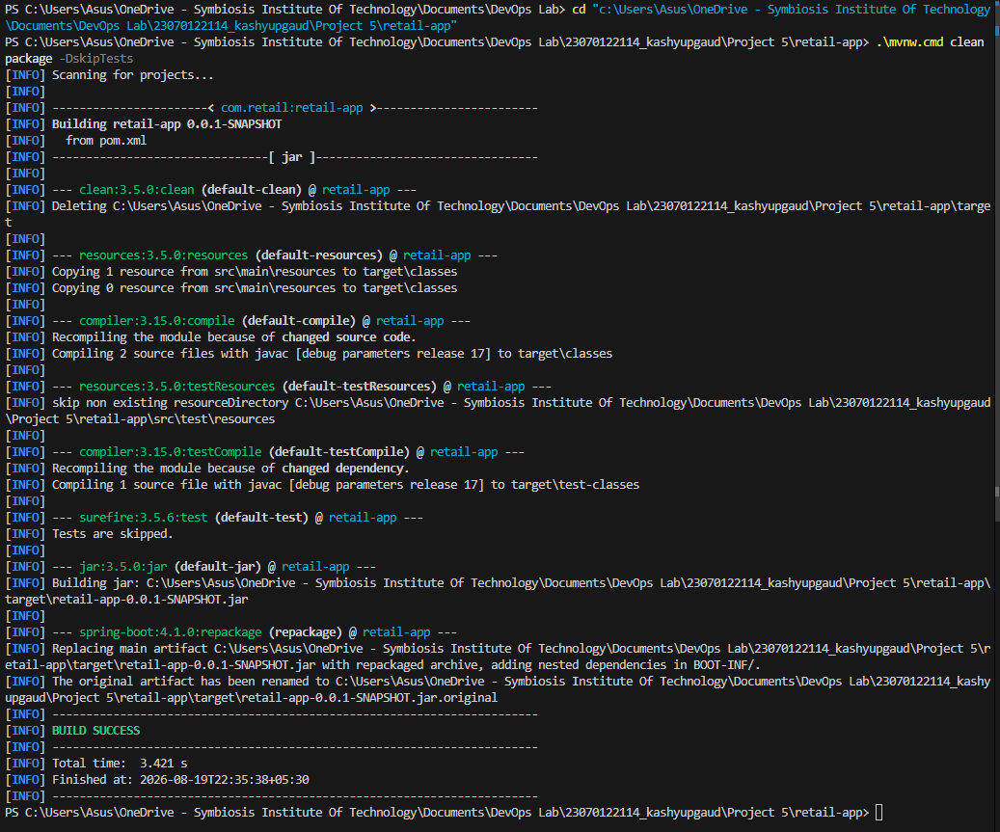
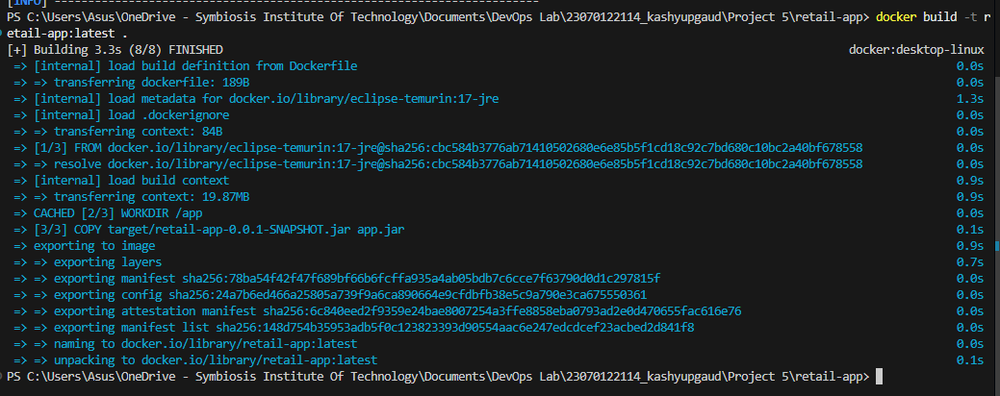
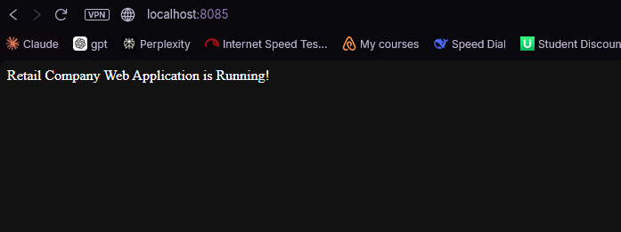
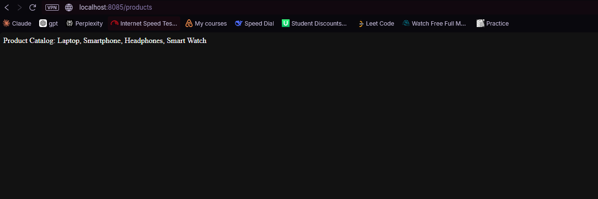
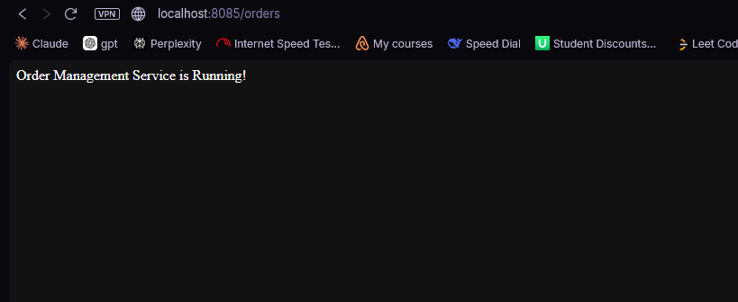
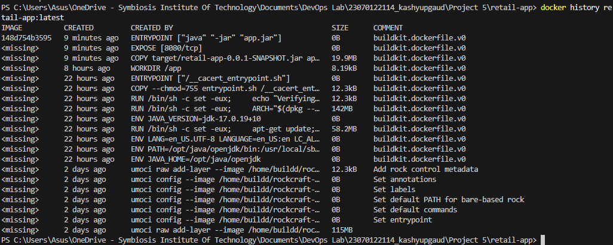

# Project 5 — Containerizing a Spring Boot Application and Inspecting Its Docker Image

## 1. Project Overview
This project demonstrates how to containerize a Spring Boot retail web application, deploy it as a Docker container, test its endpoints, and inspect the Docker image layers.

**Final configuration used for the main run:**
- **Application**: retail-app
- **Java**: 17
- **Spring Boot**: 4.1.0
- **Build tool**: Maven
- **Docker image**: retail-app:latest
- **Container**: retail-container1
- **Port mapping**: 8085:8080

### Architecture
```text
Spring Boot Application
        |
        v
     Maven Build
        |
        v
Executable JAR
        |
        v
    Dockerfile
        |
        v
Docker Image: retail-app:latest
        |
        v
Docker Container: retail-container1
        |
        v
localhost:8085
```

## 2. Prerequisites
The following were used for the project:
- Java JDK 17
- Maven Wrapper included in the Spring Boot project
- Docker Desktop
- PowerShell on Windows
- A Spring Boot application exposing `/`, `/products`, and `/orders`

## 3. Spring Boot Application
The application represents a retail company's web application and exposes these endpoints:

| Endpoint | Purpose |
|----------|---------|
| `/` | Retail application home page |
| `/products` | Product catalog |
| `/orders` | Order management |

### Controller
The controller provides:
```java
@GetMapping("/")
public String home() {
    return "Retail Company Web Application is Running!";
}

@GetMapping("/products")
public String products() {
    return "Product Catalog: Laptop, Smartphone, Headphones, Smart Watch";
}

@GetMapping("/orders")
public String orders() {
    return "Order Management Service is Running!";
}
```

## 4. Build the Spring Boot JAR
The executable JAR was generated using:
```bash
.\mvnw.cmd clean package -DskipTests
```
**Evidence:**


## 5. Dockerfile
The Dockerfile uses a Java 17 JRE image and copies the executable Spring Boot JAR into the container.

```dockerfile
FROM eclipse-temurin:17-jre
WORKDIR /app
COPY target/retail-app-0.0.1-SNAPSHOT.jar app.jar
ENTRYPOINT ["java", "-jar", "app.jar"]
```

## 6. Build the Docker Image
The image was built with:
```bash
docker build -t retail-app:latest .
```
**Evidence:**


## 7. Run the Docker Container
The Spring Boot application was deployed in a Docker container using:
```bash
docker run -d --name retail-container1 -p 8085:8080 retail-app:latest
```

## 8. Test the Home Endpoint
Open `http://localhost:8085` in a browser.
**Expected response:** `Retail Company Web Application is Running!`
**Evidence:**


## 9. Test the Products Endpoint
Open `http://localhost:8085/products` in a browser.
**Expected response:** `Product Catalog: Laptop, Smartphone, Headphones, Smart Watch`
**Evidence:**


## 10. Test the Orders Endpoint
Open `http://localhost:8085/orders` in a browser.
**Expected response:** `Order Management Service is Running!`
**Evidence:**


## 11. Inspect Docker Image Layers
The image history was inspected using:
```bash
docker history retail-app:latest
```
**Evidence:**


## 12. Final Result
The Spring Boot retail application was successfully:
- Built with Maven.
- Packaged as an executable JAR.
- Containerized using Docker.
- Built as the image `retail-app:latest`.
- Deployed as `retail-container1`.
- Exposed through port `8085`.
- Tested through the home, products, and orders endpoints.
- Verified through image history.

### Final deployment
```text
Docker Image
retail-app:latest
       |
       v
Docker Container
retail-container1
       |
       | 8085:8080
       v
http://localhost:8085
```

## 13. Project Deliverables
This package contains:
```text
Project5_Retail_App_Docker/
├── README.md
└── screenshots/
    ├── 02-maven-build-and-jar.png
    ├── 04-docker-build.png
    ├── 07-home-page.png
    ├── 08-products-endpoint.png
    ├── 09-orders-endpoint.png
    └── 11-docker-history.png
```
