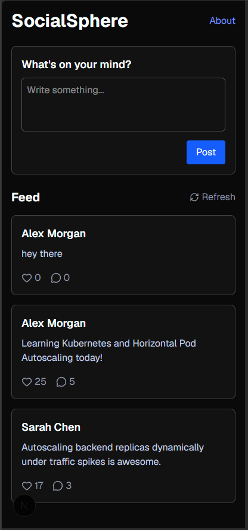
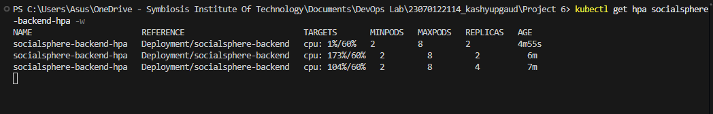

# Project 6: SocialSphere Kubernetes Autoscaling

## Overview
This project demonstrates application scalability and self-healing infrastructure using Kubernetes. We deploy a multi-tier Social Media Application (SocialSphere) with a Node.js Backend and a Next.js Frontend. It features a Horizontal Pod Autoscaler (HPA) to automatically scale backend pods based on CPU utilization during traffic spikes.

## Architecture
1. **Frontend Deployment**: Next.js application exposing the UI.
2. **Backend Deployment**: Node.js REST API with resource limits configured.
3. **Horizontal Pod Autoscaler (HPA)**: Monitors backend CPU usage and scales replicas between 2 and 8 when CPU exceeds 60%.
4. **Metrics Server**: Required in the cluster to provide resource utilization metrics.

## Prerequisites
- Docker Desktop with Kubernetes enabled (or Minikube).
- `kubectl` installed and configured.
- Metrics server deployed on the cluster.

## How to Run
1. Build the Docker images locally:
   ```bash
   docker build -t socialsphere-backend:latest ./backend/
   docker build -t socialsphere-frontend:latest ./frontend/
   ```
2. Apply the Kubernetes manifests:
   ```bash
   kubectl apply -f ./k8s/
   ```
3. Expose the services:
   ```bash
   kubectl port-forward svc/backend-service 3001:3001
   ```
4. Run a load test to trigger autoscaling:
   ```bash
   kubectl run -i --tty load-generator --rm --image=busybox:1.28 --restart=Never -- /bin/sh -c "while true; do wget -q -O- http://backend-service:3001/api/posts; done"
   ```
5. Watch the HPA scale up the pods in real-time:
   ```bash
   kubectl get hpa -w
   ```

## Execution Flow & Screenshots

### 1. Application User Interface (Frontend)
Successfully accessing the SocialSphere application in the browser after configuring the deployment.


### 2. Load Testing & HPA Scaling
Triggering the load test and observing the Horizontal Pod Autoscaler (HPA) automatically scaling the backend pods to handle the increased traffic.

