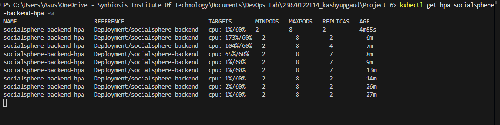

# Project 6: SocialSphere Kubernetes Autoscaling

## Overview
This project demonstrates application scalability and self-healing infrastructure using Kubernetes. We deploy a multi-tier Social Media Application (SocialSphere) with a Node.js Backend and a Next.js Frontend. It features a Horizontal Pod Autoscaler (HPA) to automatically scale backend pods based on CPU utilization during traffic spikes.

## Architecture
1. **Frontend Deployment**: Next.js application exposing the UI.
2. **Backend Deployment**: Node.js REST API with resource limits configured.
3. **Horizontal Pod Autoscaler (HPA)**: Monitors backend CPU usage and scales replicas between 2 and 8 when CPU exceeds 60%.
4. **Metrics Server**: Required in the cluster to provide resource utilization metrics.

## Detailed Step-by-Step Instructions

### Step 1: Install Metrics Server
The HPA requires the Kubernetes Metrics Server to fetch CPU utilization data.
```bash
# Apply the metrics server deployment
kubectl apply -f https://github.com/kubernetes-sigs/metrics-server/releases/latest/download/components.yaml

# Patch the deployment to allow insecure TLS (required for Docker Desktop local clusters)
kubectl patch deployment metrics-server -n kube-system --type 'json' -p '[{"op": "add", "path": "/spec/template/spec/containers/0/args/-", "value": "--kubelet-insecure-tls"}]'
```

### Step 2: Build the Docker Images
Navigate to your project directory and build the Docker images for the frontend and backend directly into your local Docker daemon.
```bash
# Build the backend image
docker build -t socialsphere-backend:latest ./backend/

# Build the frontend image
docker build -t socialsphere-frontend:latest ./frontend/
```

### Step 3: Apply Kubernetes Manifests
Deploy the ConfigMaps, Secrets, Deployments, Services, and the HPA to your cluster.
```bash
# Apply all YAML files in the k8s folder
kubectl apply -f ./k8s/

# Verify the pods are running successfully
kubectl get pods
```

### Step 4: Expose the Application Services
To access the application and send traffic to it, we need to port-forward the services to our local machine.
```bash
# In Terminal 1: Port-forward the backend
kubectl port-forward svc/backend-service 3001:3001

# In Terminal 2: Port-forward the frontend
kubectl port-forward svc/frontend-service 3000:3000
```

### Step 5: Trigger the Autoscaling (Load Test)
We use a temporary busybox pod to generate heavy HTTP traffic to the backend, forcing the CPU to spike over the 60% threshold.
```bash
# In Terminal 3: Run the load generator
kubectl run -i --tty load-generator --rm --image=busybox:1.28 --restart=Never -- /bin/sh -c "while true; do wget -q -O- http://backend-service:3001/api/posts; done"
```

### Step 6: Monitor HPA Scaling
While the load generator is running, watch the HPA dynamically scale the backend pods.
```bash
# In Terminal 4: Watch HPA and Pods
kubectl get hpa -w
kubectl get pods -w
```
When you stop the load generator, the CPU usage will drop, and Kubernetes will automatically scale down the pods after a 5-minute stabilization window.

---

## Execution Flow & Screenshots

### 1. Application User Interface (Frontend)
Successfully accessing the SocialSphere application in the browser after configuring the deployment.


### 2. Kubernetes Cluster Status
Verifying the state of the deployments, pods, and services running in the cluster.


### 3. Load Testing & HPA Scaling
Triggering the load test and observing the Horizontal Pod Autoscaler (HPA) automatically scaling the backend pods to handle the increased traffic.

