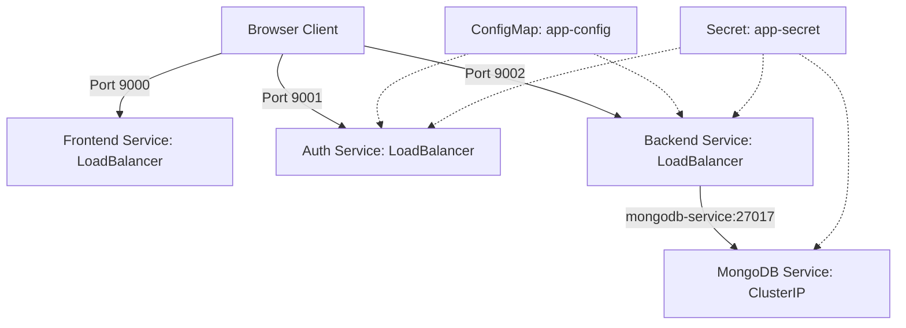
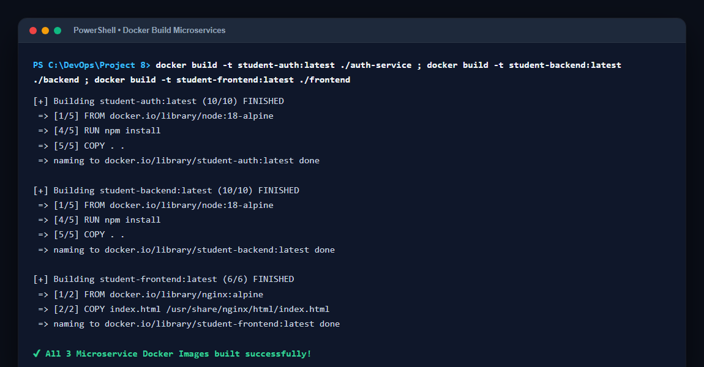
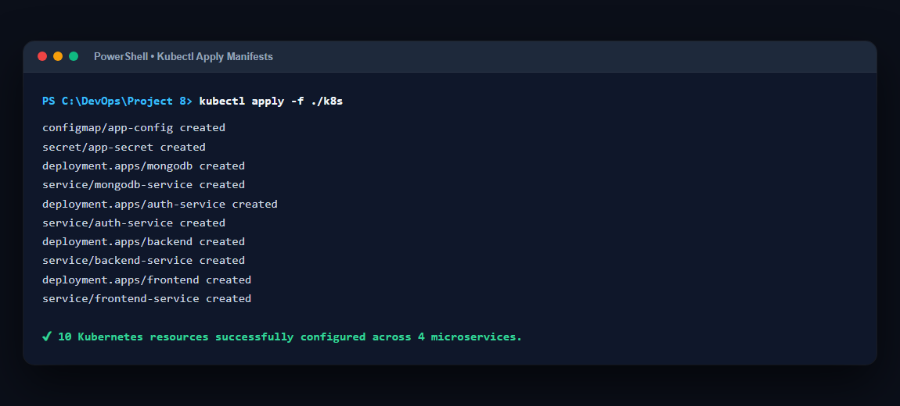
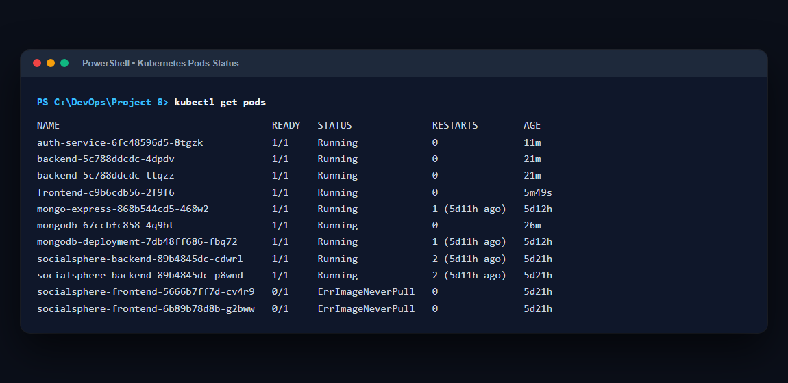
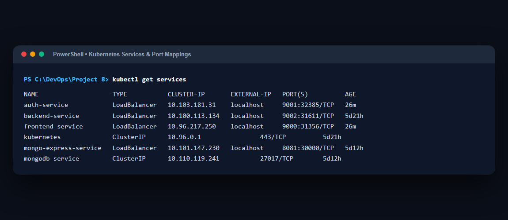
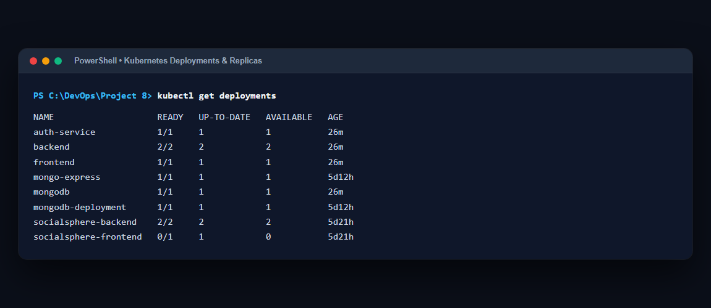
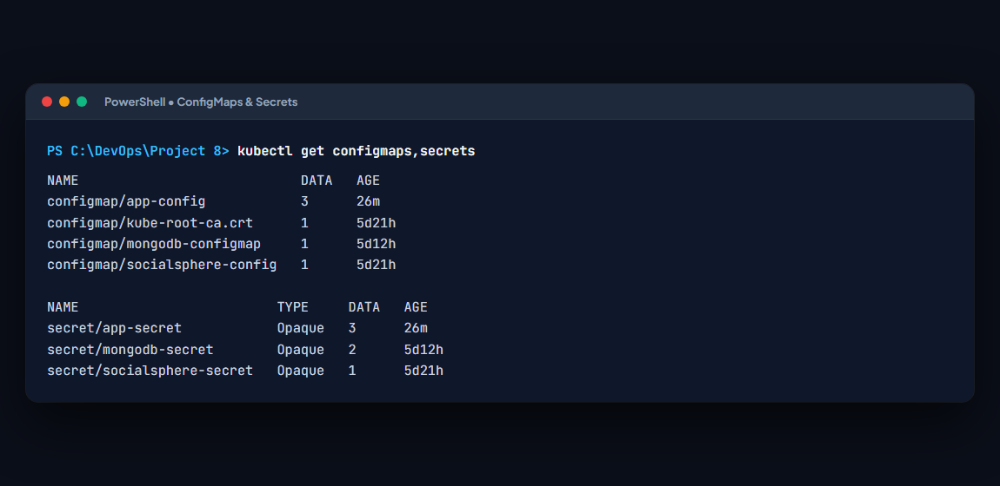
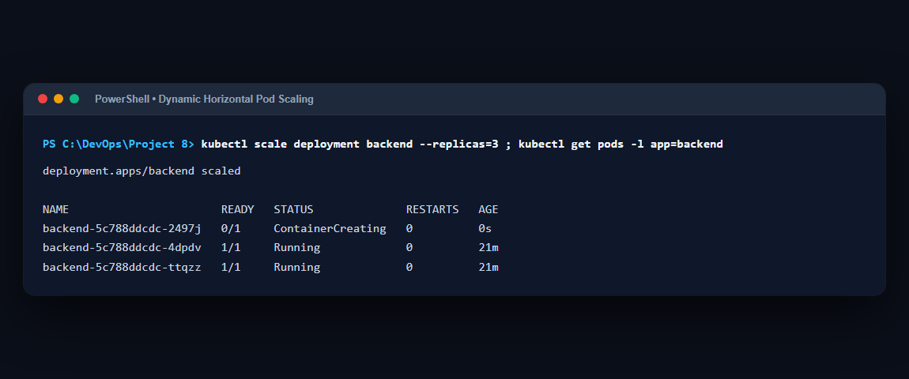
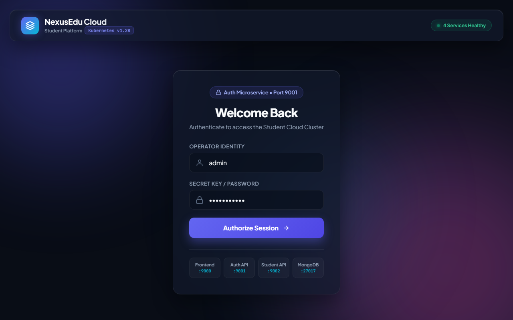
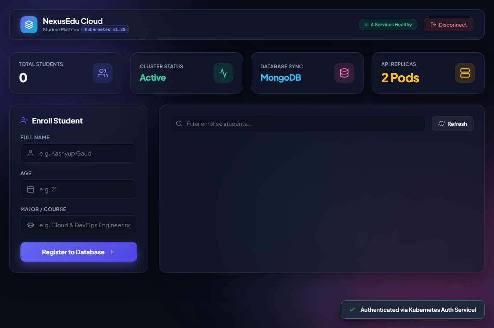

# Project 8 - Containerize a Complete Multi-Tier Application with 4 Microservices (Deployments, Services, ConfigMaps, Secrets)

**Student Name:** Kashyup Gaud  
**PRN:** 23070122114  
**Course:** DevOps Lab  

---

## 📌 Project Overview

This project demonstrates the complete containerization and orchestration of a multi-tier cloud-native application—**"Online Student Management System"**—deployed across a Kubernetes cluster. 

The application architecture consists of **4 distinct microservices**:
1. **Frontend UI** (`Nginx + HTML5/CSS3/Vanilla JS`): Futuristic glassmorphic web dashboard running on port `9000`.
2. **Authentication Service** (`Node.js + Express + JWT`): Microservice handling session authorization on port `9001`.
3. **Student API Backend** (`Node.js + Express + Mongoose`): RESTful CRUD microservice running on port `9002` with 2 replicas for load balancing.
4. **Database** (`MongoDB`): Persistent document store exposed via Kubernetes ClusterIP on port `27017`.

It also demonstrates core Kubernetes constructs:
- **Kubernetes Deployments:** Managing replica counts, rolling updates, and container lifecycles.
- **Kubernetes Services:** Service discovery (`ClusterIP` & `LoadBalancer`).
- **ConfigMaps:** Decoupling non-sensitive environment configuration (DB hosts, ports).
- **Secrets:** Securing sensitive data (MongoDB credentials, JWT secrets).
- **Scaling:** Scaling microservice replicas dynamically on demand.

---

## 🏛️ Architecture & Service Discovery



---

## 📁 Project Structure

```text
Project 8/
├── auth-service/
│   ├── Dockerfile
│   ├── package.json
│   └── server.js
├── backend/
│   ├── Dockerfile
│   ├── package.json
│   └── server.js
├── frontend/
│   ├── Dockerfile
│   └── index.html
├── k8s/
│   ├── configmap.yaml
│   ├── secret.yaml
│   ├── mongodb-deployment.yaml
│   ├── mongodb-service.yaml
│   ├── auth-deployment.yaml
│   ├── auth-service.yaml
│   ├── backend-deployment.yaml
│   ├── backend-service.yaml
│   ├── frontend-deployment.yaml
│   └── frontend-service.yaml
├── Screenshots/
└── README.md
```

---

## ⚙️ Step 1: Microservices Source Code & Dockerfiles

### 1. Authentication Service (`auth-service/`)
- **`package.json`**: Express, CORS, JSON Web Token (JWT).
- **`server.js`**: Generates signed JWT tokens upon login.
- **`Dockerfile`**:
```dockerfile
FROM node:18-alpine
WORKDIR /app
COPY package*.json ./
RUN npm install
COPY . .
EXPOSE 4000
CMD ["npm", "start"]
```

### 2. Backend Student API (`backend/`)
- **`package.json`**: Express, Mongoose, CORS.
- **`server.js`**: Connects to `mongodb-service:27017`, performs CRUD operations for student records.
- **`Dockerfile`**:
```dockerfile
FROM node:18-alpine
WORKDIR /app
COPY package*.json ./
RUN npm install
COPY . .
EXPOSE 5000
CMD ["npm", "start"]
```

### 3. Frontend Web Application (`frontend/`)
- **`index.html`**: Glassmorphic UI connecting to Auth (`:9001`) and Backend (`:9002`).
- **`Dockerfile`**:
```dockerfile
FROM nginx:alpine
COPY index.html /usr/share/nginx/html/index.html
EXPOSE 80
CMD ["nginx", "-g", "daemon off;"]
```

---

## 📦 Step 2: Build Docker Images

Build the container images locally:

```powershell
# 1. Build Authentication Service Image
cd auth-service
docker build -t student-auth:latest .
cd ..

# 2. Build Backend API Image
cd backend
docker build -t student-backend:latest .
cd ..

# 3. Build Frontend Image
cd frontend
docker build -t student-frontend:latest .
cd ..
```

*(Screenshot: Docker build output for microservices)*  


---

## 📄 Step 3: Kubernetes Manifests

### 1. `k8s/configmap.yaml`
Stores non-sensitive database connection details and backend configuration.
```yaml
apiVersion: v1
kind: ConfigMap
metadata:
  name: app-config
data:
  DATABASE_HOST: mongodb-service
  DATABASE_PORT: "27017"
  BACKEND_PORT: "5000"
```

### 2. `k8s/secret.yaml`
Stores sensitive database credentials and JWT signing keys.
```yaml
apiVersion: v1
kind: Secret
metadata:
  name: app-secret
type: Opaque
stringData:
  MONGO_USERNAME: admin
  MONGO_PASSWORD: password123
  JWT_SECRET: my_super_secret_jwt_key
```

### 3. `k8s/mongodb-deployment.yaml` & `k8s/mongodb-service.yaml`
Deploys official MongoDB image and creates internal `ClusterIP` service for DNS discovery (`mongodb-service:27017`).
```yaml
apiVersion: apps/v1
kind: Deployment
metadata:
  name: mongodb
spec:
  replicas: 1
  selector:
    matchLabels:
      app: mongodb
  template:
    metadata:
      labels:
        app: mongodb
    spec:
      containers:
      - name: mongodb
        image: mongo:latest
        ports:
        - containerPort: 27017
        env:
        - name: MONGO_INITDB_ROOT_USERNAME
          valueFrom:
            secretKeyRef:
              name: app-secret
              key: MONGO_USERNAME
        - name: MONGO_INITDB_ROOT_PASSWORD
          valueFrom:
            secretKeyRef:
              name: app-secret
              key: MONGO_PASSWORD
---
apiVersion: v1
kind: Service
metadata:
  name: mongodb-service
spec:
  selector:
    app: mongodb
  ports:
  - port: 27017
    targetPort: 27017
```

### 4. `k8s/auth-deployment.yaml` & `k8s/auth-service.yaml`
Deploys `student-auth` microservice with `LoadBalancer` port `9001`.
```yaml
apiVersion: apps/v1
kind: Deployment
metadata:
  name: auth-service
spec:
  replicas: 1
  selector:
    matchLabels:
      app: auth-service
  template:
    metadata:
      labels:
        app: auth-service
    spec:
      containers:
      - name: auth-service
        image: student-auth:latest
        imagePullPolicy: IfNotPresent
        ports:
        - containerPort: 4000
        envFrom:
        - configMapRef:
            name: app-config
        env:
        - name: JWT_SECRET
          valueFrom:
            secretKeyRef:
              name: app-secret
              key: JWT_SECRET
---
apiVersion: v1
kind: Service
metadata:
  name: auth-service
spec:
  type: LoadBalancer
  selector:
    app: auth-service
  ports:
  - port: 9001
    targetPort: 4000
```

### 5. `k8s/backend-deployment.yaml` & `k8s/backend-service.yaml`
Deploys `student-backend` with **2 replicas** and `LoadBalancer` port `9002`.
```yaml
apiVersion: apps/v1
kind: Deployment
metadata:
  name: backend
spec:
  replicas: 2
  selector:
    matchLabels:
      app: backend
  template:
    metadata:
      labels:
        app: backend
    spec:
      containers:
      - name: backend
        image: student-backend:latest
        imagePullPolicy: IfNotPresent
        ports:
        - containerPort: 5000
        envFrom:
        - configMapRef:
            name: app-config
        env:
        - name: MONGO_USERNAME
          valueFrom:
            secretKeyRef:
              name: app-secret
              key: MONGO_USERNAME
        - name: MONGO_PASSWORD
          valueFrom:
            secretKeyRef:
              name: app-secret
              key: MONGO_PASSWORD
---
apiVersion: v1
kind: Service
metadata:
  name: backend-service
spec:
  type: LoadBalancer
  selector:
    app: backend
  ports:
  - port: 9002
    targetPort: 5000
```

### 6. `k8s/frontend-deployment.yaml` & `k8s/frontend-service.yaml`
Deploys `student-frontend` Nginx pod exposed on port `9000`.
```yaml
apiVersion: apps/v1
kind: Deployment
metadata:
  name: frontend
spec:
  replicas: 1
  selector:
    matchLabels:
      app: frontend
  template:
    metadata:
      labels:
        app: frontend
    spec:
      containers:
      - name: frontend
        image: student-frontend:latest
        imagePullPolicy: IfNotPresent
        ports:
        - containerPort: 80
---
apiVersion: v1
kind: Service
metadata:
  name: frontend-service
spec:
  type: LoadBalancer
  selector:
    app: frontend
  ports:
  - port: 9000
    targetPort: 80
```

---

## 🚀 Step 4: Deploy to Kubernetes Cluster

Navigate to the `k8s/` directory and apply all manifests:

```powershell
cd k8s
kubectl apply -f .
```

*(Screenshot: Applying all Kubernetes manifest files)*  


---

## 🔍 Step 5: Verify Deployment & Kubernetes Objects

### 1. Verify Pods
```powershell
kubectl get pods
```
*(Screenshot: All 4 microservice pods running)*  


### 2. Verify Services & Port Bindings
```powershell
kubectl get services
```
*(Screenshot: ClusterIP and LoadBalancer services)*  


### 3. Verify Deployments
```powershell
kubectl get deployments
```
*(Screenshot: Deployments with replica status)*  


### 4. Verify ConfigMaps and Secrets
```powershell
kubectl get configmaps,secrets
```
*(Screenshot: ConfigMaps and Secrets created)*  


---

## 📈 Step 6: Demonstrate Kubernetes Scaling

Scale the `backend` deployment from **2 replicas to 3 replicas** to demonstrate dynamic scaling:

```powershell
kubectl scale deployment backend --replicas=3
kubectl get pods -l app=backend
```

*(Screenshot: Demonstrating pod scaling in real-time)*  


---

## 🌐 Step 7: Application Walkthrough & Inter-Service Testing

### 1. Open the Frontend Application
Navigate to **`http://localhost:9000`** in your browser.

*(Screenshot: NexusEdu login screen)*  


### 2. Authenticate with Auth Service
Enter your credentials and click **Authorize Session**. The frontend sends a POST request to `http://localhost:9001/login`, receiving a JWT token.

*(Screenshot: Successful authentication toast notification)*  


### 3. Register New Students into MongoDB via Backend API
Fill in the student details (Name, Age, Major) and click **Register to Database**. The frontend talks to `http://localhost:9002/api/students`, which in turn stores the document inside the `mongodb-service:27017` database.

*(Screenshot: Student added and displayed on dashboard)*  


---

## 🎯 Conclusion
In this project, we successfully:
1. **Containerized 4 independent microservices** using multi-stage and optimized Dockerfiles.
2. **Implemented Kubernetes Deployments** managing pod replicas and lifecycles.
3. **Established Kubernetes Services** demonstrating internal DNS service discovery (`mongodb-service:27017`) and external ingress via `LoadBalancer`.
4. **Utilized ConfigMaps and Secrets** for decoupled and secure configuration management.
5. **Demonstrated dynamic horizontal pod scaling** with `kubectl scale`.
