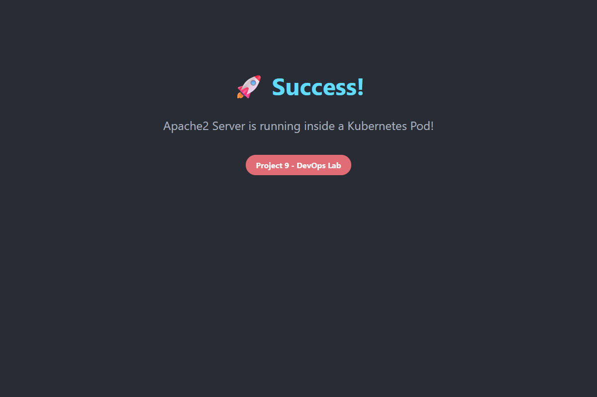

# Project 9 - Create Apache2 Server within a Deployment

**Student Name:** Kashyup Gaud  
**PRN:** 23070122114  
**Course:** DevOps Lab  

---

## 📌 Project Overview

This project demonstrates how to deploy an Apache HTTP Server (`httpd`) inside a Kubernetes cluster using a **Deployment** and expose it to the host machine using a **LoadBalancer Service**. It also utilizes a **ConfigMap** to inject a custom HTML web page into the Apache container.

### Key Kubernetes Concepts Covered:
1. **Deployments:** Managing a ReplicaSet of 2 `httpd` pods for high availability.
2. **Services (LoadBalancer):** Exposing the internal port `80` to the host machine port `8093`.
3. **ConfigMaps:** Decoupling configuration artifacts (HTML files) from the image content using volume mounts.

---

## 📁 Project Structure

```text
Project 9/
├── apache-configmap.yaml
├── apache-deployment.yaml
├── apache-service.yaml
├── Screenshots/
└── README.md
```

---

## ⚙️ Step 1: Kubernetes Manifests

### 1. `apache-configmap.yaml`
We use a ConfigMap to define a custom `index.html` page. This will be mounted directly into the Apache document root folder (`/usr/local/apache2/htdocs/`) inside the pod.

```yaml
apiVersion: v1
kind: ConfigMap
metadata:
  name: apache-configmap
data:
  index.html: |
    <!DOCTYPE html>
    <html lang="en">
    <head>
        <meta charset="UTF-8">
        <meta name="viewport" content="width=device-width, initial-scale=1.0">
        <title>Apache2 on Kubernetes</title>
        <style>
            body { font-family: 'Segoe UI', Tahoma, Geneva, Verdana, sans-serif; background-color: #282c34; color: white; text-align: center; padding-top: 100px; }
            h1 { color: #61dafb; font-size: 3rem; }
            p { font-size: 1.5rem; color: #abb2bf; }
            .badge { display: inline-block; padding: 10px 20px; background-color: #e06c75; border-radius: 20px; font-weight: bold; margin-top: 20px; }
        </style>
    </head>
    <body>
        <h1>🚀 Success!</h1>
        <p>Apache2 Server is running inside a Kubernetes Pod!</p>
        <div class="badge">Project 9 - DevOps Lab</div>
    </body>
    </html>
```

### 2. `apache-deployment.yaml`
This manifest defines a Deployment for the Apache web server. It uses the official `httpd:latest` Docker image and scales to 2 replicas.

```yaml
apiVersion: apps/v1
kind: Deployment
metadata:
  name: apache-deployment
  labels:
    app: apache
spec:
  replicas: 2
  selector:
    matchLabels:
      app: apache
  template:
    metadata:
      labels:
        app: apache
    spec:
      containers:
      - name: apache
        image: httpd:latest
        imagePullPolicy: IfNotPresent
        ports:
        - containerPort: 80
        volumeMounts:
        - name: apache-html-volume
          mountPath: /usr/local/apache2/htdocs/
      volumes:
      - name: apache-html-volume
        configMap:
          name: apache-configmap
```

### 3. `apache-service.yaml`
This Service exposes the Apache pods externally using a `LoadBalancer` which maps to port `8093` on the localhost (Docker Desktop).

```yaml
apiVersion: v1
kind: Service
metadata:
  name: apache-service
spec:
  type: LoadBalancer
  selector:
    app: apache
  ports:
    - protocol: TCP
      port: 8093
      targetPort: 80
```

---

## 🚀 Step 2: Deploy to Kubernetes Cluster

To apply the configuration, navigate to the `Project 9` folder in the terminal and execute:

```powershell
kubectl apply -f .
```

*(Screenshot: Output of kubectl apply)*  


---

## 🔍 Step 3: Verify Deployment

Check if the ConfigMap, Deployments, Pods, and Services are correctly running:

### 1. Verify Pods Status
```powershell
kubectl get pods -l app=apache
```
*(Screenshot: Pods running)*  


### 2. Verify Services & Port Bindings
```powershell
kubectl get services apache-service
```
*(Screenshot: Service exposing port 8093)*  


---

## 🌐 Step 4: Access Apache Server from Host Machine

Open your web browser and navigate to the exposed LoadBalancer port:
👉 **[http://localhost:8093](http://localhost:8093)**

You should see the custom HTML page that was dynamically injected via the Kubernetes ConfigMap, proving the Apache web server is successfully responding to traffic from the host machine!

*(Screenshot: Apache web server displaying custom UI)*  


---

## 🎯 Conclusion
In this project, we successfully:
1. Deployed an **Apache2 (`httpd`)** web server within a Kubernetes Deployment.
2. Injected custom configuration data directly into running containers using **Kubernetes ConfigMaps**.
3. Exposed the server to the external host machine network using a **Kubernetes LoadBalancer Service**.