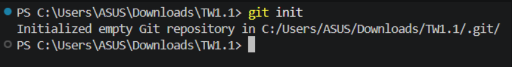
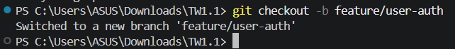
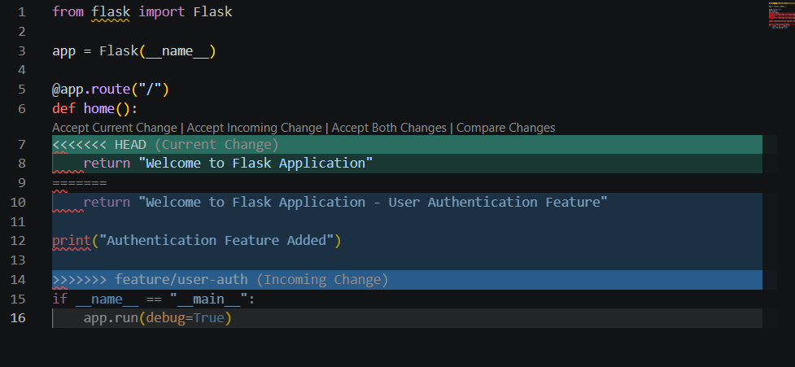
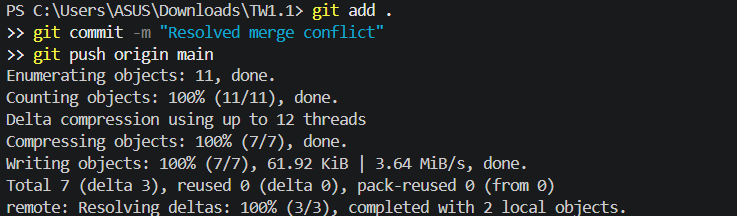

# Assignment TW1.1 – Git Workflow & Collaboration

## Student Details

- **Name:** Mohnish Kundnani
- **PRN:** 23070122142

---

## Objective

Learn the fundamentals of Git by creating a repository, working with branches, committing changes, resolving merge conflicts, and collaborating using GitHub.

---

# Task 1.1 – Initialize Git Repository

### Commands

```bash
git init
git add .
git commit -m "Initial Commit"
```

### Output

- Repository initialized successfully.
- Flask project committed to the main branch.



---

# Task 1.2 – Create Feature Branch

### Commands

```bash
git checkout -b feature/user-auth
git add .
git commit -m "Added authentication feature"
git push -u origin feature/user-auth
```

### Output

- Created a feature branch.
- Authentication feature pushed to GitHub.



---

# Task 1.3 – Merge Branch

### Commands

```bash
git checkout main
git merge feature/user-auth
```

### Merge Conflict



### Conflict Resolved

```bash
git add .
git commit -m "Resolved merge conflict"
git push origin main
```



---

# Git Commands Used

```bash
git init
git add .
git commit
git checkout
git branch
git merge
git push
```

---

# Learning Outcomes

- Understood Git repository initialization.
- Created and managed branches.
- Performed commits and pushes.
- Resolved merge conflicts.
- Practiced GitHub collaboration workflow.

---

# Conclusion

This assignment provided practical experience with Git version control, branch management, conflict resolution, and collaborative development using GitHub.
