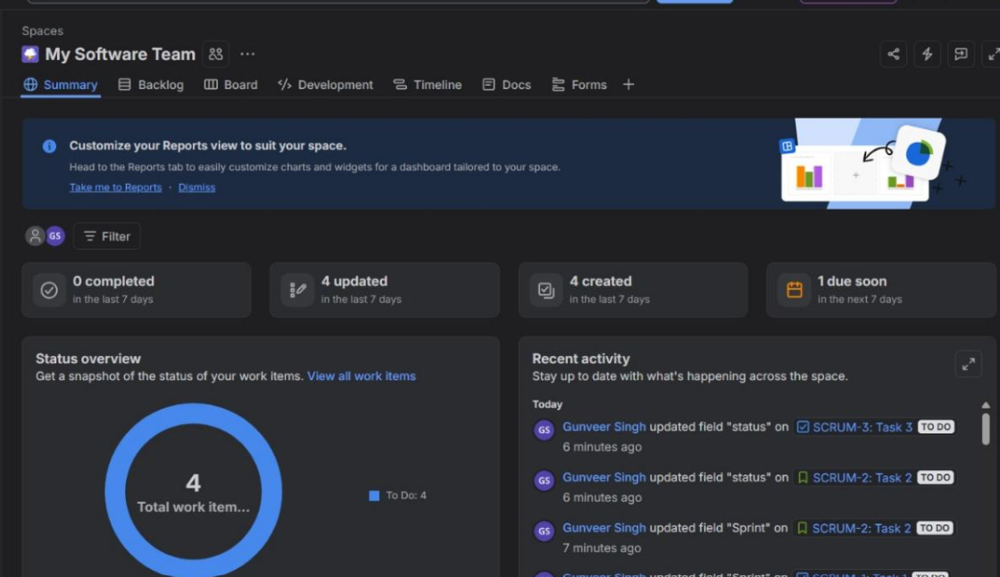
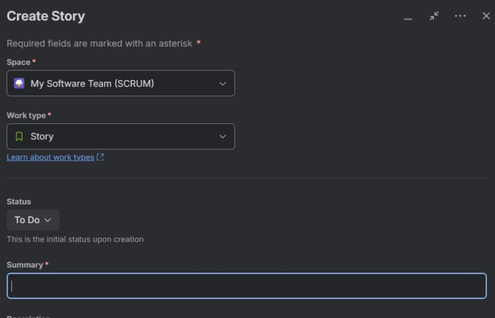
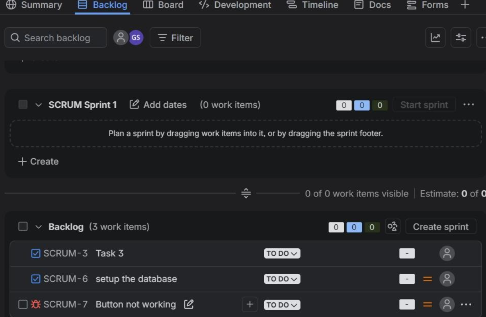

# Assignment TW1.2 – Jira Project & Issue Tracking

## Student Information

- **Name:** Mohnish Kundnani
- **PRN:** 23070122142

---

## Objective

The objective of this assignment is to gain practical knowledge of Agile project management by creating a Scrum project in Jira, adding user stories, and organizing the project backlog.

---

## Tools Used

- Jira Software (Cloud)
- GitHub
- Visual Studio Code

---

# Task 1: Create Scrum Project

### Procedure

- Logged into Jira Cloud.
- Created a new Scrum project named **Hello World**.
- Verified project dashboard, backlog, board, and timeline.

### Screenshot

---

# Task 2: Add User Stories

### Procedure

- Created multiple user stories.
- Added descriptions and priorities.
- Assigned story points where required.
- Saved all stories to the backlog.

### Screenshot

---

# Task 3: Organize Product Backlog

### Procedure

- Added project tasks to the backlog.
- Prioritized work items.
- Prepared the backlog for sprint planning.

### Screenshot

---

# Result

- Scrum project created successfully.
- User stories added and managed.
- Product backlog organized for sprint execution.
- Agile workflow successfully implemented using Jira.

---

# Learning Outcomes

- Learned how to create Scrum projects in Jira.
- Understood user story management.
- Practiced backlog prioritization.
- Gained experience with Agile project planning.

---

# Conclusion

This assignment provided hands-on experience with Jira Software and Agile practices. It improved understanding of Scrum workflows, backlog management, and user story organization used in real-world software development.
