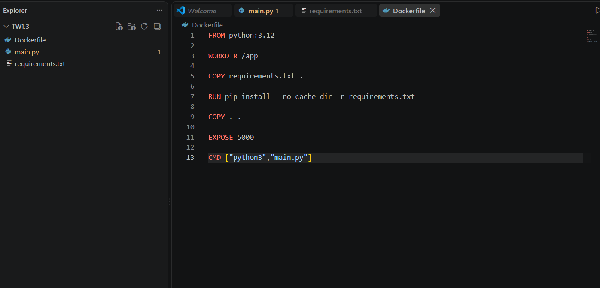
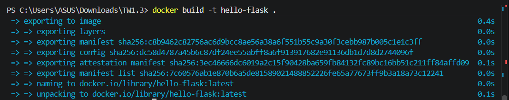
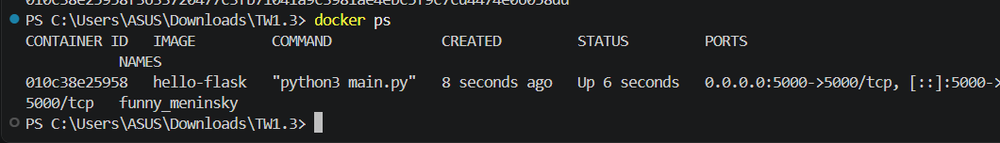
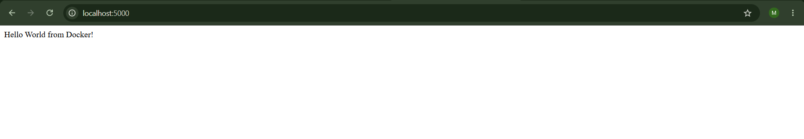
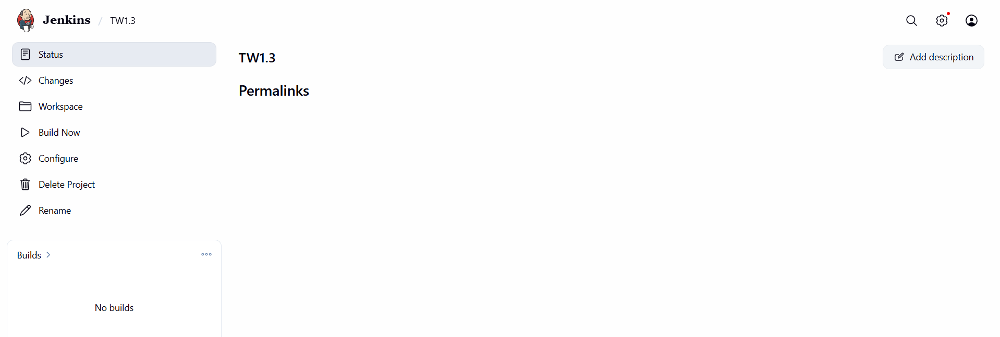
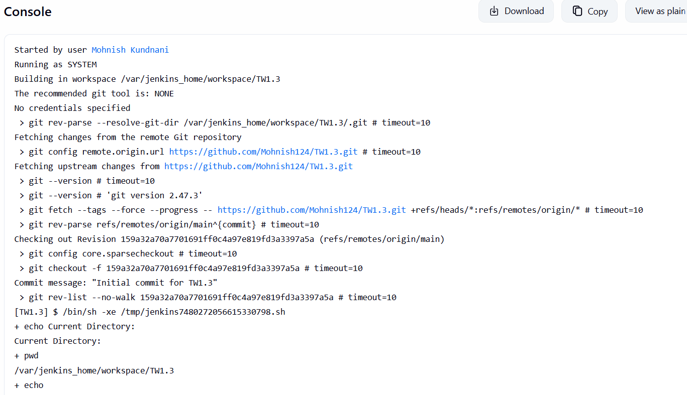

# Assignment TW1.3 – Docker Containerization & Jenkins Freestyle Project

## Student Details

- **Name:** Mohnish Kundnani
- **PRN:** 23070122142

---

# Objective

The objective of this assignment is to learn the basics of Docker by containerizing a Flask application and to understand Continuous Integration using a Jenkins Freestyle Project.

---

# Software & Tools

- Docker Desktop
- Python 3.12
- Flask
- Jenkins
- Git & GitHub
- Visual Studio Code

---

# Task 1 – Create Docker Image

A simple Flask application was created and packaged using Docker.

### Dockerfile

```dockerfile
FROM python:3.12

WORKDIR /app

COPY requirements.txt .
RUN pip install --no-cache-dir -r requirements.txt

COPY . .

EXPOSE 5000

CMD ["python3", "main.py"]
```

### Dockerfile



---

## Build Docker Image

### Command

```bash
docker build -t hello-flask .
```

### Output



---

# Task 2 – Run Docker Container

### Command

```bash
docker run -d -p 5000:5000 hello-flask
```

The container started successfully and exposed the Flask application on port **5000**.

### Running Container



---

# Task 3 – Verify Application

Open the browser and visit:

```text
http://localhost:5000
```

The Flask application was successfully accessible.



---

# Task 4 – Jenkins Freestyle Project

A Jenkins Freestyle Project was configured to clone the GitHub repository and execute shell commands.

### Shell Commands

```bash
pwd
echo
ls -la
```

### Jenkins Configuration



### Build Result

The build completed successfully without any errors.



---

# Commands Used

```bash
docker build -t hello-flask .

docker run -d -p 5000:5000 hello-flask
```

---

# Learning Outcomes

- Built a Docker image using a Dockerfile.
- Executed a Flask application inside a Docker container.
- Verified container deployment using localhost.
- Configured a Jenkins Freestyle Project.
- Connected Jenkins with a GitHub repository.
- Successfully executed the Jenkins build process.

---

# Result

The Flask application was successfully containerized using Docker and executed locally. Jenkins was configured to clone the project repository and perform the required build steps, demonstrating the basic workflow of Docker containerization and Continuous Integration.
