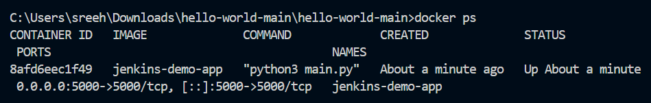
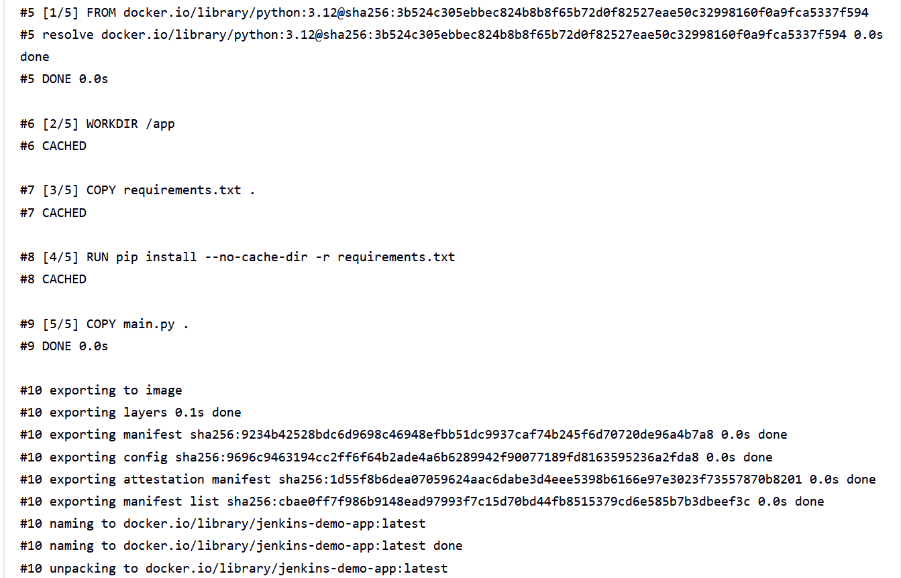

# Project 1 -- Dockerizing Jenkins Pipeline

**Student Name:** \[Your Name\]\
**PRN:** \[Your PRN\]

------------------------------------------------------------------------

# Objective

The objective of this project is to demonstrate Continuous Integration
(CI) and Continuous Delivery (CD) using Jenkins and Docker. The pipeline
automatically fetches a Flask application from GitHub, builds a Docker
image, starts a test container, verifies the application using an HTTP
request, and completes the pipeline successfully.

------------------------------------------------------------------------

# Software & Tools Used

-   Docker Desktop
-   Jenkins
-   Git & GitHub
-   Python 3.12
-   Flask
-   Visual Studio Code

------------------------------------------------------------------------

# Project Files

The project consists of the following files:

-   `main.py`
-   `Dockerfile`
-   `Jenkinsfile`
-   `requirements.txt`
-   `docker-compose.yml`
-   `README.md`

------------------------------------------------------------------------

# Project Workflow

``` text
GitHub Repository
        │
        ▼
Jenkins Pipeline
        │
        ▼
Checkout Source Code
        │
        ▼
Build Docker Image
        │
        ▼
Run Test Container
        │
        ▼
Test Flask Application
        │
        ▼
Remove Test Container
        │
        ▼
Pipeline Successful
```

------------------------------------------------------------------------

# Task 1 -- Creating Jenkins Pipeline Project

A Jenkins Pipeline project named **Project 1** was created successfully.

### Screenshot


------------------------------------------------------------------------

# Task 2 -- Pipeline Definition Using Git SCM

The pipeline was configured to obtain the Jenkinsfile directly from the
GitHub repository using **Pipeline script from SCM**.

Configuration:

-   Definition: Pipeline script from SCM
-   SCM: Git
-   Repository: `https://github.com/Sreenair-1/hello-world.git`
-   Branch: `*/main`
-   Script Path: `Jenkinsfile`

### Screenshot


------------------------------------------------------------------------

# Task 3 -- GitHub Repository Configuration

The Git repository was configured in Jenkins and the `main` branch was
selected for the pipeline.

### Screenshot


------------------------------------------------------------------------

# Task 4 -- Docker Container Running

The Flask application was successfully built into a Docker image and
executed as a Docker container.

The application container exposes port `5000`.

### Screenshot



------------------------------------------------------------------------

# Task 5 -- Flask Application Output

The Flask application was successfully accessed through the browser.

The application returned:

``` text
Hello World from Main Branch
```

### Screenshot


------------------------------------------------------------------------

# Task 6 -- Final Console Output

The repository used for the project is:

``` text
https://github.com/Sreenair-1/hello-world.git
```

### Screenshot





------------------------------------------------------------------------

# Task 10 -- Jenkinsfile

A Declarative Jenkins Pipeline was used to automate the CI/CD workflow.

The pipeline performs the following stages:

-   Checkout
-   Build Docker Image
-   Test

The Dockerized application is tested through a Docker network so that
the Jenkins container can communicate with the test container.

``` groovy
pipeline {

    agent any

    stages {

        stage('Checkout') {
            steps {
                echo 'Checking out source code...'
                checkout scm
            }
        }

        stage('Build') {
            steps {
                echo 'Building Docker image...'
                sh 'docker build -t jenkins-demo-app:latest .'
            }
        }

        stage('Test') {
            steps {
                sh '''
                    docker rm -f test-container || true

                    docker run -d \
                        --name test-container \
                        --network jenkins-network \
                        jenkins-demo-app:latest

                    sleep 5

                    curl -f http://test-container:5000/test

                    docker rm -f test-container
                '''
            }
        }
    }

    post {
        success {
            echo 'CI/CD Pipeline completed successfully!'
        }

        failure {
            echo 'CI/CD Pipeline failed!'
        }
    }
}
```

------------------------------------------------------------------------

# Application Configuration

The Flask application contains two routes.

``` python
from flask import Flask

app = Flask(__name__)

@app.route('/')
def run():
    print("User Authentication Feature Added")
    return "Hello World from Main Branch"

@app.route("/test")
def test():
    return "Application test successful"

if __name__=="__main__":
    app.run(host="0.0.0.0", port=5000)
```

The `/test` route is used by Jenkins to verify that the Dockerized Flask
application is responding correctly.

------------------------------------------------------------------------

# Dockerfile

The Flask application is packaged into a Python Docker image.

``` dockerfile
FROM python:3.12-slim

WORKDIR /app

COPY requirements.txt .

RUN pip install --no-cache-dir -r requirements.txt

COPY main.py .

EXPOSE 5000

CMD ["python", "main.py"]
```

------------------------------------------------------------------------

# Learning Outcomes

-   Configured a Jenkins Declarative Pipeline.
-   Connected Jenkins with a GitHub repository using Git SCM.
-   Automated source-code checkout from the `main` branch.
-   Built a Docker image automatically using Jenkins.
-   Created and tested a Docker container from the generated image.
-   Used Docker networking for communication between Jenkins and the
    test container.
-   Verified a Flask application using an automated HTTP test.
-   Understood the basic Continuous Integration and Continuous Delivery
    workflow.

------------------------------------------------------------------------

# Result

The Dockerizing Jenkins Pipeline was successfully implemented. Jenkins
fetched the Flask application from GitHub, checked out the source code,
built the `jenkins-demo-app:latest` Docker image, started a test
container, verified the `/test` endpoint successfully, removed the
temporary test container, and completed the pipeline with the status:

``` text
Finished: SUCCESS
```

The project successfully demonstrates an automated Jenkins-based CI/CD
workflow for a Dockerized Flask application.
