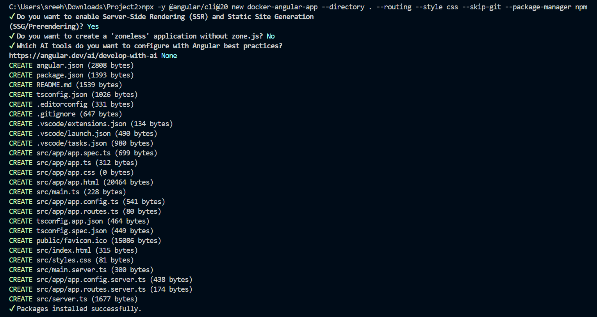
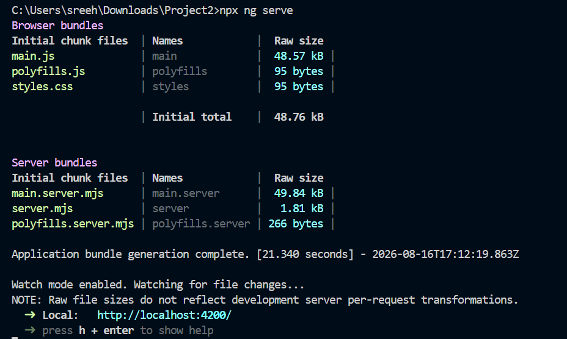
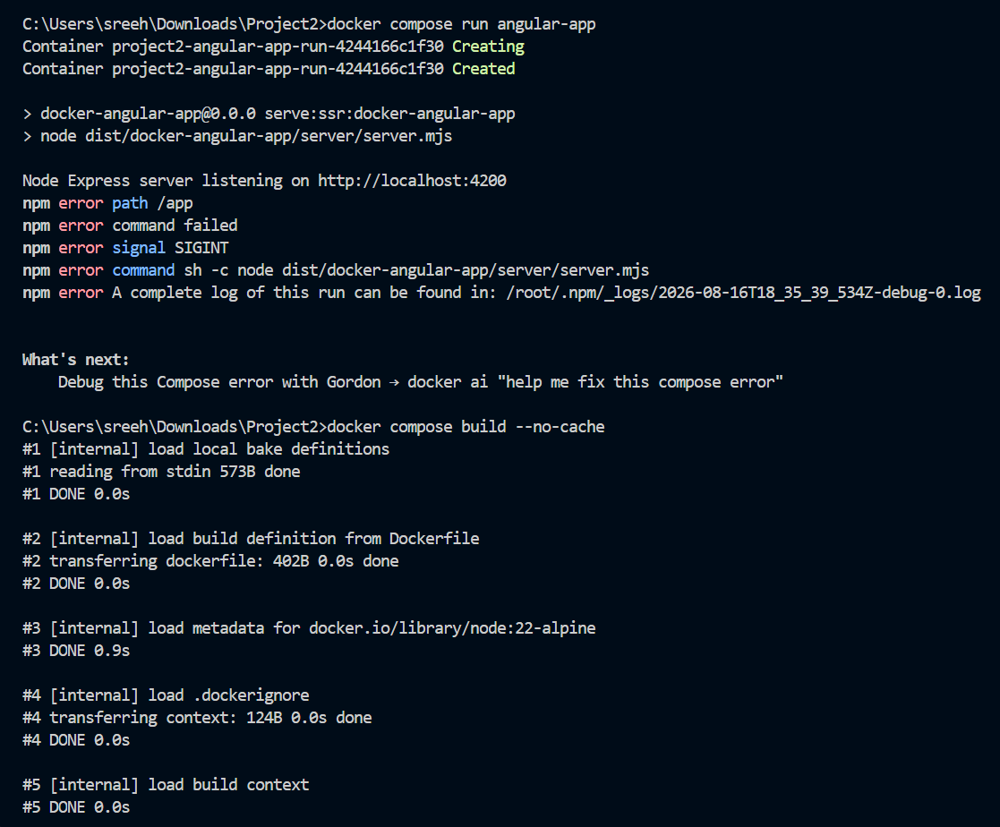
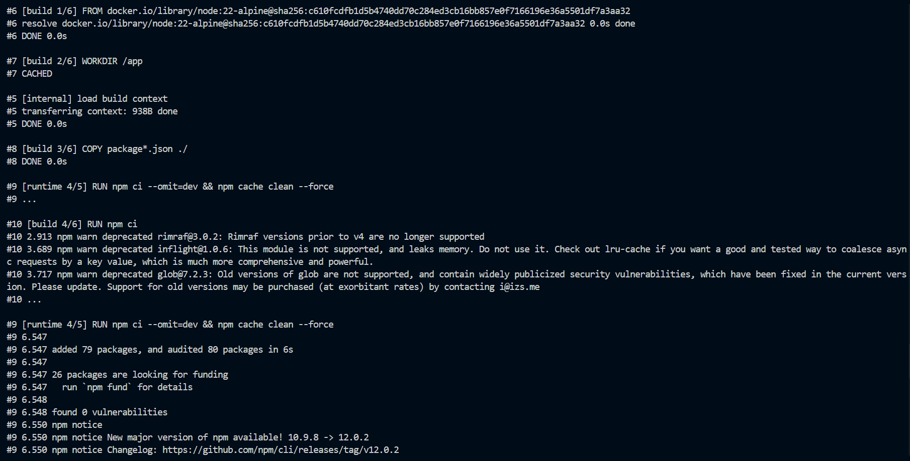
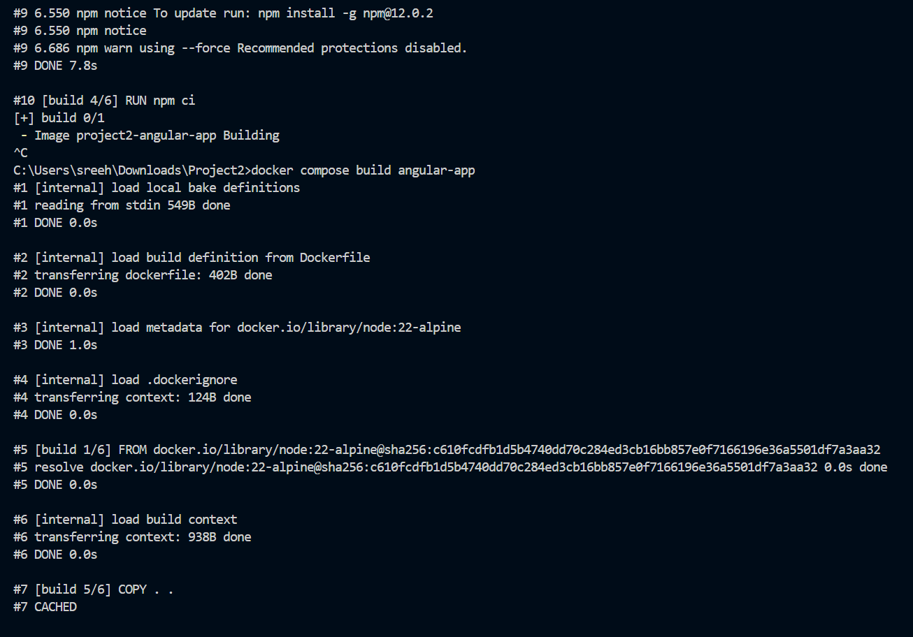
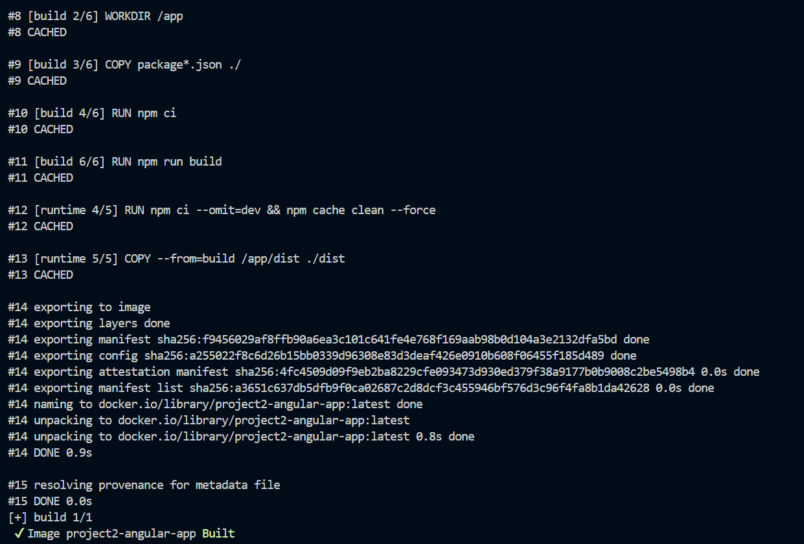

# Project 2 -- Dockerizing Angular Application

**Student Name:** Sreehari Nair
**PRN:** 23070122144

------------------------------------------------------------------------

# Objective

The objective of this project is to containerize an Angular application
using Docker and Docker Compose. The project demonstrates creating an
Angular application, running it locally, building the application inside
a Docker image, running the containerized Angular SSR application, and
verifying that the application is accessible through the browser.

------------------------------------------------------------------------

# Software & Tools Used

-   Docker Desktop
-   Docker Compose
-   Angular CLI
-   Node.js
-   npm
-   Visual Studio Code
-   Web Browser

------------------------------------------------------------------------

# Project Files

The project consists of the following files and directories:

-   `angular.json`
-   `package.json`
-   `package-lock.json`
-   `Dockerfile`
-   `docker-compose.yml`
-   `src/`
-   `public/`
-   `tsconfig.json`
-   `tsconfig.app.json`
-   `tsconfig.spec.json`
-   `README.md`

------------------------------------------------------------------------

# Project Workflow

``` text
Angular CLI
     │
     ▼
Create Angular Application
     │
     ▼
Install Dependencies
     │
     ▼
Run Angular Application Locally
     │
     ▼
Create Docker Configuration
     │
     ▼
Build Docker Image
     │
     ▼
Run Angular Application using Docker Compose
     │
     ▼
Node Express SSR Server
     │
     ▼
Access Application at localhost:4200
```

------------------------------------------------------------------------

# Task 1 -- Creating the Angular Application

A new Angular application named **docker-angular-app** was created using
Angular CLI.

The application was configured with:

-   Angular CLI 20
-   Routing enabled
-   CSS styling
-   Server-Side Rendering (SSR) and Static Site Generation enabled
-   Zone.js
-   npm package manager

### Command Executed

``` bash
npx -y @angular/cli@20 new docker-angular-app --directory . --routing --style css --skip-git --package-manager npm
```

During project creation, Server-Side Rendering (SSR) and Static Site
Generation (SSG/Prerendering) were enabled.

### Command Output

The Angular CLI generated the required application files and completed
package installation successfully.

### Screenshot



------------------------------------------------------------------------

# Task 2 -- Running the Angular Application Locally

The Angular application was started locally using the Angular
development server.

### Command Executed

``` bash
npx ng serve
```

The Angular application was successfully compiled and the browser bundle
and server bundle were generated.

The development server became available at:

``` text
http://localhost:4200/
```

### Command Output

The terminal displayed:

``` text
Application bundle generation complete.
Watch mode enabled. Watching for file changes...
Local: http://localhost:4200/
```

### Screenshot



------------------------------------------------------------------------

# Task 3 -- Verifying the Angular Application

The running Angular application was opened in a web browser using:

``` text
http://localhost:4200
```

The Angular application loaded successfully and displayed the
application interface.

### Command Used

The application was served using:

``` bash
npx ng serve
```

### Output

The browser successfully displayed:

``` text
Hello, docker-angular-app
Congratulations! Your app is running.
```

### Screenshot


------------------------------------------------------------------------

Task 4 -- Building the Docker Image

The Angular application was containerized using the project's
Dockerfile.

The Docker build process uses the Node.js 22 Alpine base image, installs
the project dependencies, builds the Angular application, and prepares
the production runtime.

Command Executed

docker compose build angular-app

For a clean build without using cached layers, the following command was
also used:

docker compose build --no-cache

Command Output

The Docker build performed the following major steps:

FROM node:22-alpine
WORKDIR /app
COPY package*.json ./
RUN npm ci
RUN npm run build
COPY --from=build /app/dist ./dist

The image was successfully created as:

project2-angular-app

Screenshots









------------------------------------------------------------------------

# Task 5 -- Running the Angular Application Using Docker Compose

After successfully building the Docker image, the Angular application
was started using Docker Compose.

### Command Executed

``` bash
docker compose run angular-app
```

Docker Compose created the required network and application container.

The Angular SSR application started using the following command inside
the container:

``` text
npm run serve:ssr:docker-angular-app
```

which runs:

``` text
node dist/docker-angular-app/server/server.mjs
```

### Command Output

The container successfully started the Node Express SSR server:

``` text
Node Express server listening on http://localhost:4200
```

### Screenshot


------------------------------------------------------------------------

# Task 6 -- Verifying the Dockerized Angular Application

The containerized Angular application was accessed through the browser
at:

``` text
http://localhost:4200
```

The application loaded successfully from the Dockerized Angular SSR
environment.

### Command Used

The application was started using:

``` bash
docker compose run angular-app
```

### Output

The Node Express server successfully listened on:

``` text
http://localhost:4200
```

The Angular application was then displayed in the browser.

### Screenshot


------------------------------------------------------------------------

# Task 7 -- Docker Image and Container Verification

The Docker Compose build successfully produced the Angular application
image:

``` text
project2-angular-app
```

The running container was created by Docker Compose and the application
was served through the Node Express SSR server.

### Commands Used

``` bash
docker compose build angular-app
```

``` bash
docker compose run angular-app
```

### Output

The Docker image was built successfully and the Angular SSR application
started successfully on port `4000`.

------------------------------------------------------------------------

# Dockerfile

The Dockerfile uses a multi-stage build approach.

The build stage installs dependencies and generates the Angular
production build. The runtime stage installs production dependencies and
copies the generated `dist` directory.

``` dockerfile
FROM node:22-alpine AS build

WORKDIR /app

COPY package*.json ./

RUN npm ci

COPY . .

RUN npm run build

FROM node:22-alpine AS runtime

WORKDIR /app

COPY package*.json ./

RUN npm ci --omit=dev && npm cache clean --force

COPY --from=build /app/dist ./dist

EXPOSE 4200

CMD ["npm", "run", "serve:ssr:docker-angular-app"]
```

------------------------------------------------------------------------

# Docker Compose Configuration

Docker Compose was used to build and run the Angular application.

``` yaml
services:
  angular-app:
    build:
      context: .
      dockerfile: Dockerfile
    image: project2-angular-app
    ports:
      - "4200:4200"
```

------------------------------------------------------------------------

# Important Commands Used

### Create Angular Application

``` bash
npx -y @angular/cli@20 new docker-angular-app --directory . --routing --style css --skip-git --package-manager npm
```

### Run Angular Locally

``` bash
npx ng serve
```

### Build Docker Image

``` bash
docker compose build angular-app
```

### Build Without Cache

``` bash
docker compose build --no-cache
```

### Run Dockerized Application

``` bash
docker compose run angular-app
```

### Access Application

``` text
http://localhost:4000
```

------------------------------------------------------------------------

# Learning Outcomes

-   Created an Angular application using Angular CLI.
-   Configured Angular Server-Side Rendering (SSR).
-   Ran and verified an Angular application locally.
-   Created a multi-stage Dockerfile for an Angular application.
-   Installed Node.js dependencies inside a Docker build.
-   Built an optimized Angular production image.
-   Used Docker Compose to build and run the application.
-   Ran an Angular SSR application using Node Express inside a
    container.
-   Verified the Dockerized application through a web browser.
-   Understood the basic process of containerizing a modern Angular
    application.

------------------------------------------------------------------------

# Result

The Angular application was successfully created, built, containerized,
and executed using Docker and Docker Compose. The Docker image
`project2-angular-app` was generated successfully, and the Angular SSR
application was started through the Node Express server.

The application was successfully accessible at:

``` text
http://localhost:4000
```

Thus, the project successfully demonstrates the process of **Dockerizing
and running an Angular SSR application using Docker Compose**.
