# Project 4 -- Distributed Jenkins CI Pipeline for Maven Java Application

**Student Name:** Sreehari Nair  
**PRN:** 23070122144  

------------------------------------------------------------------------

# Objective

The objective of this project is to design and implement a distributed
Continuous Integration (CI) pipeline using Jenkins and Apache Maven for a
Java application. The pipeline pulls the application source code from a
remote GitHub repository, distributes the build lifecycle across
multiple connected Jenkins agent nodes (executing Build and Package on
Agent-1 and Test on Agent-2), runs automated unit tests with JUnit 5, and
packages the application into an executable JAR artifact.

------------------------------------------------------------------------

# Software & Tools Used

-   Jenkins (Controller and Distributed Inbound Agents)
-   Apache Maven 3.9.9
-   Java SE Development Kit (JDK 21)
-   Git & GitHub
-   JUnit 5 (Jupiter)
-   Visual Studio Code
-   Windows PowerShell

------------------------------------------------------------------------

# Project Files

The project consists of the following files and directories:

-   `app/`
    -   `src/main/java/com/devops/student/GradeService.java`
    -   `src/main/java/com/devops/student/StudentApp.java`
    -   `src/test/java/com/devops/student/GradeServiceTest.java`
    -   `pom.xml`
-   `Screenshots/`
-   `Jenkinsfile`
-   `.gitignore`
-   `README.md`

------------------------------------------------------------------------

# Pipeline Architecture & Workflow

``` text
                     GitHub Repository
               (https://github.com/Sreenair-1/Project_4)
                            │
                            ▼
                    Jenkins Controller
                 (http://localhost:8080)
                            │
                  ┌─────────┴─────────┐
                  │                   │
                  ▼                   ▼
               Agent-1             Agent-2
          (Build & Package)        (Test)
                  │                   │
                  └─────────┬─────────┘
                            ▼
                      Build Success
                   (app-1.0-SNAPSHOT.jar)
```

The distributed pipeline assigns the execution workload across the nodes
as follows:

-   **Jenkins Controller:** Orchestrates the pipeline stages, pulls the
    Jenkinsfile, and delegates execution.
-   **Agent-1 (`agent-1`):** Executes **Stage 1 (Build)** to compile
    source code and **Stage 3 (Package)** to generate the JAR archive.
-   **Agent-2 (`agent-2`):** Executes **Stage 2 (Test)** to run the
    automated JUnit 5 unit test suite.

------------------------------------------------------------------------

# Task 1 -- Verifying Maven Environment and Local Application Build

The Maven environment was verified locally to confirm the installed
version and runtime JDK configuration.

### Command Executed

``` bash
mvn -version
```

### Command Output

``` text
Apache Maven 3.9.9 (8e8579a9e76f7d015ee5ec7bfcdc97d260186937)
Maven home: C:\Program Files\JetBrains\IntelliJ IDEA Community Edition 2023.2\plugins\maven\lib\maven3
Java version: 21.0.5, vendor: Oracle Corporation, runtime: C:\Program Files\Java\jdk-21
Default locale: en_US, platform encoding: UTF-8
OS name: "windows 11", version: "10.0", arch: "amd64", family: "windows"
```

### Screenshot

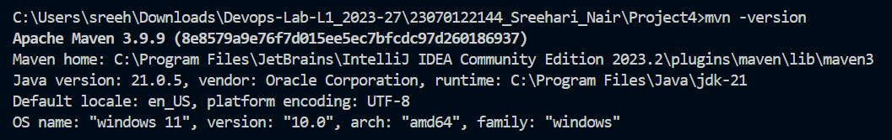

The Java Maven application (`app`) was then built and tested locally
using `mvn clean package`.

### Command Executed

``` bash
cd app
mvn clean package
```

### Command Output

Maven compiled the Java source files, executed all 9 unit tests with 0
failures, and generated the JAR artifact:

``` text
[INFO] Scanning for projects...
[INFO] -----------------< com.devops.student:app >-----------------
[INFO] Building app 1.0-SNAPSHOT
[INFO] --------------------------------[ jar ]---------------------------------
[INFO] --- clean:3.2.0:clean (default-clean) @ app ---
[INFO] --- compiler:3.11.0:compile (default-compile) @ app ---
[INFO] Compiling 2 source files with javac [debug target 17] to target\classes
[INFO] --- surefire:3.2.5:test (default-test) @ app ---
[INFO] Running com.devops.student.GradeServiceTest
[INFO] Tests run: 9, Failures: 0, Errors: 0, Skipped: 0
[INFO] Results:
[INFO] Tests run: 9, Failures: 0, Errors: 0, Skipped: 0
[INFO] --- jar:3.3.0:jar (default-jar) @ app ---
[INFO] Building jar: ...\target\app-1.0-SNAPSHOT.jar
[INFO] ------------------------------------------------------------------------
[INFO] BUILD SUCCESS
[INFO] ------------------------------------------------------------------------
```

### Screenshots

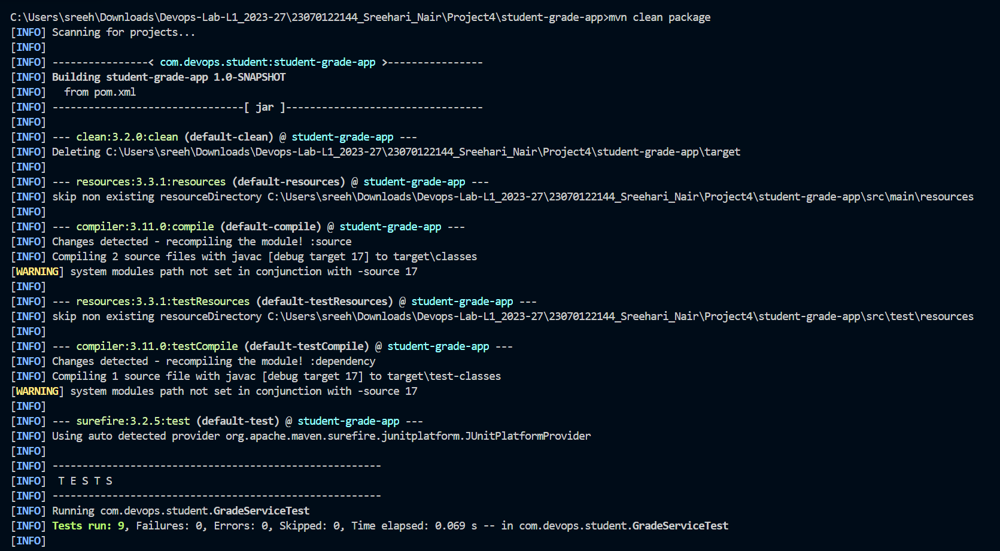

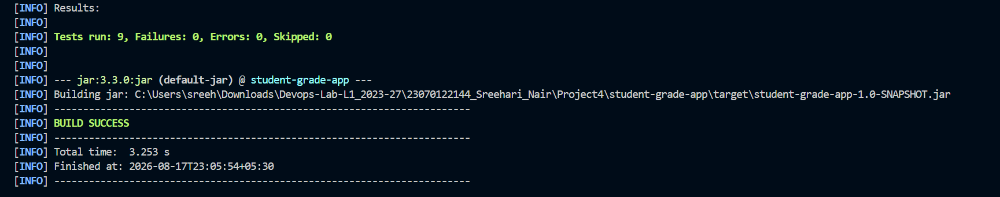

------------------------------------------------------------------------

# Task 2 -- Project Structure and Source Code Verification

The directory structure of `Project4` was verified in Visual Studio
Code, showing the Java source files, unit tests, Maven POM, Jenkinsfile,
and Screenshots directory.

### Screenshot


------------------------------------------------------------------------

# Task 3 -- Jenkins Agent 1 Node Creation and Configuration

A permanent agent node named `agent-1` was created in the Jenkins
Controller to handle the Build and Package stages.

The agent was configured with:

-   **Node name:** `agent-1`
-   **Type:** Permanent Agent
-   **Number of executors:** `1`
-   **Remote root directory:** `jenkins-agent-1`
-   **Labels:** `agent-1`
-   **Usage:** Use this node as much as possible
-   **Launch method:** Launch agent by connecting it to the controller
    (Inbound agent)

### Screenshot

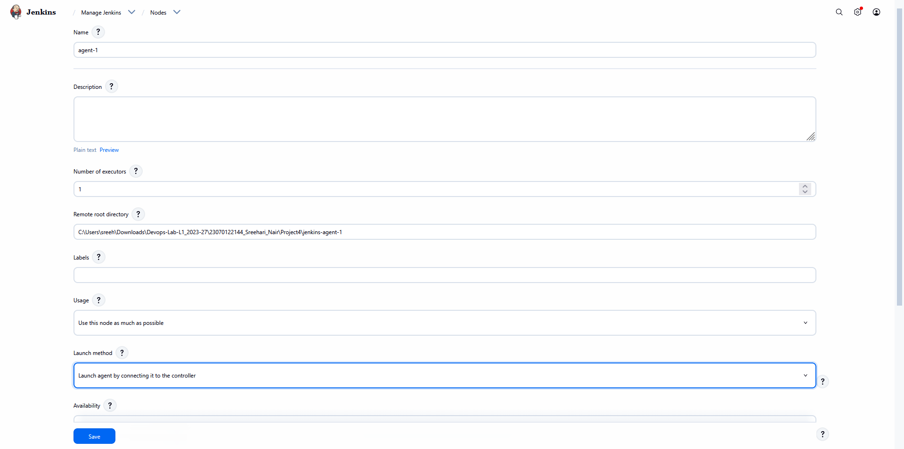

------------------------------------------------------------------------

# Task 4 -- Connecting Jenkins Agent 1 Node

The `agent.jar` launcher was downloaded from the Jenkins Controller and
executed inside a PowerShell terminal to connect `agent-1` over
WebSocket.

### Command Executed

``` powershell
curl.exe -sO http://localhost:8080/jnlpJars/agent.jar & java -jar agent.jar -url http://localhost:8080/ -secret 8936d903ef79adfd53f14186979d1b9ca8dbd1fec0a93d7791594ee86312e727 -name "agent-1" -webSocket -workDir "C:\Users\sreeh\Downloads\Devops-Lab-L1_2023-27\23070122144_Sreehari_Nair\Project4\jenkins-agent-1"
```

### Command Output

``` text
INFO: Using remoting work directory
INFO: Setting up agent: agent-1
INFO: Using Remoting version: 3355.v388858a_47b_33
INFO: WebSocket connection open
INFO: Connected
```

### Screenshots

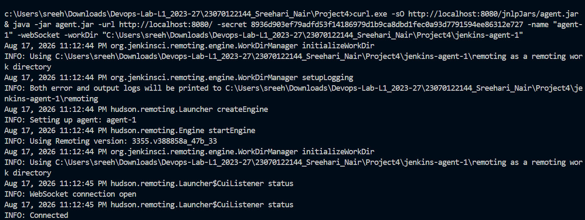


------------------------------------------------------------------------

# Task 5 -- Jenkins Agent 2 Node Creation and Configuration

A second permanent agent node named `agent-2` was created in the Jenkins
Controller to handle the Test stage.

The agent was configured with:

-   **Node name:** `agent-2`
-   **Type:** Permanent Agent
-   **Number of executors:** `1`
-   **Remote root directory:** `jenkins-agent-2`
-   **Labels:** `agent-2`
-   **Usage:** Use this node as much as possible
-   **Launch method:** Launch agent by connecting it to the controller

### Screenshot

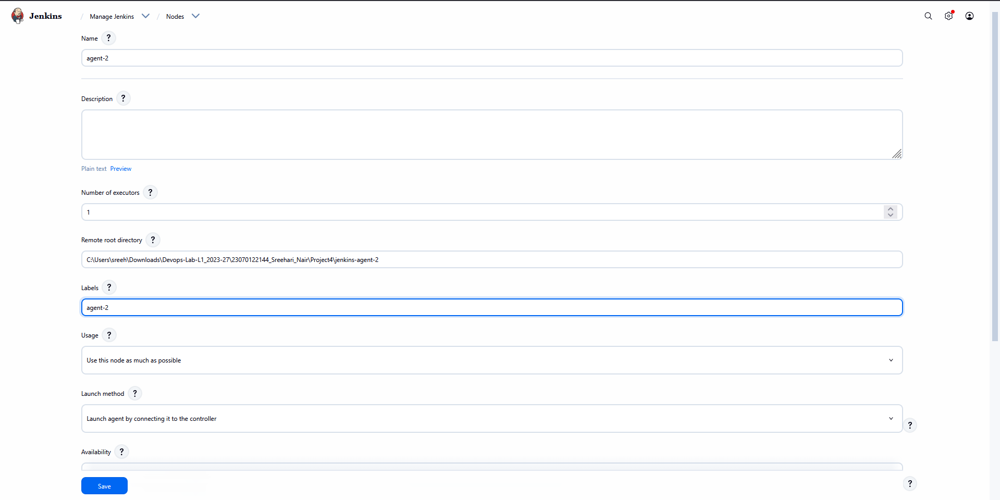

------------------------------------------------------------------------

# Task 6 -- Connecting Jenkins Agent 2 Node

A second PowerShell terminal was opened to start and connect `agent-2` to
the Jenkins Controller.

### Command Executed

``` powershell
curl.exe -sO http://localhost:8080/jnlpJars/agent.jar & java -jar agent.jar -url http://localhost:8080/ -secret 6c6e490524dc81adae1cd65924d561d1d574d2cec2f1f6a2febbb4f148775b1b -name "agent-2" -webSocket -workDir "C:\Users\sreeh\Downloads\Devops-Lab-L1_2023-27\23070122144_Sreehari_Nair\Project4\jenkins-agent-2"
```

### Command Output

``` text
INFO: Using remoting work directory
INFO: Setting up agent: agent-2
INFO: Using Remoting version: 3355.v388858a_47b_33
INFO: WebSocket connection open
INFO: Connected
```

### Screenshots

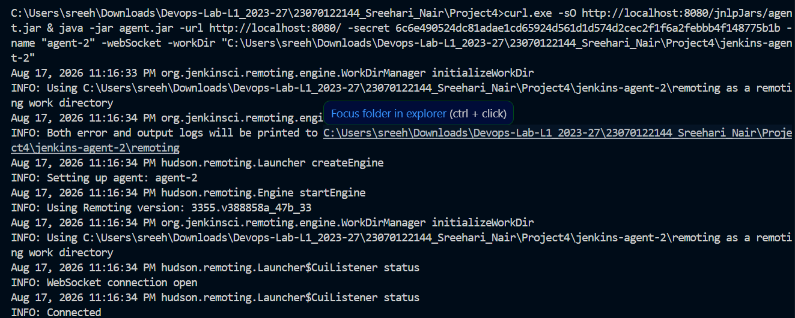

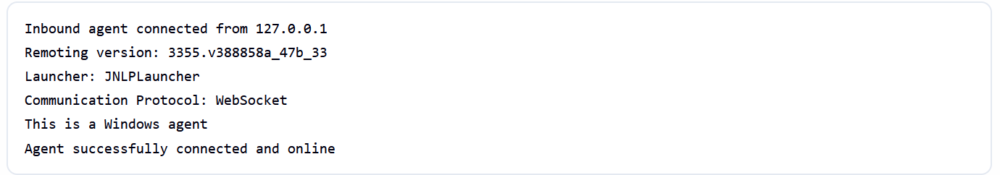

------------------------------------------------------------------------

# Task 7 -- Jenkins Distributed Nodes Dashboard Verification

The Jenkins Nodes management dashboard (`/computer/`) was inspected to
verify that the Built-In Node, `agent-1`, and `agent-2` were all online,
synchronized, and available for job execution.

### Screenshot

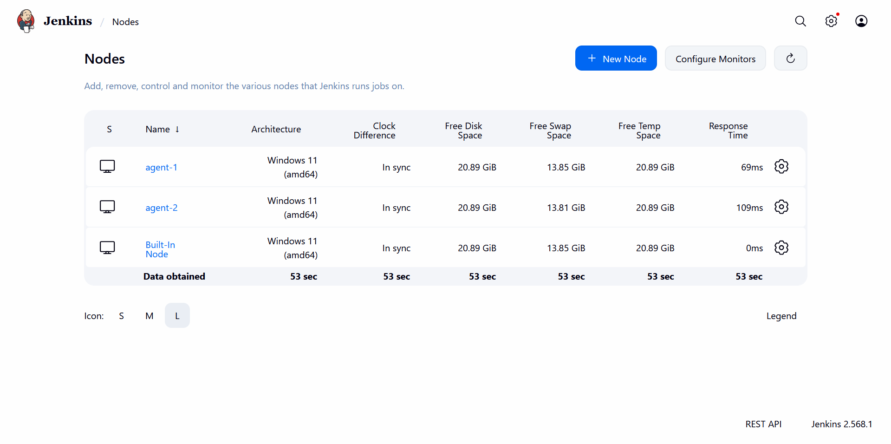

------------------------------------------------------------------------

# Task 8 -- Jenkins Pipeline Job Creation and SCM Configuration

A new Jenkins Pipeline job named `Project_4` was created and configured
to load the Declarative Pipeline script from GitHub SCM.

The pipeline job was configured with:

-   **Definition:** Pipeline script from SCM
-   **SCM:** Git
-   **Repository URL:** `https://github.com/Sreenair-1/Project_4.git`
-   **Branch Specifier:** `*/main`
-   **Script Path:** `Jenkinsfile`

### Jenkinsfile Pipeline Code

``` groovy
pipeline {
    agent none

    stages {

        stage('Build') {
            agent { label 'agent-1' }

            steps {
                git branch: 'main',
                    url: 'https://github.com/Sreenair-1/Project_4.git'

                dir('app') {
                    bat 'mvn clean compile'
                }
            }
        }

        stage('Test') {
            agent { label 'agent-2' }

            steps {
                git branch: 'main',
                    url: 'https://github.com/Sreenair-1/Project_4.git'

                dir('app') {
                    bat 'mvn test'
                }
            }
        }

        stage('Package') {
            agent { label 'agent-1' }

            steps {
                git branch: 'main',
                    url: 'https://github.com/Sreenair-1/Project_4.git'

                dir('app') {
                    bat 'mvn package'
                }
            }
        }
    }
}
```

### Screenshot

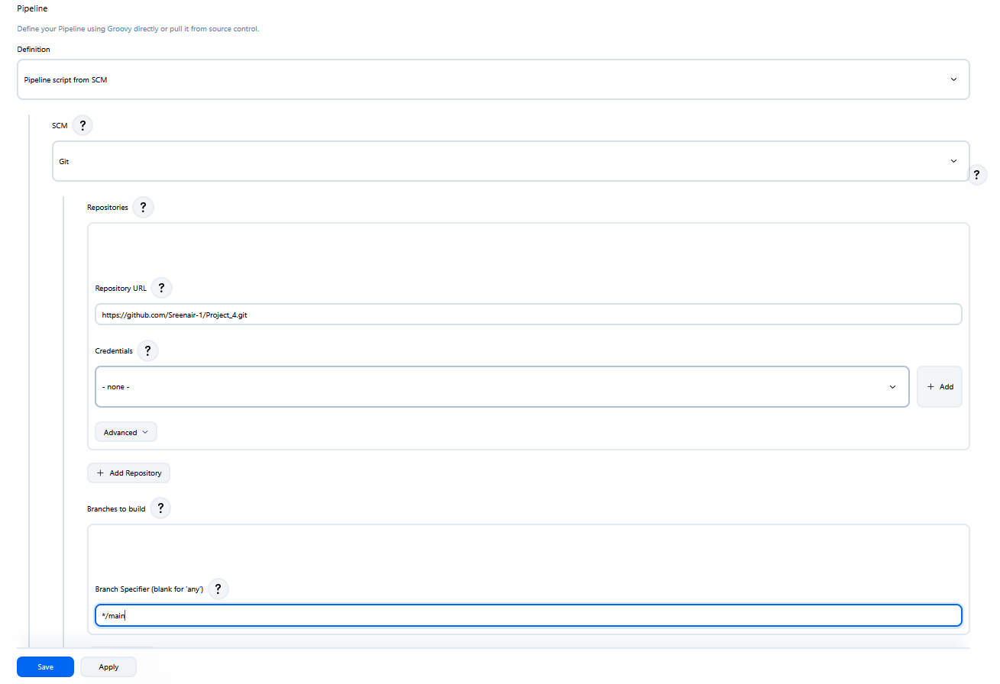

------------------------------------------------------------------------

# Task 9 -- Executing Distributed Pipeline Build

The pipeline was executed using **Build Now**. Jenkins scheduled and
distributed each stage to the target agent node:

-   **Build Stage:** Assigned to `agent-1` (Duration: 13s)
-   **Test Stage:** Assigned to `agent-2` (Duration: 13s)
-   **Package Stage:** Assigned to `agent-1` (Duration: 10s)

All stages completed successfully with green checkmarks.

### Screenshot

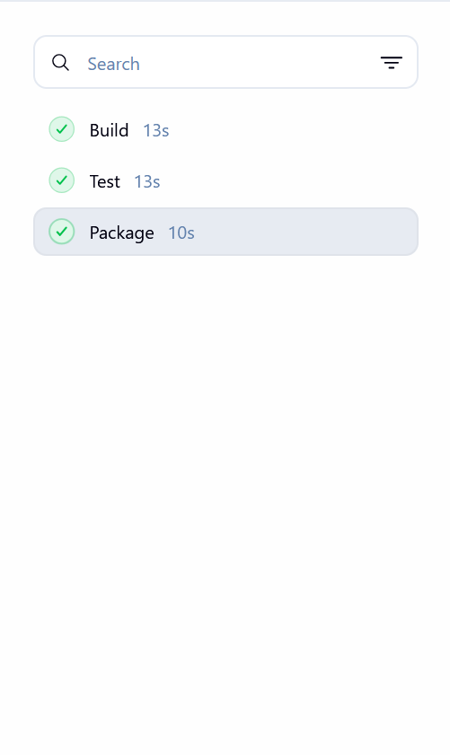

------------------------------------------------------------------------

# Task 10 -- Verifying Pipeline Console Output and Build Success

The build console output was verified to ensure that the stages executed
on the designated agent workspaces, JUnit 5 unit tests completed without
errors, and the JAR artifact was successfully built.

### Console Summary

``` text
[INFO] Results:
[INFO] 
[INFO] Tests run: 9, Failures: 0, Errors: 0, Skipped: 0
[INFO] 
[INFO] --- jar:3.3.0:jar (default-jar) @ app ---
[INFO] Building jar: ...\jenkins-agent-1\workspace\Project_4\app\target\app-1.0-SNAPSHOT.jar
[INFO] BUILD SUCCESS
[INFO] Total time: 3.468 s
[INFO] Finished at: 2026-08-17T23:20:35+05:30
[Pipeline] End of Pipeline
Finished: SUCCESS
```

### Screenshot

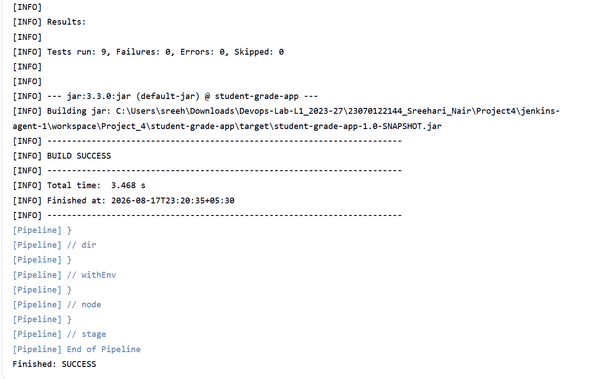

------------------------------------------------------------------------

# Conclusion

This project successfully demonstrated the implementation of a
distributed Continuous Integration (CI) pipeline using Jenkins and
Apache Maven for a Java application. By delegating the Build and Package
stages to **Agent-1** and the Test stage to **Agent-2**, the project
showcased effective workload distribution, automated testing, and
artifact generation in a distributed multi-node CI/CD environment.
