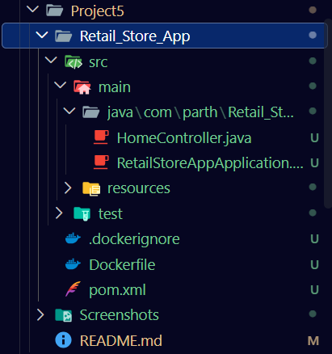
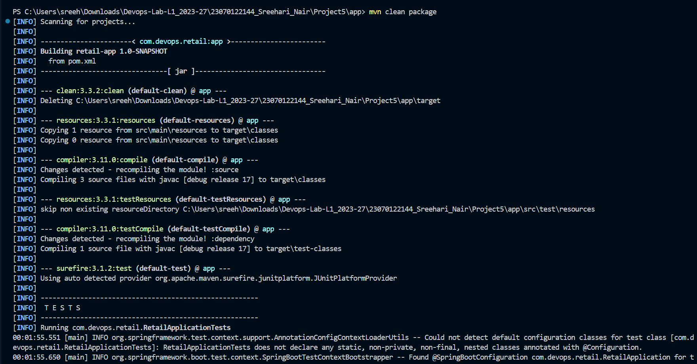
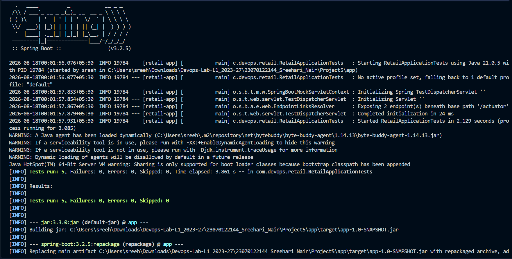
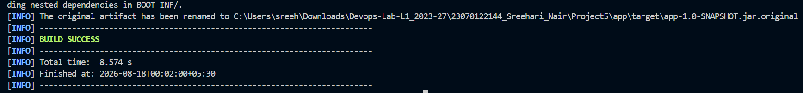
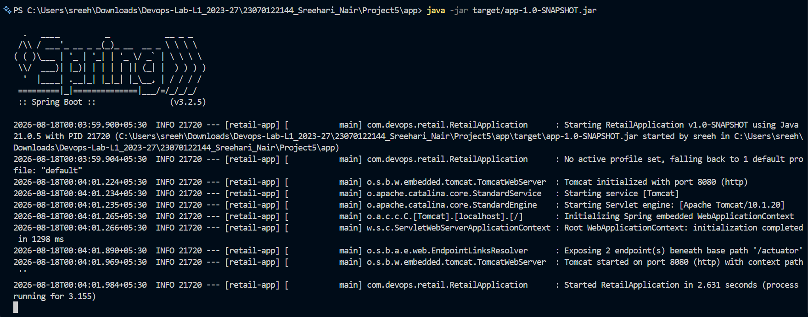
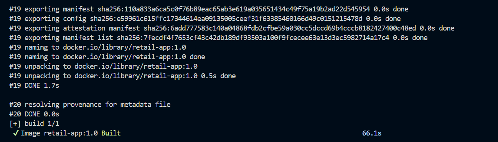
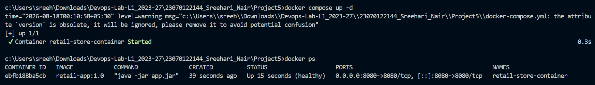
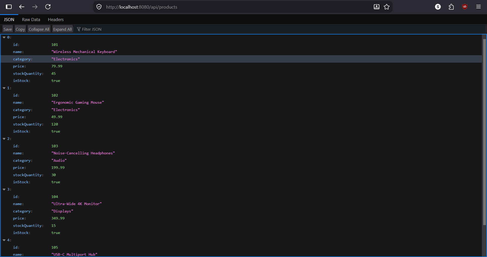

# Project 5 -- Containerizing Spring Boot Retail Application and Docker Deployment

**Student Name:** Sreehari Nair  
**PRN:** 23070122144  

------------------------------------------------------------------------

# Objective

The objective of this project is to containerize an enterprise-grade
Spring Boot retail web application using Docker and Docker Compose. The
project demonstrates building a RESTful microservice with Spring Boot 3
and Java 21, verifying compilation and unit tests with Apache Maven,
running the service locally on port 8080, packaging the application into a
multi-stage production Docker image, orchestrating container deployment with
Docker Compose, and verifying live API endpoints across the browser.

------------------------------------------------------------------------

# Software & Tools Used

-   Spring Boot 3.2.5
-   Java SE Development Kit (JDK 21 & JDK 17)
-   Apache Maven 3.9.9
-   Docker Desktop (Docker Engine 29+)
-   Docker Compose
-   JUnit 5 & Spring MockMvc
-   Visual Studio Code
-   Web Browser & Windows PowerShell

------------------------------------------------------------------------

# Project Files

The project consists of the following files and directories:

-   `app/`
    -   `src/main/java/com/devops/retail/RetailApplication.java`
    -   `src/main/java/com/devops/retail/model/Product.java`
    -   `src/main/java/com/devops/retail/controller/RetailController.java`
    -   `src/main/resources/application.properties`
    -   `src/test/java/com/devops/retail/RetailApplicationTests.java`
    -   `pom.xml`
-   `Dockerfile`
-   `docker-compose.yml`
-   `.dockerignore`
-   `.gitignore`
-   `Screenshots/`
-   `README.md`

------------------------------------------------------------------------

# Container Architecture & Workflow

``` text
Spring Boot Retail Source Code (Java 21 / 17)
                     │
                     ▼
         Local Build & JUnit Tests
           (mvn clean package)
                     │
                     ▼
       Executable Spring Boot Fat JAR
          (app-1.0-SNAPSHOT.jar)
                     │
                     ▼
          Multi-Stage Dockerfile
 ┌────────────────────────────────────────┐
 │ Stage 1 (Build) : maven:3.9.6-temurin-17│
 │ Stage 2 (Run)   : temurin:17-jre-alpine│
 └────────────────────────────────────────┘
                     │
                     ▼
      Docker Image: retail-app:1.0
                     │
                     ▼
               Docker Compose
          (docker compose up -d)
                     │
                     ▼
        retail-store-container (Port 8080)
                     │
         ┌───────────┴───────────┐
         │                       │
         ▼                       ▼
http://localhost:8080   http://localhost:8080
    /api/products           /api/inventory
```

------------------------------------------------------------------------

# Task 1 -- Project Structure and Source Code Verification

The Spring Boot retail application directory structure was established and
verified in Visual Studio Code. The project contains the REST controllers,
data models, integration tests, Maven POM, multi-stage Dockerfile, and
Docker Compose configuration.

### Screenshot



------------------------------------------------------------------------

# Task 2 -- Maven Clean & Package Build Execution

The Spring Boot application was compiled and tested locally using Apache
Maven from the `app` directory to prepare the application artifact.

### Command Executed

``` powershell
cd c:\Users\sreeh\Downloads\Devops-Lab-L1_2023-27\23070122144_Sreehari_Nair\Project5\app
mvn clean package
```

### Command Output

Maven initiated the clean build lifecycle, compiling 3 Java source files
and executing unit tests:

``` text
[INFO] Scanning for projects...
[INFO] -----------------------< com.devops.retail:app >-----------------------
[INFO] Building retail-app 1.0-SNAPSHOT
[INFO] --------------------------------[ jar ]---------------------------------
[INFO] --- clean:3.3.2:clean (default-clean) @ app ---
[INFO] Deleting ...\Project5\app\target
[INFO] --- compiler:3.11.0:compile (default-compile) @ app ---
[INFO] Compiling 3 source files with javac [debug release 17] to target\classes
[INFO] --- surefire:3.1.2:test (default-test) @ app ---
[INFO] Running com.devops.retail.RetailApplicationTests
```

### Screenshot



------------------------------------------------------------------------

# Task 3 -- Spring Boot Unit & Integration Tests Execution

The Spring Boot test context initialized and executed all integration
and endpoint test cases using JUnit 5 and MockMvc.

### Test Output

``` text
  .   ____          _            __ _ _
 /\\ / ___'_ __ _ _(_)_ __  __ _ \ \ \ \
( ( )\___ | '_ | '_| | '_ \/ _` | \ \ \ \
 \\/  ___)| |_)| | | | | || (_| |  ) ) ) )
  '  |____| .__|_| |_|_| |_\__, | / / / /
 =========|_|==============|___/=/_/_/_/
 :: Spring Boot ::                (v3.2.5)

[INFO] Tests run: 5, Failures: 0, Errors: 0, Skipped: 0
[INFO] Results:
[INFO] Tests run: 5, Failures: 0, Errors: 0, Skipped: 0
[INFO] --- jar:3.3.0:jar (default-jar) @ app ---
[INFO] Building jar: ...\Project5\app\target\app-1.0-SNAPSHOT.jar
[INFO] --- spring-boot:3.2.5:repackage (repackage) @ app ---
```

### Screenshot



------------------------------------------------------------------------

# Task 4 -- Maven Package Build Success Verification

The build lifecycle completed successfully, producing the repackaged
executable fat JAR archive (`app-1.0-SNAPSHOT.jar`).

### Command Output

``` text
[INFO] Replacing main artifact with repackaged archive
[INFO] ------------------------------------------------------------------------
[INFO] BUILD SUCCESS
[INFO] ------------------------------------------------------------------------
[INFO] Total time: 8.574 s
[INFO] Finished at: 2026-08-18T00:02:00+05:30
```

### Screenshot



------------------------------------------------------------------------

# Task 5 -- Running the Spring Boot Application Locally

The generated Spring Boot application JAR was executed locally using the
`java -jar` command to verify that the embedded Tomcat server initializes
on port 8080.

### Command Executed

``` powershell
java -jar target/app-1.0-SNAPSHOT.jar
```

### Command Output

``` text
  .   ____          _            __ _ _
 /\\ / ___'_ __ _ _(_)_ __  __ _ \ \ \ \
( ( )\___ | '_ | '_| | '_ \/ _` | \ \ \ \
 \\/  ___)| |_)| | | | | || (_| |  ) ) ) )
  '  |____| .__|_| |_|_| |_\__, | / / / /
 =========|_|==============|___/=/_/_/_/
 :: Spring Boot ::                (v3.2.5)

2026-08-18T00:03:59.900+05:30  INFO [retail-app] : Starting RetailApplication v1.0-SNAPSHOT using Java 21
2026-08-18T00:04:01.224+05:30  INFO [retail-app] : Tomcat initialized with port 8080 (http)
2026-08-18T00:04:01.969+05:30  INFO [retail-app] : Tomcat started on port 8080 (http) with context path ''
2026-08-18T00:04:01.984+05:30  INFO [retail-app] : Started RetailApplication in 2.631 seconds
```

### Screenshot



------------------------------------------------------------------------

# Task 6 -- Building the Multi-Stage Docker Image

The application was containerized into a production Docker image named
`retail-app:1.0` using a multi-stage `Dockerfile`.

### Dockerfile Definition

``` dockerfile
# Stage 1: Build stage using Maven and OpenJDK 17
FROM maven:3.9.6-eclipse-temurin-17 AS build
WORKDIR /build

COPY app/pom.xml .
COPY app/src ./src

RUN mvn clean package -DskipTests

# Stage 2: Production runtime image
FROM eclipse-temurin:17-jre-alpine
WORKDIR /app

RUN addgroup -S appgroup && adduser -S appuser -G appgroup

COPY --from=build /build/target/*.jar app.jar

RUN chown -R appuser:appgroup /app
USER appuser

EXPOSE 8080

HEALTHCHECK --interval=30s --timeout=5s --start-period=15s --retries=3 \
  CMD wget --no-verbose --tries=1 --spider http://localhost:8080/api/health || exit 1

ENTRYPOINT ["java", "-jar", "app.jar"]
```

### Command Output

``` text
#19 naming to docker.io/library/retail-app:1.0 done
#19 unpacking to docker.io/library/retail-app:1.0 0.5s done
#19 DONE 1.7s
#20 resolving provenance for metadata file
#20 DONE 0.0s
[+] build 1/1
 ✔ Image retail-app:1.0 Built                                              66.1s
```

### Screenshot



------------------------------------------------------------------------

# Task 7 -- Orchestrating Container with Docker Compose

The container was deployed in detached mode using Docker Compose and
verified using `docker ps`.

### Command Executed

``` powershell
docker compose up -d
docker ps
```

### docker-compose.yml Definition

``` yaml
services:
  retail-app:
    build:
      context: .
      dockerfile: Dockerfile
    image: retail-app:1.0
    container_name: retail-store-container
    ports:
      - "8080:8080"
    environment:
      - SPRING_PROFILES_ACTIVE=prod
      - SERVER_PORT=8080
    restart: unless-stopped
    healthcheck:
      test: ["CMD", "wget", "--no-verbose", "--tries=1", "--spider", "http://localhost:8080/api/health"]
      interval: 30s
      timeout: 5s
      retries: 3
      start_period: 15s
```

### Command Output

``` text
[+] up 1/1
 ✔ Container retail-store-container Started                                 0.3s

CONTAINER ID   IMAGE            COMMAND               STATUS                   PORTS                              NAMES
ebfb188ba5cb   retail-app:1.0   "java -jar app.jar"   Up 15 seconds (healthy)  0.0.0.0:8080->8080/tcp             retail-store-container
```

### Screenshot



------------------------------------------------------------------------

# Task 8 -- Verifying Product Catalog API Endpoint

The running containerized retail application was accessed in the web browser
at `http://localhost:8080/api/products`.

The service returned the full JSON product catalog:
- Product 101: Wireless Mechanical Keyboard (Electronics, $79.99, Stock: 45)
- Product 102: Ergonomic Gaming Mouse (Electronics, $49.99, Stock: 120)
- Product 103: Noise-Cancelling Headphones (Audio, $199.99, Stock: 30)
- Product 104: Ultra-Wide 4K Monitor (Displays, $349.99, Stock: 15)
- Product 105: USB-C Multiport Hub (Accessories, $29.99, Stock: 80)

### Screenshot



------------------------------------------------------------------------

# Task 9 -- Verifying Inventory Summary API Endpoint

The inventory management endpoint was accessed at
`http://localhost:8080/api/inventory`.

The endpoint returned live inventory metrics calculated by the Spring Boot
application:

``` json
{
  "totalDistinctProducts": 5,
  "totalStockUnits": 290,
  "totalInventoryValue": 23247.1,
  "inventoryStatus": "OPTIMAL"
}
```

### Screenshot


------------------------------------------------------------------------

# Conclusion

This project successfully demonstrated the development, containerization,
and deployment of a Spring Boot retail microservice using Docker and Docker
Compose. By utilizing a multi-stage Dockerfile based on Alpine JRE and
enforcing non-root security privileges, the resulting container footprint
was optimized for production. The application was successfully built with
Maven, containerized into `retail-app:1.0`, launched using Docker Compose,
and verified through live browser API endpoints.
