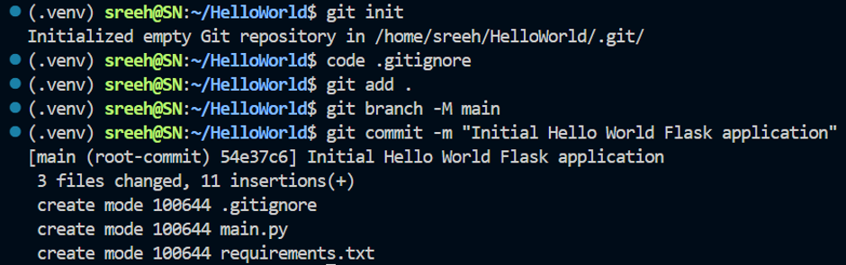
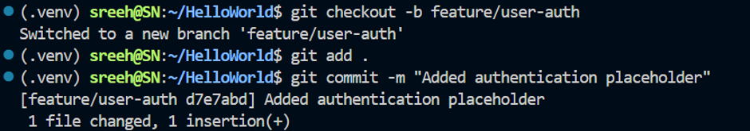
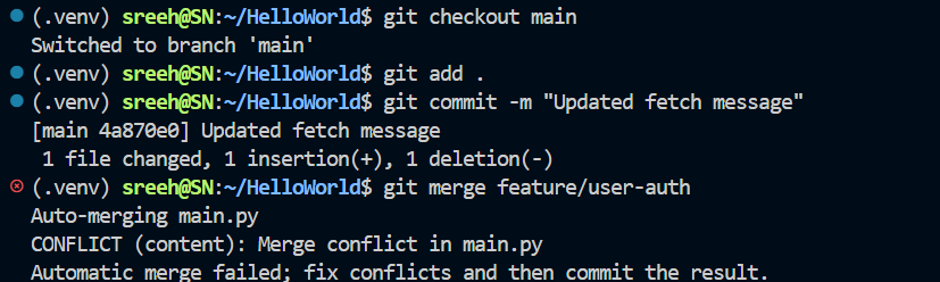
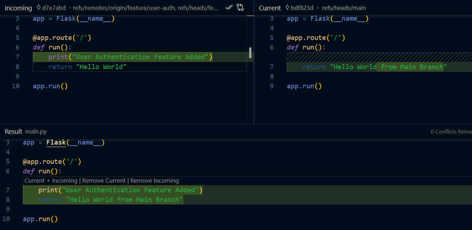

# Assignment TW1.1 - Git Workflow & Collaboration

## Objective

The objective of this assignment is to understand Git version control, branching, collaboration, merge conflicts, and remote repository management using GitHub.

## Task 1.1 - Initialize Git Repository

### Commands Used

```bash
mkdir flask-app
cd flask-app
git init
git add .
git commit -m "Initial commit"
```

### Output

- Git was initialized for the project successfully.
- The Flask Hello World application was committed to the main branch.



## Task 1.2 - Create Feature Branch

### Commands Used

```bash
git checkout -b feature/user-auth
```

The project was updated by adding a new print statement.

```bash
git add .
git commit -m "Added authentication feature"
git remote add origin https://github.com/Sreenair-1/hello-world.git
git push -u origin feature/user-auth
```



## Task 1.3 - Merge Conflict

The same line was modified in both the main branch and the feature branch.

Merged both branches:

```bash
git checkout main
git add .
git commit -m "Updated fetch message"
gut merge feature/user-auth
```

This created a merge conflict, which was resolved manually.

```bash
git add .
git commit -m "Resolved merge conflict"
git push origin main
```



## Git Commands Used

```bash
git init
git status
git add .
git commit -m ""
git checkout -b feature/user-auth
git branch
git merge
git push
git pull
```

## Learning Outcomes

- Learned how to initialize a Git repository
- Practiced staging and committing changes
- Understood branch creation
- Learned branch merging
- Gained experience in resolving merge conflicts
- Practiced pushing code to GitHub
- Improved collaborative development skills with Git

## Conclusion

The assignment successfully demonstrated Git workflow concepts such as feature branching, commits, merges, conflict resolution, and remote repository management with GitHub.