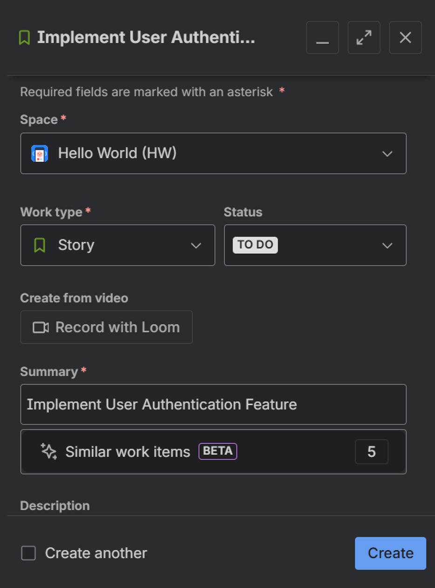
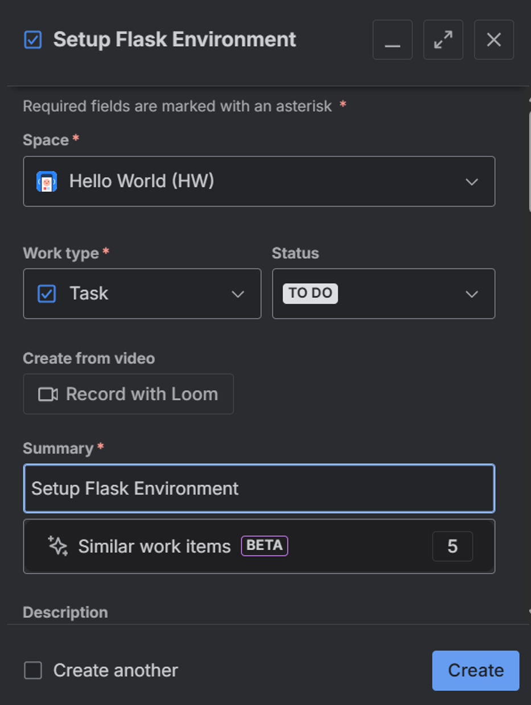
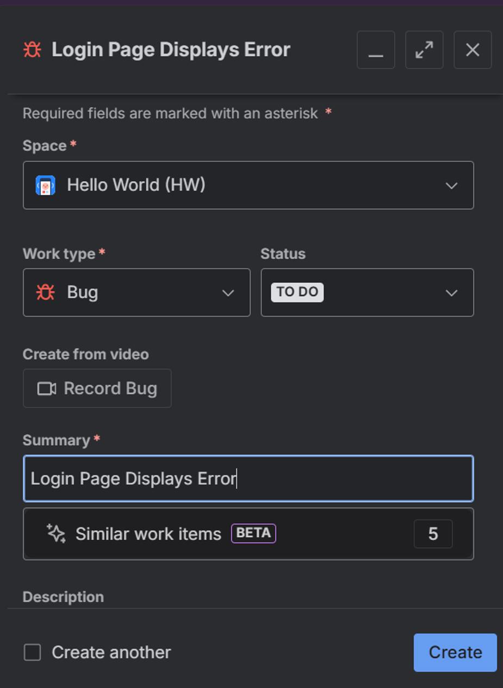

# TW1.2 - Jira Project & Issue Tracking

## Objective
Set up a Jira Cloud project for the "Hello World" application, create issues, and manage workflow using the Scrum board.

---

## Tasks Completed

### Task 2.1: Create Jira Scrum Project (1 Mark)
- Logged into Jira Cloud instance
- Created a new "Scrum" project named "Hello World"
- Project configured with standard Scrum workflow

### Task 2.2: Create Project Issues (1 Mark)
The following issues were created within the project:

1. **Story: "Implement User Authentication Feature"**
   - Issue Type: Story
   - Description: Implement secure user authentication for the Hello World application
   - Status: To Do

    

2. **Task: "Setup Flask Environment"**
   - Issue Type: Task
   - Description: Setup and configure Flask development environment
   - Status: To Do

    

3. **Bug: "Login Page Displays Error"**
   - Issue Type: Bug
   - Description: Login page showing error message on form submission
   - Status: To Do

   

### Task 2.3: Board Workflow Management (1 Mark)
- ✅ Navigated to the project board
- ✅ Moved "Setup Flask Environment" task from "To Do" → "In Progress"
- ✅ Workflow verified and updated

## Summary
All Jira project setup and issue tracking tasks have been successfully completed. The Scrum board is now operational with issues in their respective workflow states.
