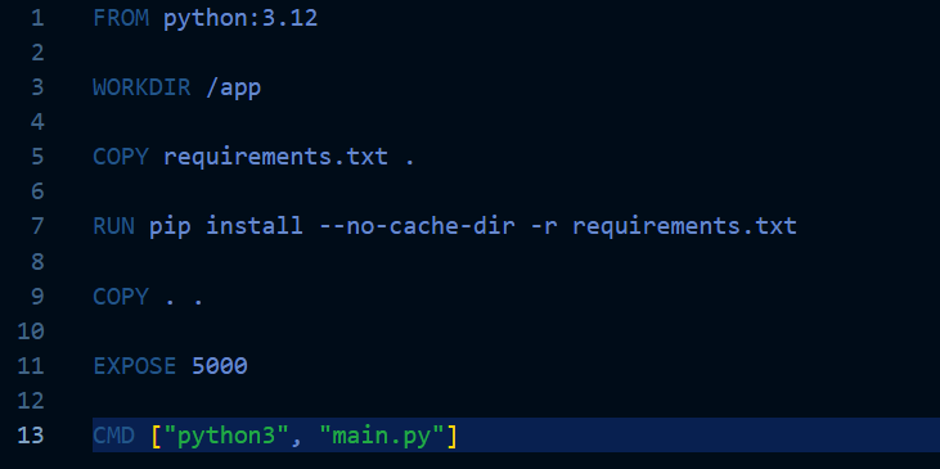
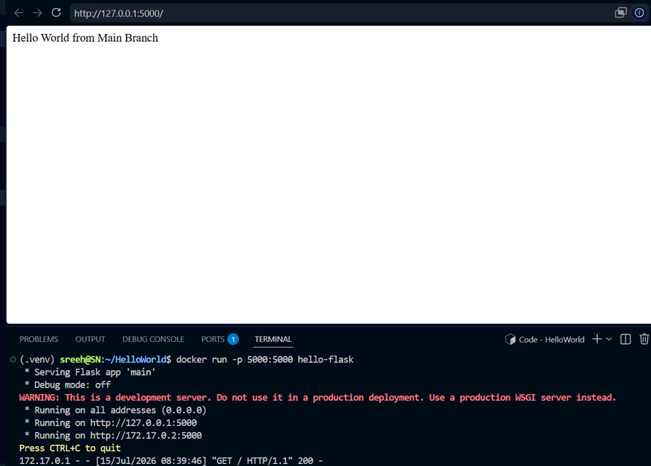
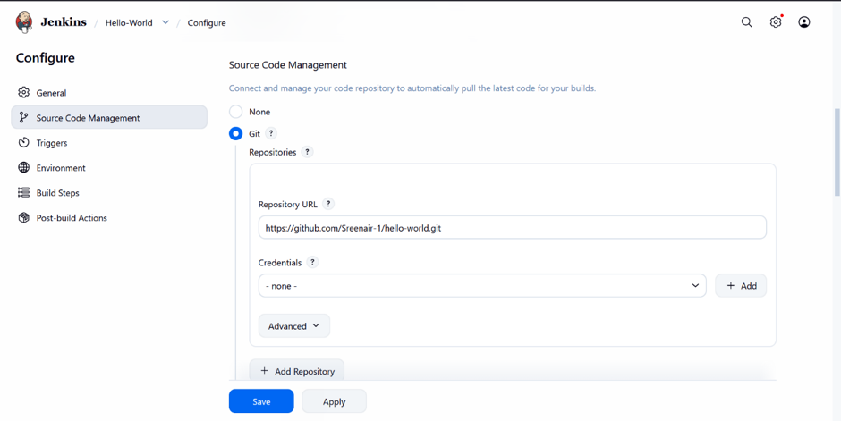
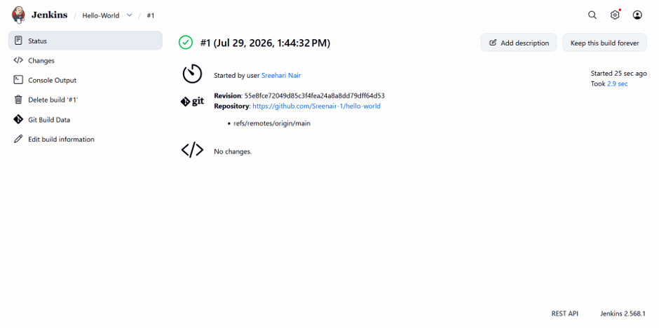

# TW1.3

## Basic Containerization (Docker) & Jenkins Freestyle Project

### Task 3.1: Dockerfile for Python Flask "Hello World" Application

Created a minimal Dockerfile for the Flask app to run on port 5000.

#### Dockerfile
```dockerfile
FROM python:3.12

WORKDIR /app

COPY requirements.txt .
RUN pip install --no-cache-dir -r requirements.txt

COPY . .

EXPOSE 5000

CMD ["python3", "main.py"]
```



#### Build and Run Commands
```bash
docker build -t hello-flask .
docker run -d -p 5000:5000 hello-flask
```



The image was built locally and verified successfully by running the container on port 5000.

### Task 3.2: Jenkins Freestyle Project

Set up a Jenkins Freestyle project to pull the Git repository from Task 1.1 and execute a build step that lists the contents of the workspace.

#### Build Step
```bash
echo Current Directory:
cd

echo.
echo Files in Workspace:
dir
```

#### Result
The Jenkins build completed successfully and displayed the workspace contents in the console output.

#### Screenshot

