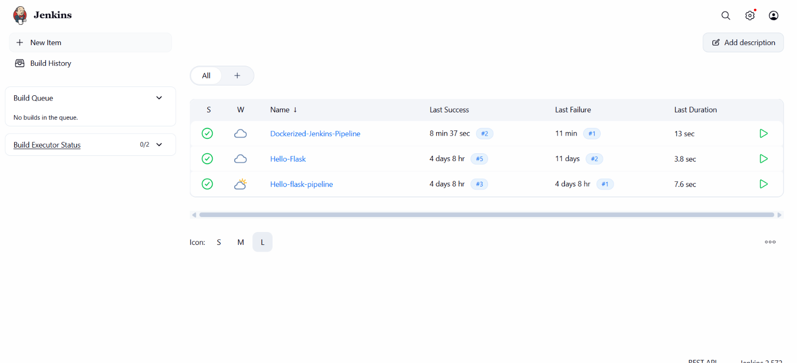
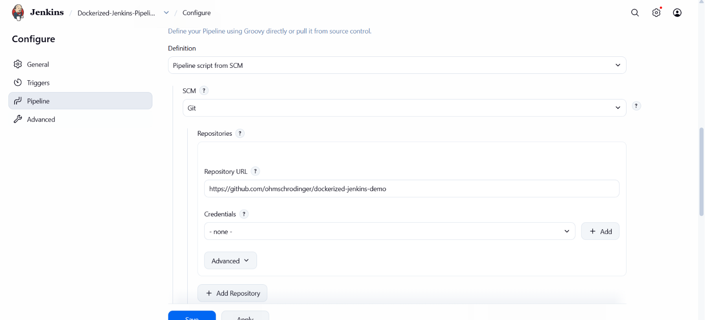
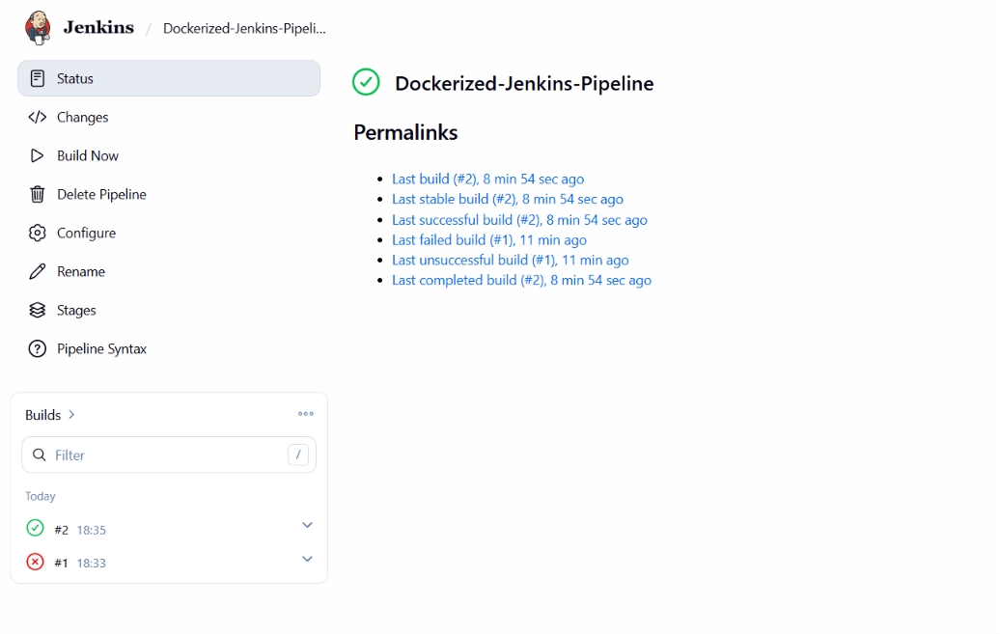
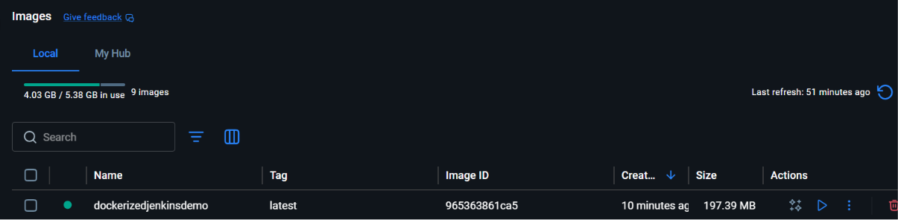
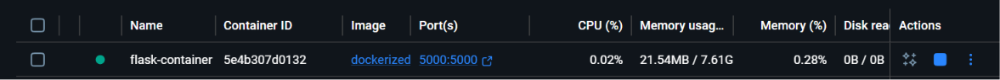

# Project 1 – Dockerizing Jenkins Pipeline

**Student Name:** Om Dhamame
**PRN:** 23070122155

---

# Objective

The objective of this project is to implement a Continuous Integration (CI) pipeline using Jenkins to automatically fetch a Flask application from GitHub, build a Docker image, and verify the successful image creation.

---

# Software & Tools Used

- Docker Desktop
- Jenkins
- Git & GitHub
- Python 3
- Flask
- Visual Studio Code

---

# Project Files

The project consists of the following files:

- app.py
- Dockerfile
- Jenkinsfile
- requirements.txt
- README.md

---

# Project Workflow

```
GitHub Repository
        │
        ▼
Jenkins Pipeline
        │
        ▼
Checkout Source Code
        │
        ▼
Check Docker
        │
        ▼
Build Docker Image
        │
        ▼
List Docker Images
        │
        ▼
Build Successful
```

---

# Task 1 – Jenkins Dashboard

A Jenkins Pipeline project named **Dockerizing-Jenkins-Pipeline** was created successfully.

### Screenshot




---

# Task 2 – Pipeline Configuration

The pipeline was configured using **Pipeline Script from SCM**.

Configuration:

- SCM: Git
- Repository: GitHub
- Branch: main
- Script Path: Jenkinsfile



---

# Task 3 – Successful Pipeline Execution

The Jenkins pipeline executed all stages successfully.

Pipeline Stages:

- Checkout Source Code
- Check Docker
- Build Docker Image
- List Docker Images

### Screenshot




---

# Task 4 – Building the Docker Image

The Docker image for the Flask application was built automatically through the Jenkins pipeline.

Command Executed:

```bash
docker build -t hello-flask:latest .
```

### Screenshot




---

# Task 5 – Docker Images Verification

After the build completed, Jenkins displayed all available Docker images.

Command Executed:

```bash
docker images
```

### Screenshot




---

# Task 6 – Console Output

The Jenkins console output confirms that every stage executed successfully.

Final Build Status:

```
Finished: SUCCESS
```


---


# Jenkins Pipeline

```groovy
pipeline {
    agent any

    stages {

        stage('Check Docker') {
            steps {
                sh 'whoami'
                sh 'pwd'
                sh 'which docker'
                sh 'docker version'
                sh 'docker ps'
            }
        }

        stage('Build Docker Image') {
            steps {
                sh 'docker build -t hello-flask:latest .'
            }
        }

        stage('List Docker Images') {
            steps {
                sh 'docker images'
            }
        }

    }
}
```

---

# Learning Outcomes

- Configured a Jenkins Declarative Pipeline.
- Connected Jenkins with a GitHub repository.
- Verified Docker installation within the Jenkins environment.
- Automated Docker image creation using Jenkins.
- Verified successful image generation using Docker commands.
- Understood the basic Continuous Integration workflow.

---

# Result

The Dockerizing Jenkins Pipeline was successfully implemented. Jenkins cloned the Flask application from GitHub, verified the Docker environment, built the Docker image automatically, and displayed the available Docker images. The pipeline completed successfully with all stages executed without errors, demonstrating a functional Continuous Integration workflow.
