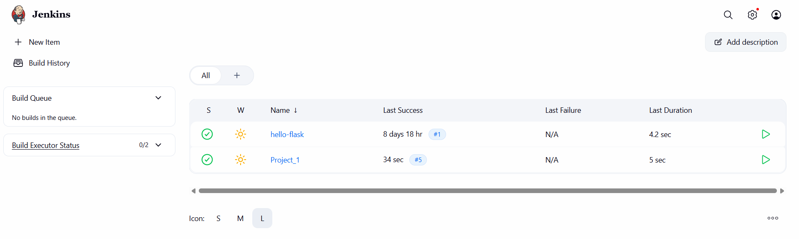
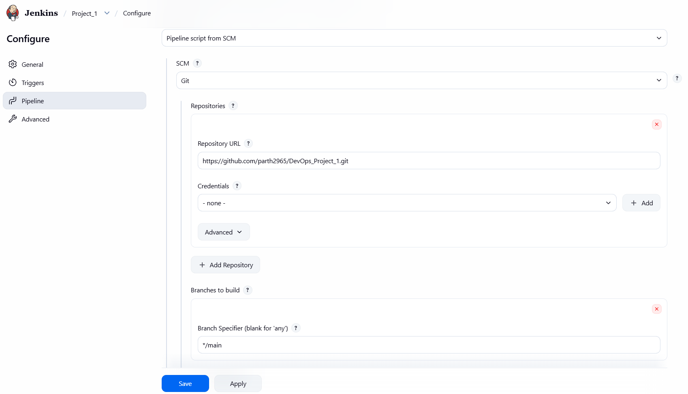
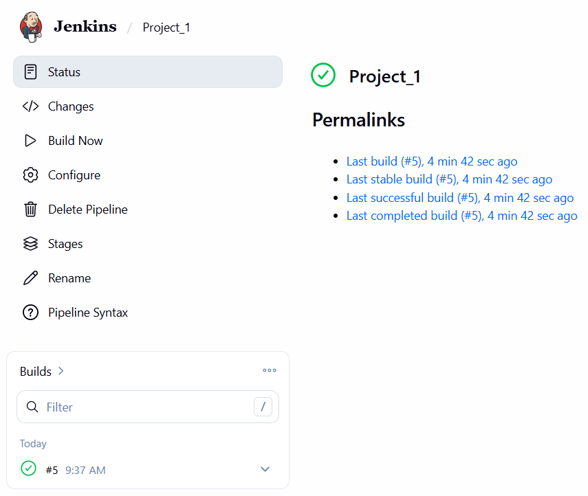
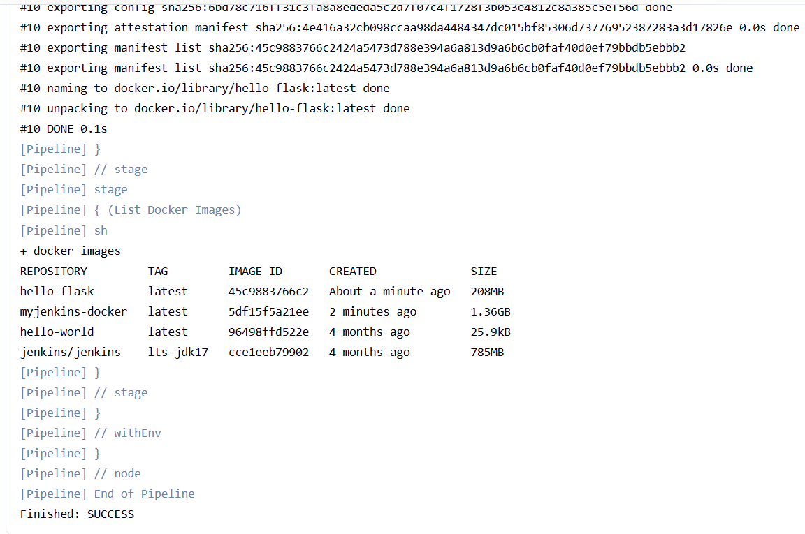

# Project 1 – Dockerizing Jenkins Pipeline

**Student Name:** Parth Damle  
**PRN:** 23070122161

---

# Objective

The objective of this project is to implement a Continuous Integration (CI) pipeline using Jenkins to automatically fetch a Flask application from GitHub, verify the Docker environment, build a Docker image, and verify the successful image creation.

---

# Software & Tools Used

- Docker Desktop
- Jenkins
- Git & GitHub
- Python 3
- Flask
- Visual Studio Code

---

# Project Files

The project consists of the following files:

- `app.py`
- `Dockerfile`
- `Jenkinsfile`
- `requirements.txt`
- `README.md`

---

# Project Workflow

```text
GitHub Repository
        │
        ▼
Jenkins Pipeline
        │
        ▼
Checkout Source Code
        │
        ▼
Check Docker
        │
        ▼
Build Docker Image
        │
        ▼
List Docker Images
        │
        ▼
Build Successful
```

---

# Task 1 – Jenkins Dashboard

A Jenkins Pipeline project named **Project_1** was created successfully.

### Screenshot



---

# Task 2 – Pipeline Configuration

The pipeline was configured using **Pipeline script from SCM**.

Configuration:

- SCM: Git
- Repository: GitHub
- Branch: `main`
- Script Path: `Jenkinsfile`

### Screenshot



---

# Task 3 – Successful Pipeline Execution

The Jenkins pipeline executed successfully, with the project showing a successful build.

The pipeline contains the following stages:

- Check Docker
- Build Docker Image
- List Docker Images

### Screenshot



---

# Task 4 – Building the Docker Image and Console Output

The Docker image for the Flask application was built automatically through the Jenkins pipeline.

The image was built using the following command:

```bash
docker build -t hello-flask:latest .
```

After the build, Jenkins listed the available Docker images using:

```bash
docker images
```

The console output confirms that the `hello-flask:latest` image was created successfully and that the pipeline completed with the status **Finished: SUCCESS**.

### Screenshot



---

# Jenkins Pipeline

A Declarative Jenkins Pipeline was used to automate the CI workflow.

Pipeline stages:

- Check Docker
- Build Docker Image
- List Docker Images

```groovy
pipeline {
    agent any

    stages {

        stage('Check Docker') {
            steps {
                sh 'whoami'
                sh 'pwd'    
                sh 'which docker'
                sh 'docker version'
                sh 'docker ps'
            }
        }

        stage('Build Docker Image') {
            steps {
                sh 'docker build -t hello-flask:latest .'
            }
        }

        stage('List Docker Images') {
            steps {
                sh 'docker images'
            }
        }

    }
}
```

---

# Learning Outcomes

- Configured a Jenkins Declarative Pipeline.
- Connected Jenkins with a GitHub repository.
- Verified Docker availability within the Jenkins environment.
- Automated Docker image creation using Jenkins.
- Verified the generated Docker image using Docker commands.
- Understood the basic Continuous Integration workflow.

---

# Result

The Dockerizing Jenkins Pipeline was successfully implemented. Jenkins fetched the project from GitHub, verified the Docker environment, built the `hello-flask:latest` Docker image automatically, and displayed the available Docker images. The pipeline completed successfully with all stages executed without errors, demonstrating a functional Continuous Integration workflow.
