# Project 4 — Distributed Jenkins CI Pipeline for a Maven-Based Java Application

**Student Name:** Parth Damle  
**PRN:** 23070122161

---

## 📖 Project Description

This project demonstrates a distributed Continuous Integration (CI) pipeline using Jenkins. A Maven-based Java application is stored in GitHub, and Jenkins distributes the Build, Test, and Package stages across two separate agent nodes. This demonstrates workload distribution using a Jenkins Controller with multiple agents.

---

## 🎯 Objective

To design and implement a distributed Jenkins CI pipeline that:

- Pulls a Maven-based Java application from a GitHub repository
- Uses multiple Jenkins agent nodes for pipeline execution
- Automates the Build → Test → Package lifecycle
- Executes Build and Package on Agent-1 and Test on Agent-2
- Produces a verifiable Maven JAR artifact

---

## ✅ Prerequisites

| Requirement | Details |
|---|---|
| Jenkins | Controller installed and running locally |
| JDK | JDK 21 installed and available to the agents |
| Maven | Apache Maven 3.9.16 |
| Git | Installed for source control operations |
| GitHub account | Hosts the Project_4 repository |
| Jenkins Agent nodes | Agent-1 and Agent-2 connected to the controller |

---

## 🛠️ Technologies Used

- **Jenkins** — CI orchestration using a Controller and distributed Agents
- **Maven** — Build automation and dependency management
- **Java (JDK 21)** — Java development environment
- **Git & GitHub** — Version control and source hosting
- **JUnit** — Automated testing framework executed through Maven

---

## 🚀 Project Setup

The Maven project was generated using the Maven Quickstart archetype. The generated project was then verified with a Maven build before integrating it with Jenkins.

The initial Maven project build was successfully completed using `mvn clean package`.

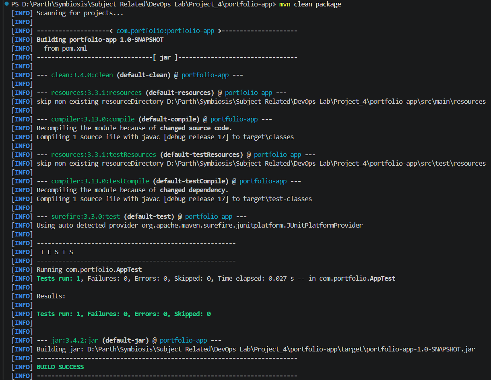

---

## 🗂️ Project Structure

```text
Project_4/
├── portfolio-app/
│   ├── .mvn/
│   ├── src/
│   │   ├── main/
│   │   └── test/
│   └── pom.xml
├── screenshots/
├── Jenkinsfile
└── README.md
```

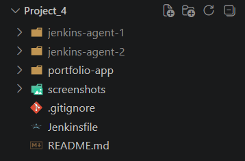

The Maven project and its `pom.xml` are contained inside the `portfolio-app` directory.

---

## 🏗️ Jenkins Architecture

```text
                    GitHub Repository
                           │
                           ▼
                   Jenkins Controller
                     (myjenkins)
                           │
                 ┌─────────┴─────────┐
                 │                   │
                 ▼                   ▼
              Agent-1             Agent-2
          (Build & Package)         (Test)
                 │                   │
                 └─────────┬─────────┘
                           ▼
                     Build Success
```

The Jenkins Controller orchestrates the pipeline and delegates the work to two connected agent nodes. **Agent-1** handles the Build and Package stages, while **Agent-2** handles the Test stage.

---

## 🔧 Jenkins Agent Setup

Two Jenkins agents were created and connected to the existing Jenkins Controller.

### Agent-1 Configuration

Agent-1 was created with the label `agent-1` and configured to connect to the Jenkins Controller.

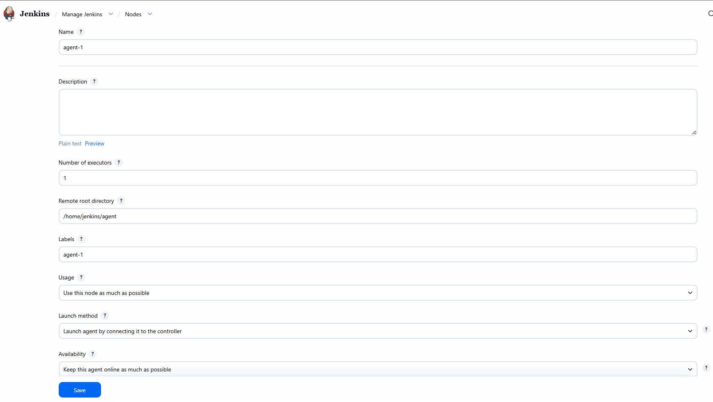

The agent was downloaded and connected using the Jenkins-provided agent command.

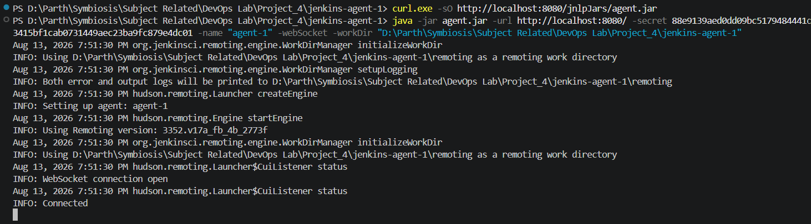

After connecting, Agent-1 was shown as connected in Jenkins.

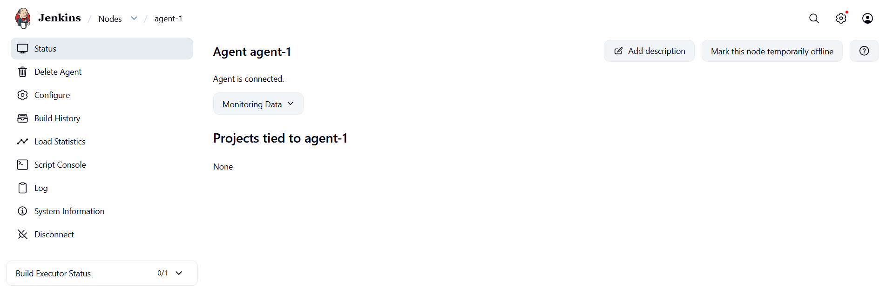

### Agent-2 Configuration

Agent-2 was created with the label `agent-2` and configured similarly.

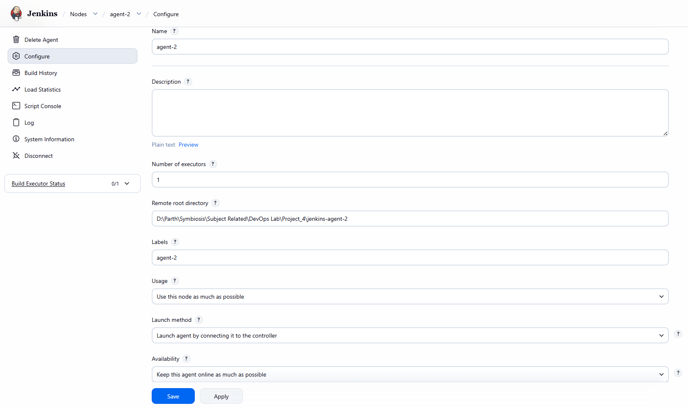

The Agent-2 agent was downloaded and connected to the same Jenkins Controller.

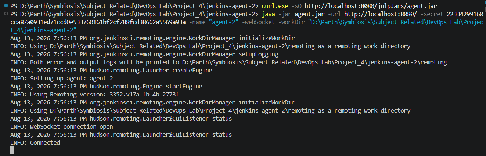

After connecting, Agent-2 was shown as connected in Jenkins.

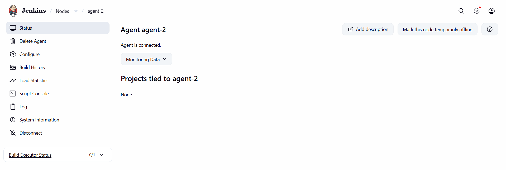

### Both Agents Online

Both Agent-1 and Agent-2 were successfully connected and available to the Jenkins Controller.

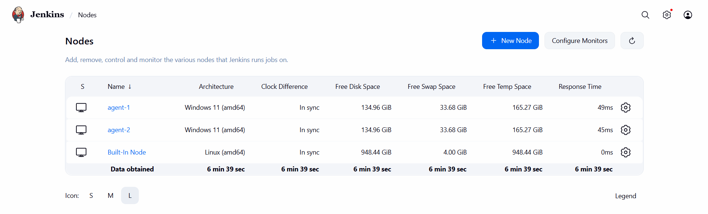

---

## 🔁 Pipeline Workflow

```text
GitHub Repository
        │
        ▼
Jenkins Pipeline
        │
        ▼
Build Stage (Agent-1)
        │
        ▼
Test Stage (Agent-2)
        │
        ▼
Package Stage (Agent-1)
        │
        ▼
BUILD SUCCESS
```

---

## 📋 Pipeline Stages

### Stage 1 – Build

- Executes on **Agent-1**
- Checks out the GitHub repository
- Enters the `portfolio-app` directory
- Compiles the Maven project

**Command:**

```bash
mvn clean compile
```

### Stage 2 – Test

- Executes on **Agent-2**
- Checks out the GitHub repository
- Enters the `portfolio-app` directory
- Runs the JUnit test cases

**Command:**

```bash
mvn test
```

### Stage 3 – Package

- Executes on **Agent-1**
- Checks out the GitHub repository
- Enters the `portfolio-app` directory
- Packages the application into a JAR

**Command:**

```bash
mvn package
```

---

## 💻 Commands Used

### Maven

```bash
mvn archetype:generate
mvn clean package
mvn clean compile
mvn test
mvn package
```

### Git

```bash
git init
git add .
git commit -m "Add distributed Jenkins pipeline"
git branch -M main
git remote add origin https://github.com/parth2965/Project_4.git
git push -u origin main
```

---

## 📜 Jenkinsfile

The Jenkinsfile defines the distributed pipeline and assigns stages to the appropriate agent labels.

```groovy
pipeline {
    agent none

    stages {

        stage('Build') {
            agent { label 'agent-1' }

            steps {
                git branch: 'main',
                    url: 'https://github.com/parth2965/Project_4.git'

                dir('portfolio-app') {
                    bat 'mvn clean compile'
                }
            }
        }

        stage('Test') {
            agent { label 'agent-2' }

            steps {
                git branch: 'main',
                    url: 'https://github.com/parth2965/Project_4.git'

                dir('portfolio-app') {
                    bat 'mvn test'
                }
            }
        }

        stage('Package') {
            agent { label 'agent-1' }

            steps {
                git branch: 'main',
                    url: 'https://github.com/parth2965/Project_4.git'

                dir('portfolio-app') {
                    bat 'mvn package'
                }
            }
        }
    }
}
```

The pipeline therefore assigns:

```text
Agent-1 → Build + Package
Agent-2 → Test
```

---

## 🔗 GitHub Repository & Pipeline Job Setup

The Project 4 Maven application and Jenkinsfile were pushed to GitHub. A Jenkins Pipeline job was then created to retrieve the Jenkinsfile directly from the repository.

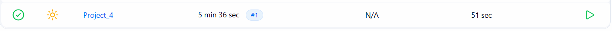

The pipeline job was configured using **Pipeline script from SCM**, with Git as the SCM and the `main` branch.

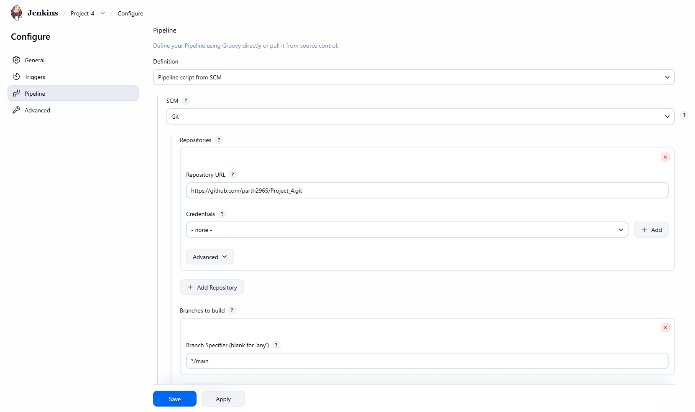

---

## 🏁 Build Result

The first Jenkins build was executed successfully.

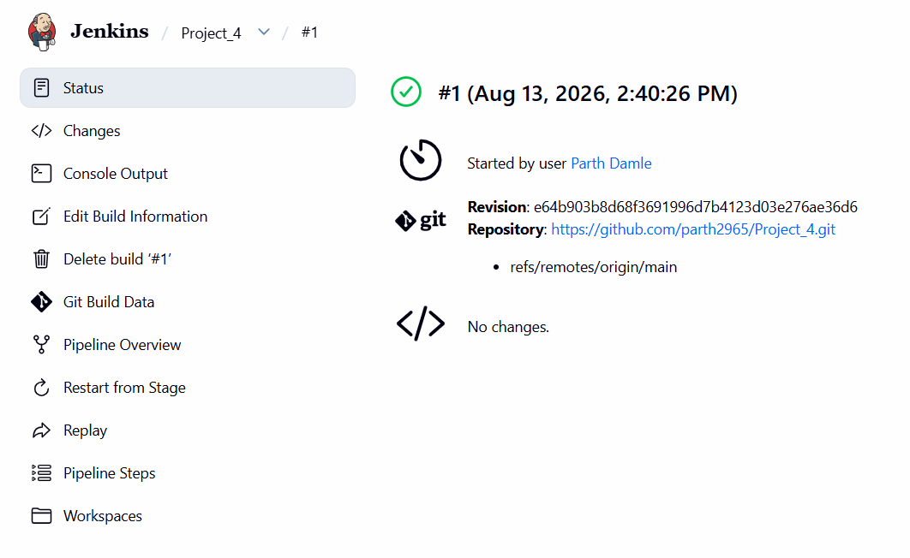

The pipeline overview shows the stages executing successfully across the two agents.

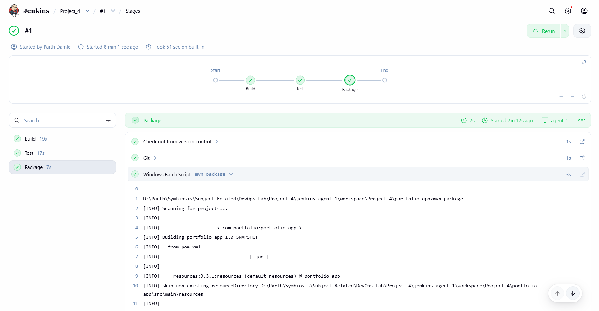

### Console Output

The complete Jenkins Console Output confirms that the stages ran on their assigned agents and that all Maven operations completed successfully.

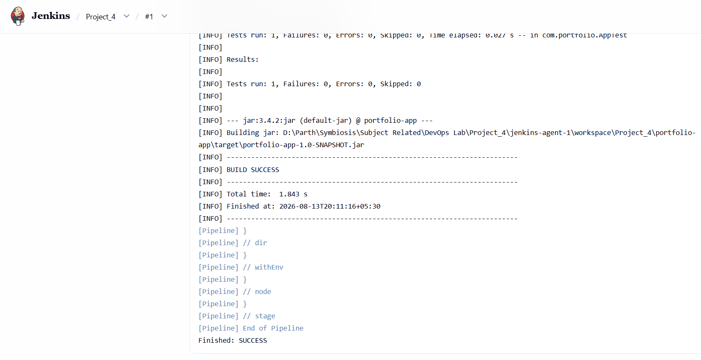

The build completed with:

```text
✓ Build   : SUCCESS — Agent-1
✓ Test    : SUCCESS — Agent-2
✓ Package : SUCCESS — Agent-1

Final Pipeline Status: BUILD SUCCESS
```

The Test stage executed one JUnit test with zero failures, and the Package stage generated:

```text
portfolio-app-1.0-SNAPSHOT.jar
```

---

## 🧩 Architecture Summary

| Component | Purpose |
|---|---|
| GitHub | Stores the Maven project source code and Jenkinsfile |
| Jenkins Controller | Orchestrates the CI pipeline |
| Agent-1 | Executes Build and Package stages |
| Agent-2 | Executes Test stage |
| Maven | Builds, tests, and packages the Java application |
| Git | Version control |
| JDK 21 | Java development environment |

---

## 🔚 Conclusion

This project successfully demonstrates a distributed Jenkins CI pipeline for a Maven-based Java application. By assigning the Build and Package stages to Agent-1 and the Test stage to Agent-2, the pipeline demonstrates how Jenkins can distribute CI workload across multiple agent nodes. The pipeline completed successfully, with the Maven project compiled, tested, and packaged into a JAR artifact.
