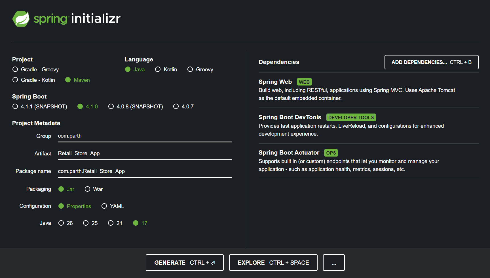
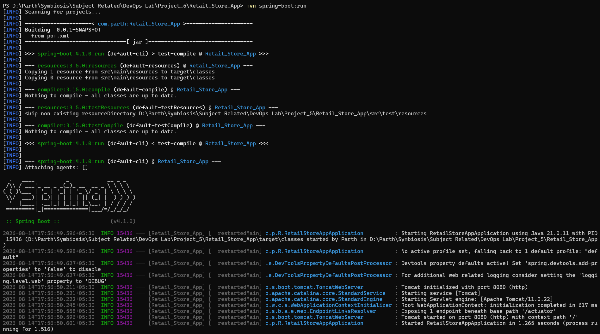
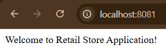
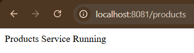
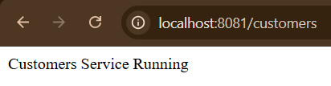
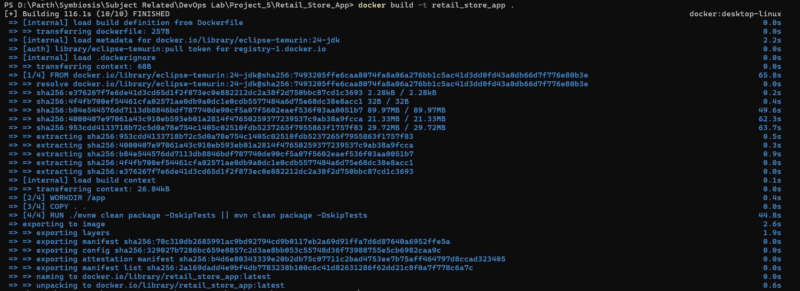
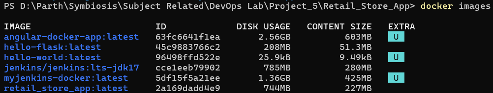
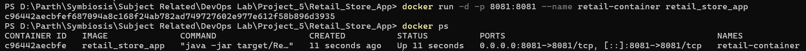
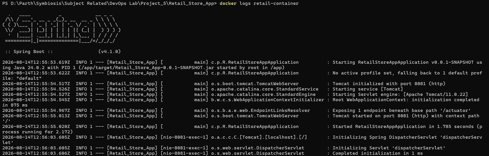

# Project 5: Containerizing Spring Boot Application and Scanning Docker Image

**Student Name:** Parth Damle  
**PRN:** 23070122161

---

## Project Description

This project demonstrates the containerization of a Spring Boot REST application for a retail company using Docker. The application provides simple retail-related REST endpoints for the home page, products service, and customers service.

The Spring Boot application is packaged into a Docker image using a Dockerfile. Maven is used to build the executable JAR, while Docker provides an isolated environment in which the application can run independently of the host setup. The resulting Docker image can then be inspected and scanned using Docker security tooling such as Docker Scout or Docker Trusted Registry (DTR).

---

## Objective

To containerize a Spring Boot REST application using Docker, build and run the Docker image, verify the application inside the container, and prepare the image for vulnerability/security scanning.

---

## Technologies Used

| Technology | Version / Configuration | Purpose |
|---|---|---|
| Java | 17 (project configuration) | Programming language |
| Spring Boot | 4.1.0 | REST application framework |
| Maven | Maven Wrapper | Build automation and dependency management |
| Docker Desktop | Installed locally | Container runtime |
| Docker Engine | Docker Desktop | Image and container management |
| Windows / PowerShell | Host environment | Development and Docker commands |
| VS Code | Development environment | Source-code editing |

---

## Prerequisites

* **Java** — Required for compiling and running the Spring Boot application.
* **Maven Wrapper** — Included with the project and used to build the application.
* **Docker Desktop** — Required to build Docker images and run containers.
* **PowerShell / Terminal** — Used to execute Maven and Docker commands.

---

## Project Structure

```text
Project_5/
│
├── Retail_Store_App/
│   ├── Dockerfile
│   ├── .dockerignore
│   ├── pom.xml
│   ├── mvnw
│   ├── mvnw.cmd
│   │
│   ├── src/
│   │   ├── main/
│   │   │   ├── java/
│   │   │   │   └── com/parth/Retail_Store_App/
│   │   │   │       ├── RetailStoreAppApplication.java
│   │   │   │       └── HomeController.java
│   │   │   │
│   │   │   └── resources/
│   │   │       └── application.properties
│   │   │
│   │   └── test/
│   │
│   └── target/
│
└── screenshots/
    ├── spring_initializer_config_ss.png
    ├── mvn_spring_boot_run_command_powershell_ss.png
    ├── welcome_to_retail_store_application_home_page_running_via_springboot.png
    ├── welcome_to_retail_store_application_product_service_running_via_springboot.png
    ├── welcome_to_retail_store_application_customers_service_running_via_springboot.png
    ├── docker_build_success_powershell.png
    ├── docker_images_powershell_to_see_the_new_retail_store_app_image.png
    ├── docker_container_for_retail_app_running.png
    └── docker_logs_retail_container.png
```

---

## Spring Boot Architecture

```text
                    Browser / Client Request
                              │
                              ▼
                    Embedded Spring Server
                              │
                              ▼
                    Spring Boot Application
                              │
                              ▼
                       REST Controller
                       (HomeController)
                              │
                 ┌────────────┼────────────┐
                 ▼            ▼            ▼
                `/`      `/products`   `/customers`
                 │            │            │
                 ▼            ▼            ▼
              Response     Response     Response
                 │            │            │
                 └────────────┼────────────┘
                              ▼
                         Client / Browser
```

### Spring Initializr Setup

The Spring Boot project was created/configured using Spring Initializr.



---

## Application Configuration

The application uses port **8081**, configured in `application.properties`:

```properties
spring.application.name=Retail_Store_App
server.port=8081
```

The main Spring Boot application class starts the application using `SpringApplication.run()`.

---

## REST Controller

The application contains a `HomeController` with three GET endpoints:

```java
@GetMapping("/")
public String home() {
    return "Welcome to Retail Store Application!";
}

@GetMapping("/products")
public String products() {
    return "Products Service Running";
}

@GetMapping("/customers")
public String customers() {
    return "Customers Service Running";
}
```

---

## REST Endpoints

| Endpoint | Method | Description | Response |
|---|---|---|---|
| `/` | GET | Home endpoint | `Welcome to Retail Store Application!` |
| `/products` | GET | Products service | `Products Service Running` |
| `/customers` | GET | Customers service | `Customers Service Running` |

---

## Running the Application Locally

The application can first be tested outside Docker using the Maven Wrapper.

```bash
.\mvnw spring-boot:run
```

### Spring Boot Started



Once the server starts, the application listens on:

```text
http://localhost:8081
```

### Home Page



### Products Endpoint



### Customers Endpoint



---

## Docker Architecture

```text
                    Developer Machine
                           │
                           ▼
                       Dockerfile
                           │
                           ▼
                    Docker Build Process
                           │
                           ▼
                      Docker Image
                           │
                           ▼
                    Docker Container
                           │
                           ▼
                 Spring Boot Application
                           │
                           ▼
                    Container Port 8081
                           │
                           ▼
                    Host Port 8081
                           │
                           ▼
                       Browser
```

---

## Dockerfile

The project uses the following Dockerfile:

```dockerfile
FROM eclipse-temurin:24-jdk

WORKDIR /app

COPY . .

RUN ./mvnw clean package -DskipTests || mvn clean package -DskipTests

EXPOSE 8081

ENTRYPOINT ["java","-jar","target/Retail_Store_App-0.0.1-SNAPSHOT.jar"]
```

### Dockerfile Instructions Explained

| Instruction | Purpose |
|---|---|
| `FROM` | Selects the Eclipse Temurin JDK 24 base image |
| `WORKDIR` | Sets `/app` as the working directory inside the image |
| `COPY` | Copies the project files into the container build context |
| `RUN` | Builds the Spring Boot application using Maven |
| `EXPOSE` | Documents that the application uses port 8081 |
| `ENTRYPOINT` | Starts the generated Spring Boot JAR |

---

## Docker Commands Used

### Build the Docker Image

From the `Retail_Store_App` directory:

```bash
docker build -t retail-store-app .
```

### Verify the Image

```bash
docker images
```

### Run the Container

```bash
docker run -d -p 8081:8081 --name retail-store-container retail-store-app
```

### Check Running Containers

```bash
docker ps
```

### View Container Logs

```bash
docker logs retail-store-container
```

---

## Docker Build Process

The complete containerization workflow is:

```text
Spring Boot Source Code
        │
        ▼
     Dockerfile
        │
        ▼
  docker build command
        │
        ▼
   Docker Image Created
        │
        ▼
    docker run command
        │
        ▼
 Docker Container Started
        │
        ▼
Application Available on
   localhost:8081
        │
        ▼
Endpoint Verification
        │
        ▼
Container Logs Checked
```

### Docker Image Build

The Docker image was successfully built using PowerShell.



---

## Docker Images

The generated `retail-store-app` image can be verified using:

```bash
docker images
```



---

## Running Container

The application is deployed inside a Docker container using:

```bash
docker run -d -p 8081:8081 --name retail-store-container retail-store-app
```



---

## Application Access from Docker

After starting the container, the Spring Boot application can be accessed through the mapped host port:

```text
http://localhost:8081
```

The same REST endpoints can then be accessed from the Dockerized application:

```text
/
 /products
 /customers
```

---

## Container Logs

Container logs can be checked to verify that the Spring Boot application started correctly:

```bash
docker logs retail-store-container
```



---

## Docker Image Scanning

After building the Docker image, it can be scanned for known vulnerabilities using Docker security tooling such as **Docker Scout** or **Docker Trusted Registry (DTR)**.

Example Docker Scout command:

```bash
docker scout cves retail-store-app
```

The scan helps identify known vulnerabilities in the image's base layers and installed components.

> Note: The supplied project contains the Docker image build, container execution, and verification evidence. A separate vulnerability-scan screenshot/result was not included in the supplied project files, so no scan result is claimed here.

---

## Build and Deployment Result

```text
Spring Boot Application : SUCCESS
Docker Image Build      : SUCCESS
Docker Container        : SUCCESS
Application Deployment  : SUCCESS
Container Logs          : SUCCESS

Final Status : APPLICATION RUNNING SUCCESSFULLY
```

---

## Learning Outcomes

* Created a Spring Boot REST application.
* Configured REST endpoints for a retail application.
* Built and tested the application locally.
* Created a Dockerfile for containerization.
* Built a Docker image from the Spring Boot project.
* Ran the application inside a Docker container.
* Mapped container port 8081 to the host.
* Verified the application using browser endpoints.
* Checked Docker container logs.
* Understood the basic workflow for Docker image vulnerability scanning.

---

## Conclusion

This project demonstrates the complete basic lifecycle of containerizing a Spring Boot REST application. The application was developed as a retail store service, tested locally, packaged through Maven inside the Docker build process, and deployed as a Docker container.

The successful Docker image build, container execution, endpoint verification, and log inspection demonstrate that the Spring Boot application can run in an isolated and reproducible container environment. The generated image can additionally be subjected to Docker security scanning tools such as Docker Scout or DTR to identify potential vulnerabilities.
