# Project 6: Social Media Infrastructure Scalability using Kubernetes

**Student Name:** Parth

---

## Project Description

This project demonstrates application scalability using Kubernetes and Horizontal Pod Autoscaling (HPA). A containerized Retail Store application was deployed on a local Minikube Kubernetes cluster using a Deployment, exposed through a NodePort Service, and monitored using the Kubernetes Metrics Server.

The Horizontal Pod Autoscaler was configured to automatically adjust the number of application pods according to CPU utilization. CPU load was generated during the demonstration, causing the application to scale from 2 replicas up to the configured maximum of 5 replicas.

---

## Objective

The objective of this project is to deploy an application on Kubernetes and demonstrate automatic application scalability using a Horizontal Pod Autoscaler based on CPU utilization.

---

## Technologies Used

| Technology | Purpose |
|---|---|
| Kubernetes | Container orchestration |
| Minikube | Local Kubernetes cluster |
| kubectl | Kubernetes command-line management |
| Docker Desktop | Container runtime |
| Docker Image | Containerized application |
| Metrics Server | CPU and memory metrics |
| HPA | Automatic pod scaling |

---

## Prerequisites

- Docker Desktop
- Minikube
- kubectl
- Existing Docker image `retail_store_app:latest`
- Windows system with Docker/WSL2 support

---

## Kubernetes Architecture

```text
                         User
                           │
                           ▼
                    NodePort Service
                    retail-service
                           │
                           ▼
                   Retail Deployment
                  retail-deployment
                           │
             ┌─────────────┼─────────────┐
             ▼             ▼             ▼
           Pod 1         Pod 2       Additional Pods
                                      during scaling
             │             │             │
             └─────────────┼─────────────┘
                           ▼
                    Metrics Server
                           │
                           ▼
             Horizontal Pod Autoscaler
                           │
                           ▼
                    CPU Utilization
                           │
                           ▼
                 Replica Count Changes
```

The NodePort Service exposes the application through Minikube and routes traffic to the pods managed by the Deployment. The Metrics Server provides CPU usage information, which the HPA uses to determine whether the Deployment should scale up or down.

---

## Step 1 — Starting the Minikube Cluster

Minikube was started using the Docker driver to create a local Kubernetes cluster.

```powershell
minikube start --driver=docker
```

The cluster was then verified using:

```powershell
minikube status
kubectl get nodes
kubectl cluster-info
```

The Minikube control plane and Kubernetes node were confirmed to be running and ready.

### Minikube Status

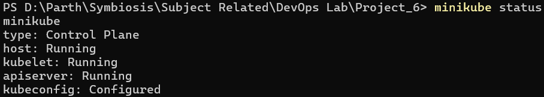

### Kubernetes Node

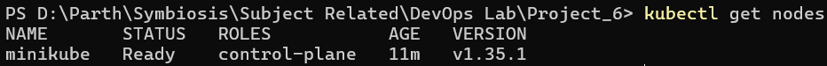

### Cluster Information

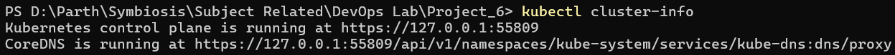

---

## Step 2 — Kubernetes Deployment

A Kubernetes Deployment was created to manage the Retail Store application pods.

### Deployment Configuration

| Field | Value |
|---|---|
| Deployment name | `retail-deployment` |
| Initial replicas | `2` |
| Label | `retail-app` |
| Container name | `retail-container` |
| Image | `retail_store_app:latest` |
| Image pull policy | `Never` |
| Container port | `8081` |
| CPU request | `100m` |
| CPU limit | `500m` |

### `deployment.yaml`

```yaml
apiVersion: apps/v1
kind: Deployment
metadata:
  name: retail-deployment

spec:
  replicas: 2

  selector:
    matchLabels:
      app: retail-app

  template:
    metadata:
      labels:
        app: retail-app

    spec:
      containers:
      - name: retail-container
        image: retail_store_app:latest
        imagePullPolicy: Never

        ports:
        - containerPort: 8081

        resources:
          requests:
            cpu: "100m"
          limits:
            cpu: "500m"
```

The Deployment was applied using:

```powershell
kubectl apply -f deployment.yaml
```

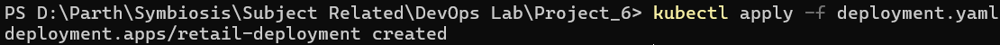

The Deployment and pods were then verified:

```powershell
kubectl get deployments
kubectl get pods
```

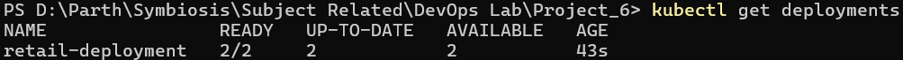

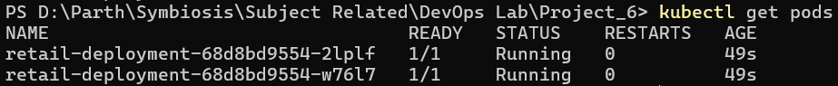

---

## Step 3 — Kubernetes Service

A NodePort Service was created to expose the application outside the Kubernetes cluster.

### Service Configuration

| Field | Value |
|---|---|
| Service name | `retail-service` |
| Type | `NodePort` |
| Port | `8081` |
| Target port | `8081` |
| NodePort | `30081` |
| Selector | `app: retail-app` |

### `service.yaml`

```yaml
apiVersion: v1
kind: Service

metadata:
  name: retail-service

spec:
  type: NodePort

  selector:
    app: retail-app

  ports:
    - port: 8081
      targetPort: 8081
      nodePort: 30081
```

The Service was applied using:

```powershell
kubectl apply -f service.yaml
```

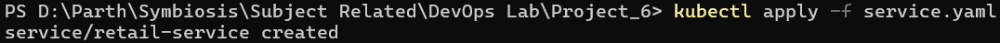

The Service was verified using:

```powershell
kubectl get svc
```

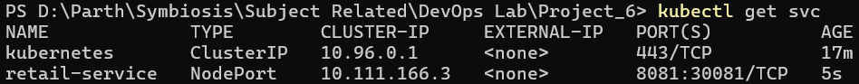

---

## Step 4 — Loading the Docker Image into Minikube

The Docker image used by the application was:

```text
retail_store_app:latest
```

The image was loaded into the Minikube environment using:

```powershell
minikube image load retail_store_app:latest
```

The image was verified using:

```powershell
minikube image ls | Select-String "retail_store_app"
```

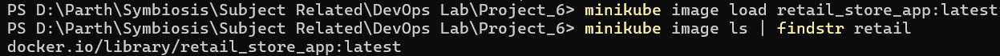

---

## Step 5 — Accessing the Application

The application was exposed using the NodePort Service.

The service URL was obtained using:

```powershell
minikube service retail-service --url
```

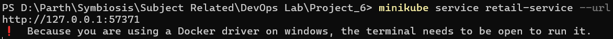

The application was successfully opened in a browser.

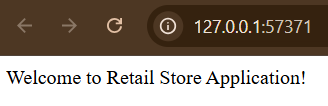

---

## Step 6 — Kubernetes Resources Overview

Before configuring autoscaling, the Kubernetes resources were reviewed together.

```powershell
kubectl get all
```

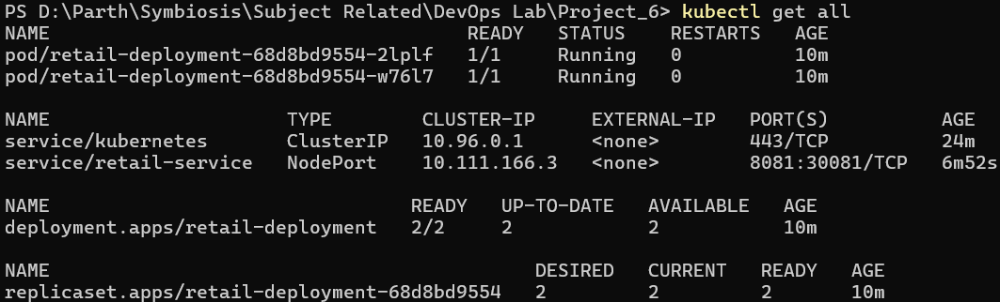

This confirmed that the Deployment, ReplicaSet, Pods, and Service were functioning correctly.

---

## Step 7 — Horizontal Pod Autoscaler

A Horizontal Pod Autoscaler was configured to automatically scale the Retail Store Deployment according to CPU utilization.

### HPA Configuration

| Field | Value |
|---|---|
| HPA name | `retail-hpa` |
| Target | `retail-deployment` |
| Minimum replicas | `2` |
| Maximum replicas | `5` |
| CPU target | `50%` |

### `hpa.yaml`

```yaml
apiVersion: autoscaling/v2

kind: HorizontalPodAutoscaler

metadata:
  name: retail-hpa

spec:
  scaleTargetRef:
    apiVersion: apps/v1
    kind: Deployment
    name: retail-deployment

  minReplicas: 2
  maxReplicas: 5

  metrics:
  - type: Resource
    resource:
      name: cpu

      target:
        type: Utilization
        averageUtilization: 50
```

The HPA was applied using:

```powershell
kubectl apply -f hpa.yaml
```

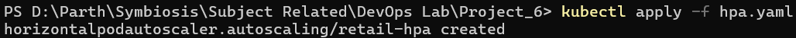

The HPA was verified using:

```powershell
kubectl get hpa
```

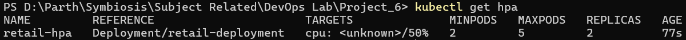

---

## Step 8 — Metrics Server

The Metrics Server is required by the HPA to obtain CPU utilization data from the running pods.

It was enabled using the Minikube addon:

```powershell
minikube addons enable metrics-server
```

The Metrics Server was verified using:

```powershell
kubectl top nodes
kubectl top pods
```

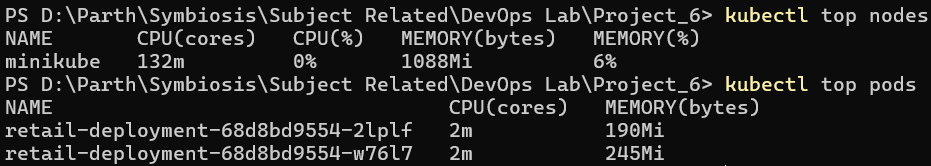

After the Metrics Server became available, the HPA was checked again:

```powershell
kubectl get hpa
```

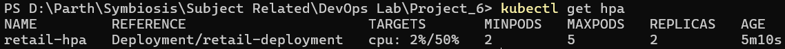

The HPA was then able to report actual CPU utilization instead of `<unknown>`.

---

## Step 9 — Autoscaling Demonstration

CPU load was generated against the application pods to demonstrate automatic scaling.

The HPA was monitored using:

```powershell
kubectl get hpa -w
```

The pods were monitored using:

```powershell
kubectl get pods -w
```

During the load test, CPU utilization increased significantly and the HPA increased the replica count.

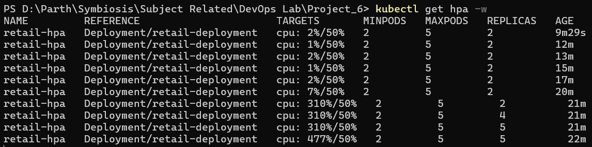

The Deployment initially had **2 replicas**. During the load test, the HPA increased the replica count to **4 and then 5 replicas**, reaching the configured maximum of 5.

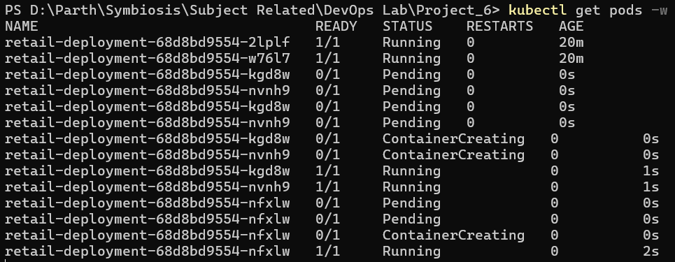

The application remained accessible through the NodePort Service while additional pods were created.

---

## Step 10 — Final Kubernetes State

The final Kubernetes resources were reviewed using:

```powershell
kubectl get all
```

At the demonstrated peak scaling state, the Deployment had 5 ready replicas and the HPA had reached its maximum of 5 replicas.

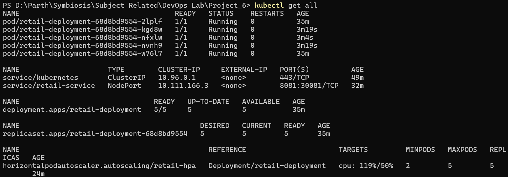

The HPA status was also checked:

```powershell
kubectl get hpa
```

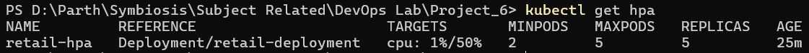

### Observed Configuration

| Field | Value |
|---|---|
| Initial replicas | `2` |
| Minimum replicas | `2` |
| Maximum replicas | `5` |
| CPU target | `50%` |
| Peak demonstrated replicas | `5` |
| Service type | `NodePort` |
| NodePort | `30081` |
| Application port | `8081` |

---

## Kubernetes Workflow

```text
Docker Image
     │
     ▼
Minikube Cluster
     │
     ▼
Kubernetes Deployment
     │
     ▼
2 Initial Pods
     │
     ▼
NodePort Service
     │
     ▼
Retail Store Application
     │
     ▼
Metrics Server
     │
     ▼
HPA monitors CPU
     │
     ▼
CPU Load Increases
     │
     ▼
Replica Count Increases
     │
     ▼
5 Pods at Peak Load
     │
     ▼
Load Removed
     │
     ▼
HPA Scales Down
```

The Docker image was loaded into Minikube and deployed through a Kubernetes Deployment. The NodePort Service exposed the application. The Metrics Server supplied CPU metrics to the HPA, and increased CPU utilization caused the HPA to increase the number of application replicas automatically.

---

## Commands Used

### Minikube

```powershell
minikube start --driver=docker
minikube status
minikube profile list
minikube image load retail_store_app:latest
minikube image ls | Select-String "retail_store_app"
minikube service retail-service --url
minikube addons enable metrics-server
```

### Kubernetes

```powershell
kubectl get nodes
kubectl cluster-info
kubectl apply -f deployment.yaml
kubectl apply -f service.yaml
kubectl apply -f hpa.yaml
kubectl get deployments
kubectl get pods
kubectl get svc
kubectl get hpa
kubectl get all
```

### Monitoring

```powershell
kubectl top nodes
kubectl top pods
kubectl get hpa -w
kubectl get pods -w
```

### Load Generation

```powershell
kubectl exec -it <pod-name> -- sh -c "yes > /dev/null"
```

The load was stopped using `Ctrl+C` after the autoscaling demonstration.

---

## Build Result

```text
Build Result

Minikube Cluster: RUNNING
Deployment Created: SUCCESS
Service Created: SUCCESS
Horizontal Pod Autoscaler Created: SUCCESS
Metrics Server Enabled: SUCCESS
Application Accessible: SUCCESS
Autoscaling Demonstrated: SUCCESS

Peak Replica Count Demonstrated: 5
Final Kubernetes Status: SUCCESS
```

---

## Learning Outcomes

- Kubernetes Deployment management
- Kubernetes Services and NodePort
- Minikube-based local Kubernetes clusters
- Docker image management with Minikube
- Metrics Server
- Horizontal Pod Autoscaling
- CPU-based resource monitoring
- Automatic replica scaling
- `kubectl` resource management

---

## Conclusion

This project successfully demonstrated Kubernetes-based application scalability using a Minikube cluster, a Kubernetes Deployment, a NodePort Service, the Metrics Server, and a Horizontal Pod Autoscaler. The Retail Store application initially ran with two replicas. After CPU load was generated, the HPA automatically increased the replica count to four and then five, reaching the configured maximum of five replicas. This confirmed that the Kubernetes autoscaling infrastructure was functioning successfully.
